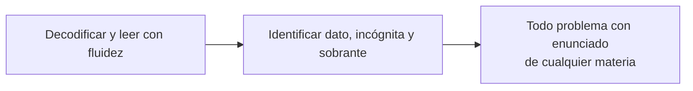
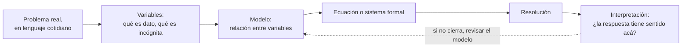

# Mapa de temas y prerrequisitos

**Fecha**: 2026-07-31 · **Estado: MAPA v2.9.4 — v2.5 aplicó una tercera ronda de
revisión externa sobre el v2.4 (consejo: GPT, Gemma, Z), filtrando lo
redundante; 4 troncos nuevos (Idiomas Extranjeros, Ciencia de Materiales,
Sistemas de Control y Automatización, UX y Diseño de Interfaces) + 6
ampliaciones dentro de troncos existentes + 2 bugs de grafo corregidos.
v2.5.1 verificó lo aplicado contra las 34 secciones de
`MAPA-materias-investigacion.md` y sumó 4 huecos reales que se habían
investigado pero nunca aplicado (física atómica/nuclear, momento e
impulso/choques, magnetismo básico, comunicación audiovisual/multimedial).
v2.5.2 auditó el grafo mismo (1 referencia rota más, `E25`) y cruzó
`PROPUESTA-materias-nuevas-biblioteca.md` (primeros auxilios, impuestos,
trámites). v2.6 es una cuarta ronda externa (Gemma) que sumó Psicología
cognitiva, Lógica de predicados y Teoría de grafos. v2.7 es una quinta
ronda (GPT + Z) con el lote más grande hasta entonces: geometría espacial,
epistemología, biotecnología, física moderna, Arquitectura de
Computadoras (Tronco 10.f) y finanzas personales avanzadas, entre otros.
v2.8 suma un cuarto modelo (Opus 5) al consejo y es la ronda más grande
hasta entonces — confirmado que ya no faltan materias, sólo temas:
transformaciones geométricas (confirmado por 3 modelos), contabilidad,
sociología, 7 bugs de "flecha sin nodo" hallados auditando la tabla de
cruces, y una docena de temas más. v2.9 se hizo sobre
`lista-temas-plana.md` (sin flechas ni prosa, para esquivar el límite de
lectura de Gemma) — sin el contexto de alcance del documento completo,
los 4 modelos propusieron mucho contenido universitario de carrera
específica que se descartó explícitamente; lo real fueron 14 huecos
estructurales verificados de Opus 5 (jerarquía de operaciones, concepto
de función, leyes de Newton, entre otros) más un 15° bug de etiqueta
contradictoria hallado por auditoría propia (criptografía real, cuarto
de esta familia) y 4 extensiones confirmadas por 2+ modelos (salud
mental, técnicas de estudio, ética de la IA, lenguaje musical). v2.9.1
sumó `AM5` (corrientes del pensamiento ambiental, ambientalismo vs.
ecologismo con neutralidad) a pedido de Javier — mismo hueco de
neutralidad que ya se había resuelto para Economía y Filosofía, sin
aplicar a Educación Ambiental hasta ahora. v2.9.2 revisó si Salud y
Tecnología tenían el mismo hueco: Salud sí (`EF13` políticas de drogas,
`C19` sistema de salud, ambos neutrales); Tecnología quedó descartada por
no ser una materia curricular con "corrientes" tan establecidas. v2.9.3
revisó el resto del mapa con el mismo criterio y sumó `DER6`/`DER7`
(corrientes de interpretación jurídica y política criminal), `OF18`
(modelo agroindustrial vs. agroecología) y `T11` (corrientes
historiográficas) — más enriquecer `E28` con economía feminista/del
cuidado (acotada al argumento contable de Waring, sin tocar el debate más
amplio, a pedido explícito de Javier). v2.9.4 sumó una segunda pasada:
`PS10` (corrientes psicológicas), `INV9` (corrientes de filosofía de la
ciencia) y `CS5` (corrientes de la comunicación). Con esto, 10
aplicaciones del principio de neutralidad en total. Nada implementado.**

Este documento se divide en 3 archivos, porque ya no entra cómodo en uno solo:

- **`introduccion.md`** (este archivo) — cómo leer el mapa, y las dos
  dependencias transversales que no pertenecen a ningún tronco.
- **[`changelog.md`](changelog.md)** — historial completo de parches, v2 a
  v2.5, con el porqué de cada uno.
- **[`troncos.md`](troncos.md)** — el mapa en sí: los 21 troncos, oficios,
  profesiones, tabla de cruces, reparto en 11 años y qué evalúa el DSL hoy.

Grafo de dependencias entre TEMAS, cruzando materias. Una flecha `A --> B`
significa "no se puede enseñar B sin haber enseñado A". El límite lo pone lo que
el DSL puede evaluar y lo que entra en 11 años de estudio continuo, no el
programa actual.

## Cómo leerlo

- **Nodos** = temas evaluables, del tamaño de una plantilla o un puñado.
- **Flechas** = prerrequisito real, no afinidad temática.
- Los temas de **otras materias** van marcados con la materia entre paréntesis:
  ahí está la parte interesante, porque casi todo lo que se enseña en Física,
  Química, Economía o Informática cuelga de un tema de Matemáticas.
- Los **troncos** son cadenas largas; las **ramas** son lo que sale de ellas.

---

## La dependencia que nadie escribe

Antes de todo lo demás: **comprensión lectora**. Un problema con enunciado es
primero un ejercicio de lectura. Si el alumno no puede identificar qué se pide,
qué dato le dan y qué le sobra, no falla en matemática: falla en lengua. Vale
como prerrequisito universal y no lo vuelvo a repetir en cada grafo.

---

## El proceso que nadie escribe: modelización matemática

Igual de transversal que la comprensión lectora, y por eso va acá y no dentro
de un tronco. El mapa enseña a *resolver* una ecuación ya armada; casi nunca
enseña a *armarla*. Física, Química, Economía e Ingeniería fallan más en el
paso de enunciado a ecuación que en la cuenta en sí.

**Por qué importa que esté escrito**: `Lenguaje algebraico` (A1, Tronco 2) ya
roza el primer paso, pero el mapa salta directo a resolver. El tramo
`MOD2 → MOD4` es justo el que separa a un alumno que sabe despejar de uno que
puede plantear el problema de la cuadrática que le dieron en Física. El lazo
de vuelta a `MOD3` es a propósito: modelar no es lineal, se vuelve sobre el
modelo cuando la respuesta da un resultado absurdo (una velocidad negativa,
una probabilidad de 1,4). Es el primer ciclo real del mapa — antes todo era
estrictamente acíclico.

Seguir con **[`troncos.md`](troncos.md)** para el mapa completo, o con
**[`changelog.md`](changelog.md)** para el historial de por qué está como está.
