# Troncos — Mapa de temas y prerrequisitos

Parte de un documento dividido en 3 archivos: [`introduccion.md`](introduccion.md) ·
[`changelog.md`](changelog.md) · **`troncos.md`** (este archivo).

Los 21 troncos, oficios, profesiones académicas, tabla de cruces, cruces
inversos, reparto en 11 años y qué evalúa el DSL hoy. Para el porqué de cada
agregado, ver el changelog; para las dos dependencias transversales
(comprensión lectora, modelización matemática), ver la introducción.

---

## Tronco 1 — Numérico: de contar a la tasa de interés

Es el tronco más largo y el que más ramas sostiene. Casi toda la Vida Cotidiana
y toda la Economía cuelgan de acá.

```mermaid
graph TD
  N1["Conteo y valor posicional"] --> N2["Suma y resta"]
  N2 --> N3["Multiplicación y división"]
  N3 --> N3B["Jerarquía de operaciones:<br/>PEMDAS"]
  N3B --> N4["Divisibilidad, múltiplos y divisores"]
  N4 --> N16["Números primos:<br/>factorización prima"]
  N16 --> N5["MCD y MCM"]
  N3 --> NE1["Números enteros:<br/>signo, orden y recta numérica"]
  NE1 --> NE2["Operaciones con enteros"]
  N3 --> N6["Fracciones: equivalencia y orden"]
  N6 --> N7["Operaciones con fracciones"]
  N7 --> N8["Decimales y redondeo"]
  N8 --> N9["Razón y proporción"]
  N9 --> N10["Regla de tres directa e inversa"]
  N10 --> N11["Porcentaje"]
  N3 --> N12["Potencias"]
  N12 --> N13["Notación científica"]
  N12 --> N14["Raíces"]
  N14 --> N14Ba["√2: irracionalidad demostrable<br/>por inconmensurabilidad"]
  N14 --> N14Bb["π: irracional y trascendente"]
  N14Ba --> N14Bc["La recta numérica completa:<br/>racionales e irracionales, los reales"]
  N14Bb --> N14Bc
  N12 --> N15["Logaritmos"]
  N1 --> N17["Hora y reloj:<br/>lectura y duración entre horas"]
  N2 --> N18["Dinero: monedas, billetes y vuelto"]
  N3 --> N19B["Sucesiones aritméticas:<br/>término general"]
  N19B --> N19["Sucesiones y series"]
  N19 --> A11P2["Series geométricas<br/>(exponencial, Álgebra)"]

  N11 --> E22["Recibo de sueldo:<br/>del básico al bruto"]
  E22 --> E23["Descuentos obligatorios:<br/>jubilación, obra social"]
  N11 --> E24["Monotributo:<br/>categoría y cuota"]
  N11 --> E1["Descuentos y recargos sucesivos<br/>(Vida Cotidiana)"]
  N11 --> E2["IVA y precio final<br/>(Economía)"]
  N11 --> E3["Interés simple<br/>(Economía)"]
  E3 --> E4["Interés compuesto"]
  N12 --> E4
  E4 --> E5["CFT vs. tasa nominal"]
  E4 --> E6["Cuota de un crédito, sistema francés"]
  E4 --> E7["Plazo fijo vs. inflación:<br/>rendimiento real"]
  E7 --> E25["Valor esperado de una inversión<br/>y riesgo"]
  D17P["Esperanza matemática<br/>(Matemáticas)"] --> E25
  E25 --> E25B["Seguros:<br/>prima, cobertura y gestión del riesgo"]
  E25 --> E25C["Fondo de emergencia<br/>y diversificación"]
  E4 --> E25D["Jubilación:<br/>sistema previsional y aporte"]
  N10 --> E8["Escalar una receta<br/>(Vida Cotidiana)"]
  E8 --> E8B["Química de la cocción:<br/>reacción de Maillard, y cómo el pH la acelera o frena (cruce Química)"]
  E8 --> E8I["Maduración de frutas:<br/>almidón que se vuelve azúcar"]
  E8B --> E8J["Tensión superficial y emulsiones:<br/>por qué liga (o no) una mayonesa"]
  E8B --> E8K["Desnaturalización de proteínas<br/>en la cocción: por qué se endurece la carne"]
  N11 --> E8Ga["Calorías en la<br/>etiqueta nutricional"]
  N11 --> E8Gb["% valor diario<br/>(%VD)"]
  N11 --> E8Gc["Azúcares agregados:<br/>identificarlos en la etiqueta"]
  E8B --> E8H["Seguridad alimentaria:<br/>zona de peligro 5-60°C, contaminación cruzada"]
  N11 --> E8Ca["Gastos fijos"]
  N11 --> E8Cb["Gastos variables"]
  E8Ca --> E8Cc["Regla 50/30/20:<br/>necesidades, deseos y ahorro"]
  E8Cb --> E8Cc
  E8Cc --> E8D["Gestión del tiempo:<br/>matriz urgente/importante"]
  E8 --> E8Ea["Símbolos de cuidado textil"]
  E8 --> E8Eb["Técnicas de lavado:<br/>a mano y a máquina"]
  E8 --> E8Ec["Separar la ropa por color<br/>y tipo de tela"]
  E8Ea --> E8L["Química de las manchas:<br/>por qué el agua caliente fija una mancha de proteína"]
  E8Eb --> E8L
  E8Ec --> E8M["Identificar una fibra<br/>por combustión (burn test)"]
  E8Cc --> E8Fa["Garantías:<br/>derechos y plazos"]
  E8Cc --> E8Fb["Contratos simples:<br/>qué firmar y qué evitar"]
  E8Cc --> E8Fc["Comparar productos:<br/>costo real, no precio de góndola"]
  TER2P["Calor: Q = m·c·ΔT<br/>(Física)"] --> E8N["Eficiencia energética doméstica:<br/>por qué una heladera llena gasta menos"]
  E21P["Consumo eléctrico y lectura<br/>de factura (Vida Cotidiana)"] --> E8O["Consumo eléctrico en espera<br/>(phantom loads): por qué un aparato 'apagado' sigue gastando"]
  N10 --> E9["Escala de un mapa<br/>(Geografía)"]
  N10 --> E10["Densidad de población<br/>(Geografía)"]
  N13 --> E11["Unidades de almacenamiento<br/>(Informática)"]
  N12 --> E12["Sistemas de numeración:<br/>binario y hexadecimal (Informática)"]
  N15 --> E13["pH y pOH<br/>(Química)"]
  N15 --> E14["Decibeles y escala Richter<br/>(Física / Geografía)"]
  NE2 --> V4["Temperaturas bajo cero<br/>(Vida Cotidiana)"]
  NE2 --> F9["Cargas eléctricas:<br/>positiva y negativa (Física)"]
  NE2 --> E20["Debe y haber en un balance<br/>(Economía)"]
  E20 --> E20A1["Estructura del patrimonio:<br/>activo, pasivo, patrimonio neto"]
  E20A1 --> E20A2["Ecuación contable fundamental:<br/>activo = pasivo + patrimonio neto"]
  E20 --> E20A3["Tipos de sociedades:<br/>unipersonal, S.R.L., S.A., cooperativa"]
  E20A2 --> E20B["Partida doble:<br/>asiento contable"]
  E20B --> E20C["Libro diario<br/>y mayor"]
  E20C --> E20D["Estados contables:<br/>patrimonio y ciclo contable completo"]
  ADM6P["Estado de resultados<br/>(Administración)"] --> E20D
  E20D --> E20A4["Contabilidad como sistema<br/>de información: ciclo comercial vs. industrial"]
  E20D --> E20A5["Índices financieros:<br/>liquidez, rotación, rentabilidad"]
  E20D --> E20A6["Contabilidad ambiental"]

  E2 --> ECF1["Costo de oportunidad"]
  ECF1 --> ECF2["División formal:<br/>microeconomía y macroeconomía"]
  ECF2 --> ECF3["Sectores económicos:<br/>primario, industrial, servicios, cuaternario"]
  ECF2 --> ECF4["Economía positiva y normativa"]
  ECF2 --> E26["Oferta y demanda:<br/>precio de equilibrio"]
  E26 --> E27["PBI e inflación:<br/>magnitud macroeconómica, no sólo tasa personal"]
  E26 --> E28a["Mercantilismo"]
  E26 --> E28b["Fisiocracia"]
  E28a --> E28c["Liberalismo clásico<br/>y escuela austríaca"]
  E28b --> E28c
  E28c --> E28d["Socialismo utópico"]
  E28d --> E28e["Marxismo"]
  E28c --> E28f["Keynesianismo"]
  E28e --> E28f
  E28c --> E28g["Ordoliberalismo"]
  E28f --> E28g
  E28c --> E28h["Neoliberalismo"]
  E28f --> E28h
  E28c --> E28i["Economía feminista"]
  E28e --> E28i
  CRIPTO1P["Criptografía<br/>(Informática)"] --> E29["Blockchain, claves<br/>y wallet"]
  E29 --> E30["Contratos inteligentes:<br/>reglas si-entonces autoejecutables"]
  E30 --> E31["Intercambio descentralizado<br/>(DEX) y swap"]
  E4 --> E31
  E31 --> E32["Pools de liquidez<br/>y creador de mercado automático (AMM)"]

  E27 --> E33["Balanza comercial:<br/>exportaciones e importaciones"]
  E33 --> E34a["Tipo de cambio fijo"]
  E33 --> E34b["Tipo de cambio flotante"]
  E34a --> E34c["Devaluación:<br/>ajuste del tipo de cambio fijo"]
  E34b --> E34c
  E34c --> E35["Reservas y banco central"]
  E33 --> E36["Comercio internacional:<br/>ventaja comparativa"]
  E35 --> E37a["Deuda pública interna"]
  E35 --> E37b["Deuda pública externa"]
  E4 --> E37a
  E4 --> E37b
  E37a --> E37c["Default:<br/>cese de pagos de la deuda"]
  E37b --> E37c
```

**El salto que más se subestima**: `Porcentaje --> Interés compuesto`. Entre los
dos hay que entender que un porcentaje se puede aplicar sobre un resultado que ya
tenía un porcentaje aplicado. Ese único concepto es el que hace que "+20% y luego
−20% no vuelve al original", y es el mismo que hace que la deuda de una tarjeta
de crédito crezca como crece. Si se enseña bien acá, media Economía sale gratis.

**Agregado v2.9.5 — `E28` deja de ser un solo nodo (`E28a`-`E28i`)**:
mismo anti-patrón lumped que ya se corrigió en Historia profunda (30
nodos) y en Lengua (sintaxis) — "Corrientes del pensamiento económico
(mercantilismo a economía feminista)" era un único nodo cubriendo 9
escuelas reales en ~250 años. Ahora cada una es su propio nodo, en
orden histórico real (mercantilismo y fisiocracia → liberalismo
clásico y escuela austríaca, que a su vez da lugar tanto al socialismo
utópico → marxismo como —por otro camino— al keynesianismo →
ordoliberalismo/neoliberalismo, con economía feminista colgando de
liberalismo clásico y de marxismo por tomar ambos como punto de
partida crítico), cada una con fuente primaria
real para citar (Smith/Hayek/Mises/Hazlitt para liberalismo clásico;
Marx para marxismo, con Mises —*El cálculo económico en el sistema
socialista*— como contraparte crítica real, mismo tratamiento que
`DER6`/`DER7`: describir cada postura y su objeción real, nunca cuál
tiene razón; Keynes para keynesianismo; Röpke para ordoliberalismo;
Friedman para neoliberalismo; Owen para socialismo utópico; Quesnay y
Mun para fisiocracia/mercantilismo, opcionales por ser más curiosidad
histórica que corriente viva). Los cruces hacia `AM5a-d` (corrientes
ambientales) y `C19a-c` (sistemas de salud) que antes salían de un
`E28P` genérico ahora apuntan a la corriente específica que
corresponde en cada caso — liberalismo clásico → ambientalismo
liberal / salud privada de mercado, keynesianismo → ecologismo
político / salud pública universal, marxismo → decrecimiento,
ordoliberalismo → salud mixta (es, literalmente, el mismo modelo de
"economía social de mercado" alemán del que nace `E28g`) — más preciso
que el fan-out genérico anterior, no sólo una prolijidad cosmética.
`Conservacionismo` (`AM5a`) se queda sin prerrequisito de `E28`: forzar
una corriente económica específica ahí hubiera sido la misma conexión
artificial que el resto del proyecto evita a propósito.

**Agregado v2.8 — Contabilidad (`E20B`-`E20D`)**: confirmado
independientemente por GPT y Opus 5 — la orientación real de Economía y
Administración recorre tres planos (contabilidad, administración,
economía) y el mapa sólo tenía dos. Es un hueco raro porque ya estaba la
punta (`E20`, debe y haber) y la cola (`ADM6`, estado de resultados) sin
el medio: partida doble (cómo se registra un movimiento), libro diario y
mayor (dónde se acumulan los asientos), y el ciclo contable completo que
termina en los mismos estados contables que `ADM6` ya calculaba sin
mostrar de dónde salían los números.

**Agregado v2.9.6 — Sistemas de Información Contable (`E20A1-A6`)**:
confirmado vía Angrisani (SIC 1/2/3), MAIPUE y *Educación a Distancia
SIC* (todos reales, escuela técnica argentina). `E20B` (partida doble)
arrancaba in-media-res, sin la base que un curso real siempre da
antes: `E20A1` (estructura del patrimonio: activo, pasivo, patrimonio
neto) y `E20A2` (ecuación contable fundamental, A = P + PN), que ahora
son el prerrequisito real de `E20B`. `E20A3` (tipos de sociedades:
unipersonal, S.R.L., S.A., cooperativa — forma jurídica de empresa,
distinta del derecho societario de `DER0d`) cuelga de `E20` como
concepto hermano. Del otro lado de la cadena, `E20A4` (contabilidad
como sistema de información: ciclo comercial vs. industrial), `E20A5`
(índices financieros: liquidez, rotación de cuentas a cobrar/pagar/
mercaderías, rentabilidad económica/financiera, efecto palanca — vía
*Sistemas de Información Contable 2*) y `E20A6` (contabilidad
ambiental, tema moderno del mismo libro) extienden `E20D` con el
análisis posterior a tener los estados contables armados.

**Agregado v2.9.6 — Proyectos Organizacionales (`PROY1-PROY3`)**:
confirmado vía Gallardo y Apolinar García. El meta-tronco genérico
`Gestión de proyectos` (`GP1-5`) es agnóstico de organización;
`PROY1` (visión y misión organizacional), `PROY2` (estudio de
contexto local/regional) y `PROY3` (tipos de proyecto: social vs.
productivo) son su instancia concreta del lado de Economía-Gestión —
mismo patrón que ya usa `Proyecto ciudadano participativo` (`C22`,
Cívica) del lado cívico: el genérico enseña el ciclo, cada materia le
pone el contenido específico encima.

**Agregado v2.9.6 — Economía formal (`ECF1-ECF4`)**: confirmado vía
Eggers (Francisco) y Casani/Llorente/Pérez, reales. Distinta de la
Economía = finanzas personales que ya cubre `E1-E37`: `ECF1` (costo
de oportunidad, 0 resultados en grep pese a ser de los conceptos más
básicos de cualquier curso de economía) es la puerta de entrada real
antes de `División formal: microeconomía y macroeconomía` (`ECF2`),
que hoy sólo existía de forma implícita. `ECF3` (sectores económicos:
primario, industrial, servicios, cuaternario) y `ECF4` (economía
positiva y normativa) cuelgan de `ECF2` como sus dos desarrollos
estándar. `Oferta y demanda` (`E26`) pasa a depender de `ECF2` en vez
de directo de `E2` — tiene más sentido pedagógico entender primero que
existe una microeconomía antes de ver su concepto más citado.

**El hueco que se disimulaba solo**: `Enteros` no tenía nodo propio, pero el
resto del mapa ya lo daba por hecho — la tabla de cruces menciona "enteros y
recta numérica" para calcular años entre hechos, y todo `antes/después de
Cristo` (Tronco 6) los necesita sin que existiera de dónde colgarlos. Ahora
cuelga acá, entre la división y las fracciones, que es donde pedagógicamente
corresponde: ya sabe operar, todavía no necesita partes de un todo.

**Otro hueco que se disimulaba solo**: `Divisibilidad --> MCD y MCM` saltaba
por encima de los `Números primos`, dándolos por sabidos. Sin factorización
prima, el MCD/MCM se enseña como algoritmo de tanteo en vez de método; y sin
este nodo, `Criptografía` (Tronco 10, `CRIPTO1`) no tiene de dónde colgar
el porqué de RSA — factorizar un número grande en primos es, literalmente,
el problema que hace posible la seguridad de una conexión web.

**Agregado v2.9 — Jerarquía de operaciones (`N3B`)**: Opus 5 lo marcó como
hueco estructural, no de contenido — sin nombrar PEMDAS explícitamente,
todo lo que viene después (fracciones, potencias, ecuaciones) da por
sabido un orden de resolución que nunca se enseñó como regla propia.

**Bug corregido v2.9 — `Criptografía` tenía etiqueta contradictoria**:
esta misma sección citaba `IN11P["Criptografía (Informática)"]`, pero el
`IN11` real (Tronco 10.a) es "Seguridad informática" — un concepto más
amplio, no específicamente cifrado/clave pública/hash. Cuarto bug de esta
familia (mismo patrón que `BD1`, `G6P`, `RIT1`). Ahora existe `CRIPTO1`
(criptografía real: clave simétrica/asimétrica, hash) entre `Redes`
(`IN10`) y `Seguridad informática` (`IN11`), y esta sección cruza ahí.

**El hueco que la plataforma ya resolvía sin que el mapa lo supiera**:
`Recibo de sueldo` ya figuraba en la tabla de cruces desde el v1
("Porcentaje"), y el DSL ya tiene plantillas oficiales sembradas para
descuentos de jubilación y obra social, y para Monotributo — sólo faltaba
el nodo. Cuelga de `Porcentaje` porque es, en esencia, aplicar varios
porcentajes sucesivos sobre una base (el mismo concepto que ya hacía
funcionar el interés compuesto), pero con nombre y letra chica reales en
vez de un ejercicio abstracto.

**Agregado v2.4 — lo que faltaba antes de contar (`N17`/`N18`)**: hora y
reloj, y dinero con vuelto, son currícula de primaria (grados 1-2) que
el tronco daba por sabida al arrancar directo en operaciones. Ninguno de
los dos es reducible a un nodo existente — ni conteo ni fracciones.

**Agregado v2.4 — Economía más allá del interés y el sueldo (`E26`-`E32`)**:
`Oferta y demanda` es el concepto bisagra que faltaba antes de cualquier
"agente económico" o "estructura de mercado" — hoy la plataforma los
enseña presuponiéndolo. `PBI e inflación` distingue la magnitud
macroeconómica de `E7` (que es, a propósito, la lectura personal —
cuánto rinde mi plazo fijo). `Corrientes del pensamiento económico`
(mercantilismo, fisiócratas, liberalismo clásico, marxismo, escuela
austriaca, keynesianismo, monetarismo, neoliberalismo, economía
feminista/del cuidado — Marilyn Waring, *If Women Counted*, 1988, el
libro que empezó a cuestionar por qué el trabajo doméstico y de cuidado
no cuenta en el PBI) se enseña con un
principio no negociable: identificar qué sostiene cada escuela con la
misma seriedad expositiva, nunca evaluar cuál tiene razón — cruza
directo con `Historia de la filosofía y corrientes` (Tronco de
Filosofía) porque "liberalismo" y "marxismo" son a la vez escuela
económica y corriente filosófico-política, mismo contenido desde dos
materias. El bloque de cripto/DeFi (`E29`-`E32`) es pedido explícito,
sin currícula estándar que lo respalde (es tecnología, no un eje
tradicional de los programas de Economía) — blockchain y wallet
retoman el mismo par de claves pública/privada que ya usa `Criptografía`
(`CRIPTO1`) para cifrar, acá aplicado a firmar una transacción; un contrato
inteligente es, en esencia, la misma regla `si-entonces` de cualquier
condicional, corriendo en una red en vez de en un servidor; un pool de
liquidez fija el precio con la misma idea de "despejar una variable de
una fórmula" que ya usa Física, aplicada al producto constante de dos
reservas.

**Agregado v2.4 — Vida Cotidiana, 4 nodos nuevos junto a `E8`**: esta
materia no es Cocina aunque dependa de ella (`E8B`, química de la
cocción/Maillard, cruce real con Química) ni es Economía aunque dependa
de Finanzas personales (`E8C`, presupuesto del hogar — mismo contenido
que `presupuesto_familiar` en Economía, pendiente decidir de qué lado
vive antes de escribirlo dos veces). `E8D` (gestión del tiempo, matriz
urgente/importante) es una capacidad archivada que ni la propia
propuesta escrita anticipó. `E8E` (cuidado de la ropa) es pedido
explícito: el marco Family and Consumer Sciences nombra "lavar la ropa"
textualmente como parte de esta disciplina, no es una ocurrencia suelta.

**Agregado v2.8 — Etiqueta nutricional y Seguridad alimentaria (`E8G`/
`E8H`)**: los dos aparecían citados en la tabla de cruces desde hace
varias versiones ("Etiqueta nutricional → porcentaje, proporción",
"Seguridad alimentaria → temperatura, rango") sin nodo real en ningún
lado — hallazgo de Opus 5 auditando esa tabla contra los diagramas.
Estaban además en la propuesta original de Vida Cotidiana ("identificar
azúcares agregados", "zona de peligro 5-60°C") y nunca se les asignó
nodo cuando se aplicó el resto de la sección en v2.4.

**Agregado v2.8 — Sucesiones aritméticas (`N19B`) e Irracionales y
reales (`N14B`)**: Z señaló que `N19` saltaba directo a series
geométricas sin el puente aritmético (término general de una progresión
que suma siempre lo mismo, no que multiplica); es el escalón que falta
entre `N3` y `A11` del otro lado. `N14B` es un caso concreto de "salto
sin piso", el mismo patrón que ya se corrigió para `Enteros` en v2:
`π` y `√2` se usan en `GO6` (circunferencia) y `M6` (Pitágoras) sin que
existiera ningún nodo de números irracionales — el mapa tenía enteros,
fracciones, decimales, raíces y complejos, pero nunca nombró el conjunto
que los une a todos con la recta numérica completa.

**Agregado v2.5 — Economía Internacional (`E33`-`E37`)**: `E26`-`E32`
(v2.4) modelan al agente económico individual y a la macroeconomía de un
país hacia adentro (oferta/demanda, PBI, inflación); acá el agente es el
país mismo negociando con otros. `Ventaja comparativa` (Ricardo) es el
concepto que explica por qué un país exporta lo que exporta en vez de
producir todo internamente — el mismo tipo de "por qué esta decisión y no
otra" que ya resolvía `Punto de equilibrio` en Administración, pero a
escala de comercio exterior. `Deuda pública` reusa `Interés compuesto`
(`E4`) igual que el CFT de una tarjeta de crédito, sólo que quien pide
prestado es un Estado y no una familia — mismo concepto matemático, dos
escalas.

**Agregado v2.7 — Finanzas personales avanzadas (`E25B`-`E25D`) y Defensa
del consumidor (`E8F`)**: GPT (consejo) señaló que `E25` (valor esperado
de una inversión) se quedaba corto — faltaba todo lo que rodea a
gestionar el riesgo real de una persona, no sólo el de una inversión
puntual. `Seguros` es la misma idea de `E25` leída al revés: en vez de
asumir un riesgo por una ganancia esperada, se paga una prima fija para
transferírselo a otro. `Fondo de emergencia y diversificación` y
`Jubilación` cierran el circuito de finanzas personales que hoy termina
en `E7` (plazo fijo) sin decir qué hacer con el resto de la vida
financiera de una persona. `E8F` (Defensa del consumidor) es la misma
familia de contenido "seguridad concreta, no trivia" que ya justificaba
`E8E` (cuidado de la ropa) — garantías, contratos simples y comparar
productos por costo real, no por precio de góndola.

---

## Tronco 2 — Algebraico: de la letra al cálculo

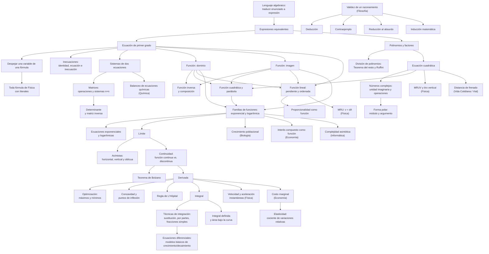
```mermaid
graph TD
  A1["Lenguaje algebraico:<br/>traducir enunciado a expresión"] --> A2["Expresiones equivalentes"]
  A2 --> A3["Ecuación de primer grado"]
  A3 --> A4["Despejar una variable de una fórmula"]
  A3 --> A16["Inecuaciones:<br/>identidad, ecuación e inecuación"]
  A3 --> A5["Sistemas de dos ecuaciones"]
  A5 --> AL1["Matrices:<br/>operaciones y sistemas n×n"]
  AL1 --> AL1B["Determinante<br/>y matriz inversa"]
  A3 --> FUNC1a["Función: dominio"]
  A3 --> FUNC1b["Función: imagen"]
  FUNC1a --> FUNC1c["Función inversa<br/>y composición"]
  FUNC1b --> FUNC1c
  FI2P["Validez de un razonamiento<br/>(Filosofía)"] --> DEM1a["Deducción"]
  FI2P --> DEM1b["Contraejemplo"]
  FI2P --> DEM1c["Reducción al absurdo"]
  FI2P --> DEM1d["Inducción matemática"]
  A2 --> A6["Polinomios y factoreo"]
  A6 --> A6B["División de polinomios:<br/>Teorema del resto y Ruffini"]
  A6 --> A7["Ecuación cuadrática"]
  A7 --> A15["Números complejos:<br/>unidad imaginaria y operaciones"]
  A15 --> A15B["Forma polar:<br/>módulo y argumento"]
  A7 --> A8["Función cuadrática y parábola"]
  FUNC1a --> A8
  FUNC1b --> A8
  A3 --> A9["Función lineal:<br/>pendiente y ordenada"]
  FUNC1a --> A9
  FUNC1b --> A9
  A9 --> A10["Proporcionalidad como función"]
  A8 --> A11["Familias de funciones:<br/>exponencial y logarítmica"]
  FUNC1a --> A11
  FUNC1b --> A11
  A11 --> A11B["Ecuaciones exponenciales<br/>y logarítmicas"]
  A11 --> A12["Límite"]
  A12 --> A12ASIN["Asíntotas:<br/>horizontal, vertical y oblicua"]
  A12 --> A12B["Continuidad:<br/>función continua vs. discontinua"]
  A12B --> A12BOL["Teorema de Bolzano"]
  A12B --> A13["Derivada"]
  A13 --> A13B["Optimización:<br/>máximos y mínimos"]
  A13 --> A13CONC["Concavidad y<br/>puntos de inflexión"]
  A13 --> A13LHOP["Regla de L'Hôpital"]
  A13 --> A14["Integral"]
  A14 --> A14TEC["Técnicas de integración:<br/>sustitución, por partes, fracciones simples"]
  A14 --> A14DEF["Integral definida<br/>y área bajo la curva"]
  A14TEC --> A17["Ecuaciones diferenciales:<br/>modelos básicos de crecimiento/decaimiento"]

  A4 --> F1["Toda fórmula de Física<br/>con literales"]
  A5 --> Q1["Balanceo de ecuaciones químicas<br/>(Química)"]
  A9 --> F2["MRU: v = d/t<br/>(Física)"]
  A7 --> F3["MRUV y tiro vertical<br/>(Física)"]
  A7 --> V1["Distancia de frenado<br/>(Vida Cotidiana / Vial)"]
  A11 --> B1["Crecimiento poblacional<br/>(Biología)"]
  A11 --> E15["Interés compuesto como función<br/>(Economía)"]
  A13 --> F4["Velocidad y aceleración<br/>instantáneas (Física)"]
  A13 --> E16["Costo marginal<br/>(Economía)"]
  E16 --> E16B["Elasticidad:<br/>cociente de variaciones relativas"]
  A11 --> I1["Complejidad asintótica<br/>(Informática)"]
```

**El cruce clásico**: `Derivada --> Velocidad instantánea`. En el programa
tradicional Física enseña velocidad media en 2° año y Matemáticas enseña derivada
en 5°, así que el alumno aprende dos veces la misma idea sin que nadie le diga
que es la misma. Enseñado en orden, la derivada deja de ser una regla mecánica.

**Y el que casi nadie usa**: `Distancia de frenado` cuelga de la **cuadrática**.
Que la distancia crezca con el cuadrado de la velocidad es la razón por la que
ir a 120 en vez de 100 no es "un 20% más peligroso" sino un 44% más de frenada.
Es educación vial y es matemática, al mismo tiempo.

**El piso que le faltaba a la Inteligencia Artificial**: `Sistemas de dos
ecuaciones --> Matrices`. El v2 hacía colgar `Inteligencia artificial`
(Tronco 10) sólo de regresión lineal — alcanza para ajustar una recta, no
para explicar qué es un vector de pesos o una capa de una red. Matrices es
la generalización directa de resolver sistemas, no un tema nuevo sin
conexión: el mismo método que ya resuelve un sistema de 2×2 es, escalado,
el que después resuelve uno de n×n.

**El otro hijo de la cuadrática**: `Números complejos` cuelga de la misma
`Ecuación cuadrática` que la parábola, no es un tema aislado — nace de
preguntarse qué pasa cuando el discriminante da negativo. El DSL ya evalúa
parte real y operaciones básicas (suma, resta); el mapa no tenía dónde
ponerlo.

**Agregado v2.4**: `Inecuaciones` (`A16`) es tan básico como una ecuación
de primer grado y el mapa nunca lo había separado de "ecuación" — falta
en todo el tronco. `Ecuaciones diferenciales` (`A17`) cierra el tronco
después de `Integral`: sin esto, cualquier "esto crece proporcional a lo
que ya tiene" (interés compuesto, crecimiento poblacional, decaimiento
radiactivo) se enseña como fórmula memorizada en vez de modelo derivado.

**Agregado v2.7 — Optimización (`A13B`)**: `Derivada` (`A13`) ya existía,
pero el mapa saltaba directo a `Integral` sin pasar por su aplicación más
usada en la práctica — dónde una función tiene un máximo o un mínimo
(derivada igual a cero). Es la misma cuenta que decide la forma de menor
material para una lata, el punto de mayor ganancia con un precio variable,
o la velocidad óptima de un vehículo para gastar menos combustible.

**Agregado v2.8 — Elasticidad económica (`E16B`)**: hallado por Opus 5
auditando la tabla de cruces del propio documento — "Elasticidad
(económica) | Cociente de variaciones relativas | Matemáticas" aparecía
citada ahí desde hace varias versiones sin que existiera ningún nodo en
ningún diagrama, el mismo patrón que ya se había corregido para gases,
recibo de sueldo y enteros. Cuelga de `Costo marginal` (`E16`) porque las
dos son la misma familia de razón de cambio aplicada a Economía — una
mide cuánto cuesta producir una unidad más, la otra cuánto responde la
cantidad demandada a un cambio de precio.

**Agregado v2.8 — Ruffini (`A6B`) y forma polar (`A15B`)**: Z señaló los
dos. `Polinomios y factoreo` (`A6`) enseña a factorear pero no el método
algorítmico estándar para dividir un polinomio por otro (Teorema del
resto, regla de Ruffini) — el paso intermedio real entre factorear a
ojo y factorear con procedimiento. `Números complejos` (`A15`) tenía sólo
la forma algebraica (`a + bi`); la forma polar (módulo y ángulo) es la
que de verdad se usa para multiplicar y dividir complejos sin álgebra
pesada, y es además el lenguaje que después reaparece en Ondas (fasores).

**Agregado v2.9 — 5 huecos estructurales verificados por Opus 5**: el tronco
tenía funciones específicas (lineal, cuadrática, exponencial) sin haber
definido nunca qué es una función en general — `FUNC1` (dominio, imagen,
inversa, composición) llena ese vacío antes de que existan sus casos
particulares. `A12B` (continuidad) es el escalón real entre `Límite` y
`Derivada`: no se puede derivar lo que no es continuo, y el mapa saltaba
directo. `A11B` (ecuaciones exponenciales y logarítmicas) es la
resolución que faltaba después de tener las funciones (`A11`) y el
número (logaritmo, Tronco 1). `AL1B` (determinante y matriz inversa)
completa `Matrices` con las dos operaciones que de verdad se usan para
resolver un sistema n×n, no sólo plantearlo. `DEM1` (demostración
matemática: deducción, contraejemplo, reducción al absurdo, inducción)
cierra un cruce que estaba a medio hacer: `Validez de un razonamiento`
(`FI2`, Filosofía) ya existía, pero nunca se aplicaba a la matemática
misma — un alumno podía identificar un razonamiento válido en lógica sin
saber que una demostración es exactamente eso.

**Agregado v2.9.6 — Análisis Matemático nivel 2 (`A12ASIN`, `A12BOL`,
`A13CONC`, `A13LHOP`, `A14TEC`, `A14DEF`)**: confirmado vía *Análisis 1*
y *Análisis 2* (Polimodal, Longseller — Altman/Comparatore/Kurzrok,
reales). El esqueleto ya estaba completo (`Límite → Continuidad →
Derivada → Optimización → Integral → Ecuaciones diferenciales`), pero
le faltaban las técnicas específicas de nivel universitario-puente,
todas con 0 resultados en grep: asíntotas (horizontal/vertical/oblicua,
cuelga de `A12`), teorema de Bolzano (cuelga de `A12B`), concavidad y
puntos de inflexión y regla de L'Hôpital (cuelgan de `A13`), técnicas
de integración —sustitución, por partes, fracciones simples— e integral
definida/área bajo la curva (cuelgan de `A14`). Mismo tratamiento
"nivel 2" que ya se usó en Química (`v2.9.6` de ese tronco) — no
rompen el diseño, son la vuelta de tuerca que ya estaba prevista:
`A17` (Ecuaciones diferenciales) no tenía sentido pedagógico sin
`A14TEC` (técnicas de integración) antes, así que ahora cuelga de ahí
en vez de directo de `A14`.

---

## Tronco 3 — Geometría, geometría analítica y vectores

Antes era "Medida, espacio y vectores" y saltaba directo de área/perímetro a
Pitágoras, sin piso. Se abre en dos tramos: la geometría de la forma (que
faltaba casi entera) y el puente analítico que la conecta con el álgebra y
desemboca en trigonometría y vectores.

### 3.a — Geometría: de la forma a la medida

```mermaid
graph TD
  M1["Magnitud, unidad e instrumento"] --> M2["Sistema métrico y conversiones"]
  M2 --> M11["Análisis dimensional:<br/>verificar una ecuación por sus unidades"]
  M2 --> M3["Perímetro y área:<br/>figuras simples"]
  M3 --> M4["Volumen y capacidad"]
  M4 --> M4Ba["Prismas"]
  M4 --> M4Bb["Pirámides"]
  M4 --> M4Bc["Cilindros"]
  M4 --> M4Bd["Conos"]
  M4 --> M4Be["Esferas"]
  M4Ba --> M4Bf["Desarrollo plano:<br/>la figura 2D que arma el cuerpo 3D"]
  M4Bb --> M4Bf
  M4Bc --> M4Bf
  M4Bd --> M4Bf
  M4Be --> M4Bf
  M2 --> M5["Cifras significativas y error"]
  M5 --> M5B["Error sistemático vs. aleatorio:<br/>incertidumbre experimental"]
  M2 --> GO1["Ángulos:<br/>tipos, medida y relaciones"]
  GO1 --> GO2["Triángulos:<br/>clasificación y suma de ángulos internos"]
  GO2 --> GO3["Congruencia de triángulos"]
  GO2 --> GO4["Semejanza y Teorema de Thales"]
  GO1 --> GO5["Polígonos:<br/>diagonales y ángulos internos"]
  GO1 --> GO6["Circunferencia y círculo:<br/>elementos y ángulos"]
  GO5 --> GO7["Área de polígonos regulares<br/>y figuras compuestas"]
  M3 --> GO7
  M3 --> M6["Teorema de Pitágoras"]
  GO2 --> M6
  GO3 --> M6
  GO3 --> GO8a["Traslación"]
  GO3 --> GO8b["Rotación"]
  GO3 --> GO8c["Reflexión"]
  GO4 --> GO8d["Homotecia"]

  M4 --> Q2["Densidad<br/>(Química / Física)"]
  M4 --> Q3["Concentración de una solución<br/>(Química)"]
  M5 --> Q4["Toda medición de laboratorio"]
  M3 --> V2["Pintura y cerámicas para un ambiente<br/>(Vida Cotidiana)"]
  M4 --> V3["Consumo de agua y gas<br/>(Vida Cotidiana)"]
  M3 --> AR1["Composición y proporción<br/>(Arte)"]
  AR1 --> AR5a["Línea"]
  AR1 --> AR5b["Forma"]
  AR1 --> AR5c["Volumen"]
  AR1 --> AR5d["Textura"]
  AR1 --> AR5e["Valor<br/>(claroscuro)"]
  AR1 --> AR5f["Espacio"]
  AR1 --> AR5g["Color"]
  AR1 --> AR6a["Contraste"]
  AR1 --> AR6b["Equilibrio"]
  AR1 --> AR6c["Proporción"]
  AR1 --> AR6d["Ritmo"]
  AR1 --> AR6e["Unidad"]
  AR1 --> AR6f["Énfasis"]
  AR1 --> AR6g["Movimiento"]
  AR1 --> AR6h["Patrón"]
  AR1 --> AR6i["Variedad"]
  AR1 --> AR6j["Escala"]
  GO6 --> AR3["Rosetones y simetría<br/>(Arte)"]
  GO8b --> AR3
  GO8c --> AR3
  GO8b --> DT1aP["Proyección ortogonal<br/>(Dibujo Técnico, Tronco 14)"]
  GO8c --> DT1aP
  GO8b --> DT1bP["Proyección axonométrica<br/>(Dibujo Técnico, Tronco 14)"]
  GO8c --> DT1bP
  GO8b --> DT1cP["Proyección oblicua<br/>(Dibujo Técnico, Tronco 14)"]
  GO8c --> DT1cP
  M11 --> F1P["Toda fórmula de Física<br/>con literales (Álgebra)"]
  M11 --> QKP["Estequiometría<br/>(Química)"]

  AR6a --> AR9a["Plano"]
  AR6b --> AR9a
  AR6c --> AR9a
  AR6d --> AR9a
  AR6e --> AR9a
  AR6f --> AR9a
  AR6g --> AR9a
  AR6h --> AR9a
  AR6i --> AR9a
  AR6j --> AR9a
  CS1P["Teoría de la comunicación<br/>(Comunicación Social)"] --> AR9a
  AR9a --> AR9b["Encuadre"]
  AR9b --> AR9c["Montaje"]
  OND4aP["Timbre del sonido<br/>(Física, 9.b)"] --> AR9c
  OND4bP["Altura del sonido<br/>(Física, 9.b)"] --> AR9c
  OND4cP["Intensidad del sonido<br/>(Física, 9.b)"] --> AR9c
  AR9c --> AR10a["Integrar texto<br/>en un multimedial"]
  AR9c --> AR10b["Integrar imagen<br/>en un multimedial"]
  AR9c --> AR10c["Integrar sonido<br/>en un multimedial"]
  AR9c --> AR10d["Integrar video<br/>en un multimedial"]
```

**Lo que el v1 se saltaba**: pasar de área/perímetro directo a Pitágoras
dejaba al teorema sin piso — sobre triángulos rectángulos, pero enseñado
antes de clasificar un triángulo. La cadena real es `Ángulos → Triángulos →
Congruencia/Semejanza → Pitágoras`. De yapa, `Semejanza` es lo que más rinde
después: las razones trigonométricas de 3.b **son** semejanza aplicada a un
triángulo rectángulo, no una tabla nueva para memorizar.

**La habilidad que nadie nombra**: `Análisis dimensional` no es un tema de
Geometría, es la continuación real de `Sistema métrico` — convertir
unidades y verificar que las unidades de una ecuación cierren son la misma
habilidad aplicada dos veces. Sin esto, un alumno puede despejar mal una
fórmula de Física y no tener forma de notarlo hasta que el número da
absurdo; con esto, las unidades le avisan el error antes que el resultado.

**Agregado v2.8 — Transformaciones geométricas (`GO8`)**: el hallazgo con
más confirmación cruzada de todo el proceso — **los tres modelos de esta
ronda (Opus 5, GPT y Z) lo señalaron de forma independiente**. Traslación,
rotación, reflexión y homotecia cuelgan de `Congruencia` (las tres
primeras no cambian tamaño ni forma) y de `Semejanza` (la homotecia sí
cambia tamaño, no forma). Sin este nodo, tres cosas que ya estaban en el
mapa lo daban por sabido sin decirlo: `Rosetones y simetría` (`AR3`,
Arte) hablaba de simetría sin que existiera el concepto formal; `Sistemas
de proyección` (`DT1`, Dibujo Técnico) presupone rotar y reflejar un
objeto en el espacio; y `Principios de diseño` (`AR6`) incluye "patrón"
y "movimiento" como si el alumno ya supiera qué es una traslación.

**Agregado v2.8 — Instrumentación y medición (`M5B`)**: GPT señaló que
`Cifras significativas y error` (`M5`) mide el error de redondeo, pero no
distingue dos tipos de error que cualquier laboratorio real necesita
separar — el sistemático (un instrumento mal calibrado, siempre en la
misma dirección) del aleatorio (ruido de medición, se promedia). Sin esta
distinción, "incertidumbre experimental" es una frase, no una habilidad.

**Agregado v2.4 — `Composición y proporción` (`AR1`) se queda corta con
un solo nodo**: el marco estándar de educación artística ("Elements of
Art & Principles of Design") separa 8 elementos básicos (`AR5` — línea,
forma, volumen, textura, valor, espacio, color: el vocabulario con el
que se describe cualquier obra) de ~10 principios de organización (`AR6`
— cómo se combinan esos elementos: contraste, equilibrio, proporción,
ritmo, etc.). "Composición" no es un elemento, es la aplicación de los
principios — cada uno tan gradable como cualquier otro ("¿esta imagen
usa la regla de tercios o simetría?").

**Agregado v2.5.1 — 2 de los 7 lenguajes NAP que seguían sin cubrir
(`AR9`/`AR10`)**: Teatro y Danza se agregaron en v2.4 (`AR8`/`AR7`),
llevando la cobertura a 4 de 7 (Visuales, Música, Teatro, Danza).
Comunicación Audiovisual y Multimedial habían sido investigados como
hueco real (`materias-adicionales-competidor.md`, candidato #4 de 8) y
nunca se aplicaron ni se dejaron como decisión pendiente — a diferencia
de Música, que sí tiene una nota explícita ("queda como decisión
pendiente" en el changelog v2.4). El propio informe original señalaba
que esto reconecta con "Diseño y Cultura Digital", el tronco que el
consejo propuso en v2.1 y se descartó con la misma razón genérica que
después se revirtió para Filosofía (`FI4`-`FI8` sí se aplicaron pese a
haber sido descartados primero) — la misma reconsideración le tocaba a
este candidato y había quedado sin hacer. `AR9` cruza con `Sonido`
(Física, ya usado por `AR4` para acústica) y con `Teoría de la
comunicación` (`CS1`, Tronco 16.a) porque narrativa audiovisual es, a la
vez, lenguaje artístico y comunicación técnica — ninguna de las dos
materias lo cubre sola.

**Agregado v2.7 — Geometría espacial (`M4B`)**: señalado independientemente
por GPT y Z en la misma ronda — `M4` ("Volumen y capacidad") calculaba el
volumen de una figura sin nombrar antes las figuras mismas. Prismas,
pirámides, cilindros, conos y esferas, con su desarrollo plano (la figura
2D que arma el cuerpo 3D al doblarla), son la currícula estándar entre
`Área de polígonos` (`GO7`) y `Volumen`, y el puente directo hacia
`Sistemas de proyección` y `Perspectivas` (`DT1`/`DT3`, Dibujo Técnico,
Tronco 14) — que hoy suponían esta base sin que existiera.

### 3.b — Geometría analítica, trigonometría y vectores

La geometría analítica no existía. Es el puente entre el álgebra de
funciones y la geometría de figuras, y de ahí sale directo a vectores —
por eso comparte diagrama con lo que ya estaba.

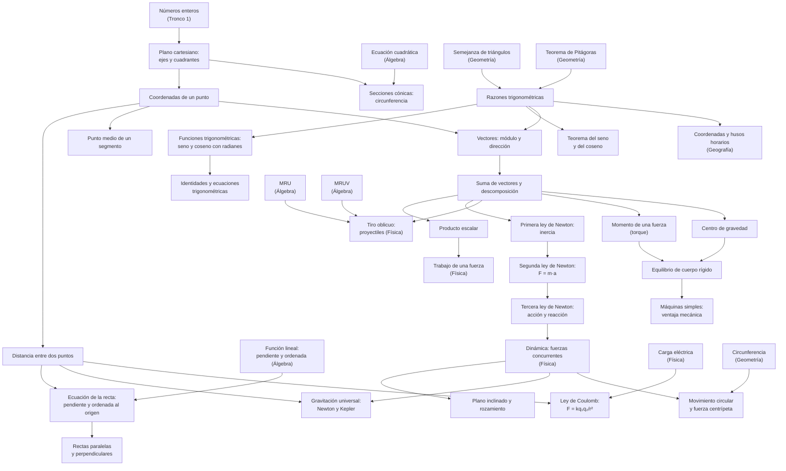
```mermaid
graph TD
  NE1P["Números enteros<br/>(Tronco 1)"] --> GA1["Plano cartesiano:<br/>ejes y cuadrantes"]
  GA1 --> GA2["Coordenadas de un punto"]
  GA2 --> GA3["Distancia entre dos puntos"]
  GA2 --> GA4["Punto medio de un segmento"]
  GA3 --> GA5["Ecuación de la recta:<br/>pendiente y ordenada al origen"]
  A9P["Función lineal:<br/>pendiente y ordenada (Álgebra)"] --> GA5
  GA5 --> GA6["Rectas paralelas<br/>y perpendiculares"]
  GA1 --> GA7["Secciones cónicas:<br/>circunferencia"]
  A7P["Ecuación cuadrática<br/>(Álgebra)"] --> GA7

  GO4P["Semejanza de triángulos<br/>(Geometría)"] --> M7["Razones trigonométricas"]
  M6P["Teorema de Pitágoras<br/>(Geometría)"] --> M7
  M7 --> TRIG1["Funciones trigonométricas:<br/>seno y coseno con radianes"]
  TRIG1 --> TRIG3["Identidades y ecuaciones<br/>trigonométricas"]
  M7 --> TRIG2["Teorema del seno<br/>y del coseno"]
  M7 --> M8["Vectores: módulo y dirección"]
  GA2 --> M8
  M8 --> M9["Suma de vectores y descomposición"]
  M9 --> M10["Producto escalar"]

  M9 --> NEWTON1a["Primera ley de Newton:<br/>inercia"]
  NEWTON1a --> NEWTON1b["Segunda ley de Newton:<br/>F = m·a"]
  NEWTON1b --> NEWTON1c["Tercera ley de Newton:<br/>acción y reacción"]
  NEWTON1c --> F5["Dinámica: fuerzas concurrentes<br/>(Física)"]
  F5 --> F6["Plano inclinado y rozamiento"]
  M10 --> F7["Trabajo de una fuerza<br/>(Física)"]
  M7 --> G1["Coordenadas y husos horarios<br/>(Geografía)"]

  F2P["MRU<br/>(Álgebra)"] --> F10["Tiro oblicuo:<br/>proyectiles (Física)"]
  F3P["MRUV<br/>(Álgebra)"] --> F10
  M9 --> F10
  F5 --> F11["Gravitación universal:<br/>Newton y Kepler"]
  GA3 --> F11
  FIS1P["Carga eléctrica<br/>(Física)"] --> F12["Ley de Coulomb:<br/>F = kq₁q₂/r²"]
  GA3 --> F12
  F5 --> F13["Movimiento circular<br/>y fuerza centrípeta"]
  GO6P["Circunferencia<br/>(Geometría)"] --> F13
  M9 --> EST1a["Momento de una fuerza<br/>(torque)"]
  M9 --> EST1b["Centro de gravedad"]
  EST1a --> EST1c["Equilibrio de cuerpo rígido"]
  EST1b --> EST1c
  EST1c --> F14["Máquinas simples:<br/>ventaja mecánica"]
```

**El cruce que faltaba nombrar**: `Función lineal` (A9, Tronco 2) y `Ecuación
de la recta` acá son el mismo objeto visto desde dos materias — la pendiente
que Álgebra despeja es la misma que Geometría mide como inclinación.
Enseñados por separado, un alumno pasa los dos exámenes sin notar que son lo
mismo; con este puente, `y = mx + b` deja de ser una fórmula y pasa a ser un
dibujo.

**Cuello de botella real, ahora con piso propio**: `Semejanza → Trigonometría
→ Vectores → Dinámica`. Casi todo el fracaso en Física de secundaria superior
pasa por acá: el alumno no falla en Newton, falla en descomponer una fuerza.
Antes ese fallo no tenía de dónde salir; ahora atrás hay geometría real y no
un salto al vacío.

**La otra mitad de la cuadrática que faltaba acá**: `Secciones cónicas`
cuelga tanto de `Plano cartesiano` como de `Ecuación cuadrática` — una
circunferencia es la misma álgebra de segundo grado que ya se enseñó, leída
en dos variables en vez de una. El DSL hoy sólo evalúa circunferencia; el
mapa deja el lugar para parábola, elipse e hipérbola cuando se necesiten.

**Agregado v2.4 — la estructura estándar de Física de secundaria tenía 5
áreas y el mapa sólo cubría 4 completas**: faltaba toda la mecánica más
allá de fuerzas concurrentes. `Gravitación universal` (`F11`) y `Ley de
Coulomb` (`F12`) comparten la misma forma exacta (`F = k·a·b/r²`) —
proporcional al producto, inversamente proporcional al cuadrado de la
distancia — enseñadas juntas, el alumno ve un patrón matemático aplicado
dos veces, no dos fórmulas sueltas. `Gravitación` además le da mecanismo
real a `Formación del sistema solar` y `Rotación y traslación` (Tronco
8.a), que hoy narran sin explicar *por qué* algo orbita. `Movimiento
circular` (`F13`) explica el peralte de una ruta, una centrifugadora, un
satélite en órbita. `Máquinas simples` (`F14`) es el puente real entre
Física y Oficios — la ventaja mecánica que un carpintero o un mecánico
usan todos los días sin nombrarla así.

**Agregado v2.8 — Funciones trigonométricas, Teorema del seno/coseno y
Estática (`TRIG1`, `TRIG2`, `EST1`)**: tres huecos técnicos que Z señaló
por el mismo patrón que ya corrigieron Pitágoras y Volumen —una cadena
que salta un escalón real. `M7` (razones trigonométricas) se quedaba en
el triángulo rectángulo; `TRIG1` agrega la función seno/coseno en
radianes que **ya necesitaba** `Oscilación y período` (`OND1`, Tronco
9.b) sin tenerla — Ondas dependía de una sinusoide que nunca existía como
tal, la misma flecha rota que tenía Meteorología antes de v2.5. `TRIG2`
(seno/coseno para triángulos oblicuos) es lo que necesita cualquier
triángulo que no sea rectángulo — topografía, o un `Montador de
Estructuras` (`OF10`) calculando un cable en ángulo. `EST1` corrige un
error de orden real: `F14` (máquinas simples) colgaba de `F5` (fuerzas
**concurrentes**), pero una palanca es el caso canónico de fuerzas **no**
concurrentes — momento de una fuerza, equilibrio de cuerpo rígido y
centro de gravedad son lo que de verdad explica por qué una palanca
funciona, no la suma de vectores que ya usaba `F5`. El mismo hueco
sostenía sin decirlo a `ING8` ("por qué un triángulo es rígido") y a
`OF10`.

**Agregado v2.9 — Leyes de Newton (`NEWTON1`) e Identidades
trigonométricas (`TRIG3`)**: dos huecos estructurales más de Opus 5. `F5`
("Dinámica: fuerzas concurrentes") ya asumía las tres leyes de Newton sin
nombrarlas nunca — inercia, `F = m·a` y acción-reacción son el marco
conceptual completo, `F5` es sólo el caso de aplicarlas a fuerzas que
concurren en un punto. `TRIG3` es el álgebra que faltaba después de
tener las funciones (`TRIG1`) y los teoremas (`TRIG2`): resolver una
ecuación trigonométrica o usar `sen²+cos²=1` es una habilidad distinta de
saber qué es el seno o aplicarlo a un triángulo oblicuo.

---

## Tronco 4 — Conjuntos, combinatoria, datos y decisión

El tronco más subvalorado y el que más sirve para no ser estafado. Antes
arrancaba directo en "leer una tabla"; le faltaba el fundamento formal de
contar sin enumerar, que es lo que sostiene después toda la probabilidad
compuesta.

### 4.a — Conjuntos y combinatoria: contar sin enumerar

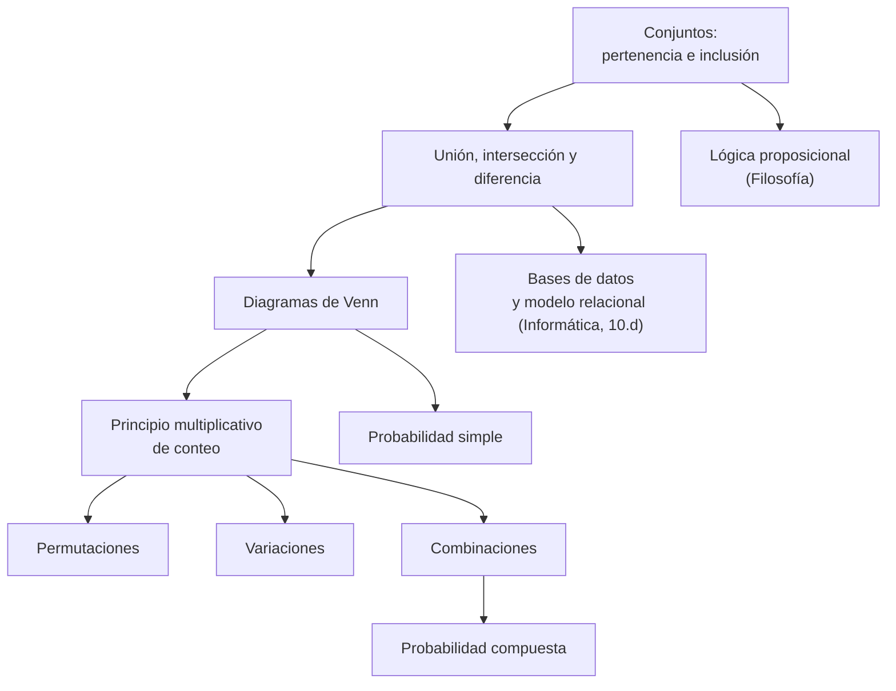
```mermaid
graph TD
  CJ1["Conjuntos:<br/>pertenencia e inclusión"] --> CJ2["Unión, intersección y diferencia"]
  CJ2 --> CJ3["Diagramas de Venn"]
  CJ3 --> CJ4["Principio multiplicativo<br/>de conteo"]
  CJ4 --> CJ5["Permutaciones"]
  CJ4 --> CJ6["Variaciones"]
  CJ4 --> CJ7["Combinaciones"]

  CJ3 --> D8P["Probabilidad simple"]
  CJ7 --> D9P["Probabilidad compuesta"]
  CJ2 --> IN9P["Bases de datos<br/>y modelo relacional (Informática, 10.d)"]
  CJ1 --> FI1P["Lógica proposicional<br/>(Filosofía)"]
```

**Por qué no era "un tema más de probabilidad"**: sin conjuntos, un diagrama
de Venn en Biología o en Informática es un dibujo con círculos que se
solapan y nada más. Con conjuntos atrás, `unión` e `intersección` son la
misma operación que después arma una consulta (`Y`/`O` de una base de
datos) y la que clasifica un espacio muestral. Y sin combinatoria,
`Probabilidad compuesta` (4.b) queda condenada a enumerar caso por caso: el
binomial que Biología usa para probabilidades genéticas complejas es
directamente `combinaciones`.

**Bug corregido v2.5 — `BD1` duplicaba `IN9`**: este diagrama tenía un nodo
propio `BD1` ("Bases de datos: álgebra relacional") aunque la etiqueta ya
decía "(Informática)" — es decir, se sabía que no era de acá, pero tenía
ID y flecha propios en vez de una referencia cruzada. Mientras tanto,
Tronco 10 ya tenía el nodo real (`IN9`, "Bases de datos y modelo
relacional") colgando del mismo `CJ2`. Mismo prerrequisito, mismo
concepto, dos IDs — `BD1` se retira y la flecha cruza directo a `IN9P`,
que ahora además tiene desarrollo completo en 10.d.

### 4.b — Datos, azar y decisión

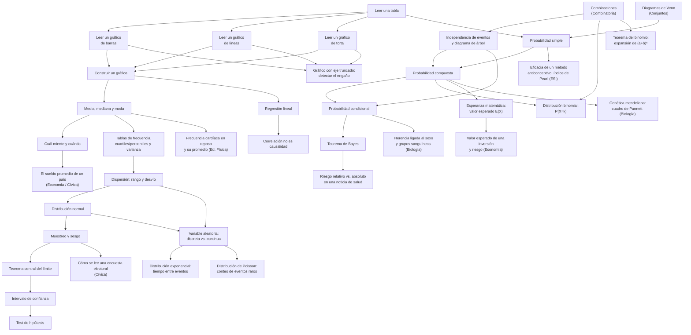
```mermaid
graph TD
  CJ3P["Diagramas de Venn<br/>(Conjuntos)"] --> D8["Probabilidad simple"]
  CJ7P["Combinaciones<br/>(Combinatoria)"] --> D9B["Independencia de eventos<br/>y diagrama de árbol"]
  D9B --> D9["Probabilidad compuesta"]
  D1["Leer una tabla"] --> D2a["Leer un gráfico<br/>de barras"]
  D1 --> D2b["Leer un gráfico<br/>de líneas"]
  D1 --> D2c["Leer un gráfico<br/>de torta"]
  D2a --> D3["Construir un gráfico"]
  D2b --> D3
  D2c --> D3
  D3 --> D4["Media, mediana y moda"]
  D4 --> D5["Cuál miente y cuándo"]
  D4 --> D4B["Tablas de frecuencia,<br/>cuartiles/percentiles y varianza"]
  D4B --> D6["Dispersión: rango y desvío"]
  D6 --> D7["Distribución normal"]
  D1 --> D8
  D8 --> D9
  D9 --> D10["Probabilidad condicional"]
  D9B --> D10
  D10 --> D11["Teorema de Bayes"]
  CJ7P --> D16["Distribución binomial:<br/>P(X=k)"]
  D9 --> D16
  D9 --> D17["Esperanza matemática:<br/>valor esperado E(X)"]
  CJ7P --> D18["Teorema del binomio:<br/>expansión de (a+b)ⁿ"]
  D7 --> D12["Muestreo y sesgo"]
  D12 --> D12B["Teorema central del límite"]
  D12B --> D13["Intervalo de confianza"]
  D13 --> D14["Test de hipótesis"]
  D3 --> D15["Regresión lineal"]
  D6 --> D19["Variable aleatoria:<br/>discreta vs. continua"]
  D7 --> D19
  D19 --> D20["Distribución exponencial:<br/>tiempo entre eventos"]
  D19 --> D21["Distribución de Poisson:<br/>conteo de eventos raros"]

  D5 --> C1["El sueldo promedio de un país<br/>(Economía / Cívica)"]
  D2a --> C2["Gráfico con eje truncado:<br/>detectar el engaño"]
  D2b --> C2
  D2c --> C2
  D15 --> C3["Correlación no es causalidad"]
  D9 --> B2["Genética mendeliana:<br/>cuadro de Punnett (Biología)"]
  D10 --> B3["Herencia ligada al sexo<br/>y grupos sanguíneos (Biología)"]
  D11 --> S1["Riesgo relativo vs. absoluto<br/>en una noticia de salud"]
  D8 --> ES1["Eficacia de un método<br/>anticonceptivo: índice de Pearl (ESI)"]
  D12 --> C4["Cómo se lee una encuesta electoral<br/>(Cívica)"]
  D4 --> EF1["Frecuencia cardíaca en reposo<br/>y su promedio (Ed. Física)"]
  D17 --> E25P["Valor esperado de una inversión<br/>y riesgo (Economía)"]
```

**El cruce que más rinde**: `Probabilidad compuesta --> Genética mendeliana`. El
cuadro de Punnett *es* probabilidad compuesta con otra notación. Biología lo
enseña como una receta de cuadraditos; si viene después de probabilidad, el
alumno entiende **por qué** sale 3:1 en vez de memorizarlo. La cadena completa
ahora es `Combinatoria (4.a) → Probabilidad compuesta → Punnett`, que es
además la misma cadena que, más adelante, necesita `Deriva genética` (Tronco 7):
un alelo que se fija por azar en una población chica es, otra vez, muestreo,
sólo que el tronco 7 lo llama `deriva genética` en vez de `probabilidad`.

**Dos nodos que ya estaban implementados sin estar en el mapa**:
`Distribución binomial` y `Esperanza matemática` son plantillas oficiales
del DSL desde hace semanas — la primera cuelga de `Combinaciones` (es
literalmente `C(n,k)` con una probabilidad fija) y de `Probabilidad
compuesta`; la segunda generaliza la idea de "promedio" a un contexto de
azar, y es la misma cuenta que después decide si una inversión de riesgo
conviene o no.

**Agregado v2.4 — el hermano algebraico de `D16` (`D18`)**: el teorema
del binomio y la distribución binomial nacen del mismo lugar
(`Combinaciones`, `CJ7`) — son las dos caras de la misma pieza,
probabilidad y álgebra, y el mapa sólo tenía una.

**Agregado v2.5 — el puente que faltaba hacia "probabilidad continua"
(`D19`-`D21`)**: el tronco ya tenía binomial, Bayes y normal, pero cada
una vivía suelta sin el concepto que las unifica — `Distribución normal`
es continua, `Binomial` es discreta, y nada lo decía explícitamente.
`D19` nombra esa distinción (variable aleatoria discreta vs. continua);
`D20`/`D21` son los dos casos continuos/discretos que la normal no cubre
y que sí aparecen seguido fuera del aula (tiempo de espera de un colectivo
— exponencial; llamadas por hora a un call center — Poisson). No es
"más estadística": es la clasificación que faltaba para que binomial,
normal, exponencial y Poisson dejen de ser cuatro fórmulas sueltas y
pasen a ser cuatro respuestas a la misma pregunta ("¿qué tipo de azar es
este?").

**Agregado v2.9 — 3 huecos estructurales de Opus 5**: `Probabilidad
compuesta` (`D9`) y `Probabilidad condicional` (`D10`) daban por sabido
qué es la independencia de eventos y cómo armar un diagrama de árbol —
`D9B` es el prerrequisito real de los dos, no un tema aparte. `D4B`
(tablas de frecuencia, cuartiles/percentiles, varianza) llena el salto
entre `Media, mediana y moda` y `Dispersión`: hoy iba directo de
promedios simples a desvío estándar sin el paso intermedio que cualquier
curso de estadística enseña. `D12B` (teorema central del límite) es la
razón matemática de por qué `Intervalo de confianza` y `Test de
hipótesis` funcionan — estaban aplicados sin el teorema que los sostiene.

### 4.c — Teoría de grafos

Ausente en cualquier lado del mapa pese a que dos troncos ya lo
necesitaban sin nombrarlo: `Redes` (`RED1`-`RED4`, Tronco 10.b) enruta
paquetes entre nodos, y `Escala de un mapa`/`Distribución de biomas`
(Tronco 1/8.a) ya piensan el territorio como puntos conectados. Un grafo
es la estructura matemática que sostiene a los dos.

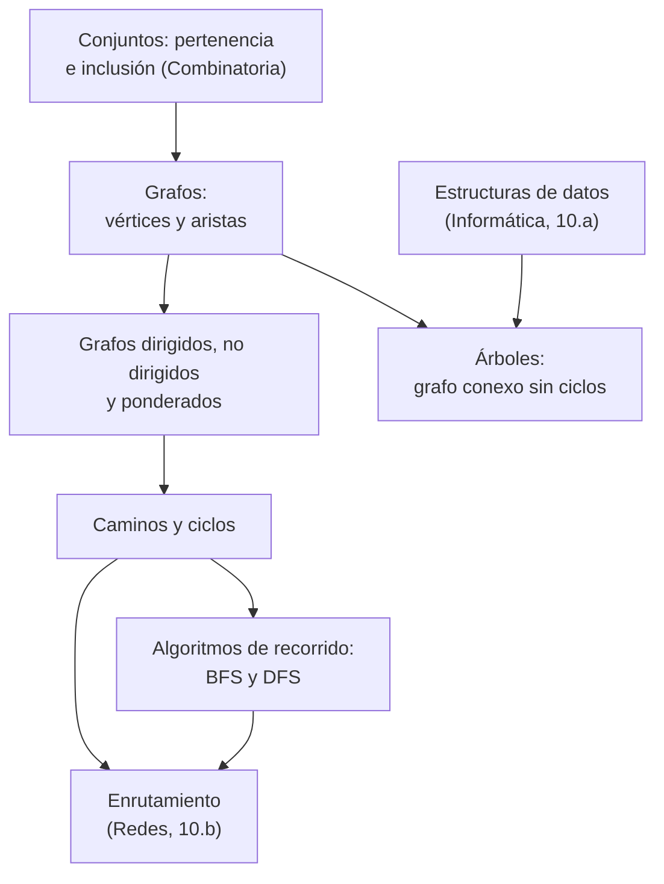
```mermaid
graph TD
  CJ1P["Conjuntos: pertenencia<br/>e inclusión (Combinatoria)"] --> GRAF1["Grafos:<br/>vértices y aristas"]
  GRAF1 --> GRAF2["Grafos dirigidos, no dirigidos<br/>y ponderados"]
  GRAF2 --> GRAF3["Caminos y ciclos"]
  GRAF1 --> GRAF4["Árboles:<br/>grafo conexo sin ciclos"]
  GRAF3 --> GRAF5["Algoritmos de recorrido:<br/>BFS y DFS"]
  IN6P["Estructuras de datos<br/>(Informática, 10.a)"] --> GRAF4

  GRAF3 --> RED3P["Enrutamiento<br/>(Redes, 10.b)"]
  GRAF5 --> RED3P
```

**Por qué no es sólo "más combinatoria"**: un grafo es un conjunto de
vértices con una relación (las aristas) entre ellos — la misma idea de
`Conjuntos` (4.a) aplicada a modelar conexiones en vez de pertenencia.
`Árboles` (`GRAF4`) es el caso particular sin ciclos que ya usaba
implícitamente `IN6` (listas, pilas, colas) sin nombrarlo, y que
`Filogenia y árboles evolutivos` (`BO`, Biología) y `Sistemas de archivos`
(`SO4`, Informática) ya dan por sabido en forma de árbol sin decir "esto
es teoría de grafos". `BFS`/`DFS` (`GRAF5`) son el algoritmo real detrás
de `Enrutamiento` (Tronco 10.b): un router encuentra el camino más corto
recorriendo un grafo, no memorizando rutas.

## Tronco 5 — Lengua: de leer a argumentar (y a comunicar)

```mermaid
graph TD
  P1["Conciencia fonológica"] --> P2["Decodificación y fluidez"]
  P2 --> P3["Vocabulario y familia de palabras"]
  P3 --> P4["Clases de palabras"]
  P4 --> P4B["Conjugación verbal:<br/>indicativo y subjuntivo"]
  P4 --> P4C["Concordancia nominal y verbal"]
  P4 --> P5["Sujeto y predicado"]
  P5 --> P6["Núcleos y modificadores"]
  P6 --> P7["Objetos y circunstanciales"]
  P7 --> P7B["Voz activa y pasiva"]
  P7 --> P7C["Oraciones negativas e interrogativas"]
  P7 --> P8["Oración compuesta:<br/>coordinación y subordinación"]
  P2 --> P9["Comprensión: idea principal"]
  P9 --> P10["Tipos textuales"]
  P10 --> P10Ba["Género narrativo"]
  P10 --> P10Bb["Género lírico"]
  P10 --> P10Bc["Género dramático"]
  P10Ba --> P10Ca["Narrador"]
  P10Ca --> P10Cb["Punto de vista"]
  P10Cb --> P10Cc["Estructura narrativa"]
  P10 --> P11["Recursos literarios"]
  P11 --> P11Ba["Romanticismo"]
  P11Ba --> P11Bb["Realismo"]
  P11Bb --> P11Bc["Modernismo"]
  P11Bc --> P11Bd["Generación del 98"]
  P11Bd --> P11Be["Boom latinoamericano"]
  P10 --> P12a["Tesis"]
  P12a --> P12b["Argumentos"]
  P12b --> P12c["Contraargumentos"]
  P12c --> P13["Detectar falacias"]

  P4 --> ORT["Ortografía y tildación"]
  ORT --> P4D["Signos de puntuación"]
  P8 --> P14["Producción escrita compleja"]
  P4D --> P14
  P14 --> P14Ba["Conectores textuales"]
  P14 --> P14Bb["Referencia:<br/>anáfora y catáfora"]
  P14 --> P14Bc["Progresión temática"]
  P13 --> FI1["Lógica proposicional<br/>(Filosofía)"]
  FI1 --> FI2["Validez de un razonamiento"]
  FI2 --> I2["Álgebra booleana<br/>(Informática)"]
  FI2 --> FI2B["Lógica de predicados:<br/>cuantificadores (∀, ∃) y deducción formal"]
  FI1 --> FI9["Epistemología:<br/>qué es el conocimiento, cómo se justifica"]
  FI1 --> FI4a["Ser<br/>(ontología)"]
  FI1 --> FI4b["Existencia"]
  FI1 --> FI4c["Realidad"]
  FI1 --> FI5["Ética como rama propia:<br/>corrientes normativas"]
  FI1 --> FI6a["Qué es el arte"]
  FI1 --> FI6b["El gusto estético"]
  FI1 --> FI6c["Lo bello"]
  FI1 --> FI7["Historia de la filosofía y corrientes:<br/>presocráticos a existencialismo,<br/>+ corrientes político-económicas (neutral)"]
  FI5 --> FI8a["Utilitarismo"]
  FI5 --> FI8b["Deontología"]
  FI5 --> FI8c["Ética de la virtud"]
  FI5 --> FI8d["Contractualismo"]
  FI8a --> FIB1["Bioética: eutanasia, experimentación<br/>animal, ingeniería genética humana"]
  FI8b --> FIB1
  FI8c --> FIB1
  FI8d --> FIB1
  P13 --> CD1["Verificación de una noticia<br/>(Ciudadanía Digital)"]
  P13 --> CD2["Publicidad engañosa:<br/>marcar lo que no dice nada"]
  P12c --> H1["Interpretar una fuente histórica<br/>(Historia)"]

  P12c --> COM1["Exposición oral"]
  P13 --> COM2["Debate:<br/>refutar en vivo"]
  COM1 --> COM2
  COM2 --> COM3["Negociación"]
  COM1 --> COM4["Presentación con apoyo visual"]
  COM2 --> COM5["Persuasión ética<br/>vs. manipulación"]
  P13 --> COM5
  P14 --> COM6a["CV"]
  P14 --> COM6b["Correo formal"]
  P14 --> COM6c["Informe técnico"]
  P11 --> AR8["Teatro: dramaturgia<br/>y actuación (Arte)"]
  COM1 --> AR8

  P2 --> LC1["Circuito de la comunicación:<br/>emisor, receptor, código, canal"]
  LC1 --> LC2["Variedades de la lengua:<br/>registros y lectos"]
  P8 --> LC3["Discurso referido:<br/>estilo directo e indirecto"]
  P10 --> LC4["Géneros discursivos:<br/>primarios y secundarios"]
  P10 --> LC5["Paratextos"]
  P12a --> LC6["Subjetivemas y modalizadores"]
  LC4 --> LC7["Géneros periodísticos:<br/>noticia y crónica"]
  P10 --> LC7

  P8 --> SX1["Coordinadas copulativas"]
  P8 --> SX2["Coordinadas disyuntivas"]
  P8 --> SX3["Coordinadas adversativas"]
  P8 --> SX4["Coordinadas distributivas"]
  P8 --> SX5["Subordinada sustantiva<br/>de sujeto"]
  P8 --> SX6["Subordinada sustantiva<br/>de complemento directo"]
  P8 --> SX7["Subordinada sustantiva<br/>de complemento de régimen"]
  P8 --> SX8["Subordinada sustantiva<br/>de complemento circunstancial"]
  P8 --> SX9["Subordinada sustantiva<br/>de complemento del nombre"]
  P8 --> SX10["Subordinada sustantiva<br/>de complemento de un adjetivo"]
  P8 --> SX11["Subordinada adjetiva<br/>o de relativo"]
  P8 --> SX12["Subordinada adverbial<br/>de tiempo"]
  P8 --> SX13["Subordinada adverbial<br/>de lugar"]
  P8 --> SX14["Subordinada adverbial<br/>de modo"]
  P8 --> SX15["Subordinada causal"]
  P8 --> SX16["Subordinada consecutiva"]
  P8 --> SX17["Subordinada condicional"]
  P8 --> SX18["Subordinada concesiva y final"]
  P6 --> SX19["Sintagmas: nominal, adjetivo,<br/>preposicional, adverbial, verbal"]

  P9 --> ESTU1["Técnicas de estudio:<br/>resumen y organizadores gráficos"]
  P10 --> TT1["Texto teatral:<br/>parlamentos, acotaciones, dramaturgo"]
  P5 --> TS1["Tipos de sujeto:<br/>bimembre/unimembre, tácito/expreso"]
```

**El cruce inesperado y muy bueno**: `Detectar falacias --> Lógica proposicional
--> Álgebra booleana`. Es la misma estructura en tres materias: Lengua la ve en
prosa, Filosofía la formaliza, Informática la vuelve circuito. Enseñado en ese
orden, el álgebra de Boole deja de ser tablas de verdad sin sentido.

**Agregado v2.4 — Filosofía tenía, en todo el mapa, sólo 2 nodos
prestados (`FI1`/`FI2`)**: de las 5 ramas clásicas de la disciplina
(metafísica, epistemología, ética, lógica, estética), sólo lógica tenía
nodo. `FI4`-`FI7` cierran esa brecha — son tan gradables por `mc`/`vf`/
`match` como cualquier otra materia ("¿qué corriente sostiene que el
conocimiento viene de la experiencia? → empirismo"), no "evaluación
abierta". `FI7` incluye explícitamente corrientes político-económicas
(marxismo, liberalismo, socialismo, conservadurismo, anarquismo) con el
mismo principio de neutralidad que las corrientes económicas del Tronco
1 (`E28`): identificar qué sostiene cada una, nunca evaluar cuál tiene
razón. `FI8` (Dilemas éticos) es lo único genuinamente `abierta` +
corrección manual de todo este bloque — juzgar un caso, no identificar
qué dijo Kant.

**Agregado v2.6 — `Lógica de predicados` (`FI2B`)**: `FI1`/`FI2` cubren
lógica **proposicional** (afirmaciones completas: "llueve", "el suelo está
mojado"). La lógica de predicados es un nivel más — cuantificar sobre
elementos de un conjunto ("para todo x", "existe un x tal que") y
deducción formal a partir de premisas. Es la extensión real que separa
"esto es válido o no" (`FI2`) de "esto se puede derivar formalmente de
esto otro", y cierra el mismo hueco que `Álgebra booleana` (`I2`) tiene
del lado de Informática: booleana opera con proposiciones fijas,
predicados opera con proposiciones que dependen de una variable.

**Agregado v2.7 — Epistemología (`FI9`)**: señalado por Z citando el
propio texto del mapa, que ya nombraba las "5 ramas clásicas" de
Filosofía (metafísica, epistemología, ética, lógica, estética) pero sólo
había desarrollado 4 — epistemología (teoría del conocimiento: qué es
saber algo, cómo se justifica una creencia, la distinción entre opinión y
conocimiento) se había quedado afuera sin que nadie lo notara. Cierra el
quinteto que `FI4`-`FI8` habían dejado incompleto.

**Agregado v2.7 — Movimientos literarios (`P11B`)**: `Recursos
literarios` (`P11`) enseña las herramientas (metáfora, hipérbole);
faltaba el mapa histórico de qué corriente las usa y por qué (Romanticismo,
Realismo, Modernismo, Generación del 98, Boom latinoamericano) — currícula
estándar de cualquier programa de Lengua y Literatura de secundaria, y un
cruce natural con `Interpretar una fuente histórica` (`H1`) y con el
propio Tronco 8 (cada movimiento tiene su contexto histórico real detrás).

**Agregado v2.7 — Escritura profesional (`COM6`)**: `Producción escrita
compleja` (`P14`) ya enseña a escribir con estructura; faltaba el género
concreto que un egresado usa primero en la vida real — CV, correo
electrónico formal, informe técnico, documentación. Mismo criterio que ya
aplicó `E8F` en Vida Cotidiana: contenido práctico y de alta demanda, no
trivia de estilo.

**Agregado v2.8 — Géneros literarios (`P10B`/`P10C`) y Cohesión y
coherencia (`P14B`)**: Z señaló que `Tipos textuales` (`P10`) es otra
cosa que géneros literarios — tipo textual es la forma (narrativo,
descriptivo, argumentativo como estructura del discurso), género
literario es la tradición (narrativo, lírico, dramático como forma de
arte). `Análisis narrativo` (narrador, punto de vista, estructura) es el
vocabulario real con el que se lee cualquier cuento o novela, y faltaba
entre `Recursos literarios` y `Movimientos literarios` (`P11B`, v2.7) —
tenía las herramientas y la historia, sin la capa del medio. `Cohesión y
coherencia` es lo que `Producción escrita compleja` (`P14`) daba por
sabido: que un texto bien armado no es sólo párrafos con ideas correctas,
es que un conector, un pronombre o una referencia efectivamente unan una
oración con la siguiente.

**Lo que Lengua enseñaba a medias**: comprensión y producción escrita, sí;
comunicación en vivo, no. `Exposición oral`, `Debate` y `Negociación` cuelgan
de lo mismo que ya existía (`Texto argumentativo`, `Detectar falacias`) — no
es contenido nuevo, es el mismo contenido puesto de pie frente a otra
persona en tiempo real, que es donde en la práctica se nota si el argumento
se entendió o sólo se escribió bien. Es también, casi textual, la sección
2.6 del informe de revisión: faltaba explícitamente en el mapa.

**Agregado v2.4**: `P4B`/`P4C`/`P7B`/`P7C` (conjugación verbal en sus dos
modos, concordancia, voz activa/pasiva, tipos de oración) ya tenían
generador escrito hace tiempo (V1) sin que el mapa les diera nodo — iba
de `Clases de palabras` directo a `Sujeto y predicado` sin pasar por
conjugar un verbo o concordar sujeto y predicado.

**Agregado v2.9 — Signos de puntuación (`P4D`)**: hueco estructural real
que señaló Opus 5 — `Ortografía y tildación` (`ORT`) existía, puntuación no,
pese a que `Producción escrita compleja` (`P14`) la necesita para que un
texto se pueda leer sin ambigüedad. Una coma mal puesta cambia el sentido
de una oración tanto como una palabra mal escrita, y el mapa sólo cubría
la segunda.

**Lectura obligatoria, de dominio público (más de 70 años desde la
muerte del autor, Ley 11.723)**: `P9`-`P13` rinden mejor con un texto
real de base. Primaria: Horacio Quiroga (*Cuentos de la selva*), fábulas
de Iriarte y Samaniego, Rafael Pombo, José Martí (*La Edad de Oro*).
Secundaria: José Hernández (*Martín Fierro*), Esteban Echeverría (*El
matadero*, cruce directo con `H1`), Domingo F. Sarmiento (*Facundo*,
el ensayo argumentativo del canon para `P12`), Gustavo Adolfo Bécquer y
Rubén Darío (recursos literarios verso por verso, `P11`), Ricardo
Güiraldes (*Don Segundo Sombra*).

**Agregado v2.4 — `AR8` (Teatro): de los 7 lenguajes artísticos que
reconoce la NAP de Educación Artística (Visuales, Música, Diseño,
Audiovisual, Multimedial, Teatro, Danza), Teatro y Danza eran los 2 que
ni siquiera figuraban como tema menor de Arte en todo el mapa. Teatro
cuelga de aquí (`P11`/`COM1`) porque una obra dramática es, a la vez,
texto literario y actuación en vivo — la misma articulación
lectura/oralidad que ya conectaba `Recursos literarios` con `Exposición
oral`. Su pareja, `AR7` — Danza —, se agregó en Tronco 9.b (`OND4`),
colgando del mismo piso de ritmo y tiempo que ya sostenía la acústica de
un instrumento. Como el resto de Arte, la práctica (actuar, bailar) sigue
siendo `abierta` con corrección manual; lo gradable es la teoría de cada
lenguaje (estructura dramática, técnicas de danza por estilo).

**Agregado v2.9.6 — Comunicación/pragmática (`LC1-LC7`) y atomización
de sintaxis (`SX1-SX19`, `ESTU1`, `TT1`, `TS1`)**: confirmado vía
"Prácticas del Lenguaje 1" (Ed. Estrada, colección Huellas) y
"Sintaxis.pdf" (manual de 125 páginas). `LC1-LC7` cierran el costado
pragmático que Lengua nunca tuvo — el circuito de la comunicación en
sí (`LC1`), variedades de la lengua por registro/lecto (`LC2`),
discurso referido (`LC3`), géneros discursivos primarios/secundarios
de Bajtín (`LC4`), paratextos (`LC5`), subjetivemas y modalizadores
—cómo se marca la opinión en un texto, complemento directo de `Tesis`
(`P12a`)— (`LC6`) y géneros periodísticos como tipo textual propio,
distinto del `tipos-textuales` genérico (`LC7`). El bloque grande es
sintaxis: `Oración compuesta: coordinación y subordinación` (`P8`)
era **un solo nodo aplastando ~18 conceptos reales** — mismo
anti-patrón lumped que ya se corrigió en Historia profunda (30 nodos)
y en `E28` (v2.9.5). `SX1-SX4` atomizan coordinación (copulativas,
disyuntivas, adversativas, distributivas); `SX5-SX10` subordinación
sustantiva (sujeto, complemento directo, de régimen, circunstancial,
del nombre, de un adjetivo); `SX11-SX18` subordinación adjetiva y
adverbial (relativo, tiempo, lugar, modo, causal, consecutiva,
condicional, concesiva/final). Todos cuelgan de `P8`, que queda como
nodo-paraguas. `SX19` (sintagmas: nominal, adjetivo, preposicional,
adverbial, verbal) cuelga en cambio de `Núcleos y modificadores`
(`P6`), que ya cubría lo mismo con enfoque más informal — es su
versión formal, no una repetición. Cierran el tronco 3 nodos chicos
confirmados vía "Prácticas del lenguaje 5" (currículum real): técnicas
de estudio (`ESTU1`, resumen y organizadores gráficos, cuelga de `P9`),
texto teatral como tipo textual (`TT1`, distinto del género dramático
literario que ya cubría `P10Bc`) y tipos de sujeto (`TS1`, bimembre/
unimembre, tácito/expreso, hoy aplastados dentro del genérico `P5`).

**Agregado v2.9.6 — Bioética general (`FIB1`)**: confirmado vía
`FILOSOFIA Maipue` y `filosofía es 5` (Estrada). Bioética sólo existía
recortada al caso de transgénicos (`BIOTEC2`, Biología) — nunca como
rama general de ética aplicada. `FIB1` (eutanasia, experimentación
animal, ingeniería genética humana) cuelga de las 4 corrientes éticas
normativas (`FI8a-d`) porque es, justamente, el terreno donde esas
corrientes en abstracto se ponen a prueba con un caso concreto —
`BIOTEC2` pasa a ser una instancia particular de este marco más
general, no un tema aislado.

---

## Tronco 6 — Tiempo, espacio y sociedad

```mermaid
graph TD
  T1["Línea de tiempo y antes/después"] --> T2["Década, siglo, milenio"]
  T2 --> T3["Antes y después de Cristo:<br/>cálculo de intervalos"]
  T3 --> T4["Periodización histórica"]
  T4 --> T5["Causa y consecuencia"]
  T5 --> T6["Cambio y continuidad"]
  T6 --> T7["Multicausalidad"]
  T4 --> T8["Significancia histórica:<br/>qué del pasado vale la pena estudiar"]
  T5 --> T9["Evidencia:<br/>fuente primaria vs. secundaria, confiabilidad"]
  T6 --> T10["Dimensión ética:<br/>qué le debemos a la memoria de lo ocurrido"]
  T7 --> T11a["Positivismo<br/>(historiografía)"]
  T7 --> T11b["Materialismo histórico"]
  T7 --> T11c["Escuela de los Annales"]
  T7 --> T11d["Historia cultural"]

  G2["Orientación y puntos cardinales"] --> G3["Mapa, plano y escala"]
  G3 --> G4["Coordenadas geográficas"]
  G4 --> G5["División política"]
  G4 --> G12a["Mapas digitales"]
  G4 --> G12b["GPS:<br/>sistema de posicionamiento global"]
  G4 --> G12c["Imágenes satelitales"]
  G5 --> G5B["Región:<br/>cómo se agrupan territorios por rasgos compartidos"]
  G5 --> G6["Relieve, clima y biomas"]
  G6 --> G7["Recursos y actividades económicas"]

  G6 --> GEOA1["Regiones naturales de Argentina:<br/>NOA, NEA, Cuyo, Pampeana, Patagonia"]
  GEOA1 --> GEOA2["Riesgos naturales argentinos:<br/>tornados, granizo, inundaciones, sequías, sismos, ciclones"]
  G9P["Relieve, sismos y volcanes<br/>(Historia profunda)"] --> GEOA2
  G7 --> GEOA5["Geografía económica agrícola argentina"]
  G7 --> GEOA6["Minería e hidrocarburos en Argentina"]
  GEOA3["Indicadores sociales de Argentina:<br/>NBI, pobreza, hacinamiento"] --> IDH1["Índice de Desarrollo Humano"]
  G8 --> GEOA3
  G8 --> GEOA4["Migraciones internas en Argentina:<br/>golondrina, fronteriza, interna"]

  G5 --> GM1["Estados y globalización:<br/>geopolítica y soberanía"]
  G8 --> GM2["Migraciones internacionales"]
  G7 --> GM3["Trabajo y desempleo mundial"]
  G7 --> GM4["Geografía industrial mundial:<br/>deslocalización de empresas"]
  G7 --> GM5["Producción agraria mundial<br/>y biotecnología"]
  G7 --> GM6["Turismo mundial:<br/>flujos e impacto económico"]
  AM1 --> GM7["Recursos hídricos y gestión"]
  GEOA2 --> GM8["Riesgos ambientales mundiales"]

  G8 --> GAM1["América Latina:<br/>formación histórica de la población"]
  GM4 --> GAM2["América Latina:<br/>industria y energía"]
  GAM1 --> GAM3["Países de América Latina:<br/>México, Centroamérica, Caribe, Paraguay"]
  G8 --> GAM4["América Anglosajona:<br/>poblamiento y territorio"]

  T7 --> H2a["Revoluciones<br/>(desarrollo real en 8.c)"]
  T7 --> H2b["Independencias<br/>(desarrollo real en 8.c)"]
  T7 --> H2c["Guerras<br/>(desarrollo real en 8.c)"]
  G7 --> G8["Población: pirámides y migraciones"]
  G7 --> AM1["Ambiente y recursos<br/>(art. 92 g, Ley 27.621)"]
  AM1 --> AM5a["Conservacionismo"]
  AM1 --> AM5b["Ambientalismo liberal"]
  AM1 --> AM5c["Ecologismo político"]
  AM1 --> AM5d["Decrecimiento"]
  E28cP["Liberalismo clásico<br/>y escuela austríaca (Economía)"] --> AM5b
  E28fP["Keynesianismo<br/>(Economía)"] --> AM5c
  E28eP["Marxismo<br/>(Economía)"] --> AM5d
  FI7P["Historia de la filosofía<br/>y corrientes (Filosofía)"] --> AM5a
  FI7P --> AM5b
  FI7P --> AM5c
  FI7P --> AM5d
  G8 --> SOC1a["Hechos sociales"]
  T7 --> SOC1a
  SOC1a --> SOC1b["Instituciones"]
  SOC1b --> SOC1c["Estratificación"]
  H10P["Hominización:<br/>primates a Homo (Historia profunda)"] --> ANTRO1a["Cultura"]
  ANTRO1a --> ANTRO1b["Diversidad cultural"]
  ANTRO1b --> ANTRO1c["Etnocentrismo"]
  H10P --> ANTRO2["Subcampos de la antropología:<br/>física, arqueológica, lingüística, social"]
  ANTRO1b --> ANTRO3["Relaciones de parentesco"]
  G5 --> C5["Organización del Estado<br/>(Cívica)"]
  C5 --> C5B["Constitución Nacional:<br/>Preámbulo"]
  C5B --> C5C["Parte dogmática:<br/>derechos y garantías"]
  C5 --> C6["División de poderes"]
  C6 --> C7["Cómo se hace una ley"]
  C6 --> C8["Sistema electoral y reparto D'Hondt"]
  T7 --> C9a["Derechos del niño<br/>(art. 92 d)"]
  T7 --> C9b["Derechos indígenas<br/>(art. 92 e)"]
  T7 --> C9c["Derechos de género<br/>(art. 92 f)"]
  C5B --> C9Ba["Bandera"]
  C5B --> C9Bb["Escudo"]
  C5B --> C9Bc["Himno"]
  C5B --> C9Bd["Escarapela"]
  H2a --> C9C["Marchas patrióticas:<br/>marcha↔efeméride↔hecho histórico"]
  H2b --> C9C
  H2c --> C9C
  C6 --> C14["Impuestos:<br/>quién cobra qué y qué se financia con eso"]
  C6 --> C15a["DNI"]
  C6 --> C15b["CUIL"]
  C6 --> C15c["Voto:<br/>trámite y padrón"]
  C6 --> C15d["Historia clínica"]
  C6 --> C16a["Sistemas políticos comparados"]
  C16a --> C16b["Partidos políticos"]
  C16b --> C16c["Organismos internacionales"]
  C16c --> C17["Tratados internacionales:<br/>jerarquía constitucional (art. 75 inc. 22)"]
  C15a --> C18a["Señalización vial"]
  C15b --> C18a
  C15c --> C18a
  C15d --> C18a
  C15a --> C18b["Prioridades de paso"]
  C15b --> C18b
  C15c --> C18b
  C15d --> C18b
  C15a --> C18c["Alcoholemia<br/>y conducción"]
  C15b --> C18c
  C15c --> C18c
  C15d --> C18c
  C14 --> C19a["Sistema de salud<br/>público universal"]
  C14 --> C19b["Sistema de salud<br/>privado de mercado"]
  C14 --> C19c["Sistema de salud<br/>mixto"]
  E23P["Obra social<br/>(Economía)"] --> C19a
  E23P --> C19b
  E23P --> C19c
  E28fP --> C19a
  E28cP --> C19b
  E28gP["Ordoliberalismo<br/>(Economía)"] --> C19c

  C5 --> C20["Teoría del poder:<br/>Aristóteles, Locke, Habermas, pluralismo"]
  C20 --> C21["Tipos de Estado:<br/>liberal, de bienestar, neoliberal"]
  E28cP --> C21
  E28fP --> C21
  GP1P["Gestión de proyectos<br/>(Economía-Gestión)"] --> C22["Proyecto ciudadano participativo:<br/>del problema al proyecto"]
  C9a --> C23["Discriminación y organismos<br/>de protección: INADI, Ley 26.370"]
```

**Agregado v2.4 — 3 conceptos de pensamiento histórico sin nodo
(`T8`-`T10`)**: el marco "Big Six" (Seixas & Morton, referencia
internacional en didáctica de la Historia) tiene 6 conceptos; el mapa ya
cubría 2 (`T5` Causa y consecuencia, `T6` Cambio y continuidad — `T7`
Multicausalidad es extensión del cuarto). Sin `Dimensión ética` (`T10`)
como habilidad enseñada explícitamente, un nodo como "Memoria: terrorismo
de Estado" corre el riesgo de quedar reducido a una fecha para
memorizar, en vez de ser la herramienta de juicio sobre el pasado que en
la práctica evita repetir el error.

**Agregado v2.9.3 — Corrientes historiográficas (`T11`)**: el marco Big
Six (`T5`-`T10`) enseña a PENSAR históricamente, pero nunca nombra que
los propios historiadores llevan un siglo discutiendo desde dónde se
escribe la historia. **Positivismo histórico** (Ranke: contar "lo que
realmente pasó", hechos y grandes figuras, archivo como verdad). **Materialismo
histórico** (Marx: la historia la mueven las condiciones materiales y la
lucha de clases, no las ideas). **Escuela de los Annales** (Bloch,
*Apología para la historia*, 1949: estructuras de larga duración —
clima, demografía, economía — por encima de reyes y batallas). **Historia
cultural/microhistoria** (Ginzburg: un caso chico e insignificante puede
revelar una estructura social entera). Cruza con `FI7` (marxismo también
como corriente historiográfica) y con `INV7` (cada escuela es, en el
fondo, un modelo distinto de qué cuenta como evidencia) — mismo principio
de neutralidad: cada corriente es una lente real con la que se sigue
escribiendo historia hoy, no una etapa superada por la siguiente.

**Agregado v2.4 — duplicación resuelta**: esta cadena tenía su propia
`H3`/`H4` ("Memoria: terrorismo de Estado" / "Causa Malvinas", art. 92 c
y b) citando los mismos dos artículos que `AH12`/`AH13` en Tronco 8.c —
mismo contenido, dos IDs. El desarrollo real (con más contexto y
prerrequisito) queda en `Tronco 8.c`; acá sólo el cruce de referencia,
para no escribir el mismo tema dos veces.

**Agregado v2.4 — `Región` (`G5B`)**: de los 5 Temas de la Geografía
(NCGE/AAG), 4 ya tenían nodo (Ubicación, Lugar, Interacción Humano-
Ambiental, Movimiento); "Región" — cómo se agrupan territorios por
rasgos compartidos más allá de la frontera política (regiones
culturales, biomas como región) — no tenía ninguno. `División política`
se le acerca pero es más estrecho.

**Agregado v2.7 — Sistemas de Información Geográfica (`G12`)**: GPT
señaló que `Coordenadas geográficas` (`G4`) se queda en el papel — hoy
prácticamente nadie mide una coordenada con papel y compás, la mide con
el GPS del celular. Cuelga de `G4` porque un SIG es, en esencia,
coordenadas con una capa de datos encima (mapas digitales, imágenes
satelitales), la misma habilidad de lectura de mapas aplicada a la
herramienta que de verdad se usa hoy.

**Agregado v2.4 — Constitución Nacional y símbolos patrios**: la
Instrucción Cívica clásica organiza la Constitución en Preámbulo
(`C5B`), parte dogmática (`C5C`, derechos y garantías) y parte orgánica
(ya cubierta por `C5`/`C6`) — hoy sólo la parte orgánica tenía nodo.
Símbolos patrios (`C9B`: bandera, escudo, himno, escarapela — obligatorios
en las escuelas argentinas desde 1903/1909) y marchas patrióticas
(`C9C`: identificar a qué efeméride corresponde cada marcha, no
memorizar la letra) cierran un hueco que hoy no existe en ningún lado
del mapa. Aplica el mismo principio de neutralidad que corrientes de
pensamiento (Tronco 1/Filosofía): enseñar qué dice la Constitución, no
adoctrinar sobre cómo interpretarla.

`Reparto D'Hondt` necesita además **división entera** del Tronco 1: es el único
tema de Cívica que es una cuenta, y es justamente el que casi nadie entiende.

**Agregado v2.5.2 — Impuestos y Trámites (`C14`/`C15`)**: verificado
contra `PROPUESTA-materias-nuevas-biblioteca.md`, que los proponía
explícitamente para Educación Cívica y nunca entraron a ninguna versión
del MAPA. `C14` es distinto de `E2` (IVA y precio final, Tronco 1): `E2`
calcula cuánto IVA paga una persona en una compra puntual; `C14` es la
pregunta cívica de fondo — quién cobra cada impuesto (nacional,
provincial, municipal) y qué servicio público financia, sin la cual
"pagar impuestos" no tiene contraparte. `C15` es alfabetización cívica
práctica pura (qué es cada documento, para qué sirve) — mismo tipo de
contenido "seguro y verificable" que ya rinde en Vida Cotidiana.

**Agregado v2.8 — Sociología, Antropología y Ciencia Política (`SOC1`,
`ANTRO1`, `C16`/`C17`)**: confirmado por Opus 5 y Z de forma
independiente — la Res. CFE 84/09 reconoce diez orientaciones del Ciclo
Orientado; el mapa cubría nueve (Psicología, Derecho, Comunicación,
Filosofía entre otras) pero ninguna materia cubría la sociedad como
objeto de estudio. `Sociología` cuelga de `Población` (`G8`, el dato) y
`Multicausalidad` (`T7`, la herramienta de pensamiento histórico) porque
estudia exactamente eso — hechos sociales e instituciones — con
metodología propia. `Antropología` (cultura, diversidad, etnocentrismo)
cuelga de `Hominización` (`H10`, Tronco 8.b), que hoy narra el paso de
primate a Homo sin la herramienta conceptual de "cultura" que explica por
qué ese paso importa. `Ciencia Política` (sistemas comparados, partidos,
organismos internacionales) no existía en ningún lado pese a que Cívica
ya enseñaba división de poderes de un solo Estado — acá se compara entre
Estados. No son troncos nuevos: son nodos que completan materias
existentes (Cívica, Historia) sin abrir una fila nueva en `materias`.

**Agregado v2.8 — Educación vial normativa (`C18`)**: confirmado por
Opus 5 y Z — `Distancia de frenado` (Tronco 2) y `Momento lineal, impulso
y choques` (`MOM1`-`MOM3`, Tronco 9.d) ya daban el mecanismo físico; nunca
existió el contenido normativo y práctico (señalización, prioridad de
paso, alcoholemia). Con un matiz que trajo Opus 5: el Decreto 436/2025
derogó los artículos de la Ley 27.214 que la hacían obligatoria a nivel
nacional, así que hoy es decisión de cada provincia — el nodo entra igual
porque el contenido sigue siendo currícula real donde se dicta, pero ya
no con el respaldo de obligatoriedad nacional que tienen ESI o Educación
Ambiental.

**Agregado v2.9.2 — Sistema de salud (`C19`)**, pregunta de Javier: no
existía ni el nodo base — `E23` (obra social) aparecía de pasada como
descuento de sueldo, sin que el sistema de salud en sí tuviera dónde
vivir. El espectro real, con el mismo tratamiento neutral que `E28`/
`FI7`/`AM5`: **público universal** (financiado por impuestos, acceso
garantizado — modelo hospital público/NHS), **privado de mercado**
(seguros y prepagas compitiendo por cobertura; en su versión más radical,
la crítica —asociada a la escuela austriaca, ya nombrada en `E28`— de que
el hospital es un modelo de negocio centralizado y obsoleto, y que en un
mercado sin regulación los servicios de salud se desagregarían en
oferentes especializados y competitivos en vez de concentrarse ahí) y
**mixto** (el sistema argentino real: hospital público + obra social +
prepaga, las tres capas conviviendo). Cuelga de `Impuestos` (`C14`)
porque la salud pública es, en definitiva, el mismo dinero que ese nodo
ya explica de dónde sale y a qué se destina.

**Agregado v2.9 — Corrientes del pensamiento ambiental (`AM5`)**,
pregunta de Javier: `AM1`-`AM4` (Ambiente y recursos, huella de carbono,
cambio climático, huella humana histórica) son puramente científico-
técnicos — miden, comparan una línea de base, calculan un impacto. Ninguno
entra en el terreno donde el ambiente deja de ser ciencia y pasa a ser
ideología: **ambientalismo** (conservacionismo clásico, regulación,
mercado de carbono, "capitalismo verde" — el ambiente se protege *dentro*
del sistema económico existente) vs. **ecologismo político**
(decrecimiento, ecosocialismo, ecofeminismo, "derechos de la naturaleza"
—constitucionalizados en Ecuador 2008 y Bolivia—, Buen Vivir/Pachamama
como paradigma alternativo de desarrollo — el ambiente exige repensar el
sistema económico en sí). Es el mismo tipo de espectro ideológico que ya
se trató con neutralidad en `E28` (mercantilismo a neoliberalismo) y
`FI7` (liberalismo a anarquismo) — de hecho cruza con los dos: la
discusión ecologismo/decrecimiento **es**, en el fondo, una corriente
económica y una corriente político-filosófica aplicadas al límite
ecológico. Mismo principio no negociable que ya rige esos dos: identificar
qué sostiene cada postura con la misma seriedad expositiva, nunca evaluar
cuál tiene razón.

**Agregado v2.9.6 — Geografía regional: Argentina, Mundial y América
(`GEOA1-GEOA6`, `GM1-GM8`, `GAM1-GAM4`, `IDH1`)**: los 21 temas previos de
Geografía (`G1-G12`, `AM1`, `AM5a-d`) eran puramente herramienta/
concepto — orientación, escala, SIG, división política, relieve-clima-
biomas genérico, recursos económicos genérico, población genérica —
sin un solo nodo de contenido regional o temático específico,
confirmado contra fuentes reales (*La Argentina. Geografía económica y
humana*, Isidro/Carlevari; *Geografía Mundial y los desafíos del Siglo
XXI*, Santillana; *Una geografía de América para pensar*, Gambuzzi/
López, Kapelusz-Norma). Bloque Argentina (`GEOA1-GEOA6`): regiones
naturales, riesgos naturales, indicadores sociales (NBI), migraciones
internas, agro y minería/hidrocarburos — este último confirmado además
por `Ciencias Sociales ES.3` (DGCyE 2007, oficial). Bloque Mundial
(`GM1-GM8`): geopolítica y globalización, migraciones internacionales,
trabajo/desempleo, geografía industrial, producción agraria y
biotecnología, turismo, recursos hídricos, riesgos ambientales. Bloque
América (`GAM1-GAM4`): formación de la población, industria y energía,
países concretos (México/Centroamérica/Caribe/Paraguay) y América
Anglosajona — expandido de 1 a 4 nodos porque el libro fuente está
organizado en esos 4 bloques reales, demasiado sustancial para un solo
nodo. `IDH1` (Índice de Desarrollo Humano) cierra un hueco sorprendente
— 0 resultados en grep pese a ser el indicador estándar que Geografía/
Economía/Cívica dan por conocido. `turismo-mundial` (`GM6`) entra pese
al riesgo de solapamiento con `material/turismo/` (oficio Guía
Turístico) porque el ángulo es distinto — acá es el fenómeno geográfico-
económico mundial, allá la práctica profesional de guiar.

**Corrección — sismos en `GEOA2`**: el primer borrador de `riesgos-
naturales-argentinos` listaba tornados, granizo, inundaciones y
sequías, sin actividad sísmica — hueco real, no decisión: Cuyo/NOA
(San Juan, Mendoza) son zona sísmica activa con el organismo real
(INPRES) y el antecedente histórico documentado (San Juan 1944) que
cualquier riesgos-naturales-argentinos tiene que nombrar, aunque no
sea un riesgo homogéneo en todo el país (la Pampeana no es zona
sísmica) — mismo criterio de "no generalizar de una región a todo el
país" que ya aplicó el resto de `GEOA1-GEOA6`. Ahora `GEOA2` cruza con
`Relieve, sismos y volcanes` (`G9`, Tronco 8.a) para el mecanismo, y
justifica de paso por qué la construcción sismorresistente (fuente
real en los libros de Albañil/Constructor de Perú, Chile y República
Dominicana) es contenido aplicable en Argentina y no sólo importado:
las mismas técnicas rigen en las provincias cuyanas. Agregado también
`ciclones` al listado — con la misma lógica de no homogeneizar: en la
región del Río de la Plata y provincia de Buenos Aires las
inundaciones son un riesgo normal y recurrente (sudestada, crecidas
del Riachuelo/Río de la Plata), mientras que los ciclones —los
sistemas que en general las causan— son el evento raro detrás de un
riesgo frecuente. Nota para cuando se genere el contenido real de
`GEOA2`: cada riesgo de la lista es regional, no nacional parejo —
tornados y granizo son más Pampeana/Litoral, sismos son Cuyo/NOA,
inundaciones por sudestada son específicamente Río de la Plata/Buenos
Aires, sequías son más NOA/Cuyo/Patagonia según el año.

**Agregado v2.9.6 — Antropología: subcampos y parentesco (`ANTRO2`,
`ANTRO3`)**: confirmado vía materia real "Antropología" (GCBA, 2021).
`ANTRO2` clasifica la disciplina (física, arqueológica, lingüística,
social/cultural) y cuelga directo de `H10P` porque es previo a
cualquiera de sus ramas, no una consecuencia de ellas. `ANTRO3`
(relaciones de parentesco) cuelga de `ANTRO1b` (Diversidad cultural)
porque los sistemas de parentesco son, precisamente, uno de los ejes
clásicos donde esa diversidad se estudia.

**Agregado v2.9.6 — Cívica: teoría del poder, tipos de Estado,
proyecto ciudadano y discriminación (`C20-C23`)**: confirmado vía 5
libros reales de "Construcción de Ciudadanía" (Eggers-Brass/Maipue/
Kapelusz, currículum de Buenos Aires) y De Luca, *Política y
ciudadanía* (Santillana). `C20` trae teoría del poder en sí
(Aristóteles/polis, Locke/derechos naturales, Habermas/comunicación,
pluralismo) — distinta de `C6`, que es sólo la estructura de los 3
poderes. `C21` (tipos de Estado: liberal, de bienestar, neoliberal)
conecta directo con las corrientes económicas ya atomizadas en v2.9.5:
`E28c` (liberalismo/escuela austríaca) fundamenta el Estado liberal/
neoliberal, `E28f` (keynesianismo) el Estado de bienestar — mismo
tratamiento neutral, sin evaluar cuál es superior. `C22` (proyecto
ciudadano participativo: del problema al proyecto) es la instancia
cívica específica del `GP1-5` genérico (Gestión de proyectos,
Economía-Gestión) — mismo patrón que ya se usa para especializar
gestión de proyectos en otras materias. `C23` (discriminación e
INADI, Ley 26.370 control de acceso a boliches) cuelga de `C9a`
(Derechos del niño) — 0 resultados en grep para "INADI"/
"discriminaci" en todo el documento pese a ser contenido curricular
real de Formación Ética y Ciudadana 6° (GCBA).

### Meteorología: la física detrás del clima

`G6` ("Relieve, clima y biomas") siempre narró el resultado — hace calor,
llueve, hay sequía — sin el mecanismo. Tan así, que Tronco 9.f (Mecánica
de fluidos) tenía una flecha rota apuntando acá: `Presión hidrostática -->
G6` etiquetada "Presión atmosférica", como si ese nodo ya existiera. No
existía — `G6` nunca fue sobre presión, es sobre relieve y bioma. Con esta
sección, la flecha deja de mentir.

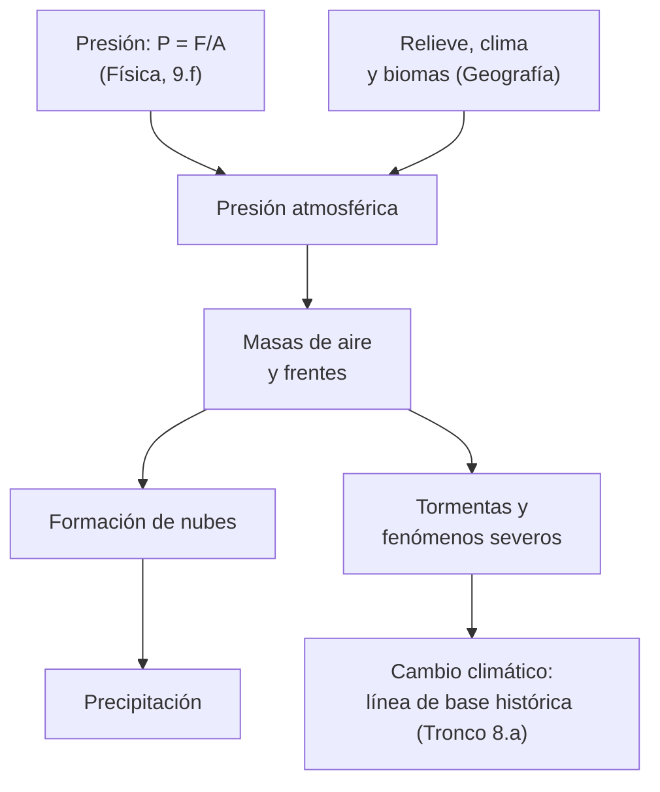
```mermaid
graph TD
  FLU1P["Presión: P = F/A<br/>(Física, 9.f)"] --> MET1["Presión atmosférica"]
  G6P["Relieve, clima<br/>y biomas (Geografía)"] --> MET1
  MET1 --> MET2["Masas de aire<br/>y frentes"]
  MET2 --> MET3["Formación de nubes"]
  MET3 --> MET4["Precipitación"]
  MET2 --> MET5["Tormentas y<br/>fenómenos severos"]
  MET5 --> AM3P["Cambio climático:<br/>línea de base histórica (Tronco 8.a)"]
```

**Agregado v2.5, y bug corregido**: la cadena real es `Presión atmosférica
→ Masas de aire y frentes → Nubes → Precipitación`, con `Tormentas` como
rama que junta todo lo anterior en un evento — es el mismo tipo de
"mecanismo detrás del resultado" que ya aplicó Tronco 9 con `Máquina
térmica` (Historia narraba la Revolución Industrial; Física construyó el
piso real de calor y cambios de estado). `MET5 --> Cambio climático`
porque los eventos severos son, en la práctica, el dato con el que se
mide si el clima ya cambió — la misma `línea de base histórica` que
`AM3` (Tronco 8.a) usa para comparar. La flecha que antes decía `FLU2 -->
G6P["Presión atmosférica"]` en Tronco 9.f ahora apunta a `MET1P`.

---

## Tronco 7 — Materia, energía y vida

```mermaid
graph TD
  QA["Materia: estados y cambios"] --> QB["Mezclas y métodos de separación"]
  QB --> QCMa["Modelo atómico<br/>de Dalton"]
  QCMa --> QCMb["Modelo atómico<br/>de Thomson"]
  QCMb --> QCMc["Modelo atómico<br/>de Rutherford"]
  QCMc --> QCMd["Modelo atómico<br/>de Bohr"]
  QCMd --> QCM["Modelo atómico actual:<br/>síntesis"]
  QCM --> QC["Átomo: partículas subatómicas"]
  QCM --> INV7P["Construir y usar un<br/>modelo científico (Investigación)"]
  QC --> QD["Número atómico y másico"]
  QD --> QE["Configuración electrónica"]
  QE --> QF["Tabla periódica y tendencias"]
  QF --> QG["Enlace químico y polaridad"]
  QG --> QG2["Geometría molecular:<br/>teoría VSEPR"]
  QG2 --> QNANO["Nanotecnología"]
  QG --> QH["Nomenclatura de compuestos"]
  QH --> QI["Ecuación química y balanceo"]
  QI --> QJ["Mol y masa molar"]
  QJ --> QK["Estequiometría"]
  QK --> QL["Reactivo limitante y rendimiento"]
  QJ --> QM["Soluciones y concentración"]
  QM --> QDIL["Dilución de soluciones:<br/>C1V1 = C2V2"]
  QM --> QN["Ácido-base y pH"]
  QN --> QANALIT["Química analítica:<br/>titulación, espectroscopía, cromatografía"]
  QN --> QATMOS["Química de la atmósfera:<br/>ozono, lluvia ácida, esmog fotoquímico"]
  MET1P["Presión atmosférica<br/>(Meteorología)"] --> QATMOS
  QM --> QCOLIGa["Descenso crioscópico"]
  QM --> QCOLIGb["Ascenso ebulloscópico"]
  QM --> QCOLIGc["Presión osmótica"]
  QJ --> QZ1["Gases ideales:<br/>PV = nRT"]
  QA --> QZ1
  QZ1 --> QDALTON["Presiones parciales:<br/>Ley de Dalton"]
  QZ1 --> QO
  QI --> QO["Termoquímica"]
  QI --> QP["Equilibrio químico y Kc"]
  QP --> QQ["Cinética de reacción"]
  QP --> QKSP["Equilibrio de solubilidad:<br/>Ksp"]
  QO --> QGIBBS["Energía libre de Gibbs:<br/>por qué una reacción es espontánea"]
  QP --> QGIBBS
  QI --> QTIPOSa["Reacción de síntesis"]
  QI --> QTIPOSb["Reacción de descomposición"]
  QI --> QTIPOSc["Reacción de desplazamiento"]
  M5P["Cifras significativas y error<br/>(Geometría)"] --> QSAFE["Seguridad de laboratorio:<br/>pictogramas GHS, equipos de protección"]
  QA --> QSAFE

  QG --> QR["Carbono:<br/>tetravalencia y cadenas"]
  QR --> QPETROLEO["Petróleo como recurso<br/>energético: reservas y explotación"]
  QR --> QSa["Alcanos"]
  QR --> QSb["Alquenos"]
  QR --> QSc["Alquinos"]
  QSa --> QT["Grupos funcionales"]
  QSb --> QT
  QSc --> QT
  QT --> QUa["Glúcidos"]
  QT --> QUb["Lípidos"]
  QT --> QUc["Proteínas"]
  QT --> QUd["Ácidos nucleicos"]
  QT --> QV["Polímeros naturales y sintéticos"]
  QG --> QW["Oxidación y reducción:<br/>número de oxidación"]
  QW --> QX["Pilas y celdas galvánicas"]
  QX --> QSUPERCOND["Superconductividad"]
  QW --> QY["Electrólisis"]

  BA0a["Agua<br/>(necesidad básica)"] --> BA["Ser vivo: características"]
  BA0b["Aire<br/>(necesidad básica)"] --> BA
  BA0c["Alimento<br/>(necesidad básica)"] --> BA
  BA --> BA1["Partes de una planta<br/>y germinación"]
  BA --> BA2["Ciclos de vida<br/>y metamorfosis"]
  BA --> BA3["Hábitats y adaptación"]
  BA --> BB["Célula y organelas"]
  BB --> BMICRO["Microbiología, virus<br/>y sistema inmunitario"]
  BB --> BC["Mitosis y meiosis"]
  BC --> BD["ADN, gen y proteína"]
  BD --> BE["Genética mendeliana"]
  BE --> BDIHIB["Cruce dihíbrido"]
  BD --> BIOTEC1a["PCR"]
  BIOTEC1a --> BIOTEC1b["ADN recombinante"]
  BIOTEC1b --> BIOTEC1c["CRISPR"]
  BIOTEC1c --> BIOTEC2["Organismos transgénicos<br/>y bioética"]
  BIOTEC2 --> FI8aP["Utilitarismo<br/>(Filosofía)"]
  BIOTEC2 --> FI8bP["Deontología<br/>(Filosofía)"]
  BIOTEC2 --> FI8cP["Ética de la virtud<br/>(Filosofía)"]
  BIOTEC2 --> FI8dP["Contractualismo<br/>(Filosofía)"]
  BB --> BF["Fotosíntesis y respiración celular"]
  BF --> BQUIMIO["Quimiosíntesis:<br/>bacterias quimiosintéticas"]
  BF --> BG["Flujo de materia y energía"]
  BG --> BH["Cadenas y redes tróficas"]
  BH --> BH2["Pirámide de biomasas:<br/>energía disponible por nivel trófico"]
  N11P2["Porcentaje<br/>(Matemáticas)"] --> BH2
  BH --> BI["Ciclos biogeoquímicos"]
  BA --> BJ["Clasificación y evolución"]
  BB --> BK["Sistemas del cuerpo humano"]
  BK --> BK1["Sistema nervioso:<br/>neurona y sinapsis"]
  BMICRO --> BCHAGAS["Mal de Chagas:<br/>Trypanosoma cruzi y vinchuca"]

  BJ --> BL["Selección natural:<br/>mecanismo y evidencias"]
  BL --> BM["Deriva genética y flujo génico"]
  BL --> BN["Especiación"]
  BN --> BO["Filogenia y árboles evolutivos"]

  BH --> BP["Dinámica poblacional:<br/>crecimiento y capacidad de carga"]
  BP --> BQ["Nicho ecológico"]
  BP --> BR["Biodiversidad e índices"]
  BR --> BS["Conservación y áreas protegidas"]

  QJ --> BF
  QO --> BF
  QUa --> BF
  QUb --> BF
  QUc --> BD
  QUd --> BD
  BA3 --> BH
  QG --> BMICRO
  QW --> BMICRO
  QUc --> BENZa["Enzima como proteína"]
  BENZa --> BENZb["Sustrato<br/>y especificidad enzimática"]
  BENZb --> BENZc["Temperatura y pH:<br/>factores que afectan<br/>la actividad enzimática"]
  BF --> BENZa
  QQ --> BENZc
  D9P["Probabilidad compuesta<br/>(Matemáticas)"] --> BM
  BK --> EF2["Fisiología del ejercicio<br/>(Ed. Física)"]
  EF2 --> EF3a["Volumen de<br/>entrenamiento"]
  EF3a --> EF3b["Regla del 10%"]
  EF2 --> EF3c["150 min/semana<br/>(recomendación OMS)"]
  EF2 --> EF10["Frecuencia cardíaca máxima:<br/>zonas de entrenamiento"]
  N12P["Potencias<br/>(Matemáticas)"] --> EF11["IMC:<br/>índice de masa corporal"]
  EF2 --> EF4a["RICE:<br/>reposo, hielo, compresión, elevación"]
  EF2 --> EF4b["Entrada en calor"]
  EF2 --> EF4c["Sobreentrenamiento"]
  EF2 --> EF4d["Ergonomía"]
  EF2 --> EF4e["Sueño"]
  EF4a --> EF4["Prevención y cuidado:<br/>síntesis"]
  EF4b --> EF4
  EF4c --> EF4
  EF4d --> EF4
  EF4e --> EF4
  EF4 --> EF9a["RCP"]
  EF4 --> EF9b["Uso de DEA<br/>(desfibrilador)"]
  EF4 --> EF9c["Atragantamiento"]
  EF4 --> EF9d["Quemaduras"]
  EF4 --> EF9e["Golpe de calor"]
  EF4 --> EF12["Prevención de adicciones:<br/>consumos problemáticos (Ley 26.586)"]
  PS8P["Sesgos cognitivos<br/>(Psicología)"] --> EF12
  PS9cP["Salud mental<br/>(Psicología)"] --> EF12
  BKEP["Sistema endocrino<br/>(Biología)"] --> EF12
  EF12 --> EF13a["Prohibicionismo"]
  EF12 --> EF13b["Reducción de daños"]
  EF12 --> EF13c["Despenalización<br/>y legalización regulada"]
  EF2 --> EF5a["Grupos musculares"]
  EF2 --> EF5b["Sistemas energéticos"]
  EF2 --> EF5c["Mitos del<br/>entrenamiento físico"]
  M3P["Perímetro y área<br/>(Geometría)"] --> EF6["Deportes: medidas de cancha<br/>y comparación de superficies"]
  EF6 --> EF7["Deportes: jugadores, posiciones<br/>y sistema de puntaje"]
  EF7 --> EF8["Deportes: origen histórico<br/>y país de origen"]
  EF8 --> EF8B["Juegos Olímpicos:<br/>de Grecia antigua a Coubertin"]
  EF8 --> EF8C["El pato: deporte<br/>nacional argentino"]
  EF8 --> EF8D["El deporte como fenómeno<br/>cultural argentino"]
  BK --> BKE["Sistema endocrino:<br/>hormonas y glándulas"]
  BKE --> ES2["Anatomía y pubertad<br/>(ESI)"]
  ES2 --> ES3a["ITS: transmisión"]
  ES3a --> ES3b["ITS: prevención"]
  ES3b --> ES3c["ITS: detección"]
  ES1P["Índice de Pearl<br/>(Matemáticas)"] --> ES4["Consentimiento:<br/>qué es y qué no lo es"]
  ES4 --> ES5["Violencia de género:<br/>identificar señales en un relato"]
  ES4 --> ES6a["Ley 26.150:<br/>Educación Sexual Integral"]
  ES4 --> ES6b["Ley 27.610:<br/>interrupción voluntaria del embarazo"]
  ES4 --> ES6c["Atención en salud<br/>desde los 13 años"]
  ES4 --> ES6d["Línea 144"]
  ES4 --> ES7["Diversidad e identidad de género<br/>(Ley 26.743)"]
  ES4 --> ES8["Cuidado del vínculo:<br/>grooming y violencia digital"]
  BK --> S2["Dosis por peso corporal<br/>(Salud)"]
  BI --> AM1
  BH --> AM2["Huella de carbono<br/>y agua virtual"]
  BR --> AM1
  N9P3["Razón y proporción<br/>(Matemáticas)"] --> QZ1
```

**Dependencia que se ignora siempre**: `Mol y masa molar --> Fotosíntesis`. La
ecuación de la fotosíntesis se enseña en Biología como una frase para memorizar,
cuando es una ecuación química balanceada. Sin mol, es literatura.

**Agregado v2.8 — Modelos atómicos (`QCM`)**: Z señaló que `Átomo:
partículas subatómicas` (`QC`) entraba directo al resultado final (el
átomo con protón/neutrón/electrón ya resuelto) sin el proceso histórico
de cómo se llegó ahí — Dalton (bolita indivisible) → Thomson (budín de
pasas) → Rutherford (núcleo denso) → Bohr (órbitas). Es contenido
`ordenar` puro, y es además el mejor caso de estudio que le faltaba a
`Construir y usar un modelo científico` (`INV7`, Investigación): un
modelo científico real que se corrigió cuatro veces con nueva evidencia,
no una definición para memorizar.

**El hueco que la tabla de cruces ya delataba**: `Leyes de los gases`
figuraba en la tabla de cruces desde el v1 ("proporcionalidad directa e
inversa"), pero no tenía nodo propio — el mismo patrón que `Enteros` en el
Tronco 1. Ahora cuelga de `Mol` (para la variable `n`) y de `Materia:
estados y cambios` (porque un gas es, antes que nada, un estado de la
materia), y alimenta a `Termoquímica`: no hay transferencia de calor real
sin volumen y presión de por medio.

**Otra plantilla que ya existía sin nodo**: `Dilución de soluciones`
(`C1V1 = C2V2`) es la operación de laboratorio más común después de
preparar una solución, y ya está sembrada como plantilla oficial. Cuelga de
`Soluciones y concentración` porque es la misma idea aplicada al revés: en
vez de calcular la concentración de lo que se preparó, calcula cuánta agua
hay que agregarle a una concentración conocida para bajarla a la deseada.

**Orgánica y electroquímica no eran ausencias menores**: sin `Carbono` y
`Grupos funcionales`, biología molecular entera (`ADN`, `proteínas`, incluso
la fotosíntesis) se enseña sin poder abrir la caja — el alumno acepta que
"el ADN tiene bases nitrogenadas" sin poder ver por qué esas moléculas
concretas hacen lo que hacen. Y `Oxidación-reducción` es la química que
sostiene tanto una pila común como la respiración celular (`BF`), que
literalmente *es* una reacción redox controlada.

**El cruce que faltaba en el otro sentido**: Química le da soporte a
Biología (`QJ, QO, QU --> BF`); Biología, a la inversa, le da sentido a
Química. Nadie estudia tetravalencia del carbono por gusto — la estudia
porque ya sabe que hay una molécula real, el ADN, hecha de eso. No es un
prerequisito formal (no hace falta saber ADN para balancear un
hidrocarburo), es la misma relación que Historia profunda tiene con Física
y Química en el Tronco 8: habilita sin ser requisito.

**Selección natural ya estaba nombrada, pero como destino**: `BJ2` en el
Tronco 8 la señalaba como lo que las extinciones masivas evidencian; acá
tiene el desarrollo real, con `Deriva genética` como el punto donde
Biología vuelve a apoyarse en probabilidad — un alelo que se fija por azar
en una población chica es muestreo, aunque Biología no lo llame así.

**Agregado v2.4 — Química, 7 nodos que currícula estándar ya trata como
unidades propias**: `Geometría molecular` (`QG2`) explica por qué el agua
es polar y el CO₂ no, con la misma cantidad de electrones compartidos —
tiene visualizador de UI ya diseñado en el repo (`vseprVisualSpec.ts`),
esperando el tema. `Seguridad de laboratorio` (`QSAFE`) es la versión
química de "qué productos de limpieza no se mezclan" (Vida Cotidiana).
`Propiedades coligativas` (`QCOLIG`) explican la sal en la ruta congelada
y son, además, el mecanismo real por el que una célula se hincha o se
arruga (presión osmótica, cruce con `BB`). `Ksp`, `Gibbs` y `Dalton`
completan huecos entre nodos que hoy no se hablan entre sí: Gibbs conecta
`Termoquímica` y `Equilibrio`, explicando el "por qué sí" de una reacción
espontánea que faltaba entre los dos.

**Agregado v2.4 — Biología, el tramo que un chico vive literalmente
todos los días**: `BA0`-`BA3` son currícula de primaria (K-4) que el
tronco daba por sabida al arrancar directo en `Ser vivo: características`
— contenido típico de 7°-9°. `Microbiología, virus y sistema inmunitario`
(`BMICRO`) es exactamente lo que le faltaba a Historia profunda para
explicar la Peste Negra (`H21`) o cualquier pandemia moderna con
mecanismo biológico real, no sólo como fecha. `Enzimas` explica por qué
una papa cruda cataliza agua oxigenada y una cocida no, y por qué la
fiebre alta es peligrosa. `Cruce dihíbrido` es el paso real entre "un gen,
un rasgo" y la genética con la que de verdad se hereda el grupo sanguíneo
combinado con otro rasgo — ya tiene visualizador construido
(`BioGeneticsVisualizer.tsx`) esperando el tema.

**Agregado v2.7 — Biotecnología (`BIOTEC1`/`BIOTEC2`)**: GPT señaló que
`ADN, gen y proteína` (`BD`) explica la molécula pero no lo que hoy se
hace con ella en un laboratorio real — PCR (amplificar una muestra de
ADN), ADN recombinante y CRISPR (editar un gen puntual) son la aplicación
tecnológica que un alumno de hoy escucha nombrar constantemente
(diagnóstico de enfermedades, vacunas, mejoramiento de cultivos).
`Organismos transgénicos y bioética` cierra con la misma neutralidad ya
fijada para otros temas de debate (corrientes económicas, filosóficas):
qué es un transgénico y qué dilemas éticos reales genera (`FI8P`), sin
tomar partido sobre si está bien o mal.

**Agregado v2.4 — Educación Física, la materia más flaca de las 12
reales (2 nodos en total antes de esto)**: `EF3`-`EF5` son los 3 ejes
que `PROPUESTA-materias-nuevas-biblioteca.md` ya redactó completos
("Educación Física, que es donde no se te ocurría nada" — sacarla de
"deportes" y llevarla a cómo funciona el cuerpo y cómo cuidarlo, porque
así rinde parametrizado). `EF6`-`EF8` son el agregado explícito de
Javier — deportes, con la misma separación práctica/teoría que ya
rindió en Arte: medidas de cancha es genuinamente paramétrico (reusa
`Perímetro y área`, mismo patrón que `AR1`/`V2`), jugadores/posiciones/
puntaje y origen histórico son cultura general gradable, no la trivia de
reglamento que la propuesta descartó.

**Agregado v2.9.6 — Juegos Olímpicos, El Pato y deporte como fenómeno
cultural (`EF8B-D`)**: confirmado vía `BREVE-HISTORIA-DE-LOS-JUEGOS-
OLMPICOS.pdf` (real: Grecia antigua 776 a.C. → supresión por Teodosio
I → Coubertin y el renacimiento moderno en 1896). `EF8` (origen
histórico de cada deporte) sólo cubría quién inventó fútbol/básquet/
vóley/handball/tenis, nunca la institución olímpica en sí — 0
resultados en grep. `EF8C` (El Pato) es un dato concreto y argentino:
deporte nacional por decreto desde 1953, con origen documentado en
crónicas de 1610 — mismo patrón del proyecto de sumar siempre el
ángulo argentino específico. `EF8D` (el deporte como fenómeno cultural
argentino, vía Archetti, *El deporte en Argentina 1914-1983*,
Universidad de Oslo, académico real) es el ángulo sociológico —
identidad nacional construida a través del deporte, distinto del
histórico-fáctico de `EF8B`.

**Agregado v2.8 — Zonas de entrenamiento (`EF10`) e IMC (`EF11`)**: los
dos aparecían citados en la tabla de cruces desde versiones tempranas
("Zonas de entrenamiento → Porcentaje", "IMC → Potencias") sin nodo real
en ningún diagrama — mismo patrón de auditoría que `E8G`/`E8H`. `EF10`
cuelga de `Fisiología del ejercicio` (`EF2`) porque las zonas de
frecuencia cardíaca son, literalmente, la aplicación de esa fisiología; y
`EF11` completa el mismo bloque de indicadores corporales que ya
enseñaba `EF2` sin nombrar el más común de todos.

**Agregado v2.8 — Prevención de adicciones (`EF12`)**: el hueco normativo
más fuerte que encontró Opus 5 — la Ley 26.586 crea el Programa Nacional
de Educación y Prevención sobre las Adicciones, y la Res. CFE 256/15
aprueba los Lineamientos Curriculares para implementación obligatoria en
todas las escuelas de los niveles obligatorios. El mapa cita art. 92,
Ley 26.150, Ley 27.621, Ley 27.590 y Ley 26.743 en distintos troncos —
este nunca había entrado. Cuelga de `Prevención y cuidado` (`EF4`) igual
que RCP, y cruza con `Sesgos cognitivos` (`PS8`, Psicología) para el
mecanismo psicológico de la dependencia y con `Sistema endocrino` (`BKE`,
Biología) para el mecanismo biológico — el mismo criterio de
"mecanismo real, no sólo la advertencia" que ya aplicó el mapa en
Educación Vial y ESI.

**Agregado v2.9.2 — Políticas de drogas (`EF13`)**, pregunta de Javier:
`EF12` (Ley 26.586) estaba parado de un solo lado — "prevención" ya
asume el enfoque prohibicionista/abstencionista, sin nombrar el resto del
espectro real de políticas públicas sobre consumo problemático, tan
contestado ideológicamente como economía o ambiente:
**prohibicionismo** (criminalización, abstinencia como único objetivo —
la "guerra contra las drogas" clásica), **reducción de daños** (el
consumo va a existir, minimizar el riesgo real con testeo de sustancias,
distribución de jeringas, naloxona) y **despenalización/legalización
regulada** (modelo Portugal 2001 — tratar el consumo como tema de salud
pública, no de policía; o Uruguay 2013 con cannabis). Mismo principio no
negociable que `E28`/`FI7`/`AM5`: describir qué sostiene cada postura,
nunca evaluar cuál tiene razón — acá con el agravante de que, sin
`EF13`, el mapa enseñaba sólo una de las tres como si fuera la única.

**Agregado v2.5.2 — Primeros auxilios (`EF9`), verificado contra
`PROPUESTA-materias-nuevas-biblioteca.md`**: la propuesta original
asignaba explícitamente "primeros auxilios (RCP, atragantamiento,
quemadura, golpe de calor, leer un prospecto, signos de alarma)" al eje
de `Prevención y cuidado`, con la razón "es seguridad concreta, no
trivia" — la misma que ya justificaba "qué productos de limpieza no se
mezclan" en Vida Cotidiana. Al aplicar `EF3`-`EF5` en v2.4 quedó sólo el
tramo de lesión deportiva (`RICE`, entrada en calor, sobreentrenamiento);
el bloque médico de emergencia real nunca entró, pese a que el propio DSL
ya lo usa como ejemplo de `ordenar` en la sección final del mapa. `EF4`
también suma `ergonomía` y `sueño`, los otros dos sub-ejes de la misma
propuesta que se habían quedado afuera de la etiqueta del nodo.

**Agregado v2.4 — ESI, con el principio de neutralidad ya fijado para
temas de debate social**: la Ley 26.150 define ESI como la que "articula
aspectos biológicos, psicológicos, sociales, afectivos y éticos" — de
los 5 ejes oficiales (Lineamientos Curriculares, Res. CFE 45/08), sólo
"Cuidar el cuerpo y la salud" es biología en sentido estricto (`ES2`/
`ES3`). `ES4`-`ES8` (consentimiento, violencia de género, derechos,
diversidad e identidad de género, grooming) son los otros 4 ejes —
ninguno reducible a un sistema del cuerpo humano. `ES7` en particular
aplica el mismo principio de neutralidad que corrientes de pensamiento:
describir qué dice la ley, no adoctrinar sobre cómo vivirla.

**Agregado v2.8 — Pirámide de biomasas (`BH2`) y Sistema endocrino
(`BKE`)**: `BH2` es un caso llamativo — "Pirámide de biomasas" está
citada en la tabla de cruces desde el v1 y **ya es una plantilla oficial
sembrada** (`piramide_biomasas`, una de las 2 que tenía Biología antes de
esta ronda de trabajo), pero nunca tuvo nodo en el grafo — el mismo caso
que `Distribución binomial` en v2.2, sólo que ahí faltaba más tiempo
para notarlo. `BKE` corrige un mecanismo que faltaba de verdad: `ES2`
(Anatomía y pubertad) colgaba directo de `BK` (Sistemas del cuerpo
humano) sin pasar por el sistema que de hecho *causa* la pubertad — las
hormonas. Mismo patrón que `Presión atmosférica` en Meteorología:
`Anatomía y pubertad` usaba un mecanismo que nunca estaba enseñado.

**Agregado v2.9.6 — Sistema nervioso, quimiosíntesis y Mal de Chagas
(`BK1`, `BQUIMIO`, `BCHAGAS`)**: confirmado vía `Biología sec.pdf`,
`Biologia IV` (Díaz, Martín) y *Biología Polimodal* (Santillana,
454pp), todos reales. `BK1` (sistema nervioso: neurona y sinapsis) es
el hallazgo más significativo de esta ronda de Biología — 0
resultados en grep para "neurona"/"sistema nervioso"/"sinapsis" en
todo el documento, pese a ser de los sistemas del cuerpo más
enseñados y a que `Sistemas del cuerpo humano` (`BK`) ya existía como
genérico sin bajar a este nivel. `BQUIMIO` (quimiosíntesis, bacterias
quimiosintéticas) es la otra vía de obtener energía además de la
fotosíntesis — cuelga de `BF` como rama hermana, y cruza con
`Procariotas` (`U11`, Tronco 8.a) porque es exactamente el tipo de
organismo que la usa. `BCHAGAS` (Trypanosoma cruzi, transmitido por
vinchuca) es salud pública históricamente muy relevante en el norte
argentino — cuelga de `Microbiología, virus y sistema inmunitario`
(`BMICRO`) por ser, igual que ellos, un agente patógeno con mecanismo
de transmisión propio.

**Agregado v2.9.6 — Química, 5 nodos de cierre de unidad (`QNANO`,
`QSUPERCOND`, `QPETROLEO`, `QANALIT`, `QATMOS`)**: revisado a fondo
2026-08-13 contra Chang (McGraw-Hill, el clásico universitario,
1173pp, coincide capítulo por capítulo con lo ya generado) y confirma
que **no hay pared** — 37 temas de Química siguen sólidos, sólo 5
huecos puntuales de baja prioridad, todos de cierre de unidad. `QNANO`
(nanotecnología) cuelga de `QG2` (geometría molecular), porque es la
misma estructura molecular llevada a escala nanométrica. `QSUPERCOND`
(superconductividad) cuelga de `QX` (pilas y celdas galvánicas), el
nodo más cercano de conductividad eléctrica que ya existía. `QPETROLEO`
(petróleo como recurso energético: reservas y explotación) cuelga de
`QR` (Carbono: tetravalencia y cadenas) — distinto del ángulo
molecular que ya cubren los hidrocarburos (`QSa-c`) y del ángulo
territorial argentino de `GEOA6` (Geografía): acá es el recurso en
general. `QANALIT` (química analítica: titulación, espectroscopía,
cromatografía) y `QATMOS` (química de la atmósfera: ozono
estratosférico, lluvia ácida, esmog fotoquímico — capítulo 17 de
Chang, distinto del `cambio climático` genérico) cuelgan de `QN`
(Ácido-base y pH), que ya cubre la base de valoraciones ácido-base
que ambos usan; `QATMOS` cruza además con `Presión atmosférica`
(`MET1`, Meteorología) por tratarse de la misma atmósfera. Nota
aparte: `Ácidos nucleicos` (`QUd`) ya tenía nodo en el grafo desde
antes — el hueco ahí es sólo de contenido sin generar, no de
estructura, así que no requirió edición.

---

## Tronco 8 — Historia profunda: del Big Bang a hoy

El tronco que faltaba, y probablemente el más importante como **columna
vertebral**: es el único que da contexto a todos los demás. Los otros troncos
enseñan *cómo funciona* algo; este enseña *de dónde salió*. Un alumno que sabe
que los elementos de la tabla periódica se fabricaron dentro de estrellas
entiende la tabla periódica de otra manera.

Se lee de arriba hacia abajo como una sola línea de tiempo continua: **una
historia, no dos**. La separación entre "historia natural" e "historia humana"
es administrativa; en el tiempo profundo es el mismo relato.

### 8.a — Tierra y vida

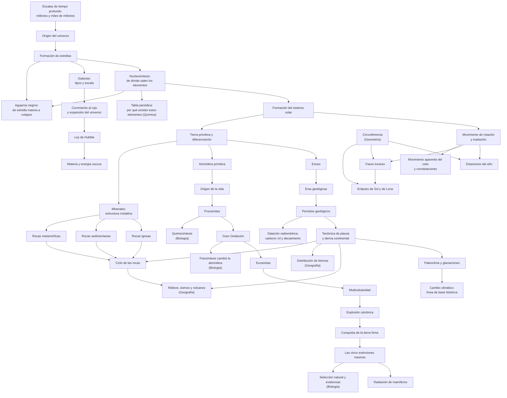
```mermaid
graph TD
  U1["Escalas de tiempo profundo:<br/>millones y miles de millones"] --> U2["Origen del universo"]
  U2 --> U3["Formación de estrellas"]
  U3 --> U4["Nucleosíntesis:<br/>de dónde salen los elementos"]
  U4 --> U5["Formación del sistema solar"]
  U5 --> AS1["Movimiento de rotación<br/>y traslación"]
  AS1 --> AS2["Estaciones del año"]
  AS1 --> AS3["Fases lunares"]
  AS3 --> AS4["Eclipses de Sol y de Luna"]
  AS1 --> AS5["Movimiento aparente del cielo<br/>y constelaciones"]
  U5 --> U6["Tierra primitiva y diferenciación"]
  U6 --> U7a["Eones"]
  U7a --> U7b["Eras geológicas"]
  U7b --> U7c["Períodos geológicos"]
  U7c --> U8["Tectónica de placas<br/>y deriva continental"]
  U6 --> U9["Atmósfera primitiva"]
  U9 --> U10["Origen de la vida"]
  U10 --> U11["Procariotas"]
  U11 --> U12["Gran Oxidación"]
  U12 --> U13["Eucariotas"]
  U13 --> U14["Multicelularidad"]
  U14 --> U15["Explosión cámbrica"]
  U15 --> U16["Conquista de la tierra firme"]
  U16 --> U17["Las cinco extinciones masivas"]
  U17 --> U18["Radiación de mamíferos"]
  U8 --> U19["Paleoclima y glaciaciones"]

  U4 --> QF2["Tabla periódica:<br/>por qué existen estos elementos (Química)"]
  U11 --> BQUIMIOP["Quimiosíntesis<br/>(Biología)"]
  U12 --> BF2["Fotosíntesis cambió la atmósfera<br/>(Biología)"]
  U17 --> BJ2["Selección natural y evidencias<br/>(Biología)"]
  U8 --> G9["Relieve, sismos y volcanes<br/>(Geografía)"]
  U8 --> G10["Distribución de biomas<br/>(Geografía)"]
  U7c --> DAT["Datación radiométrica:<br/>carbono 14 y decaimiento"]
  U19 --> AM3["Cambio climático:<br/>línea de base histórica"]
  GO6P["Circunferencia<br/>(Geometría)"] --> AS2
  GO6P --> AS3
  GO6P --> AS4

  U6 --> MIN1["Minerales:<br/>estructura cristalina"]
  MIN1 --> MIN2a["Rocas ígneas"]
  MIN1 --> MIN2b["Rocas sedimentarias"]
  MIN1 --> MIN2c["Rocas metamórficas"]
  MIN2a --> MIN3["Ciclo de las rocas"]
  MIN2b --> MIN3
  MIN2c --> MIN3
  U8 --> MIN3
  MIN3 --> G9

  U3 --> COS1["Galaxias:<br/>tipos y escala"]
  COS1 --> COS2["Corrimiento al rojo<br/>y expansión del universo"]
  COS2 --> COS3["Ley de Hubble"]
  COS3 --> COS4["Materia y energía oscura"]
  U3 --> COS5["Agujeros negros:<br/>de estrella masiva a colapso"]
  U4 --> COS5
```

**El cruce más potente de todo el mapa**: `Nucleosíntesis --> Tabla periódica`.
La tabla se enseña como un mueble con cajones. Si antes se cuenta que el hidrógeno
viene del Big Bang, el carbono y el oxígeno de estrellas que vivieron y murieron,
y el hierro del final de una estrella masiva, la tabla pasa a ser el inventario
de una historia. Es el mismo contenido con cien veces más sentido.

**Y una dependencia técnica linda**: `Datación radiométrica` necesita
**decaimiento exponencial y logaritmos** del Tronco 1 y 2. Es el tema que
justifica los logaritmos mejor que cualquier ejercicio abstracto: sin logaritmos
no se puede fechar un fósil.

**Astronomía se cortaba justo después del sistema solar**: quedaba el hueco
exacto entre "así se formó" y "así funciona ahora". `Estaciones`, `fases
lunares` y `eclipses` no son trivia de calendario, son la aplicación más
directa de `rotación y traslación` — y son también lo que Geografía (husos
horarios, estaciones) e Historia antigua (calendarios y eclipses que las
civilizaciones ya registraban) daban por sabido sin que el mapa lo enseñara
en ningún lado.

**Agregado v2.5 — Geología (`MIN1`-`MIN3`)**: `Tectónica de placas` (`U8`)
y `Relieve, sismos y volcanes` (`G9`) ya explicaban el movimiento de la
corteza y su efecto visible, pero nunca de qué está hecha la corteza que
se mueve — "volcán" era una palabra sin material detrás. `Minerales -->
Rocas -> Ciclo de las rocas` es el piso mineralógico/petrológico que
faltaba, colgando de `Tierra primitiva` (donde se diferencian núcleo,
manto y corteza) y alimentando tanto la `Tectónica` ya existente (el
reciclado de roca en zonas de subducción) como el `Relieve` de Geografía
(un volcán, literalmente, produce la roca ígnea de `MIN2`).

**Agregado v2.5 — Astronomía Moderna (`COS1`-`COS5`)**: el mapa llegaba
hasta `Formación de estrellas` y `Nucleosíntesis` — el universo de hace
13 mil millones de años — pero nada sobre el universo *actual* a escala
cosmológica. `Galaxias --> Corrimiento al rojo --> Ley de Hubble` es la
cadena real detrás de "el universo se expande", que sin esto es una frase
sin evidencia detrás (el corrimiento al rojo es, literalmente, el dato
observacional). `Materia y energía oscura` y `Agujeros negros` cuelgan de
lo mismo que ya sostenía la nucleosíntesis y la formación estelar — una
estrella lo suficientemente masiva no termina como enana blanca, colapsa.
No reemplaza a `U2`-`U5` (que siguen siendo el origen), los continúa hacia
adelante.

### 8.b — Humanidad

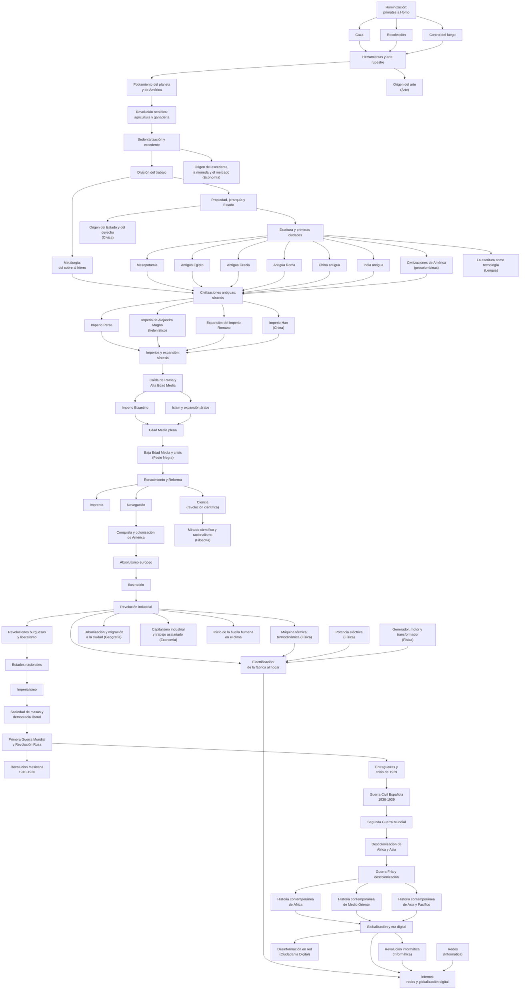
```mermaid
graph TD
  H10["Hominización:<br/>primates a Homo"] --> H11a["Caza"]
  H10 --> H11b["Recolección"]
  H10 --> H11c["Control del fuego"]
  H11a --> H12["Herramientas y arte rupestre"]
  H11b --> H12
  H11c --> H12
  H12 --> H13["Poblamiento del planeta<br/>y de América"]
  H13 --> H14["Revolución neolítica:<br/>agricultura y ganadería"]
  H14 --> H15["Sedentarización y excedente"]
  H15 --> H16["División del trabajo"]
  H16 --> H17["Propiedad, jerarquía y Estado"]
  H16 --> TEC1["Metalurgia:<br/>del cobre al hierro"]
  TEC1 --> H19
  H17 --> H18["Escritura y primeras ciudades"]
  H18 --> H19a["Mesopotamia"]
  H18 --> H19b["Antiguo Egipto"]
  H18 --> H19c["Antigua Grecia"]
  H18 --> H19d["Antigua Roma"]
  H18 --> H19e["China antigua"]
  H18 --> H19f["India antigua"]
  H18 --> H19g["Civilizaciones de América<br/>(precolombinas)"]
  H19a --> H19["Civilizaciones antiguas:<br/>síntesis"]
  H19b --> H19
  H19c --> H19
  H19d --> H19
  H19e --> H19
  H19f --> H19
  H19g --> H19
  H19 --> H20a["Imperio Persa"]
  H19 --> H20b["Imperio de Alejandro Magno<br/>(helenístico)"]
  H19 --> H20c["Expansión del Imperio Romano"]
  H19 --> H20d["Imperio Han<br/>(China)"]
  H20a --> H20["Imperios y expansión:<br/>síntesis"]
  H20b --> H20
  H20c --> H20
  H20d --> H20
  H20 --> HM1["Caída de Roma y<br/>Alta Edad Media"]
  HM1 --> HM2["Imperio Bizantino"]
  HM1 --> HM3["Islam y expansión árabe"]
  HM2 --> HM4["Edad Media plena"]
  HM3 --> HM4
  HM4 --> H21["Baja Edad Media y crisis<br/>(Peste Negra)"]
  H21 --> HM5["Renacimiento y Reforma"]
  HM5 --> H22a["Imprenta"]
  HM5 --> H22b["Navegación"]
  HM5 --> H22c["Ciencia<br/>(revolución científica)"]
  H22b --> H23["Conquista y colonización de América"]
  H23 --> HM6["Absolutismo europeo"]
  HM6 --> HM7["Ilustración"]
  HM7 --> H24["Revolución industrial"]
  H24 --> TEC2["Electrificación:<br/>de la fábrica al hogar"]
  H24 --> H25["Revoluciones burguesas<br/>y liberalismo"]
  H25 --> H26["Estados nacionales"]
  H26 --> H27["Imperialismo"]
  H27 --> HM8["Sociedad de masas y<br/>democracia liberal"]
  HM8 --> HM9["Primera Guerra Mundial<br/>y Revolución Rusa"]
  HM9 --> HM9B["Revolución Mexicana<br/>1910-1920"]
  HM9 --> HM10["Entreguerras y<br/>crisis de 1929"]
  HM10 --> HM10B["Guerra Civil Española<br/>1936-1939"]
  HM10B --> H28["Segunda Guerra Mundial"]
  H28 --> HM11["Descolonización de<br/>África y Asia"]
  HM11 --> H29["Guerra Fría y descolonización"]
  H29 --> HM12["Historia contemporánea<br/>de África"]
  H29 --> HM13["Historia contemporánea<br/>de Medio Oriente"]
  H29 --> HM14["Historia contemporánea<br/>de Asia y Pacífico"]
  HM12 --> H30["Globalización y era digital"]
  HM13 --> H30
  HM14 --> H30
  TEC2 --> TEC3["Internet:<br/>redes y globalización digital"]
  H30 --> TEC3

  H12 --> AR2["Origen del arte<br/>(Arte)"]
  H18 --> P15["La escritura como tecnología<br/>(Lengua)"]
  H15 --> E17["Origen del excedente,<br/>la moneda y el mercado (Economía)"]
  H17 --> C10["Origen del Estado y del derecho<br/>(Cívica)"]
  H22c --> FI3["Método científico y racionalismo<br/>(Filosofía)"]
  H24 --> F8["Máquina térmica:<br/>termodinámica (Física)"]
  H24 --> G11["Urbanización y migración<br/>a la ciudad (Geografía)"]
  H24 --> E18["Capitalismo industrial<br/>y trabajo asalariado (Economía)"]
  H24 --> AM4["Inicio de la huella humana<br/>en el clima"]
  H30 --> I3["Revolución informática<br/>(Informática)"]
  H30 --> CD3["Desinformación en red<br/>(Ciudadanía Digital)"]
  F8 --> TEC2
  FIS6P["Potencia eléctrica<br/>(Física)"] --> TEC2
  FIS13P["Generador, motor y transformador<br/>(Física)"] --> TEC2
  I3 --> TEC3
  IN10P["Redes<br/>(Informática)"] --> TEC3
```

**El nudo que ordena las ciencias sociales**: `Excedente --> División del trabajo
--> Propiedad y Estado`. Economía, Cívica e Historia arrancan todas del mismo
punto, y es el neolítico. Enseñado así, "qué es el Estado" deja de ser una
definición para memorizar y pasa a ser la respuesta a un problema concreto:
alguien tenía que administrar el grano guardado.

**Y el cruce que hace de puente a la Física**: `Revolución industrial --> Máquina
térmica`. La termodinámica no nació en un aula, nació resolviendo cómo sacar agua
de una mina. Física gana un porqué histórico, Historia gana un contenido técnico.

**El hilo de tecnología que estaba disperso**: `Herramientas → Metalurgia →
Imprenta → Máquina de vapor / Electrificación → Computación → Internet` ya
estaba en el mapa, pero como piezas sueltas colgando cada una de su época sin
que nada las conectara entre sí. Puesto como hilo, es la misma pregunta
contestada siete veces con siete materiales distintos — piedra, metal, tipos
móviles, vapor, electrones, silicio, cables submarinos — y es la columna
vertebral que le faltaba al propio Tronco 9 (Física) y Tronco 10
(Informática): les da el *cuándo* y el *por qué* a un contenido que si no,
también aparece como terminado y sin historia.

**Agregado 2026-08-12 — la Antigüedad y la línea 1500-presente dejan de
ser esqueleto**: `civilizaciones-antiguas` e `imperios-expansion` ya
tenían 11 sub-nodos propios en el diagrama (`H19a-g`, `H20a-d`) desde
que este tronco existe, pero nunca se generó contenido individual para
ninguno — sólo los dos nodos de síntesis. Además, contrastado contra
fuentes reales (currículum del Ministerio de Educación argentino y el
manual universitario Spielvogel/McGraw-Hill, `tareas_pendientes/libros/`)
aparecieron huecos genuinos que el mapa nunca tuvo: el Imperio Bizantino
y el mundo islámico medieval no existían en absoluto (`HM2`/`HM3`), la
Edad Media entera colgaba de un solo nodo (`H21`, ahora acotado a la
Baja Edad Media/Peste Negra, con `HM1` Alta Edad Media y `HM4` Edad
Media plena como escalones propios), Renacimiento/Reforma/Absolutismo/
Ilustración no tenían nodo (`HM5`-`HM7`, hoy disueltos dentro de
`Modernidad: imprenta, navegación, ciencia`), y la Sociedad de masas,
la Primera Guerra Mundial con la Revolución Rusa, el período de
entreguerras y la descolonización de África/Asia como proceso propio
tampoco (`HM8`-`HM11`) — `Guerras mundiales` (ahora `H28`, acotado a
la Segunda Guerra Mundial) mezclaba dos guerras con veinte años de
diferencia en un solo nodo. Por último, tres regiones enteras estaban
ausentes de la Contemporánea (`HM12`-`HM14`: África, Medio Oriente,
Asia y Pacífico) — hasta ahora esa etapa era casi sólo Europa/América.
Detalle completo del análisis y las fuentes en
`material/historia-profunda-huecos-PLANIFICACION.md`.

### 8.c — Argentina insertada en la línea

Colgada de 8.b, no en paralelo: es el mismo relato mirado de cerca.

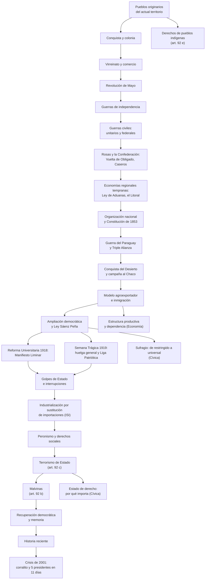
```mermaid
graph TD
  AH1["Pueblos originarios<br/>del actual territorio"] --> AH2["Conquista y colonia"]
  AH2 --> AH3["Virreinato y comercio"]
  AH3 --> AH4["Revolución de Mayo"]
  AH4 --> AH5["Guerras de independencia"]
  AH5 --> AH6["Guerras civiles:<br/>unitarios y federales"]
  AH6 --> AH6B["Rosas y la Confederación:<br/>Vuelta de Obligado, Caseros"]
  AH6B --> AH6C["Economías regionales tempranas:<br/>Ley de Aduanas, el Litoral"]
  AH6C --> AH7["Organización nacional<br/>y Constitución de 1853"]
  AH7 --> AH7B["Guerra del Paraguay<br/>y Triple Alianza"]
  AH7B --> AH7C["Conquista del Desierto<br/>y campaña al Chaco"]
  AH7C --> AH8["Modelo agroexportador<br/>e inmigración"]
  AH8 --> AH9["Ampliación democrática<br/>y Ley Sáenz Peña"]
  AH9 --> AH9B["Reforma Universitaria 1918:<br/>Manifiesto Liminar"]
  AH9 --> AH9C["Semana Trágica 1919:<br/>huelga general y Liga Patriótica"]
  AH9B --> AH10["Golpes de Estado<br/>e interrupciones"]
  AH9C --> AH10
  AH10 --> ISI1["Industrialización por sustitución<br/>de importaciones (ISI)"]
  ISI1 --> AH11["Peronismo y derechos sociales"]
  AH11 --> AH12["Terrorismo de Estado<br/>(art. 92 c)"]
  AH12 --> AH13["Malvinas<br/>(art. 92 b)"]
  AH13 --> AH14["Recuperación democrática<br/>y memoria"]
  AH14 --> AH15["Historia reciente"]
  AH15 --> AH15B["Crisis de 2001:<br/>corralito y 5 presidentes en 11 días"]

  AH1 --> C11["Derechos de pueblos indígenas<br/>(art. 92 e)"]
  AH8 --> E19["Estructura productiva<br/>y dependencia (Economía)"]
  AH9 --> C12["Sufragio: de restringido a universal<br/>(Cívica)"]
  AH12 --> C13["Estado de derecho:<br/>por qué importa (Cívica)"]
```

**Nota v2.4**: `AH12`/`AH13` son el desarrollo real de "Memoria:
terrorismo de Estado" y "Causa Malvinas" — `Tronco 6` (`H2`) sólo
referencia estos dos hacia acá, ya no los duplica con nodos propios.

**Agregado v2.9.6 — Historia Argentina, 8 nodos (`AH6B-C`, `AH7B-C`,
`AH9B-C`, `ISI1`, `AH15B`)**: confirmado vía *Historia Argentina
1806-1852* (Goldman/Gelman/Schmit, "Nueva Historia Argentina"),
*Historia Argentina 1916-1930* (Ansaldi/Falcón/Persello/Palacio),
*Historia Argentina 1976-2013*, `ACTIVA 6` (Ciencias Sociales 6
Bonaerense) e *Historia Argentina y Latinoamericana. Siglo XIX*
(Puerto de Palos) — todas fuentes reales de currículum o académicas.
`AH6` (Guerras civiles) sólo mencionaba a Rosas de pasada; `AH6B`
(Rosas y la Confederación: Vuelta de Obligado, Caseros) y `AH6C`
(economías regionales tempranas: Ley de Aduanas, el Litoral) le dan
desarrollo propio. `AH7B` (Guerra del Paraguay/Triple Alianza) y
`AH7C` (Conquista del Desierto) eran, igual, sólo mención de pasada
dentro de `AH8` — dos de los hechos más enseñados de la historia
argentina post-1853 sin nodo propio en todo el mapa. `AH9B` (Reforma
Universitaria 1918, Manifiesto Liminar) se confirmó de forma
independiente **cuatro veces** en fuentes distintas durante esta
ronda. `AH9C` (Semana Trágica 1919) es el otro gran evento de
historia obrera argentina, también ausente. `ISI1`
(industrialización por sustitución de importaciones) cuelga entre
`AH10` y `AH11` porque es, literalmente, el modelo económico que
define al peronismo que viene después — sin él, `Peronismo y
derechos sociales` flotaba sin la base económica que lo explica.
`AH15B` (Crisis de 2001: corralito, "que se vayan todos", los 5
presidentes en 11 días) cierra el hueco más obvio de `AH15`
("Historia reciente"), que hasta ahora era un cajón sin ese
contenido específico desarrollado.

**Agregado v2.9.6 — Historia Mundial, 2 nodos (`HM9B`, `HM10B`)**:
confirmado vía *Historia 4* (Serie Huellas, 2013), que de paso
reconfirma por quinta vez el hallazgo de Reforma Universitaria de
arriba. `HM9B` (Revolución Mexicana, 1910-1920) es un gran proceso
latinoamericano propio, cronológicamente paralelo a la Primera
Guerra Mundial pero sin relación causal directa — cuelga de `HM9`
como proceso hermano, no como consecuencia. `HM10B` (Guerra Civil
Española, 1936-1939) se enseña casi siempre como antesala directa de
la Segunda Guerra Mundial — cuelga entre `HM10` (Entreguerras) y
`H28`, en la posición cronológica exacta que le corresponde.

### Lo que este tronco necesita de los otros

| Tema | Necesita | De |
|---|---|---|
| Escalas de tiempo profundo | Notación científica | Matemáticas |
| Tiempo geológico y estratigrafía | Orden y secuencia, `ordenar` | Matemáticas |
| Datación radiométrica | Exponencial y logaritmos | Matemáticas |
| Nucleosíntesis | Átomo, número atómico | Química |
| Gran Oxidación | Fotosíntesis | Biología |
| Extinciones y radiación | Selección natural | Biología |
| Tectónica | Relieve, mapa | Geografía |
| Paleoclima | Leer un gráfico de series | Matemáticas |
| Excedente y moneda | Porcentaje, proporción | Matemáticas |
| Máquina térmica | Calor, trabajo, energía | Física |
| Crecimiento poblacional histórico | Función exponencial | Matemáticas |
| Cualquier proceso histórico | Texto argumentativo, fuentes | Lengua |
| Electrificación | Inducción electromagnética | Física |

### Y lo que este tronco le da a los demás

Esta es la dirección que normalmente no se aprovecha: la historia profunda no
sólo *consume* prerrequisitos, **habilita** temas de otras materias dándoles un
porqué.

- **Química**: la tabla periódica como inventario de una historia estelar
- **Biología**: la evolución deja de ser una teoría abstracta y pasa a ser el
  relato de qué pasó, con fechas
- **Geografía**: el relieve es el estado actual de un proceso, no un dibujo
- **Economía y Cívica**: el Estado, la propiedad y el mercado tienen fecha de
  nacimiento y un problema que vinieron a resolver
- **Física**: la termodinámica tiene una motivación industrial concreta
- **Lengua**: la escritura es una tecnología con 5000 años, no una obviedad
- **Arte**: hay arte desde antes de la agricultura
- **ESI y Salud**: el cuerpo humano es el resultado de una historia evolutiva

### El renderer que este tronco necesita ya existe y nadie lo usa

`visual: timeline` está implementado, hay un componente `LineaTiempo.tsx`
construido, y **cero plantillas oficiales lo usan**. Es exactamente el renderer
de este tronco. Sumado a `ordenar` para secuencias y `marcar_mapa` para
poblamientos y expansiones, la historia profunda es el tronco que mejor
aprovecha capacidad ya construida y hoy ociosa.

---

## Tronco 9 — Física: de las fuerzas a los circuitos

Cinemática (`MRU`, `MRUV`) y dinámica de fuerzas concurrentes ya cuelgan de
Matemáticas en los Troncos 2 y 3 — no se repiten acá. Lo que sigue es todo
lo que Física enseña con piso propio: electricidad, ondas, óptica, energía
y su conservación, termodinámica y mecánica de fluidos.

### 9.a — Electricidad

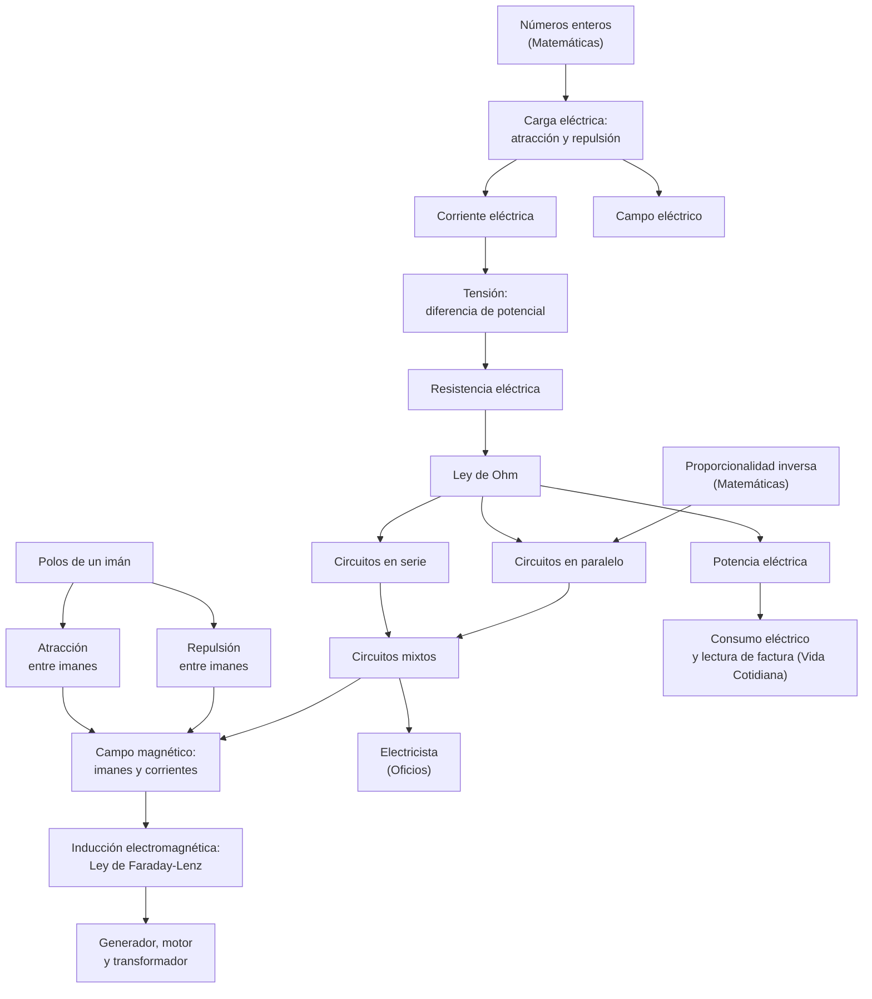
```mermaid
graph TD
  FIS1["Carga eléctrica:<br/>atracción y repulsión"] --> FIS2["Corriente eléctrica"]
  FIS2 --> FIS3["Tensión:<br/>diferencia de potencial"]
  FIS3 --> FIS4["Resistencia eléctrica"]
  FIS4 --> FIS5["Ley de Ohm"]
  FIS5 --> FIS6["Potencia eléctrica"]
  FIS5 --> FIS7["Circuitos en serie"]
  FIS5 --> FIS8["Circuitos en paralelo"]
  FIS7 --> FIS9["Circuitos mixtos"]
  FIS8 --> FIS9
  FIS1 --> FIS10["Campo eléctrico"]
  MAG1a["Polos de un imán"] --> MAG1b["Atracción<br/>entre imanes"]
  MAG1a --> MAG1c["Repulsión<br/>entre imanes"]
  MAG1b --> FIS11["Campo magnético:<br/>imanes y corrientes"]
  MAG1c --> FIS11
  FIS9 --> FIS11
  FIS11 --> FIS12["Inducción electromagnética:<br/>Ley de Faraday-Lenz"]
  FIS12 --> FIS13["Generador, motor<br/>y transformador"]

  NE1PP["Números enteros<br/>(Matemáticas)"] --> FIS1
  N10P["Proporcionalidad inversa<br/>(Matemáticas)"] --> FIS8
  FIS6 --> E21["Consumo eléctrico<br/>y lectura de factura (Vida Cotidiana)"]
  FIS9 --> OF1P["Electricista<br/>(Oficios)"]
```

**Lo que ya estaba anticipado sin tronco propio**: la tabla de cruces del v1
ya tenía la fila "Circuitos en paralelo → proporcionalidad inversa" y
"Consumo eléctrico y factura → potencia, unidades, porcentaje" sin que
existiera de dónde colgarlas. Y el DSL ya tiene `visual: circuit`
implementado — este es el tronco que mejor encaja con capacidad que ya
existe y hoy usa una sola plantilla.

**El eslabón que faltaba antes de la Historia**: la Electricidad llegaba
hasta los circuitos y de ahí el mapa saltaba directo a `Electrificación`
(Tronco 8.b) apoyado sólo en `Potencia eléctrica`. Pero ni un generador ni
un motor eléctrico funcionan por Ley de Ohm — funcionan por inducción. Sin
`Campo magnético --> Inducción --> Generador/motor/transformador`, la
Revolución Industrial eléctrica se enseña como una fecha sin mecanismo.

**Agregado v2.5.1 — `Imanes y magnetismo básico` (`MAG1`)**: hallado al
verificar `investigacion/fisica.md` contra este mapa — el hueco #8 de esa
investigación (currícula de primaria: qué es un imán, qué materiales
atrae, polos que se repelen o atraen) nunca había entrado a ninguna
versión del MAPA. `FIS11` seguía siendo el único nodo de magnetismo, y ya
arrancaba en un nivel avanzado (paso intermedio hacia la inducción) sin
punto de entrada simple — el mismo patrón de "primaria saltada" que ya se
había corregido en Biología (`BA0`-`BA3`) y Matemáticas (`N17`/`N18`).

### 9.b — Ondas

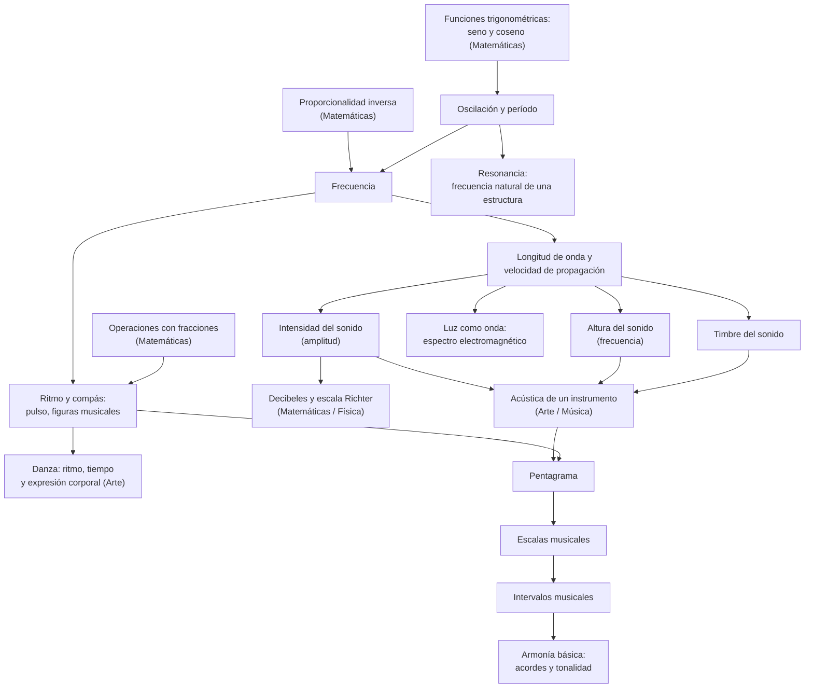
```mermaid
graph TD
  OND1["Oscilación y período"] --> OND2["Frecuencia"]
  OND2 --> OND3["Longitud de onda y<br/>velocidad de propagación"]
  OND3 --> OND4a["Timbre del sonido"]
  OND3 --> OND4b["Altura del sonido<br/>(frecuencia)"]
  OND3 --> OND4c["Intensidad del sonido<br/>(amplitud)"]
  OND3 --> OND5["Luz como onda:<br/>espectro electromagnético"]

  N10P2["Proporcionalidad inversa<br/>(Matemáticas)"] --> OND2
  TRIG1P["Funciones trigonométricas:<br/>seno y coseno (Matemáticas)"] --> OND1
  OND4a --> AR4["Acústica de un instrumento<br/>(Arte / Música)"]
  OND4b --> AR4
  OND4c --> AR4
  OND4c --> E14P["Decibeles y escala Richter<br/>(Matemáticas / Física)"]
  OND1 --> OND6["Resonancia:<br/>frecuencia natural de una estructura"]
  N7P["Operaciones con fracciones<br/>(Matemáticas)"] --> RIT1["Ritmo y compás:<br/>pulso, figuras musicales"]
  OND2 --> RIT1
  RIT1 --> AR7["Danza: ritmo, tiempo<br/>y expresión corporal (Arte)"]
  RIT1 --> MUS1a["Pentagrama"]
  AR4 --> MUS1a
  MUS1a --> MUS1b["Escalas musicales"]
  MUS1b --> MUS1c["Intervalos musicales"]
  MUS1c --> MUS2["Armonía básica:<br/>acordes y tonalidad"]
```

**La proporcionalidad inversa reaparece**: frecuencia y período son
recíprocos (`f = 1/T`), la misma relación que ya hacía falta para
`Circuitos en paralelo`. No es casualidad — es la tercera vez que el mismo
concepto matemático sostiene un tema de Física, después de resistencias en
paralelo y antes de las lentes en 9.c.

**Agregado v2.4 — `Resonancia` (`OND6`), encontrado investigando
Ingeniería, no Física**: el colapso del puente de Tacoma Narrows (1940)
es, según la propia literatura de ingeniería, "piedra angular de la
educación en ingeniería a nivel mundial" — se rompió por flutter
aeroelástico, resonancia entre el viento y la frecuencia natural de la
estructura. Sin este nodo, el caso de estudio que más rinde para enseñar
el ciclo de diseño de Ingeniería (`ING5`/`ING6`, ensayo y optimización)
no tiene mecanismo físico real detrás.

**Bug corregido v2.8 — `Ritmo y compás` (`RIT1`)**: `AR7` (Danza) colgaba
de `OND4` ("ritmo, tiempo y expresión corporal") como si "ritmo" ya fuera
un concepto enseñado en algún lado — no lo era, la misma clase de flecha
rota que tenía `FLU2 --> G6P` antes de que existiera Meteorología. `RIT1`
(pulso, figuras musicales) cuelga de `Operaciones con fracciones` (una
negra, dos corcheas, un compás de 4/4 son literalmente fracciones) y de
`Frecuencia` — y es, de paso, el mismo nodo que la investigación de
`arte.md` ya había marcado como pendiente para Música sin resolverlo:
ahora Danza tiene piso real y Música tiene, al menos, el primer nodo de
lo que le falta.

**Agregado v2.9 — Lenguaje musical y Armonía (`MUS1`/`MUS2`)**: Música
como lenguaje separado de Arte lleva **cinco rondas** apareciendo como
"decisión pendiente" sin que nadie le diera contenido real (GPT, Z y
Opus 5 lo volvieron a nombrar en esta misma ronda). En vez de resolver la
pregunta de fondo (¿separarla de Arte como tronco propio?), se le da
primer piso real: `MUS1` (pentagrama, escalas, intervalos) cuelga de
`Ritmo y compás` (`RIT1`, ya real desde v2.8) y de `Acústica de un
instrumento` (`AR4`) — leer una partitura es, literalmente, notación de
ritmo más notación de altura, las dos cosas que ya existían por separado
sin juntarse. `MUS2` (armonía, acordes y tonalidad) es el siguiente
escalón. La decisión de si esto amerita tronco propio sigue abierta —
esto es contenido real esperando esa decisión, no la decisión en sí.

### 9.c — Óptica

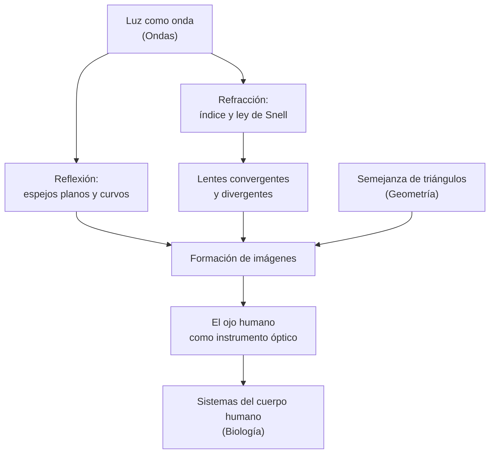
```mermaid
graph TD
  OND5P["Luz como onda<br/>(Ondas)"] --> OPT1["Reflexión:<br/>espejos planos y curvos"]
  OND5P --> OPT2["Refracción:<br/>índice y ley de Snell"]
  OPT2 --> OPT3["Lentes convergentes<br/>y divergentes"]
  OPT1 --> OPT4["Formación de imágenes"]
  OPT3 --> OPT4
  OPT4 --> OPT5["El ojo humano<br/>como instrumento óptico"]

  GO4PP["Semejanza de triángulos<br/>(Geometría)"] --> OPT4
  OPT5 --> BKP["Sistemas del cuerpo humano<br/>(Biología)"]
```

**Por qué Óptica necesitaba Geometría y no sólo Física**: `Formación de
imágenes` (con espejos o lentes) se resuelve con triángulos semejantes, no
con una fórmula nueva para memorizar — es el mismo `GO4` del Tronco 3
apareciendo por tercera vez (después de trigonometría y vectores). `OPT4`
también explica *por qué* funciona un eclipse (una sombra es una imagen sin
lente) — pero ya no es su prerrequisito formal: el v2 lo tenía como
dependencia dura (`OPT4P --> AS4`) y eso obligaba a enseñar Óptica antes de
poder explicar un eclipse en 8.a, invirtiendo el orden pedagógico real. La
dependencia dura pasó a `GO6` (circunferencia); `OPT4` queda como la misma
relación de "da sentido sin ser prerrequisito" que ya tenía Historia
profunda con el resto del mapa.

### 9.d — Energía y su conservación

Faltaba entera. `F7` (Trabajo de una fuerza) ya existía colgado del
producto escalar en el Tronco 3.b, pero terminaba ahí — un callejón sin
salida. Es el hueco que tres lecturas distintas de este mapa señalaron por
tres caminos separados (conservación general, energía mecánica,
distancia de frenado) y que además ya está sembrado como plantilla oficial
del DSL, esperando el nodo.

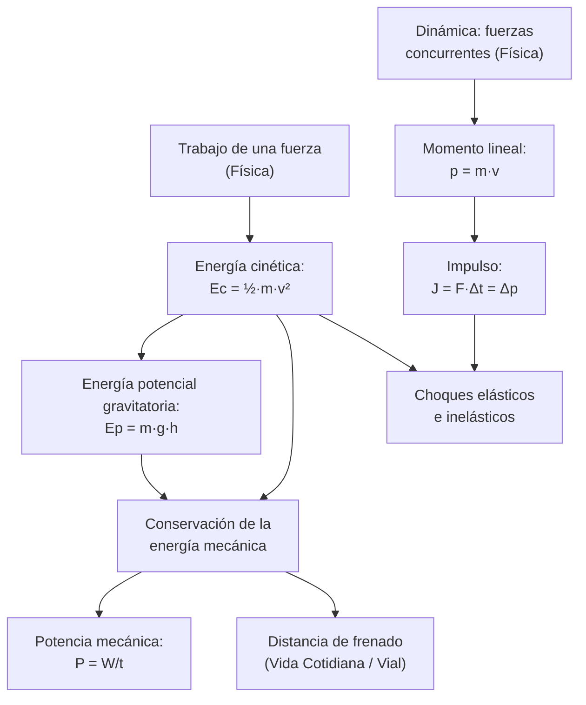
```mermaid
graph TD
  F7P["Trabajo de una fuerza<br/>(Física)"] --> ENE1["Energía cinética:<br/>Ec = ½·m·v²"]
  ENE1 --> ENE2["Energía potencial gravitatoria:<br/>Ep = m·g·h"]
  ENE1 --> ENE3["Conservación de la<br/>energía mecánica"]
  ENE2 --> ENE3
  ENE3 --> ENE4["Potencia mecánica:<br/>P = W/t"]

  ENE3 --> V1P["Distancia de frenado<br/>(Vida Cotidiana / Vial)"]

  F5P["Dinámica: fuerzas<br/>concurrentes (Física)"] --> MOM1["Momento lineal:<br/>p = m·v"]
  MOM1 --> MOM2["Impulso:<br/>J = F·Δt = Δp"]
  ENE1 --> MOM3["Choques elásticos<br/>e inelásticos"]
  MOM2 --> MOM3
```

**El nodo que le faltaba pierna a `Distancia de frenado`**: el mapa ya
tenía `V1` colgado de la cuadrática (Tronco 2) — cierto algebraicamente,
pero la razón física de que frene con el cuadrado de la velocidad es que
toda la energía cinética (que crece con `v²`) tiene que disiparse como
trabajo de rozamiento. `Conservación de la energía` es el eslabón físico
que faltaba entre el álgebra y el freno real.

**Agregado v2.5.1 — `Momento lineal, impulso y choques` (`MOM1`-`MOM3`)**:
otro hueco de `investigacion/fisica.md` (prioridad #4 de 8) que nunca
había entrado al MAPA en ninguna ronda anterior, pese a tener currícula
estándar de respaldo y un lugar claro donde colgar (`F5` para la fuerza,
`ENE1` para distinguir un choque elástico de uno inelástico por si
conserva o no la energía cinética). Es, junto con `Distancia de frenado`,
el segundo tema de seguridad vial que el mapa puede enseñar con física
real: por qué existe la zona de deformación programada de un auto, cómo
funciona un airbag, por qué el billar y la propulsión a reacción son el
mismo principio.

### 9.e — Termodinámica

`F8` ("Máquina térmica: termodinámica") ya estaba en el mapa desde el v2 —
consumido por la Historia de la Revolución Industrial (Tronco 8.b) y
citado en la tabla de cruces— pero sin desarrollo propio en Física: una
flecha que apuntaba a un concepto que el mapa nunca enseñaba. Ya está
sembrado como plantilla oficial (calor, cambios de estado, dilatación,
conversión de escalas); acá se le construye el piso real.

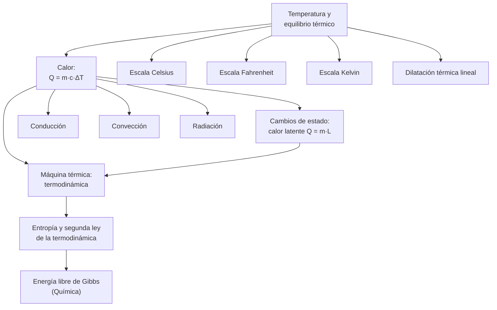
```mermaid
graph TD
  TER1["Temperatura y<br/>equilibrio térmico"] --> TER2["Calor:<br/>Q = m·c·ΔT"]
  TER1 --> TER3a["Escala Celsius"]
  TER1 --> TER3b["Escala Fahrenheit"]
  TER1 --> TER3c["Escala Kelvin"]
  TER2 --> TER4["Cambios de estado:<br/>calor latente Q = m·L"]
  TER1 --> TER5["Dilatación térmica lineal"]
  TER2 --> TER6a["Conducción"]
  TER2 --> TER6b["Convección"]
  TER2 --> TER6c["Radiación"]
  TER2 --> F8["Máquina térmica:<br/>termodinámica"]
  TER4 --> F8
  F8 --> TER7["Entropía y segunda ley<br/>de la termodinámica"]
  TER7 --> QGIBBSP["Energía libre de Gibbs<br/>(Química)"]
```

**El nodo fantasma queda resuelto**: antes `F8` era un destino sin origen
propio dentro de Física — sólo llegaba de la Historia. Ahora tiene la
misma forma que cualquier otro tema del mapa: una cadena real de
prerrequisitos (`Temperatura → Calor → Cambios de estado / Dilatación`)
que desemboca en la máquina térmica, en vez de aparecer prefabricada.

**Agregado v2.9 — Transmisión de calor y Entropía (`TER6`/`TER7`)**:
hueco estructural con cruce entre materias que Opus 5 detectó — `Calor` (`Q =
m·c·ΔT`, `TER2`) dice cuánto calor se transfiere, nunca *cómo* (conducción,
convección, radiación). Y `Energía libre de Gibbs` (`QGIBBS`, Tronco 7)
usa entropía para explicar por qué una reacción es espontánea, sin que
Física definiera nunca qué es la entropía ni la segunda ley — un cruce
que dependía de un concepto que no existía en ningún nodo.

### 9.f — Mecánica de fluidos

`Densidad` (`Q2`, Tronco 3.a) ya existía pero terminaba en Química sin
seguir a Física — faltaba toda la presión en fluidos, que además ya está
sembrada como plantilla oficial y es el puente real hacia la fisiología
cardiovascular, la atmósfera y el oficio de plomería.

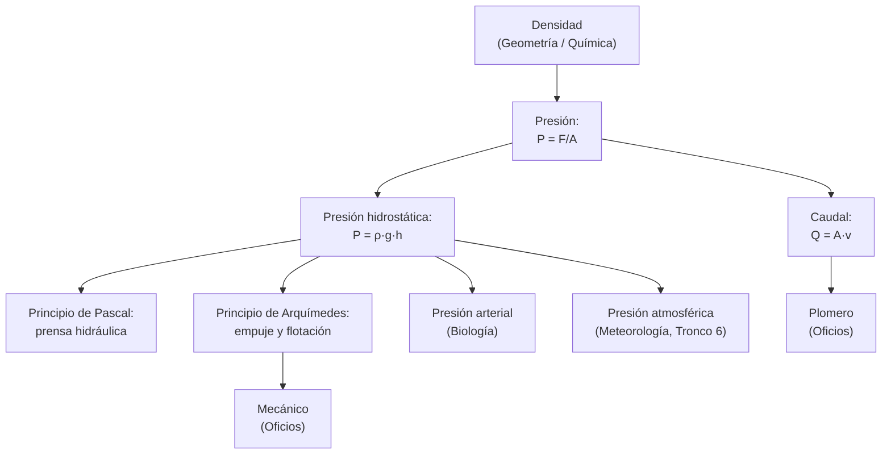
```mermaid
graph TD
  Q2P["Densidad<br/>(Geometría / Química)"] --> FLU1["Presión:<br/>P = F/A"]
  FLU1 --> FLU2["Presión hidrostática:<br/>P = ρ·g·h"]
  FLU1 --> FLU3["Caudal:<br/>Q = A·v"]
  FLU2 --> FLU4["Principio de Pascal:<br/>prensa hidráulica"]
  FLU2 --> FLU5["Principio de Arquímedes:<br/>empuje y flotación"]
  FLU5 --> OF5P2["Mecánico<br/>(Oficios)"]

  FLU2 --> BKPP["Presión arterial<br/>(Biología)"]
  FLU2 --> MET1P["Presión atmosférica<br/>(Meteorología, Tronco 6)"]
  FLU3 --> OF2P["Plomero<br/>(Oficios)"]
```

**Por qué no era sólo "más química"**: `Densidad` sin presión es un
número aislado (masa sobre volumen); con `Presión hidrostática` se explica
por qué un buceador siente los oídos, por qué el corazón necesita más
fuerza en las piernas que en la cabeza, y por qué un plomero calcula
caudal antes de elegir un caño. Es la misma cadena corta que separa "dato"
de "para qué sirve" en el resto del mapa.

**Bug corregido v2.5**: esta flecha apuntaba a `G6P["Presión atmosférica
(Geografía)"]` — pero `G6` (Tronco 6) es "Relieve, clima y biomas", nunca
tuvo un nodo de presión atmosférica. Ahora apunta al nodo real, `MET1`
(Meteorología, Tronco 6), que desarrolla la cadena completa en vez de
prometerla.

**Agregado v2.8 — Arquímedes y Pascal (`FLU4`/`FLU5`)**: Z señaló que
9.f iba de presión a hidrostática a caudal y saltaba directo a Plomero
sin el tema más clásico de fluidos de toda la secundaria — por qué flota
un barco. `Arquímedes` (empuje) explica flotación con la misma
`Presión hidrostática` que ya existía; `Pascal` (prensa hidráulica) es el
mecanismo real detrás del gato hidráulico que usa `Mecánico` (`OF5`) todos
los días, sin que el mapa se lo diera.

### 9.g — Física atómica y nuclear

La estructura estándar de un curso de Física de secundaria tiene 5 áreas:
mecánica newtoniana, fluidos y calor, electricidad y magnetismo, ondas y
óptica, física atómica y nuclear. Las primeras 4 ya estaban completas
entre el Tronco 3.b y este; la quinta no existía en ningún lado —
`investigacion/fisica.md` la marcó como hueco #3 de 8, y quedó sin
aplicar en v2.4 junto con `Momento lineal, impulso y choques` (9.d).

```mermaid
graph TD
  QDP["Número atómico<br/>y másico (Química)"] --> NUC1["Estructura del núcleo:<br/>protones y neutrones"]
  NUC1 --> NUC2a["Decaimiento alfa"]
  NUC1 --> NUC2b["Decaimiento beta"]
  NUC1 --> NUC2c["Decaimiento gamma"]
  NUC2a --> NUC3["Semivida:<br/>desintegración exponencial"]
  NUC2b --> NUC3
  NUC2c --> NUC3
  A11P["Familias de funciones:<br/>exponencial y logarítmica (Álgebra)"] --> NUC3
  NUC3 --> DATP["Datación radiométrica:<br/>carbono 14 (Tronco 8.a)"]
  NUC2a --> NUC4["Fisión y fusión nuclear:<br/>por qué liberan energía"]
  NUC2b --> NUC4
  NUC2c --> NUC4
  OND5P["Luz como onda<br/>(Ondas, 9.b)"] --> FISM1["Dualidad onda-partícula"]
  FISM1 --> FISM2["Relatividad especial:<br/>simultaneidad y E = mc² (conceptual)"]
  NUC4 --> FISM3["Física médica:<br/>rayos X, PET, radioterapia"]
  FISM1 --> FISM3
```

**El mismo patrón que ya se había corregido dos veces, sin corregir acá**:
Tronco 8.a tenía `Datación radiométrica` (`DAT`) con la nota de que
"necesita exponencial y logaritmos" desde el v2 — cierto, pero le
faltaba la física de *por qué* un núcleo decae, qué es una semivida y en
qué se diferencian las radiaciones alfa/beta/gamma. Es exactamente el
mismo hueco que ya se resolvió para `Nucleosíntesis --> Tabla periódica`
(8.a) y `Revolución industrial --> Máquina térmica` (8.b/9.e): Historia
narraba el resultado, Física no daba el mecanismo. Acá era el tercer caso
del mismo patrón y había quedado sin resolver hasta esta verificación.
Aplicación real: radioterapia y diagnóstico por imágenes (PET, rayos X),
energía nuclear, por qué un detector de humo iónico o un densímetro
industrial usan una fuente radiactiva.

**Agregado v2.7 — Física moderna (`NUC4`, `FISM1`, `FISM2`)**: GPT señaló
que `NUC1`-`NUC3` (v2.5.1) cubren la estructura y el decaimiento del
núcleo, pero no las dos reacciones que de verdad producen la energía
nuclear que se nombra todo el tiempo en la prensa — `Fisión` (partir un
núcleo pesado, centrales nucleares, bombas) y `Fusión` (unir núcleos
livianos, el proceso que ya alimentaba `Formación de estrellas` en Tronco
8.a sin nombrarlo del lado de Física). `Dualidad onda-partícula` y
`Relatividad especial` son conceptuales a propósito — el mapa no evalúa
las ecuaciones de Einstein, evalúa que un alumno entienda *que* la luz se
comporta como onda y partícula a la vez, y *que* la energía y la masa son
la misma cosa (`E = mc²`) — el mismo nivel de "narrar el mecanismo sin
exigir el cálculo completo" que ya usa `Astronomía Moderna` (8.a) para
materia oscura y agujeros negros.

**Agregado v2.9.6 — Física médica (`FISM3`)**: confirmado vía `Física
contenidos nivel adultos` (real, argentino, educación de adultos). El
propio changelog de este documento ya nombraba rayos X, PET y
radioterapia como motivación real de `NUC1`-`NUC4` desde que existen,
pero nunca se había convertido en nodo — quedaba como frase de
contexto, no como contenido evaluable. Cuelga de `NUC4` (fisión/fusión,
de donde sale la fuente radiactiva) y de `FISM1` (dualidad onda-
partícula, que explica por qué un rayo X atraviesa tejido blando y no
hueso). Chico pero real: es la aplicación práctica concreta que le
faltaba a una física nuclear por lo demás ya sólida.

---

## Tronco 10 — Informática: de la lógica al software

Ya dejó de ser un tronco chico. Hasta v2.4 era un único diagrama (`IN1`-
`IN12`); a partir de v2.5 se abre en subsecciones, mismo criterio que ya
usó Geometría (3.a/3.b), Física (9.a-9.f) o Administración y Derecho
(13.a/13.b) cuando un solo diagrama se quedaba chico.

### 10.0 — Educación Tecnológica: el fundamento que faltaba

Distinta de Informática (programación) y de Ingeniería (diseño de
producto): es el fundamento conceptual que en teoría precede a ambas,
y no existía en absoluto en `material/` — ni un solo tema.

```mermaid
graph TD
  TEC0a["Qué es la técnica<br/>y la tecnología"] --> TEC0b["Medios técnicos como<br/>extensión de capacidades humanas"]
  TEC0b --> TEC0c["Procesos técnicos:<br/>artesanales vs. industriales"]
  TEC0c --> IN1P["Algoritmo: secuencia<br/>de pasos (Informática)"]
  TEC0c --> ING1P["Problema y restricciones<br/>(Ingeniería)"]
```

**Agregado v2.9.6**: confirmado vía `TECNOLOGIA 1 DE SANTILLANA` (real,
currículum NAP), 0 resultados en grep. `TEC0a` distingue técnica
(la práctica concreta) de tecnología (la técnica sistematizada); `TEC0b`
la entiende como extensión histórica de capacidades humanas (el martillo
extiende el puño, la rueda las piernas); `TEC0c` compara el proceso
artesanal (un productor, control total) con el industrial (en cadena,
especializado) — el salto que hace falta entender antes de que
Informática o Ingeniería tengan sentido como *tipos* de técnica, no como
la técnica en sí.

### 10.a — Núcleo: de la lógica al software

Existía sólo como ramas sueltas (binario, complejidad, álgebra booleana)
colgando de Matemáticas y Filosofía. Ahora tiene tronco propio, y esas tres
ramas pasan a ser sus puntos de entrada.

```mermaid
graph TD
  IN1["Algoritmo:<br/>secuencia de pasos"] --> IN2["Variables y tipos de dato"]
  IN2 --> IN3["Estructuras de control:<br/>condicionales"]
  IN3 --> IN4["Estructuras de control:<br/>bucles"]
  IN4 --> IN5["Funciones y modularidad"]
  IN5 --> IN5C["Punteros, referencias<br/>y gestión de la memoria"]
  IN5 --> IN5B["Programación orientada<br/>a objetos: clases y objetos"]
  IN5B --> IN5Ba["Herencia"]
  IN5B --> IN5Bb["Polimorfismo"]
  IN5 --> IN6a["Listas"]
  IN5 --> IN6b["Pilas<br/>(LIFO)"]
  IN5 --> IN6c["Colas<br/>(FIFO)"]
  IN6a --> IN6["Estructuras de datos:<br/>síntesis"]
  IN6b --> IN6
  IN6c --> IN6
  IN6 --> IN7["Recursividad"]
  IN6 --> IN6B["Algoritmos de búsqueda<br/>y ordenamiento"]
  I1P["Complejidad asintótica<br/>(Matemáticas)"] --> IN6B
  D1P["Leer una tabla<br/>(Matemáticas)"] --> OFIM1["Ofimática:<br/>planilla de cálculo"]
  ADM3P["Presupuesto<br/>(Administración)"] --> OFIM1
  IN6 --> IN8["Archivos y persistencia"]
  IN8 --> IN9["Bases de datos<br/>y modelo relacional"]
  IN9 --> IN10["Redes:<br/>protocolos y cliente-servidor"]
  IN10 --> CRIPTO1["Criptografía:<br/>clave simétrica/asimétrica, hash"]
  CRIPTO1 --> IN11["Seguridad informática"]
  IN6 --> IN12["Inteligencia artificial:<br/>de reglas a aprendizaje"]
  IN12 --> IN12B["Ética de la IA:<br/>sesgo algorítmico, privacidad de datos de entrenamiento"]
  IN12B --> FI8aP["Utilitarismo<br/>(Filosofía)"]
  IN12B --> FI8bP["Deontología<br/>(Filosofía)"]
  IN12B --> FI8cP["Ética de la virtud<br/>(Filosofía)"]
  IN12B --> FI8dP["Contractualismo<br/>(Filosofía)"]

  E12P["Sistemas de numeración:<br/>binario (Matemáticas)"] --> IN2
  I2P["Álgebra booleana<br/>(Informática)"] --> IN3
  I1P["Complejidad asintótica<br/>(Matemáticas)"] --> IN6
  CJ2P["Conjuntos:<br/>unión e intersección (Matemáticas)"] --> IN9
  D15P["Regresión lineal<br/>(Matemáticas)"] --> IN12
  AL1P["Matrices y álgebra lineal<br/>(Matemáticas)"] --> IN12
  IN11 --> CD1P["Verificación de una noticia<br/>(Ciudadanía Digital)"]
```

**Las tres ramas que ya existían eran, en realidad, las puertas de
entrada**: `Sistemas de numeración` (E12, Tronco 1) alimenta directamente
cómo se guarda un dato; `Álgebra booleana` (I2, Tronco 5, vía lógica
proposicional) es literalmente la estructura de un `if`; y `Complejidad
asintótica` (I1, Tronco 2) es lo que después explica por qué una lista no
sirve para todo. El v1 tenía las puertas sin el edificio.

**Y el cruce que faltaba nombrar del otro lado**: `Conjuntos --> Bases de
datos`. Una consulta con `WHERE ... AND` es intersección de conjuntos con
otro nombre. Es el mismo patrón que Punnett con probabilidad (Tronco 4): el
contenido "nuevo" de Informática es, muy seguido, matemática vieja con
sintaxis distinta.

**El piso que le faltaba a la Inteligencia Artificial**: `Regresión lineal`
sola alcanza para ajustar una recta a puntos, no para explicar qué es un
peso, un vector de entrada o una capa de una red. `Matrices` (Tronco 2) es
el prerrequisito real que faltaba — sin eso, `IN12` se enseña como caja
negra en vez de como álgebra aplicada.

**Agregado 2026-08-13 — Punteros y gestión de memoria (`IN5C`), Herencia
y Polimorfismo (`IN5Ba`, `IN5Bb`)**: confirmado vía *Enciclopedia del
Lenguaje C++* (Ceballos Sierra, referencia clásica) y *Estructura de
Datos Orientada a Objetos* (Guardati, Pearson). Dos huecos reales, 0
resultados en grep para "puntero"/"herencia"/"polimorf" en todo el
tronco de Informática. `IN5C` (una variable que guarda una dirección de
memoria en vez de un valor) es distinto de `SO2` ("Memoria: asignación
y memoria virtual", 10.c) — ese es el sistema operativo administrando
memoria física; esto es el concepto de lenguaje que el programador
manipula directamente. `IN5B` ("Programación orientada a objetos:
clases y objetos") se quedaba en el primer escalón — herencia y
polimorfismo son, junto con el encapsulamiento que ya daba `IN5B`, los
pilares que de verdad separan "definir una clase" de "programar
orientado a objetos".

**Agregado v2.8 — Algoritmos de búsqueda y ordenamiento (`IN6B`) y
Ofimática (`OFIM1`)**: Z señaló que `Estructuras de datos` (`IN6`) y
`Complejidad asintótica` (`I1`, Tronco 2) nunca se juntaban en un
ejemplo concreto — BubbleSort, MergeSort y búsqueda binaria son
exactamente el contenido estándar que une las dos cosas, sin ellos el
cálculo de Big-O no tiene qué medir. `Ofimática` (planilla de cálculo) es
un caso raro: la banda 1-6 del mapa ya reconocía que Informática ahí es
"alfabetización digital sin currícula propia todavía", pero una planilla
es genuinamente evaluable (cruza con `Leer una tabla`, Tronco 4, y con
`Presupuesto`, `ADM3`) y es lo primero que un egresado usa en un trabajo
real — mismo criterio que ya justificó `COM6` (CV, correo formal).

**Agregado v2.9 — Programación orientada a objetos (`IN5B`)**: hueco
estructural que Opus 5 encontró en la mitad del tronco — `IN5` (funciones y
modularidad) es programación puramente procedural; `10.e` (Ingeniería de
Software) ya habla de "diseño y arquitectura" y "patrones" (`ISW2`/`ISW6`)
como si el alumno ya supiera qué es una clase o un objeto. POO es el
paradigma real detrás de ambos, y faltaba nombrarlo — sin él, `ISW2` se
enseña con vocabulario sin la base que lo sostiene.

**Agregado v2.9 — Ética de la IA (`IN12B`)**: confirmado por GPT, Z y
Opus 5, los tres de forma independiente. `Inteligencia artificial: de reglas a
aprendizaje` (`IN12`) enseña la técnica; faltaba la consecuencia social
—sesgo de género/raza aprendido de datos de entrenamiento sesgados,
privacidad de esos mismos datos— con el mismo principio de neutralidad
descriptiva que ya aplican corrientes económicas y bioética (`FI8`, con
la que cruza directo): describir el dilema real, no bajar línea sobre
cómo resolverlo.

### 10.b — Redes

`IN10` decía "Redes: protocolos y cliente-servidor" en una sola línea —
correcto, pero comprimido al punto de no distinguir una brecha real de
tooling (no hay renderer de topología de red) de una simple falta de
desarrollo. Se desarrolla acá, entre Bases de Datos y Seguridad, que es
donde ya vivía.

```mermaid
graph TD
  IN9P["Bases de datos<br/>y modelo relacional (10.d)"] --> IN10P["Redes: protocolos<br/>y cliente-servidor (10.a)"]
  IN10P --> RED1["Direccionamiento:<br/>IP y DNS"]
  RED1 --> RED2["Protocolo HTTP:<br/>petición y respuesta"]
  RED2 --> RED3["TCP/IP:<br/>capas y enrutamiento"]
  RED3 --> RED4a["Firewall"]
  RED3 --> RED4b["VPN"]
  RED3 --> RED4c["Cifrado en tránsito"]
  IN10P --> IN11P["Seguridad informática<br/>(10.a)"]
  RED4a --> IN11P
  RED4b --> IN11P
  RED4c --> IN11P
```

**Agregado v2.5**: `IN10` ya decía que un cliente le pide algo a un
servidor; lo que faltaba era el mecanismo (`IP`/`DNS` para encontrarlo,
`HTTP` para pedirle algo puntual, `TCP/IP` para que el paquete llegue
entero). `RED4` (seguridad de red) es distinta de `IN11` (seguridad
informática en general — contraseñas, phishing, cifrado de datos en
reposo): acá es específicamente qué pasa con un dato mientras viaja por
una red, no mientras está guardado.

**Bug corregido v2.9 — Criptografía real (`CRIPTO1`)**: GPT, Gemma y
Opus 5 señalaron, cada uno por su lado, que la criptografía real (clave
simétrica/asimétrica, hash) estaba débil o ausente. Verificando el
porqué, apareció un bug real: Tronco 1 citaba `IN11` como si fuera
"Criptografía" (blockchain, firma de transacciones) — pero `IN11`
siempre fue "Seguridad informática", un concepto más amplio (contraseñas,
phishing, cifrado de datos) que nunca desarrolló clave simétrica/
asimétrica ni hash como temas propios. `CRIPTO1` cuelga de `Redes` (la
criptografía moderna nace de necesitar comunicación segura entre dos
puntos) y alimenta a `IN11`, que ahora sí tiene de dónde salir.

### 10.c — Sistemas Operativos

No existía en ningún nivel — ni como nodo comprimido. Es la capa entre el
programa (`IN1`-`IN7`) y la máquina real que lo ejecuta.

```mermaid
graph TD
  I3P["Revolución informática<br/>(Historia profunda)"] --> SO0["Historia y evolución<br/>de los sistemas operativos"]
  SO0 --> SO1B["Arranque de la computadora<br/>(boot)"]
  SO1B --> SO1["Proceso:<br/>programa en ejecución"]
  IN6P["Estructuras de datos<br/>(10.a)"] --> SO1
  SO1 --> SO1C["Comunicación<br/>entre procesos"]
  SO1 --> SOES1["Subsistema de<br/>entrada y salida"]
  SO1 --> SO2["Memoria:<br/>asignación y memoria virtual"]
  SO2 --> SO2a["Paginación"]
  SO2 --> SO2b["Segmentación"]
  SO1 --> SO3["Planificación de procesos"]
  SO3 --> SO3B["Interrupciones"]
  IN8P["Archivos y persistencia<br/>(10.a)"] --> SO4["Sistema de archivos"]
  SO4 --> SO5["Permisos y usuarios"]
  SO4 --> SO4B["Sistema de archivos<br/>por bitácora (journaling)"]
  SO3 --> SO6["Virtualización:<br/>máquina virtual, contenedor"]
  SO0 --> SO7["Tipos de SO por dispositivo:<br/>mainframe, servidor, PC, tiempo real, embebido"]
```

**Por qué es un hueco real y no un tecnicismo**: sin esto, `IN6`
(estructuras de datos en memoria) y `IN8` (archivos en disco) son dos
temas que un alumno aprende por separado sin entender que ambos compiten
por los mismos recursos limitados de una máquina real — `Proceso` y
`Memoria` son justo esa idea de "recursos compartidos" que le falta
mecanismo a los dos.

**Agregado 2026-08-13 — 8 nodos más (`SO0`, `SO1B`, `SO1C`, `SOES1`,
`SO2a-b`, `SO3B`, `SO4B`, `SO7`)**: confirmado contra una guía de
estudios completa de la materia (basada en Tanenbaum, referencia
clásica del área), que reveló que `SO1-SO6` cubría sólo una fracción de
lo que realmente entra en "cómo funciona un sistema operativo". `SO0`
(historia y evolución) cuelga de `Revolución informática` (`I3`,
Historia profunda) — el mismo hilo tecnológico que ya conecta imprenta
con electrificación con internet tenía un tramo entero sin nombrar.
`SO1B` (arranque/boot) es el paso que falta entre "la máquina está
apagada" y "hay un proceso corriendo" — antes `SO1` empezaba en el
medio. `SO1C` (comunicación entre procesos) e `SOES1` (subsistema de
entrada/salida) son, junto con memoria, los tres recursos reales que un
proceso necesita — sólo memoria tenía nodo. `SO2` ("Memoria: asignación
y memoria virtual") era otro caso del mismo anti-patrón lumped que ya
se corrigió varias veces este mes: paginación y segmentación son dos
esquemas técnicamente distintos, no una frase. `SO3B` (interrupciones)
es el mecanismo real detrás de cómo el planificador (`SO3`) logra
repartir la CPU. `SO4B` (sistema de archivos por bitácora/journaling)
es la técnica moderna que evita perder datos ante un corte de luz —
ausente pese a que `SO4`/`SO5` ya cubrían archivos y permisos. `SO7`
(tipos de SO según el dispositivo: mainframe, servidor, PC, tiempo
real, embebido) cierra la clasificación que faltaba.

**Agregado 2026-08-13 — Licencias de software (`LIC1`)**: pregunta de
Javier sobre software libre — ya se había evaluado como corriente
ideológica en la ronda de neutralidad (v2.9.4) y se descartó por no
tener el mismo peso que Economía o Filosofía. El ángulo real que
faltaba es otro: no la ideología, sino el dato práctico de qué tipo de
licencia rige un software (propietaria, libre/copyleft tipo GPL,
permisiva tipo MIT/BSD, Creative Commons para contenido no-código) —
la decisión concreta que cualquiera que publica código tiene que tomar.
Por eso cuelga de `Control de versiones` (`ISW3`, 10.e) y no de
Ciudadanía Digital: es el paso siguiente real después de subir un
repositorio, no una postura política.

### 10.d — Bases de Datos

`IN9` decía "Bases de datos y modelo relacional" en una sola línea,
igual de comprimido que `IN10` antes de 10.b. Con el bug de `BD1`
corregido (ver Tronco 4.a), este es ahora el único lugar del mapa donde
vive el concepto.

```mermaid
graph TD
  CJ2P["Conjuntos: unión<br/>e intersección (Matemáticas)"] --> IN9P["Bases de datos<br/>y modelo relacional (10.d)"]
  IN9P --> BD2a["Tabla"]
  BD2a --> BD2b["Registro"]
  BD2b --> BD2c["Clave primaria"]
  BD2c --> BD3["Relaciones y<br/>claves foráneas"]
  BD3 --> BD4["Normalización"]
  BD2c --> BD5a["SQL: consultas"]
  BD5a --> BD5b["SQL: joins"]
  BD5b --> BD5c["SQL: agregaciones"]
  BD5c --> BD6["Transacciones:<br/>ACID"]
```

**Nota de numeración**: `BD1` no se reutiliza — era el ID del bug
(duplicaba `IN9`), y reusarlo generaría la misma confusión que se está
resolviendo. La numeración real arranca en `BD2`.

### 10.e — Ingeniería de Software

No existía. Informática enseñaba a programar (`IN1`-`IN7`) pero nunca el
ciclo de construir software real más allá de una línea de código — el
mismo hueco entre "saber sumar" y "Administración" que ya resolvió el
Tronco 13.a para Economía.

```mermaid
graph TD
  IN5P["Funciones y<br/>modularidad (10.a)"] --> ISW1["Requisitos:<br/>funcionales y no funcionales"]
  RP1P["Detectar el problema<br/>(Resolución de problemas)"] --> ISW1
  ISW1 --> ISW2["Diseño y arquitectura<br/>de software"]
  IN5BP["Programación orientada<br/>a objetos (10.a)"] --> ISW2
  ISW2 --> ISW3["Control de versiones"]
  ISW3 --> LIC1["Tipos de licencias de software:<br/>propietaria, libre/copyleft, permisiva, Creative Commons"]
  ISW3 --> ISW4["Pruebas:<br/>unitarias e integración"]
  ISW4 --> ISW5["Mantenimiento<br/>y deuda técnica"]
  ISW2 --> ISW6["Patrones y<br/>buenas prácticas"]
```

**Por qué no es sólo "más programación"**: `IN1`-`IN7` enseñan a escribir
un algoritmo correcto; nada en el mapa enseñaba qué pasa antes (¿qué tiene
que hacer este programa, para quién?) ni después (¿sigue andando en un
año, con otra persona tocándolo?). Es la misma relación que `Ingeniería`
(Tronco 11) tiene con la Física pura: ahí es diseñar un puente que no se
caiga, acá es diseñar software que no se rompa cuando alguien más lo
edite. `ISW3` (control de versiones) es, en la práctica de esta misma
plataforma, Git — la herramienta con la que se escribe este documento.

### 10.f — Arquitectura de Computadoras

Ausente en las 5 subsecciones anteriores: `10.a`-`10.e` cubren el
software (algoritmo, sistema operativo, red, base de datos, ingeniería de
software) pero nunca la máquina física que lo ejecuta. GPT lo marcó como
el hueco de mayor prioridad de toda su ronda, junto con Redes y Sistemas
Operativos — que ya estaban resueltos desde v2.5 sin que lo notara.

```mermaid
graph TD
  E12P["Sistemas de numeración:<br/>binario (Matemáticas)"] --> ARQ1["CPU:<br/>unidad de control y ALU"]
  ARQ1 --> ARQ2a["RAM"]
  ARQ1 --> ARQ2b["Caché"]
  ARQ2a --> ARQ2c["Jerarquía de memoria"]
  ARQ2b --> ARQ2c
  ARQ2c --> ARQ3["Buses y<br/>entrada/salida"]
  ARQ1 --> ARQ4a["Buscar<br/>(fetch)"]
  ARQ4a --> ARQ4b["Decodificar<br/>(decode)"]
  ARQ4b --> ARQ4c["Ejecutar<br/>(execute)"]
  ARQ2c --> ARQ5["Almacenamiento:<br/>volátil vs. no volátil"]
  ARQ4c --> IN1P["Algoritmo:<br/>secuencia de pasos (10.a)"]
  ARQ2c --> SO2P["Memoria: asignación<br/>y memoria virtual (10.c)"]
```

**Por qué no es sólo "más Informática"**: `10.a`-`10.e` describen qué
hace un programa; esto describe qué lo ejecuta de verdad. Sin `ARQ1`-
`ARQ5`, `Memoria virtual` (`SO2`, 10.c) es un nombre sin la memoria física
real detrás, y `Sistemas de numeración` (`E12`, Tronco 1) explica cómo se
representa un número sin decir dónde vive físicamente ese bit. `ARQ4`
(ciclo de instrucción: buscar, decodificar, ejecutar) es, en el fondo, el
mismo tipo de ciclo que ya aparece en `Resolución de problemas` y
`Modelización matemática` — un patrón que se repite, aplicado esta vez al
hardware.

---

## Tronco 11 — Ingeniería: del problema al prototipo

No existía ningún hilo que conectara la física teórica con su aplicación.
Es, a propósito, un ciclo: la ingeniería no termina en la solución, vuelve
sobre ella.

```mermaid
graph TD
  ING1["Problema y restricciones:<br/>qué tiene que cumplir la solución"] --> ING0["Investigar<br/>soluciones existentes"]
  ING0 --> ING2["Diseño conceptual"]
  ING2 --> ING3["Modelado y cálculo"]
  ING3 --> ING4["Prototipo"]
  ING4 --> ING5["Ensayo y medición"]
  ING5 --> ING6["Optimización e iteración"]
  ING6 -. no cierra, se prueba de nuevo .-> ING4
  ING6 --> ING7["Comunicar la solución"]

  MODP["Modelización matemática"] --> ING3
  F5P["Dinámica y fuerzas<br/>(Física)"] --> ING3
  FIS5P["Ley de Ohm<br/>(Física)"] --> ING3
  F14P["Máquinas simples<br/>(Física)"] --> ING3
  M5P["Cifras significativas y error<br/>(Geometría)"] --> ING5
  ING3 --> V1P["Distancia de frenado<br/>(Vida Cotidiana / Vial)"]
  ING3 --> ING8a["Tensión"]
  ING3 --> ING8b["Compresión"]
  ING8a --> ING8c["Rigidez del triángulo:<br/>por qué no se deforma"]
  ING8b --> ING8c
  OND6P["Resonancia<br/>(Física)"] --> ING8c
  ING1 --> ING9a["Ingeniería civil"]
  ING1 --> ING9b["Ingeniería mecánica"]
  ING1 --> ING9c["Ingeniería eléctrica"]
  ING1 --> ING9d["Ingeniería química"]
  ING1 --> ING9e["Ingeniería industrial"]
  ING1 --> ING9f["Ingeniería aeroespacial"]
  ING1 --> ING9g["Ingeniería biomédica"]
```

**El ciclo es el punto**: a diferencia de casi todo el resto del mapa, acá
`Optimización` vuelve a `Prototipo` en vez de terminar en un nodo final. Un
puente no se diseña una vez; se diseña, se rompe en la simulación, y se
vuelve a diseñar. Es también, sin que el mapa lo dijera antes, de dónde
sale `Distancia de frenado` (Tronco 2): no es sólo una cuadrática, es
ingeniería vial resuelta con el mismo ciclo.

**El cruce en el sentido que casi no aparecía en el v1**: `Ingeniería -->
Matemática`. El v1 era casi puramente `Matemática → otra materia`; acá
`Modelización` (la meta-sección del principio) encuentra por primera vez un
lugar donde no es un ejercicio de práctica sino el paso obligado para que
el prototipo funcione.

**Agregado v2.4 — 2 pasos que el marco estándar (Engineering Design
Process, TeachEngineering/EiE) ya tiene y el ciclo no**: `ING0`
(investigar soluciones existentes, antes de diseñar) y `ING7` (comunicar
la solución, al final) — faltaban exactamente 2 de los 7-8 pasos
estándar. `ING8` (resistencia de materiales) y `ING9` (disciplinas de la
ingeniería) son contenido nuevo real: `ING8` cruza con `Resonancia`
(`OND6`, Física) por el caso Tacoma Narrows, "piedra angular de la
educación en ingeniería a nivel mundial". Construir un prototipo real
(`ING4`) sigue siendo, a propósito, el mismo tipo de habilidad práctica
que "cómo dibujar" en Arte — no evaluable por quiz, correctamente fuera
de alcance del DAG.

---

## Tronco 12 — Investigación científica: cómo se produce el conocimiento

Las ciencias del Tronco 7 aparecen como un corpus ya terminado. Falta el
proceso que las generó — y, como Ingeniería, es otro ciclo real.

```mermaid
graph TD
  INV1["Observación y pregunta<br/>investigable"] --> INV2["Hipótesis:<br/>qué la hace buena o mala"]
  INV2 --> INV7["Construir y usar<br/>un modelo científico"]
  INV7 --> INV9a["Falsacionismo<br/>(Popper)"]
  INV7 --> INV9b["Paradigmas<br/>(Kuhn)"]
  INV7 --> INV9c["Anarquismo epistemológico<br/>(Feyerabend)"]
  FI9P["Epistemología<br/>(Filosofía)"] --> INV9a
  FI9P --> INV9b
  FI9P --> INV9c
  INV7 --> INV3["Diseño experimental:<br/>variables y control"]
  INV3 --> INV4["Recolección de datos"]
  INV4 --> INV5["Análisis estadístico<br/>de resultados"]
  INV5 --> INV6["Conclusión y comunicación<br/>de resultados"]
  INV6 --> INV8["Argumentar desde evidencia:<br/>defender la conclusión ante una objeción"]
  INV6 -. una conclusión abre la próxima pregunta .-> INV2

  FI3P["Método científico<br/>(Historia profunda)"] --> INV1
  D13P["Intervalo de confianza<br/>(Matemáticas)"] --> INV5
  D14P["Test de hipótesis<br/>(Matemáticas)"] --> INV5
  COM1P["Exposición oral<br/>(Lengua)"] --> INV6
  P12cP["Contraargumentos<br/>(Lengua)"] --> INV6
  INV6 --> ING1P["Problema y restricciones<br/>(Ingeniería)"]

  INV1 --> INVQ1["Metodología cualitativa<br/>vs. cuantitativa"]
  INVQ1 --> INVQ2["Trabajo de campo:<br/>enfoque socioantropológico"]
  INVQ2 --> INVQ3["Técnicas de investigación social:<br/>entrevista, encuesta, historia de vida"]
```

**Por qué esto no es "más estadística"**: `Test de hipótesis` (D14, Tronco
4) ya estaba, como técnica. Lo que faltaba es el proceso completo alrededor
de esa técnica — sin `Hipótesis` y sin `Diseño experimental`, un test de
hipótesis es una cuenta sin pregunta detrás. Y sin este tronco, cada tema
de Química o Biología del Tronco 7 se enseña como una lista de hechos,
nunca como la respuesta a una pregunta que alguien se hizo.

**El cruce con Historia profunda, que ya estaba insinuado**: `Método
científico y racionalismo` (FI3, Tronco 8.b) colgaba de la Modernidad sin
desarrollo propio. Acá se convierte en el punto de entrada real: la
**Agregado v2.9.6 — Metodología cualitativa (`INVQ1-INVQ3`)**:
confirmado vía *Proyectos de Investigación en Ciencias Sociales 6to*
(Maipue, real — de un programa antiguo, pero contenido igual de
válido). Todo el tronco (`INV1`-`INV9`) es puramente cuantitativo/
experimental — hipótesis, diseño experimental, análisis estadístico,
el modelo de las ciencias naturales. La metodología cualitativa es una
rama completamente distinta y hasta ahora ausente: enfoque
socioantropológico, trabajo de campo, "la perspectiva del actor",
construcción del objeto de estudio. Cuelgan de `INV1`, hermanas de
`INV3` (la rama cuantitativa) — la misma pregunta de investigación
puede tomar cualquiera de las dos rutas según qué se esté estudiando.

Revolución Científica no fue un evento aislado, fue la invención de este
ciclo.

**Agregado v2.4 — 2 prácticas NGSS sin nodo, y un hallazgo estructural
que cruza 4 secciones**: `INV7`/`INV8` cierran la comparación contra
"Science and Engineering Practices" (NGSS, EE.UU. — 8 prácticas que
unifican deliberadamente ciencia e ingeniería, la misma decisión que ya
tomó este mapa al poner `Tronco 11` y `Tronco 12` uno junto al otro).
Más importante: `Resolución de problemas` (meta-tronco transversal, más
abajo) generaliza el mismo ciclo de 6 pasos que `Ingeniería`,
`Investigación` y `Administración` (13.a) instancian cada una en su
dominio — no son 3 huecos independientes, es un solo ciclo repetido 3
veces con vocabulario de dominio distinto.

**Nota v2.5 — por qué "Estadística experimental" no es un hueco nuevo**:
una lectura del consejo (GPT) propuso un puente separado entre
Estadística e Investigación (variables, control, aleatorización,
repetición, error experimental). Ya existe: es exactamente `INV3`
("Diseño experimental: variables y control"), agregado en v2 y con
proceso completo alrededor desde acá. Es el mismo nodo con otro nombre,
no un hueco.

**Agregado v2.9.4 — Corrientes de filosofía de la ciencia (`INV9`)**:
`INV7` ("Construir y usar un modelo científico") enseñaba el paso sin
decir que **cómo** progresa la ciencia es, en sí mismo, terreno de
debate filosófico real. **Falsacionismo** (Popper, *La lógica de la
investigación científica*, 1934: una teoría es científica si puede
refutarse con un experimento, nunca "probarse" del todo). **Paradigmas**
(Kuhn, *La estructura de las revoluciones científicas*, 1962: la ciencia
no avanza acumulando datos, salta de un marco conceptual a otro cuando el
viejo ya no explica las anomalías). **Anarquismo epistemológico**
(Feyerabend, *Contra el método*, 1975: no hay un único método científico
universal, "todo vale" según el contexto histórico). Cruza con
`Epistemología` (`FI9`, Filosofía) porque es la misma pregunta —qué
cuenta como conocimiento válido— aplicada específicamente a la ciencia.

---

## Tronco 13 — Administración y Derecho: gestionar y normar

Economía (Tronco 1) y Cívica (Tronco 6) se quedaban en los conceptos; acá
están los dos troncos que faltaban para pasar del concepto a la práctica de
gestionar una organización y de argumentar dentro de un sistema de normas.

### 13.a — Administración

```mermaid
graph TD
  ORG1["Tipos de organizaciones:<br/>empresa, ONG, admin. pública, club"] --> ORG2["Elementos de las organizaciones:<br/>RRHH, materiales, naturales, conocimiento"]
  ORG2 --> ORG3["Cultura organizacional"]
  ORG2 --> ORG4["Ambiente interno y externo<br/>de la organización"]
  ORG2 --> ORG5["Estructura organizacional:<br/>organigrama"]
  ORG1 --> ADM1["Objetivos y metas"]
  ORG1 --> ADM11
  ADM1 --> ADM2["Planificación"]
  ADM2 --> ADM3["Presupuesto"]
  ADM3 --> ADM6["Estado de resultados:<br/>ingresos, costos y resultado"]
  ADM6 --> ADM7["Márgenes bruto y neto"]
  ADM6 --> ADM8["Punto de equilibrio"]
  ADM3 --> ADM4["Control de gestión<br/>e indicadores"]
  ADM4 --> ADM9["Productividad:<br/>producción / insumos"]
  ADM4 --> ADM5["Mejora continua"]
  ADM2 --> ADM10["Coordinar: personas<br/>y recursos"]
  ADM1 --> ADM11["Cooperativismo y mutualismo:<br/>economía social (art. 90, Ley 26.206)"]
  ADM10 --> ADM4

  E4P["Interés compuesto<br/>(Matemáticas)"] --> ADM3
  N11P["Porcentaje<br/>(Matemáticas)"] --> ADM3
  D4P["Media, mediana y moda<br/>(Matemáticas)"] --> ADM4
  ADM2 --> GP1P["Gestión de proyectos"]
```

**Por qué Economía sola no alcanzaba**: el Tronco 1 explica interés,
inflación y costo marginal — la teoría del dinero. Administración es la
práctica de decidir con esa teoría adentro de una organización real, con
plata limitada y objetivos en competencia. Son materias hermanas, no la
misma.

**Lo que estaba de más abstracto**: `Presupuesto → Control de gestión`
saltaba directo de la intención a la medición, sin el medio — que es
llevar cuentas reales. `Estado de resultados`, `Márgenes` y `Punto de
equilibrio` ya son plantillas oficiales sembradas (resultado bruto/neto,
margen bruto/neto, productividad); el mapa sólo les faltaba el nodo. Con
esto, `Control de gestión e indicadores` deja de ser un concepto genérico
y pasa a tener contenido concreto para medir.

**Agregado v2.4 — la función de Fayol que no tenía nodo, y una capa
mezclada bajo un solo nombre**: Henri Fayol (1916) definió administrar
con 5 funciones universales — Planear, Organizar, Dirigir, **Coordinar**,
Controlar —, pensadas para cualquier organización, no sólo una empresa.
De las 5, `Planear` ya vivía en `ADM1`/`ADM2` y `Controlar` en `ADM4`;
`Coordinar` no tenía dónde colgarse, y ahora es `ADM10`. Distinto es el
caso de `ADM3`→`ADM6`→`ADM7`→`ADM8` (presupuesto, estado de resultados,
márgenes, punto de equilibrio): esa rama entera sólo tiene sentido con
una entidad con fines de lucro de por medio — un ministerio no tiene
"margen neto". Los 11 templates ya sembrados (prestados de Economía) son,
sin excepción, de esa rama, nunca de la genérica (`ADM1`/`ADM2`/`ADM4`/
`ADM5`/`ADM9`/`ADM10`) — es decir, todo el contenido real de hoy es en
rigor **Administración de Empresas**, no administración general.

**Agregado v2.9.6 — Teoría de las Organizaciones (`ORG1-ORG5`)**:
confirmado vía ~15 libros reales de escuela técnica argentina
(Eggers, MICROEMPRENDIMIENTOS, MAIPUE, SIC1/2, y — la fuente que
termina de confirmarlo — Fainstein y *Introducción a la Gestión y
Administración en las Organizaciones*, Marcó/Loguzzo/Fedi, UNAJ 2016,
real y oficial). Todo `ADM1-11` era pura **práctica** de gestionar con
plata; nunca existió la teoría previa de qué es una organización en
sí. `ORG1` (tipos: empresa, ONG, administración pública, club) es el
árbol general del que `ADM11` (cooperativismo/mutualismo) ya era una
rama específica por mandato legal — ahora cuelga de `ORG1` en vez de
flotar suelto. `ORG2` (elementos: recursos humanos, materiales,
naturales y energéticos, conocimiento) es la base de la que cuelgan
`ORG3` (cultura organizacional — de las nociones más citadas en
gestión moderna, ausente hasta ahora), `ORG4` (ambiente interno/
externo) y `ORG5` (estructura: organigrama, división operativa vs.
administrativa). `ADM1` pasa a depender de `ORG1` porque no tiene
sentido fijar objetivos y metas sin saber primero qué tipo de
organización los está fijando.
**Administración Pública** (sector público, marco constitucional, gestión
de organismos — carrera distinta de Business Administration en cualquier
sistema universitario que las separe) no tiene hoy ni un nodo ni una
mención en el mapa; el rol `ADMIN` de la propia plataforma ("gestor de la
intranet de su escuela") ya es, de hecho, un ejemplo real de
administración genérica sin depender de una empresa ficticia. Si la
materia sigue llamándose "Administración" a secas sin desarrollar la capa
genérica, el nombre queda impreciso — decisión de diseño abierta, no
resuelta acá.

**Agregado v2.8 — Cooperativismo y mutualismo (`ADM11`)**: hallazgo de
Opus 5 con un bonus — el art. 90 de la Ley 26.206 manda incorporar
principios y valores del cooperativismo y mutualismo (en concordancia con
la Ley 16.583), y esto resuelve parte de la decisión de diseño que quedó
abierta arriba. El problema de nombre no era binario (Administración de
Empresas vs. Pública): hay una **tercera** forma de organización real,
que tampoco tiene margen neto (una cooperativa no reparte ganancia, tiene
excedente) y que sí tiene respaldo legal explícito para estar acá.

### 13.b — Derecho

```mermaid
graph TD
  DER0a["Derecho civil"] --> DER1["Hecho jurídicamente<br/>relevante"]
  DER0b["Derecho penal"] --> DER1
  DER0c["Derecho laboral"] --> DER1
  DER0d["Derecho comercial"] --> DER1
  DER0e["Derecho administrativo"] --> DER1
  DER0f["Derecho constitucional"] --> DER1
  DER0g["Derecho internacional"] --> DER1
  DER1 --> DER1B["Fuentes del derecho:<br/>ley, costumbre, jurisprudencia, doctrina"]
  DER1 --> DER2["Norma:<br/>jerarquía y vigencia"]
  DER2 --> DER6a["Iuspositivismo"]
  DER2 --> DER6b["Iusnaturalismo"]
  DER2 --> DER6c["Realismo jurídico"]
  DER6a --> DER7["Política criminal:<br/>garantismo vs. mano dura (neutral)"]
  DER6b --> DER7
  DER6c --> DER7
  DER2 --> DER3["Interpretación normativa"]
  DER3 --> DER4["Argumentación jurídica"]
  DER4 --> DER5["Resolución de conflictos<br/>y sentencia"]

  C10P["Origen del Estado y del derecho<br/>(Historia profunda)"] --> DER1
  C6P["División de poderes<br/>(Cívica)"] --> DER2
  C17P["Tratados internacionales<br/>(Ciencia Política, Cívica)"] --> DER2
  DER2 --> C7P["Cómo se hace una ley<br/>(Cívica)"]
  P13P["Detectar falacias<br/>(Lengua)"] --> DER4
  COM2P["Debate<br/>(Lengua)"] --> DER4
```

**Cívica explica el Estado; Derecho explica cómo se lo usa**: `División de
poderes` (C6) dice que existe un Poder Judicial. Este tronco es lo que pasa
adentro: de un hecho a una norma, de una norma a una interpretación en
disputa, y de ahí a una resolución. Es también donde `Detectar falacias` y
`Debate` (Tronco 5) dejan de ser habilidades generales y se vuelven el
oficio concreto de argumentar un caso.

**Agregado v2.4**: `DER0` (Ramas del derecho: civil, penal, laboral,
comercial, administrativo, constitucional, internacional) es la introducción estándar de
cualquier curso de "Introducción al Derecho", y no tenía nodo antes de
`DER1` — sin ella, un alumno llega a "hecho jurídicamente relevante" sin
saber que el derecho no es un bloque único. El contenido real de `DER2`
(pirámide de Kelsen, art. 31 CN: Constitución → tratados → leyes
nacionales → leyes provinciales → decretos) y de `DER5` (Poder Judicial:
Juzgados → Cámaras → Corte Suprema, más la división Justicia Federal/
Provincial) sigue en 0% — pero ambos ya tienen nodo, así que es hueco de
contenido (`ordenar`, listo para escribir), no de grafo. Ninguno de los
dos tiene piso real sin que Cívica resuelva antes su propio hueco de
Constitución Nacional (Tronco 6) — Derecho depende de Cívica también acá,
no sólo en `C6P`/`C10P`.

**Agregado v2.9.3 — Corrientes de interpretación jurídica (`DER6`) y
Política criminal (`DER7`)**: `DER2` ya citaba la pirámide de Kelsen sin
nombrar que Kelsen es, él mismo, el padre de una corriente — el
**iuspositivismo** (*Teoría pura del derecho*, 1934: el derecho es la
norma vigente, separado de la moral). Enfrente, el **iusnaturalismo**
(hay un derecho superior a la ley escrita, anterior a ella — de Locke a
los derechos humanos como límite a cualquier norma) y el **realismo
jurídico** (el derecho es lo que los jueces efectivamente deciden, no lo
que dice el papel). `DER7` es la aplicación de política pública de la
misma tensión: **garantismo** (Luigi Ferrajoli, *Derecho y razón*, 1989 —
minimizar el poder punitivo del Estado, presunción de inocencia como eje)
vs. **mano dura/populismo punitivo** (más pena, más cárcel, como
respuesta a la inseguridad). Mismo principio no negociable que el resto
de las corrientes ya tratadas: describir qué sostiene cada postura, nunca
cuál tiene razón.

**Agregado v2.8 — el escalón que le faltaba a la pirámide (`C17P`)**: la
propia descripción de `DER2` pone "tratados" en el segundo escalón de la
pirámide de Kelsen (Constitución → tratados → leyes nacionales →
provinciales → decretos), pero el mapa nunca enseñaba qué es un tratado
ni por qué algunos tienen jerarquía constitucional (art. 75 inc. 22) —
era, literalmente, un prerrequisito duro citado sin nodo. Ahora cuelga de
`Tratados internacionales` (`C17`, Cívica/Ciencia Política).

**Agregado v2.9.6 — Fuentes del derecho (`DER1B`)**: confirmado vía
Zajac, *Derecho 5: bases jurídicas de las organizaciones* (real,
profesional) — ley, costumbre, jurisprudencia, doctrina y equidad son
el estándar de cualquier introducción al derecho, siempre presentadas
junto a las ramas (`DER0`), y no tenían nodo. Cuelga de `DER1` como
`DER2`, con el mismo prerrequisito. **Nota de alcance**: la misma
fuente (y, con mucho más detalle, el índice de *Derecho* de Apolinar
García, 25 capítulos) confirma una oportunidad grande sin diseñar
todavía — derecho laboral y comercial concretos (despido, tipos de
sociedades, fábricas recuperadas post-2001), propiedad intelectual,
derechos del consumidor, mobbing laboral, presupuesto público — del
tamaño de un sub-tronco casi completo. Queda fuera de esta ronda,
pendiente de decisión de alcance con Javier.

### 13.c — Derecho Procesal

`DER0`-`DER5` son derecho sustantivo e interpretativo: qué dice la norma,
cómo se argumenta un caso. Nunca estuvo el trámite real de un caso —
cómo se mueve, en la práctica, de una denuncia a una sentencia firme.

```mermaid
graph TD
  DER0bP["Derecho penal<br/>(13.b)"] --> DPR1["Denuncia y<br/>etapa de instrucción"]
  DPR1 --> DPR2["Investigación:<br/>prueba y fiscalía"]
  DPR2 --> DPR3["Juicio oral"]
  DER5P["Resolución de conflictos<br/>y sentencia (13.b)"] --> DPR3
  DPR3 --> DPR4["Apelación e instancias"]
  DPR4 --> DPR5["Ejecución de la sentencia"]
```

**Agregado v2.5**: distinto de `DER3`/`DER4` (interpretar una norma,
argumentar un caso) porque acá el eje es procedimental — las etapas por
las que pasa un expediente, no el contenido de lo que se discute en él.
`DPR3` retoma `DER5` porque el juicio oral es, literalmente, donde
sucede la "resolución de conflictos y sentencia" que ya existía; este
tronco pone alrededor el trámite completo (denuncia, instrucción,
apelación, ejecución) del que `DER5` sólo era el punto central. Bloqueado
por el mismo hueco de contenido que `DER2`/`DER5`: sin que Cívica
resuelva su hueco de Constitución Nacional, ninguno de los dos tiene piso
real.

---

## Meta-troncos transversales: resolución de problemas, decisión y proyectos

Mismo tratamiento que la comprensión lectora y la modelización matemática:
no pertenecen a una materia, cruzan todas. Vienen después de Ingeniería,
Investigación y Administración porque son, en el fondo, la misma estructura
que esos tres troncos ya mostraron cada uno a su manera — acá, en su forma
general.

```mermaid
graph TD
  RP1["Detectar el problema"] --> RP2["Analizar causas<br/>y restricciones"]
  RP2 --> RP3["Diseñar posibles soluciones"]
  RP3 --> RP4["Implementar"]
  RP4 --> RP5["Evaluar el resultado"]
  RP5 --> RP6["Mejorar o iterar"]
  RP6 -. si no resolvió, vuelve a analizar .-> RP2

  TD1["Identificar alternativas"] --> TD2["Costo-beneficio"]
  TD2 --> TD3["Riesgo e incertidumbre"]
  TD3 --> TD4["Trade-offs y priorización"]
  RP3 --> TD1

  GP1["Definir alcance y objetivos"] --> GP2["Planificación:<br/>tareas e hitos"]
  GP2 --> GP3["Asignación de recursos"]
  GP3 --> GP4["Seguimiento y control"]
  GP4 --> GP5["Cierre y lecciones aprendidas"]
  RP4 --> GP1
  GP1 --> PROY1["Visión y misión<br/>organizacional"]
  PROY1 --> PROY2["Estudio de contexto<br/>para un proyecto: local y regional"]
  GP1 --> PROY3["Tipos de proyecto:<br/>social vs. productivo"]
```

**Por qué van juntos y por qué son "meta"**: `Ingeniería` (Tronco 11) es
`Resolución de problemas` aplicada a construir algo físico; `Investigación`
(Tronco 12) es la misma estructura aplicada a explicar algo; `Administración`
(13.a) la aplica a gestionar una organización. El v1 no tenía ninguna
versión general de esto — cada materia reinventaba el mismo ciclo sin
nombrarlo nunca. `Toma de decisiones` y `Gestión de proyectos` son las dos
ramas que de hecho ya necesitaba Administración, ahora con desarrollo
propio en vez de dar por sabido qué es un "trade-off" o un "hito".

### Alfabetización Mediática e Informacional

**Agregado v2.4**: no es un tronco nuevo — es el nombre que le faltaba a
un hilo que ya venía disperso en 3 investigaciones distintas sin que
nadie lo conectara: "Evidencia" en Historia (`T9`), "cómo leer una
encuesta/gráfico con eje truncado/correlación no es causalidad" en
Cívica (`C1`-`C4`), y "confiabilidad de una fuente científica" en
Investigación (`INV8`). El marco de referencia real es **UNESCO Media
and Information Literacy (MIL)** — unifica deliberadamente alfabetización
mediática, informacional y ciudadanía digital. Mismo criterio que
`Resolución de problemas`: en vez de una materia con fila propia, es un
meta-tronco que junta lo que ya existía disperso.

```mermaid
graph TD
  AMI1["Fuente primaria<br/>vs. secundaria"] --> AMI2["Confiabilidad y<br/>verificación de una fuente"]
  AMI2 --> AMI3["Detectar desinformación:<br/>sesgo, deepfakes"]
  AMI3 --> AMI4["Ciudadanía digital:<br/>privacidad y huella digital"]

  T9P["Evidencia: fuente primaria<br/>vs. secundaria (Historia)"] --> AMI1
  C2P["Gráfico con eje truncado<br/>(Cívica)"] --> AMI2
  C3P["Correlación no es<br/>causalidad (Cívica)"] --> AMI2
  INV8P["Argumentar desde evidencia<br/>(Investigación)"] --> AMI3
```

**Por qué resuelve la pregunta abierta a favor de meta-tronco y no de
materia**: cada pieza ya tiene dueño real (Historia enseña a leer una
fuente, Cívica a leer una encuesta, Investigación a argumentar con
evidencia) — convertirla en materia aparte duplicaría contenido que ya
existe en 3 lugares. Como meta-tronco, `AMI1`-`AMI4` señalan el concepto
compartido sin robarle contenido a ninguna de las tres.

### Técnicas de estudio y metacognición

**Agregado v2.9**: el hallazgo que Opus 5 marcó como "el hueco más notorio de
la ronda, dado que todo el mapa es material de estudio" — ningún nodo
enseñaba explícitamente cómo aprender, pese a que aprender es
literalmente lo que el alumno hace en cada tema de los 21 troncos.

```mermaid
graph TD
  META1["Técnicas de estudio:<br/>repaso espaciado, práctica de recuperación"] --> META2["Metacognición:<br/>saber qué sé y qué no sé"]
  PS7dP["Psicología cognitiva:<br/>aprendizaje (Psicología)"] --> META1
```

**Por qué es meta-tronco y no un tema de Psicología**: `PS7` (psicología
cognitiva) explica el mecanismo de la memoria y el aprendizaje en
general; esto es la aplicación práctica y transversal — cómo estudiar
cualquier tema de cualquier tronco, con el mismo criterio que ya usó
`Resolución de problemas` para no duplicar contenido con una fila propia
en `materias`.

---

## Oficios y trabajo técnico

El mapa está sesgado hacia escuela secundaria y universidad; esto es lo
mínimo para que un camino hacia un oficio no quede invisibilizado. Los 16
oficios de esta sección se eligieron por un criterio explícito: alta
demanda de mercado y dependencia crítica de la sociedad — sin
electricistas, gasistas y plomeros matriculados una ciudad deja de
funcionar en semanas, no en años. A propósito siguen siendo nodos finales
de ruta, no troncos completos: la mayor parte de lo que se enseña de
verdad acá — con las manos, con una herramienta real — es exactamente lo
que el mapa **no** puede evaluar.

### Construcción e infraestructura

```mermaid
graph TD
  FIS9P["Circuitos<br/>(Física)"] --> OF1["Electricista"]
  FIS13P["Generador, motor y<br/>transformador (Física)"] --> OF1

  M4P["Volumen y capacidad<br/>(Geometría)"] --> OF2["Plomero"]
  FLU3P["Caudal<br/>(Física)"] --> OF2

  QZ1P["Gases ideales<br/>(Química)"] --> OF6["Gasista"]
  FLU1P["Presión<br/>(Física)"] --> OF6

  TER4P["Cambios de estado<br/>(Física)"] --> OF7["Técnico en Refrigeración<br/>y Climatización"]
  FLU1P --> OF7
  FIS13P --> OF7

  GO7P["Área de polígonos<br/>(Geometría)"] --> OF3["Albañil / Constructor"]
  M4P --> OF3

  F5P["Dinámica: fuerzas<br/>concurrentes (Física)"] --> OF10["Montador de Estructuras"]
  M6P["Teorema de Pitágoras<br/>(Geometría)"] --> OF10

  GA6P["Rectas y ángulos<br/>(Geometría analítica)"] --> OF4["Carpintero"]
  GA6P --> OF23["Carpintero de Aluminio"]
  GA6P --> OF25["Cerrajero"]
```

**Por qué comparten cluster**: los siete cuelgan, en el fondo, de las
mismas cuatro materias (Física, Química, Geometría, Geometría analítica) —
una ciudad es electricidad, gas, agua y estructura, en ese orden de lo que
se nota primero cuando falla. `Refrigeración y Climatización` es el más
compuesto de los siete: necesita el piso térmico de `Cambios de estado`
(9.e) *y* el eléctrico de `Inducción` (9.a), porque un equipo de aire
acondicionado es, a la vez, un ciclo termodinámico y un motor.

### Metalurgia y mecánica

```mermaid
graph TD
  TER2P["Calor:<br/>Q = m·c·ΔT (Física)"] --> OF8["Soldador"]
  TEC1P["Metalurgia<br/>(Historia profunda)"] --> OF8

  QWP["Oxidación y reducción<br/>(Química)"] --> OF9["Metalúrgico"]
  TER2P --> OF9

  F7P["Trabajo de una fuerza<br/>(Física)"] --> OF5["Mecánico"]
  ENE3P["Conservación de la<br/>energía mecánica (Física)"] --> OF5

  FIS13P --> OF11["Técnico Electromecánico"]
  ENE1P["Energía cinética<br/>(Física)"] --> OF11

  IN4P["Estructuras de control: bucles<br/>(Informática)"] --> OF16["Técnico en Automatización<br/>y Robótica"]
  OF11 --> OF16

  TER2P --> OF26["Herrero / Forjador"]
  TEC1P --> OF26
  F2P["MRU: v = d/t<br/>(Física)"] --> OF24["Tornero"]
```

**El cruce con la Historia que ya estaba, sin destino**: `Metalurgia`
(Tronco 8.b, `TEC1`, "del cobre al hierro") explicaba de dónde viene la
técnica, pero no tenía ningún oficio real colgando de ella — ahora
`Soldador` y `Metalúrgico` son ese destino. `Técnico Electromecánico` es,
a propósito, el que junta los dos clusters: ni electricidad sola ni
mecánica sola alcanzan para mantener un motor industrial.

**Agregado v2.4 — `OF16`, y por qué domótica no es un 16° oficio
distinto**: la Res. CFE 343/18 hizo obligatoria la Educación Digital,
Programación y Robótica en todo el país (Argentina, primer país de
Latinoamérica en hacerlo), y a nivel de oficio INET tiene especialidad
propia — "Automatización, Control y Robótica" —, con el mismo criterio de
alta demanda de mercado que ya justifica los otros 15. Domótica, en
cambio, **no** es carrera separada en INET: se enseña como
especialización dentro de la formación eléctrica/electromecánica ya
existente (un sistema de control tipo KNX es, en esencia, instalación
eléctrica con una capa de control) — su contenido corresponde a `OF1`
(Electricista) y `OF11` (Técnico Electromecánico), no a un oficio nuevo.

### Agro y alimentos

```mermaid
graph TD
  BFP["Fotosíntesis y respiración<br/>celular (Biología)"] --> OF12["Agricultor"]
  QNP["Ácido-base y pH<br/>(Química)"] --> OF12

  N10P3["Proporcionalidad<br/>(Matemáticas)"] --> OF13["Operario Agrícola"]
  OF5P["Mecánico<br/>(Oficios)"] --> OF13

  E8P["Escalar una receta<br/>(Vida Cotidiana)"] --> OF14["Panadero"]
  TER1P["Temperatura y equilibrio<br/>térmico (Física)"] --> OF14

  TER2P --> OF15["Procesador de Alimentos"]
  QMP["Soluciones y concentración<br/>(Química)"] --> OF15
  OF12 --> OF17a["Especialización en<br/>rumiantes, aves y cerdos"]
  OF12 --> OF17b["Apicultura"]
  OF12 --> OF17c["Horticultura"]
  OF12 --> OF17d["Fruticultura"]
  OF12 --> OF18["Modelos de producción:<br/>agroindustrial vs. agroecología (neutral)"]

  E8P --> OF19["Cocina / Gastronomía"]
  TER1P --> OF19

  BA1P["Partes de una planta<br/>y germinación (Biología)"] --> OF20["Jardinero / Paisajista"]
```

### Textil y oficios de precisión

```mermaid
graph TD
  M3P["Perímetro y área<br/>(Geometría)"] --> OF21["Tapicero"]
  N9P["Razón y proporción<br/>(Matemáticas)"] --> OF22["Modista / Corte y Confección"]
  ENE3P["Conservación de la<br/>energía mecánica (Física)"] --> OF27["Relojero"]
```

**Por qué van juntos**: los tres son oficios de manualidad fina que no
encajan ni en "construir con materiales pesados" ni en "máquina
industrial" — trabajan a escala de tela o de engranaje milimétrico, con
la misma precisión manual que ya distinguía a Carpintero, pero sobre un
material blando (tela) o un mecanismo miniatura (reloj) en vez de madera.

**La diferencia real entre `Agricultor` y `Operario Agrícola`**: no es el
mismo oficio a dos velocidades — `Agricultor` decide qué y cuándo plantar
(necesita entender fotosíntesis y pH del suelo), `Operario Agrícola`
ejecuta y mantiene la maquinaria (necesita proporción para dosificar
agroquímicos, y el mismo piso mecánico que ya tenía `Mecánico`). Es la
misma distinción gerente/operario que separa `Administración` (13.a) de
quien ejecuta el presupuesto.

**Agregado v2.4 — `OF17`, y por qué es un solo nodo y no cinco**: hay
más de 500 escuelas agrotécnicas reales en Argentina (INET), programa de
6 años, título "Técnico en Producción Agropecuaria", con materias
propias documentadas por rama (rumiantes, aves y cerdos; apicultura;
horticultura; fruticultura) — mucho más rico que lo que `OF12`/`OF13`
representaban por sí solos. `OF17` es un marcador inicial de esa
riqueza, no el desarrollo completo: expandirla a un cluster propio con un
nodo por rama, si se decide hacerlo, queda para otra ronda por el
volumen, con el mismo criterio con que `Música` quedó como decisión
pendiente en vez de resolverse acá.

**Agregado v2.9.3 — Modelos de producción (`OF18`)**: `Agricultor` y
`Operario Agrícola` daban por sentado un solo modelo de agricultura sin
nombrarlo. El espectro real, neutral: **modelo agroindustrial**
(monocultivo extensivo, paquete tecnológico de semilla transgénica +
agroquímico, el "modelo sojero" que de hecho sostiene buena parte de las
divisas argentinas) vs. **agroecología** (policultivo, manejo sin
agroquímicos de síntesis, soberanía alimentaria — Vandana Shiva,
*¿Cosecha robada?*, 2003, es la crítica más citada al primer modelo desde
el segundo). Mismo tratamiento que el resto de las corrientes: describir
la lógica productiva y el argumento de cada modelo, no cuál es superior.

**Agregado v2.9.4 — Cocina/Gastronomía (`OF19`)**: mismo piso que
`Panadero` (`OF14`) — escalar receta y temperatura/equilibrio térmico —
pero destino laboral distinto (cocinero vs. panadero, oficios reales
separados en la práctica). Incluye una sección opcional no evaluada con
recetas de los devs del proyecto, ruta especial fuera de la matriz de
competencias formal.

**Por qué eran diez oficios más y no diez plantillas**: cada uno de estos
nodos representa una salida laboral real y matriculada — no un tema de
clase, un cierre de ruta educativa. La frontera con el DSL sigue siendo la
misma que ya reconocía la sección final del mapa: no hay forma de evaluar
automáticamente instalar un caño de gas o soldar una junta, y acá tampoco.
Queda para `abierta` con corrección de un instructor matriculado en ese
oficio específico, y esa es la respuesta correcta, no una limitación
pendiente de resolver.

**Agregado 2026-08-13 — 8 oficios más (`OF20`-`OF27`), encontrados por
Javier sourceando bibliotecas completas por oficio** (mismo criterio que
el resto: fuente real institucional antes de agregar, ver diseño
completo con fuentes en `material/oficios-orientacion-vocacional-
PLANIFICACION.md`). No entraron en la curaduría original de "alta
demanda + dependencia crítica" de los 16 — son oficios reales con salida
laboral, pero de escala más chica que electricidad/gas/agua — así que
quedan como segunda ronda, no una revisión del criterio original:
- **`OF20` Jardinero/Paisajista**: distinto de `Agricultor` (alimento) —
  ornamental/paisajismo urbano.
- **`OF21` Tapicero** y **`OF22` Modista**: oficios textiles ausentes del
  todo — tapizado de muebles y confección de indumentaria son gremios
  reales separados.
- **`OF23` Carpintero de Aluminio**: `OF4` es 100% madera; aluminio es
  otro material, otro gremio ("aluminero"), fuente **argentina real**
  (ALUAR).
- **`OF24` Tornero**: mecanizado de precisión en torno, distinto de
  `OF9` Metalúrgico (fundición) y `OF8` Soldador.
- **`OF25` Cerrajero**: instalación/reparación de cerraduras. Incluye
  `apertura-de-emergencia-sin-destrucción` como **último** tema de la
  progresión (decisión de Javier: requiere práctica y paciencia, mismo
  patrón "lo avanzado va al final" del resto de los oficios) — tratado a
  nivel conceptual y con la obligación ética/legal de verificar
  identidad y propiedad antes de abrir, no como manual de técnica paso a
  paso.
- **`OF26` Herrero/Forjador**: forjar el metal a mano (fragua, yunque,
  martillo) es distinto de fundir (`OF9`) o soldar (`OF8`) — comparte
  fundamento de calor y metalurgia con `Soldador`, mismo patrón que ya
  usa `OF11` con `OF5`.
- **`OF27` Relojero**: mecánica de precisión miniatura — el resorte que
  guarda y libera energía a través del tren de engranajes es,
  literalmente, la misma `Conservación de la energía mecánica` que ya
  usa `Mecánico`, aplicada a otra escala.

### Logros: la credencial real de cada oficio

> Numeración agregada 2026-08-14 — ver [[Logros: diseño unificado]] más
> abajo tras la tabla de Profesiones. `#` es el `id` real del logro, un
> registro plano igual para Oficios/Profesiones/Idiomas/examen-jefe —
> compatible con el `Logro { id, label, obtenido: boolean }` que ya usa
> `Perfil.tsx` en la web, no hay que inventar una forma nueva.

| # | Oficio | Logro / credencial |
|---:|---|---|
| 1 | Electricista | Electricista Matriculado |
| 2 | Plomero | Plomero Matriculado |
| 3 | Gasista | Gasista Matriculado (categoría habilitante) |
| 4 | Técnico en Refrigeración y Climatización | Técnico en Refrigeración y Climatización |
| 5 | Albañil / Constructor | Maestro Mayor de Obra |
| 6 | Montador de Estructuras | Montador de Estructuras Metálicas |
| 7 | Carpintero | Carpintero Oficial |
| 8 | Soldador | Soldador Certificado (IRAM/IAS) |
| 9 | Metalúrgico | Operario Metalúrgico Calificado |
| 10 | Mecánico | Mecánico Automotor |
| 11 | Técnico Electromecánico | Técnico Electromecánico |
| 12 | Técnico en Automatización y Robótica | Técnico en Automatización, Control y Robótica (INET) |
| 13 | Agricultor | Productor Agropecuario |
| 14 | Operario Agrícola | Operario Agrícola Calificado |
| 15 | Panadero | Maestro Panadero |
| 16 | Procesador de Alimentos | Técnico en Procesamiento de Alimentos |
| 17 | Cocina / Gastronomía | Cocinero Profesional |
| 18 | Jardinero / Paisajista | Jardinero / Técnico en Paisajismo |
| 19 | Tapicero | Tapicero Oficial |
| 20 | Modista / Corte y Confección | Modista / Técnico en Indumentaria |
| 21 | Carpintero de Aluminio | Carpintero de Aluminio (Aluminero) |
| 22 | Tornero | Tornero / Operador de Torno |
| 23 | Cerrajero | Cerrajero Oficial |
| 24 | Herrero / Forjador | Herrero / Forjador Artístico |
| 25 | Relojero | Relojero |

No son badges inventados: son la credencial real que ya existe en el
mercado laboral argentino para ese oficio. Es el nombre que la plataforma
puede mostrarle al alumno al completar la ruta, sin inventar nomenclatura.

---

## Profesiones académicas: el otro final de ruta

La sección de Oficios tiene 15 nodos con nombre de salida laboral real
(Electricista, Plomero...); ningún tronco académico tenía el equivalente —
todos terminaban en un concepto (`Integral`, `Inteligencia artificial`,
`Resolución de conflictos y sentencia`) y no en una profesión. Es la misma
asimetría, del otro lado: Informático y Matemático son un final de ruta
tan real como Electricista o Plomero. Mismo criterio de granularidad que
el resto del mapa — **un nodo por profesión, no un sub-tronco** —, así que
cada una cuelga directo del nodo más avanzado de su tronco de origen, sin
inflar el documento con contenido nuevo.

### Ciencias exactas y naturales

```mermaid
graph TD
  A14P["Integral<br/>(Álgebra)"] --> PROF1["Matemático"]
  ENE3P["Conservación de la<br/>energía mecánica (Física)"] --> PROF2["Físico"]
  QPP["Equilibrio químico y Kc<br/>(Química)"] --> PROF3["Químico"]
  BOP["Filogenia y árboles<br/>evolutivos (Biología)"] --> PROF4["Biólogo"]
  BKP["Sistemas del cuerpo<br/>humano (Biología)"] --> PROF5["Médico"]
  QNP["Ácido-base y pH<br/>(Química)"] --> PROF5
```

**Biólogo y Médico no son el mismo destino**: el mismo tronco (7) se
bifurca según qué nodo se toma como capstone — `Filogenia` (la pregunta de
investigación pura: cómo se relacionan las especies) versus `Sistemas del
cuerpo humano` + `pH` (la pregunta aplicada: cómo se mantiene un cuerpo
funcionando). Es la misma bifurcación investigación/aplicación que separa
`Investigador científico` de `Ingeniero` más abajo.

### Tecnología, ingeniería e investigación

```mermaid
graph TD
  IN12P["Inteligencia artificial<br/>(Informática)"] --> PROF6["Informático / Programador"]
  ING6P["Optimización e<br/>iteración (Ingeniería)"] --> PROF7["Ingeniero"]
  INV6P["Conclusión y comunicación<br/>de resultados (Investigación)"] --> PROF8["Investigador científico"]
  PROF8 --> CON1["Carrera CONICET:<br/>Asistente"] --> CON2["Adjunto"] --> CON3["Independiente"] --> CON4["Principal"] --> CON5["Superior"]
```

**Agregado v2.4 — `CON1`-`CON5`**: la Carrera del Investigador Científico
y Tecnológico (CONICET) tiene 5 categorías reales, en orden de
seniority — secuencia documentada por el propio organismo, evaluable con
`ordenar` sin inventar nada del DSL.

### Sociales y humanidades

```mermaid
graph TD
  ADM5P["Mejora continua<br/>(Administración)"] --> PROF9["Administrador"]
  DER5P["Resolución de conflictos<br/>y sentencia (Derecho)"] --> PROF10["Abogado"]
  D15P --> PROF11["Economista"]
  E7P["Rendimiento real<br/>vs. inflación (Economía)"] --> PROF11
  H30P["Globalización y era<br/>digital (Historia profunda)"] --> PROF12["Historiador"]
  G8P["Población: pirámides<br/>y migraciones (Geografía)"] --> PROF13["Geógrafo"]
  P14P["Producción escrita<br/>compleja (Lengua)"] --> PROF14["Escritor / Periodista"]
  COM1P["Exposición oral<br/>(Lengua)"] --> PROF15["Docente"]
  PS7dP["Psicología cognitiva:<br/>aprendizaje (Psicología)"] --> PROF15
```

**Por qué Economista lleva dos flechas y el resto una sola**: es el único
de esta lista que nunca tuvo tronco propio — Economía vive repartida entre
el Tronco 1 (interés, inflación) y Administración. El economista
profesional es, literalmente, la intersección de esas dos patas: regresión
(para modelar) y rendimiento real (para lo que modela).

**Agregado v2.8 — Docente (`PROF15`)**: la asimetría más llamativa que
señaló Opus 5 — de las 14 profesiones, ninguna era "Docente", pese a ser
la única cuya presencia entre los usuarios reales de esta plataforma está
garantizada. Cuelga de `Exposición oral` (comunicar un contenido) y de
`Psicología cognitiva` (`PS7`, cómo aprende quien recibe ese contenido) —
las dos patas reales de enseñar, no una sola. El resto de la asimetría
que señaló Opus 5 (los 8 troncos nuevos 14-21 sin capstone propio —
Arquitecto, Traductor, Diseñador UX, Contador, Sociólogo, Filósofo — y
Oficios sin ningún nodo de salud o servicios personales — Enfermero,
Cocinero, Técnico en reparación de PC) queda **documentada, no resuelta
acá a propósito**: son nodos terminales baratos de agregar, pero el
volumen (una decena entre ambas listas) amerita su propia ronda, mismo
criterio que ya se usó para no inflar `OF17` de una sola vez.

### Logros: el título real de cada profesión

> Numeración continúa la de Oficios (misma tabla plana de `id`s, ver
> [[Logros: diseño unificado]] abajo). **Corrección 2026-08-14**: esta
> tabla tenía 14 filas pero el grafo ya tiene 15 profesiones desde el
> agregado v2.8 (`PROF15` Docente) — faltaba su fila, agregada acá.

| # | Profesión | Logro / título |
|---:|---|---|
| 26 | Matemático | Licenciado en Matemática |
| 27 | Físico | Licenciado en Física |
| 28 | Químico | Licenciado en Química |
| 29 | Biólogo | Licenciado en Biología |
| 30 | Médico | Médico (título de grado + matrícula) |
| 31 | Informático / Programador | Licenciado en Ciencias de la Computación |
| 32 | Ingeniero | Ingeniero (matrícula profesional) |
| 33 | Investigador científico | Doctor (Investigador CONICET) |
| 34 | Administrador | Licenciado en Administración |
| 35 | Abogado | Abogado (matrícula profesional) |
| 36 | Economista | Licenciado en Economía |
| 37 | Historiador | Licenciado en Historia |
| 38 | Geógrafo | Licenciado en Geografía |
| 39 | Escritor / Periodista | Licenciado en Comunicación Social |
| 40 | Docente | Profesor (título docente / profesorado) |

Mismo criterio que en Oficios: el título real que ya usa el sistema
educativo argentino, no una etiqueta inventada para la ocasión.

### Logros: diseño unificado (2026-08-14)

No existe todavía el modelo `Logro` en el schema de Prisma — hoy "logro"
es sólo estas dos tablas (texto) más un tab 100% client-side en
`Perfil.tsx` (`apps/web/src/pages/Perfil.tsx:53`, tipo `Logro { id:
string, label, descripcion, icono, obtenido: boolean }`, calculado en el
momento, no persiste nada).

**Corrección pedida por Javier**: que el diseño de Oficios/Profesiones
sea compatible con lo que va a necesitar Idiomas (certificación C1 por
idioma + logro meta por completar los 10, ver
`material/idiomas-extranjeros-PLANIFICACION.md`) y con examen-jefe
(tiers Común/Dorado/Platino por cluster). La recomendación: **un
registro plano numerado + un booleano de desbloqueo por usuario**, nada
más — exactamente la forma que ya usa `Perfil.tsx` hoy, no inventar una
más rica.

- `id` (número, secuencial, es el `#` de las tablas de arriba) — no el
  nombre del logro. Los nombres cambian de redacción, el id no.
- `tipo`: `"oficio" | "profesion" | "idioma" | "idioma-meta" |
  "examen-jefe"` — metadata, no un espacio de numeración aparte.
- `referenciaId`: a qué cuelga (slug del oficio/profesión/idioma/cluster).
- Por usuario: sólo `desbloqueado: boolean` (+ fecha si hace falta
  ordenar cronológicamente en la UI) — el tier de examen-jefe
  (Común/Dorado/Platino) es un dato adicional en ese registro de
  desbloqueo, no 3 logros separados por cluster.

Numeración reservada para cuando se diseñe cada sistema (no generar
todavía, mismo criterio "NO implementar hasta confirmar" de los otros
docs): **1-25 Oficios**, **26-40 Profesiones** (ya asignados arriba),
**41-51 Idiomas** (10 certificaciones + 1 meta = 11 ids), **52+
examen-jefe** (uno por cluster, hoy 165 clusters — ver
`examen-jefe-clusters.md`, regenerarlos si el número de clusters cambia
antes de asignar esta numeración en firme).

**Niveles de logro — sólo 2 formas en todo el sistema, no una por tipo**:

| Forma | Dónde aplica | Cómo se gana | Nivel/tier |
|---|---|---|---|
| **Binario** | Oficios (1-25), Profesiones (26-40) | Completar la ruta del tronco/oficio (todos sus temas) | Ninguno — obtenido sí/no, es una credencial real, no se "saca con más nota" |
| **Con tier por nota** | Idiomas (41-51), examen-jefe (52+) | Rendir el pool/examen sorteado, tier según % de aciertos | **Común** 60-79% · **Dorado** 80-94% · **Platino** 95-100% (mismo umbral en los dos sistemas, ya confirmado en `idiomas-extranjeros-PLANIFICACION.md` y `examen-jefe-gamificacion-PLANIFICACION.md`) — monedas = aciertos × multiplicador (×1.0/×1.2/×1.5) |

El campo de nivel vive en el registro de desbloqueo del usuario
(`tier: "comun"\|"dorado"\|"platino"` opcional, sólo se completa para
los logros "con tier"), no como 3 logros distintos por cluster/idioma.

**Número final (2026-08-14, provisional en examen-jefe)**:

| Rango | Sistema | Cantidad |
|---|---|---:|
| 1-25 | Oficios | 25 |
| 26-40 | Profesiones | 15 |
| 41-51 | Idiomas (10 + 1 meta) | 11 |
| 52-216 | Examen-jefe (1 por cluster) | 165 |
| **Total** | | **216** |

Los 165 de examen-jefe son el número **de hoy**, no el final real —
dependen de 2 decisiones tuyas todavía abiertas (`examen-jefe-clusters.md`,
sección "Fuera del alcance"): si `Historia` se funde con `Historia
profunda` (bajaría el total en ~6 clusters) y si entran las 9 materias
nuevas (Antropología/Ciudadanía Digital/Vida Cotidiana/Sociología/
Aprendizaje/Resolución de Problemas/Salud/ESI/Ed. Física — sumarían
clusters si entran, ESI probablemente no entra). El total real queda
entre ~210 y ~235 según cómo se resuelvan esas dos cosas — se recalcula
solo (mismo script) una vez confirmes.

---

## Troncos nuevos v2.4: materias que ninguna ronda anterior había considerado

Cuatro secciones que el "consejo" (GLM5.2) y un modelo competidor
detectaron como huecos genuinamente nuevos — verificadas contra el resto
del corpus antes de aceptarlas (dos candidatos más de esas mismas rondas,
Educación Ambiental y Automatización Industrial, ya estaban resueltos en
otro lado y no generaron tronco). Cada una es compacta a propósito: el
criterio es el mismo que ya usó el resto del mapa, un tronco chico y
real es mejor que inflar contenido que todavía no se escribió.

### Tronco 14 — Dibujo Técnico y Arquitectura

```mermaid
graph TD
  GA6P["Rectas y ángulos<br/>(Geometría analítica)"] --> DT1a["Proyección ortogonal"]
  GA6P --> DT1b["Proyección axonométrica"]
  GA6P --> DT1c["Proyección oblicua"]
  DT1a --> DT2a["Vista frontal"]
  DT1a --> DT2b["Vista superior"]
  DT1a --> DT2c["Vista lateral"]
  M6P["Teorema de Pitágoras<br/>(Geometría)"] --> DT3["Perspectivas:<br/>isométrica y caballera"]
  DT2a --> DT3
  DT2b --> DT3
  DT2c --> DT3
  DT3 --> DT4["Escalas numéricas<br/>y gráficas"]
  DT4 --> DT5["Acotación normalizada<br/>(UNE/ISO)"]
  DT5 --> ING7P["Comunicar la solución<br/>(Ingeniería)"]
```

**Por qué no es Geometría ni el "dibujar" de Arte**: Geometría calcula
medidas; el dibujo artístico (Arte) es juicio estético sin regla
objetiva. Dibujo Técnico es distinto de las dos — representar un objeto
3D en un plano 2D con reglas objetivas y verificables: dada una pieza,
hay una vista superior correcta y otras incorrectas, una acotación está
bien o mal puesta. Es, en ese sentido, evaluable por `mc` sin necesitar
dibujo libre, y por eso cuelga de Geometría (3.a) en vez de Arte.
`DT5 → ING7` porque un plano acotado **es**, literalmente, cómo un
ingeniero comunica una solución — no dos habilidades separadas.

### Tronco 15 — Psicología

```mermaid
graph TD
  PS1["Psicología, modernidad<br/>y el yo"] --> PS2["Autoconocimiento como<br/>búsqueda humana"]
  PS2 --> PS3["Dependencia del otro:<br/>la cultura como herencia"]
  PS3 --> PS4["Memoria y olvido:<br/>represión, el inconsciente"]
  PS4 --> PS5["Lenguaje, pensamiento<br/>y creatividad: lo simbólico"]
  PS5 --> PS6a["Niñez"]
  PS6a --> PS6b["Pubertad"]
  PS6b --> PS6c["Cuerpo e identidad"]
  PS3 --> PS7a["Percepción"]
  PS7a --> PS7b["Atención"]
  PS7b --> PS7c["Memoria"]
  PS7c --> PS7d["Aprendizaje"]
  PS4 --> PS10a["Psicoanálisis"]
  PS4 --> PS10b["Conductismo"]
  PS4 --> PS10c["Cognitivismo"]
  PS4 --> PS10d["Humanismo"]
  PS7d --> PS10c
  PS7d --> PS8["Sesgos cognitivos:<br/>heurísticas y error sistemático de juicio"]
  PS4 --> PS9a["Ansiedad"]
  PS4 --> PS9b["Depresión"]
  PS9a --> PS9c["Cuándo pedir ayuda"]
  PS9b --> PS9c

  FI7P["Historia de la filosofía:<br/>existencialismo (Filosofía)"] --> PS1
  FI4aP["Ser<br/>(Filosofía)"] --> PS1
  FI4bP["Existencia<br/>(Filosofía)"] --> PS1
  ES2P["Anatomía y pubertad<br/>(ESI)"] --> PS6b
  PS8 --> AMI3P["Detectar desinformación<br/>(Alfabetización Mediática)"]
  PS8 --> TD3P["Riesgo e incertidumbre<br/>(Toma de decisiones)"]
```

**Materia real, nunca considerada**: orientación en Ciencias Sociales del
Ciclo Orientado argentino, junto con Derecho y Comunicación Social — el
mismo ciclo que ya aloja Filosofía. Se superpone parcialmente con ESI
(pubertad/cuerpo) y Filosofía (el yo/existencialismo) sin ser redundante
con ninguna: memoria, represión, inconsciente y desarrollo simbólico del
lenguaje no viven en ninguna de las dos.

**Agregado v2.6 — la otra mitad de la Psicología (`PS7`/`PS8`)**: `PS1`-
`PS6` son la lectura humanística (el yo, la cultura, el inconsciente) —
sólida, pero es sólo una de las dos ramas reales de la disciplina. Falta
la psicología **cognitiva y conductual**: cómo se percibe, memoriza,
presta atención y aprende, en el sentido experimental del término, no el
psicoanalítico de `PS4`. `Sesgos cognitivos` (`PS8`) es el puente real
que faltaba nombrar hacia dos secciones que ya existían sin él:
`Alfabetización Mediática` explica cómo detectar una noticia falsa, pero
no por qué el cerebro es vulnerable a caer en una (sesgo de confirmación,
anclaje); `Toma de decisiones` (meta-tronco) ya tenía `Riesgo e
incertidumbre` sin el mecanismo psicológico de por qué una persona
sobreestima un riesgo raro y subestima uno común.

**Agregado v2.9 — Salud mental (`PS9`)**: confirmado independientemente
por Z y Opus 5 en la misma ronda. Cuelga de `Memoria y olvido: represión,
el inconsciente` (`PS4`) porque son la misma zona de la disciplina —
ansiedad, depresión y cuándo pedir ayuda son contenido real de la
orientación en Ciencias Sociales, distinto del eje 100% biológico que ya
cubre ESI (`ES2`/`ES3`). Cruza con `Prevención de adicciones` (`EF12`,
v2.8) porque ambos son la misma pregunta — cuándo un malestar deja de ser
parte de la vida y se vuelve algo que necesita ayuda profesional.

**Agregado v2.9.4 — Corrientes psicológicas (`PS10`)**: `PS4` ("Memoria y
olvido: represión, el inconsciente") enseñaba conceptos puntuales de
**psicoanálisis** (Freud, *La interpretación de los sueños*, 1900) como
si fueran el contenido asentado de la Psicología, sin nombrar que es una
escuela entre varias — y que buena parte de la psicología clínica actual
parte de otras. **Conductismo** (Skinner, *Science and Human Behavior*,
1953: la conducta se explica por el ambiente y el refuerzo, no por
impulsos inconscientes) y **humanismo** (Maslow, *A Theory of Human
Motivation*, 1943: autorrealización y libre albedrío) son las otras dos
escuelas clásicas. `PS7` (psicología cognitiva, ya agregada en v2.6) es
la cuarta — el mapa las tenía a las cuatro dispersas sin nombrar que
compiten entre sí por explicar lo mismo.

### Tronco 16 — Comunicación Social, Turismo y Emprendedorismo

Tres orientaciones NES reales que ninguna ronda anterior había
considerado, agrupadas acá porque las tres son "crear/gestionar algo que
cruza varias materias sin ser ninguna" — no porque compartan contenido
entre sí.

#### 16.a — Comunicación Social

```mermaid
graph TD
  COM1P["Exposición oral<br/>(Lengua)"] --> CS1a["Emisor"]
  COM1P --> CS1b["Receptor"]
  COM1P --> CS1c["Canal"]
  COM1P --> CS1d["Ruido"]
  CS1a --> CS1["Teoría de la comunicación:<br/>síntesis"]
  CS1b --> CS1
  CS1c --> CS1
  CS1d --> CS1
  P14P["Producción escrita<br/>compleja (Lengua)"] --> CS2["Géneros periodísticos"]
  AMI3P["Detectar desinformación<br/>(Alfabetización Mediática)"] --> CS3["Ética y responsabilidad<br/>de los medios"]
  CS2 --> CS3
  CS3 --> CS4["Publicidad y persuasión"]
  CS1 --> CS5a["Funcionalismo"]
  CS1 --> CS5b["Teoría crítica"]
  CS1 --> CS5c["Estudios culturales"]
```

**Distinta de `COM1`-`COM5` (Tronco 5) y de Alfabetización Mediática**:
esas son habilidades genéricas de comunicarse (exposición, debate) y de
consumir información críticamente; Comunicación Social es la teoría y la
producción — periodismo, publicidad — detrás de los medios en sí.
Confirmada como orientación NES real (CABA y Provincia de Buenos Aires,
"Introducción a la Comunicación"), y es el destino real de `PROF14`
(Escritor/Periodista → Licenciado en Comunicación Social), que hasta
ahora colgaba sólo de Lengua sin este contenido detrás.

**Agregado v2.9.4 — Corrientes de la comunicación (`CS5`)**: `CS1`
enseñaba emisor/receptor/canal/ruido como si fuera *la* teoría de la
comunicación — es, en rigor, el **modelo funcionalista/de la
transmisión** (Shannon y Weaver, *The Mathematical Theory of
Communication*, 1949, pensado originalmente para líneas telefónicas, no
para personas). Enfrente, la **teoría crítica** (Adorno y Horkheimer,
*Dialéctica de la Ilustración*, 1944: los medios masivos como "industria
cultural" que estandariza el pensamiento en vez de sólo transmitir
información) y los **estudios culturales** (Stuart Hall, *Codificar/
decodificar*, 1973: el receptor no recibe el mensaje pasivamente, lo
reinterpreta según su propio contexto social). Mismo tratamiento neutral
que el resto: cada modelo explica una parte real, ninguno es "el
correcto".

#### 16.b — Turismo

```mermaid
graph TD
  G6P["Relieve, clima<br/>y biomas (Geografía)"] --> TUR1["Patrimonio turístico:<br/>natural y cultural"]
  G5BP["Región<br/>(Geografía)"] --> TUR1
  TUR1 --> TUR2["Circuitos e<br/>itinerarios turísticos"]
  TUR2 --> TUR3["Planificación de destino"]
  G7P["Recursos y actividades<br/>económicas (Geografía)"] --> TUR3
  TUR3 --> TUR4["Estrategias de comunicación<br/>para la promoción"]
```

**Orientación NES ("Bachiller en Turismo") y tecnicatura INET reales**,
con materia propia documentada ("Patrimonio Turístico I"). Cruza
Geografía/Historia/Economía sin ser ninguna de las tres.

#### 16.c — Emprendedorismo

```mermaid
graph TD
  RP1P["Detectar el problema<br/>(Resolución de problemas)"] --> EMP1["Detectar una oportunidad<br/>de negocio"]
  EMP1 --> EMP2["Validar con clientes:<br/>construir-medir-aprender"]
  EMP2 --> EMP3["MVP: producto<br/>mínimo viable"]
  EMP3 --> EMP4["Business Model Canvas"]
  ADM1P["Objetivos y metas<br/>(Administración)"] --> EMP4
  EMP4 --> EMP5["Pitch a inversores"]
```

**Marco internacional estándar**: Lean Startup (Eric Ries — ciclo
Construir-Medir-Aprender, validación de hipótesis con clientes),
Business Model Canvas (Osterwalder/Pigneur), MVP (la expresión mínima
para validar una hipótesis, no una versión reducida del producto final)
y pitch. **Distinto de Administración**: Emprendedorismo enseña a
detectar una oportunidad y validar si conviene crear algo nuevo, antes de
que exista una organización que administrar — Administración gestiona lo
que ya existe.

### Tronco 17 — Electrónica

```mermaid
graph TD
  FIS9P["Circuitos<br/>(Física)"] --> EL1a["Resistencia"]
  FIS9P --> EL1b["Capacitor"]
  FIS9P --> EL1c["Diodo"]
  FIS9P --> EL1d["Transistor"]
  EL1a --> EL2["Circuitos y leyes<br/>de Kirchhoff"]
  EL1b --> EL2
  EL1c --> EL2
  EL1d --> EL2
  I2P["Álgebra booleana<br/>(Informática)"] --> EL3["Lógica digital:<br/>puertas AND/OR/NOT"]
  EL2 --> EL3
  IN4P["Estructuras de control:<br/>bucles (Informática)"] --> EL4["Microcontroladores<br/>y microprocesadores"]
  EL3 --> EL4
  EL4 --> EL5["Sensores y actuadores"]
  EL5 --> OF16P["Técnico en Automatización<br/>y Robótica (Oficios)"]
```

**Especialidad INET real y con peso institucional propio** — "Diseño
Curricular Técnico en Electrónica" (Res. CFE 15/07, Anexo III), con
Olimpíada Nacional propia. **Distinta de Física** (teoría general de
circuitos, ya en Tronco 9) y de **Informática** (software puro): es el
nivel de componente físico + lógica digital que ninguna de las dos
cubre. `EL5 → OF16` cierra el círculo con la Automatización y Robótica
que ya agregó Oficios — un robot es, en el fondo, sensores y actuadores
manejados por un microcontrolador.

---

## Troncos nuevos v2.5: lo único genuinamente nuevo que aportó el consejo

Tercera ronda de revisión externa (GPT, Gemma, Z — ver changelog). De los
tres, sólo GPT aportó hallazgos que no estaban ya resueltos o descartados;
estos cuatro troncos son los suyos que no tenían dónde colgarse en ningún
tronco existente. El resto de sus 17 candidatos, y todo lo que señalaron
Gemma y Z, eran ampliaciones de troncos existentes (ver más arriba) o
huecos que el propio v2.4 ya documentaba.

### Tronco 18 — Idiomas Extranjeros

El mapa desarrolla Lengua Española por completo (Tronco 5) y nunca tuvo
ningún camino para una lengua extranjera — ni inglés, ni ningún otro
idioma, ni siquiera el DAG genérico de "cómo se aprende un idioma nuevo".

```mermaid
graph TD
  L1P["Decodificar y leer<br/>con fluidez (universal)"] --> LE1["Fonética:<br/>sonidos que no existen en la L1"]
  LE1 --> LE2["Vocabulario:<br/>frecuencia y campos semánticos"]
  LE2 --> LE3["Gramática contrastiva:<br/>qué cambia respecto de la L1"]
  P4BP["Conjugación verbal<br/>(Lengua)"] --> LE3
  P4CP["Concordancia nominal<br/>y verbal (Lengua)"] --> LE3
  LE3 --> LE4["Comprensión:<br/>lectora y auditiva"]
  LE4 --> LE5["Producción escrita"]
  LE4 --> LE6["Producción oral<br/>y conversación"]
```

**Por qué es un DAG genérico y no "inglés"**: el mismo armazón sirve para
cualquier lengua extranjera — lo que cambia es el contenido puntual de
`LE1`-`LE2` (qué sonidos y qué vocabulario), no la estructura. `Gramática
contrastiva` (`LE3`) reusa el mismo esqueleto que ya construyó Lengua
Española (`P4B`/`P4C`, conjugación y concordancia) en vez de re-enseñar
qué es un verbo o un sujeto desde cero — la diferencia real entre
aprender una L1 y una L2 no es la gramática en abstracto, es qué cambia
respecto de la que ya se tiene. En el DSL esto no abre ninguna brecha de
tooling nueva: es `abierta`/`analisis_sintactico`, el mismo evaluador que
ya usa Lengua, aplicado a otro idioma.

### Tronco 19 — Ciencia de Materiales

Ingeniería (`ING8`, resistencia de materiales) y Electrónica ya rozan el
tema; ninguna desarrolla de qué están hechos los materiales que se
diseñan o fabrican. Puente real entre Física, Ingeniería y los oficios
metalúrgicos.

```mermaid
graph TD
  ING8aP["Tensión<br/>(Ingeniería)"] --> CM1a["Dureza"]
  ING8bP["Compresión<br/>(Ingeniería)"] --> CM1a
  ING8aP --> CM1b["Tenacidad"]
  ING8bP --> CM1b
  ING8aP --> CM1c["Ductilidad"]
  ING8bP --> CM1c
  CM1a --> CM1["Propiedades mecánicas:<br/>síntesis"]
  CM1b --> CM1
  CM1c --> CM1
  F7P["Trabajo de una fuerza<br/>(Física)"] --> CM2["Elasticidad:<br/>Ley de Hooke, módulo de Young"]
  CM2 --> CM3["Plasticidad y<br/>punto de fluencia"]
  CM3 --> CM4["Fatiga y fractura"]
  QWP["Oxidación y reducción<br/>(Química)"] --> CM5["Corrosión"]
  CM1 --> CM6a["Metales"]
  CM1 --> CM6b["Cerámicos"]
  CM1 --> CM6c["Polímeros"]
  CM1 --> CM6d["Compuestos"]
  CM6a --> OF9P["Metalúrgico<br/>(Oficios)"]
  CM6d --> OF4P["Carpintero<br/>(Oficios)"]
  CM6b --> OF3P["Albañil / Constructor<br/>(Oficios)"]
```

**Nota importante — esto no repite lo que ya se resolvió en v2.2**: la
ronda v2.2 (ver changelog) decidió explícitamente que "Ley de Hooke,
fricción, plano inclinado ya caben dentro de `F5` Dinámica" — esa
decisión sigue en pie, y sigue siendo correcta para la lectura de
**fuerza de resorte** (`F = -kx`, cinemática de un resorte oscilando).
`CM2` es otra lectura del mismo nombre: **Ley de Hooke como ley de
elasticidad de un material** (`σ = E·ε`, tensión proporcional a
deformación, módulo de Young) — no es la fuerza de un resorte, es cuánto
se estira un cable de acero antes de deformarse permanentemente. Mismo
apellido, dos disciplinas distintas (dinámica vs. ciencia de materiales),
la misma razón por la que `Densidad` (Química) y `Presión` (Física) son
temas distintos aunque compartan variables. `CM6 → Metalúrgico` porque
"metales, cerámicos, polímeros, compuestos" es literalmente el vocabulario
con el que ese oficio elige qué material usar para qué pieza.

**Agregado v2.6 — `CM6` también cruza a Carpintero y Albañil**: el
consejo (Gemma) señaló que Oficios tenía referencias cruzadas a
`Electricista`/`Plomero` en Física pero ninguna a Ciencia de Materiales
para `Carpintero` (`OF4`) ni `Albañil` (`OF3`) — un carpintero elige
madera y un albañil elige hormigón/ladrillo con el mismo criterio de
"familia de materiales" que ya usaba `Metalúrgico`. No son troncos
nuevos, son las dos flechas que faltaban del mismo nodo.

### Tronco 20 — Sistemas de Control y Automatización

`OF16` (Técnico en Automatización y Robótica, Oficios) y `EL5` (Sensores
y actuadores, Electrónica) ya tenían el oficio y el componente físico;
faltaba la teoría de control que explica cómo un sensor y un actuador se
convierten en un sistema que se autorregula.

```mermaid
graph TD
  EL5P["Sensores y actuadores<br/>(Electrónica)"] --> CTRL1["Lazo abierto<br/>vs. lazo cerrado"]
  CTRL1 --> CTRL2["Realimentación<br/>(feedback)"]
  CTRL2 --> CTRL3a["Control proporcional"]
  CTRL3a --> CTRL3b["Control integral"]
  CTRL3b --> CTRL3c["Control derivativo"]
  IN3P["Estructuras de control:<br/>condicionales (Informática)"] --> CTRL4["PLC:<br/>lógica de control industrial"]
  IN4P["Estructuras de control:<br/>bucles (Informática)"] --> CTRL4
  CTRL3c --> CTRL5["Servomecanismos"]
  CTRL4 --> OF16P["Técnico en Automatización<br/>y Robótica (Oficios)"]
  CTRL5 --> OF16P
```

**Por qué no era sólo "más Electrónica"**: `EL5` da los componentes
(sensor, actuador); esto da la teoría de qué hacer con ellos. `Lazo
cerrado` es la idea de que el sistema mide su propio resultado y corrige
— un termostato no es "un sensor de temperatura", es un sensor que le
dice a un actuador cuándo apagarse, y esa realimentación es el concepto
que faltaba en todo el mapa. `PLC` retoma las mismas `Estructuras de
control` de Informática (`IN3`/`IN4`) aplicadas a hardware industrial en
vez de software — un PLC ejecuta, literalmente, condicionales y bucles
sobre entradas físicas. Cierra en `OF16`, el mismo oficio al que ya
apuntaba Electrónica (`EL5 → OF16`), porque un robot real necesita las
dos cosas: el componente y la teoría de control que lo hace autónomo.

### Tronco 21 — UX y Diseño de Interfaces

Cruza Arte (principios de diseño), Comunicación Social e Ingeniería de
Software sin ser ninguna de las tres — el mismo tipo de "orientación que
junta varias materias sin duplicar ninguna" que ya resolvió el Tronco 16.

```mermaid
graph TD
  AR6aP["Contraste<br/>(Arte)"] --> UX1["Usabilidad:<br/>heurísticas de Nielsen"]
  AR6bP["Equilibrio<br/>(Arte)"] --> UX1
  AR6cP["Proporción<br/>(Arte)"] --> UX1
  AR6dP["Ritmo<br/>(Arte)"] --> UX1
  AR6eP["Unidad<br/>(Arte)"] --> UX1
  AR6fP["Énfasis<br/>(Arte)"] --> UX1
  AR6gP["Movimiento<br/>(Arte)"] --> UX1
  AR6hP["Patrón<br/>(Arte)"] --> UX1
  AR6iP["Variedad<br/>(Arte)"] --> UX1
  AR6jP["Escala<br/>(Arte)"] --> UX1
  UX1 --> UX2a["WCAG"]
  UX2a --> UX2b["Contraste<br/>(accesibilidad)"]
  UX2a --> UX2c["Lectores de pantalla"]
  UX1 --> UX3["Jerarquía visual<br/>e información"]
  CS1P["Teoría de la comunicación<br/>(Comunicación Social)"] --> UX3
  UX3 --> UX4a["Wireframe"]
  UX4a --> UX4b["Mockup"]
  UX4b --> UX4c["Prototipo interactivo"]
  ISW1P["Requisitos<br/>(Ingeniería de Software)"] --> UX4a
  UX4c --> UX5["Pruebas de usuario"]
```

**Por qué no es "Arte con otro nombre"**: `AR6` (principios de diseño —
contraste, equilibrio, ritmo) da el vocabulario visual; UX lo aplica a un
problema distinto: no "esta imagen es agradable", sino "esta persona
puede encontrar el botón que necesita". `Usabilidad` (heurísticas de
Nielsen, 1994 — el marco de referencia estándar de la disciplina) y
`Accesibilidad` (WCAG) son objetivamente evaluables, no juicio estético:
un contraste de texto o cumple la razón mínima de la norma o no.
`Prototipado` es el punto donde este tronco se junta con `Ingeniería de
Software` (10.e) — los `Requisitos` de qué tiene que hacer un sistema
son, del lado del usuario, exactamente lo que un wireframe intenta
resolver antes de escribir una línea de código.

---

## Tabla de cruces: qué tema de una materia necesita otro de otra

Lo que pediste explícitamente. Sólo los cruces, sin lo interno de cada materia.

| Tema | Necesita | De |
|---|---|---|
| MRU, `v = d/t` | Función lineal, proporcionalidad | Matemáticas |
| MRUV, tiro vertical | Ecuación cuadrática | Matemáticas |
| Velocidad instantánea | Derivada | Matemáticas |
| Dinámica, fuerzas concurrentes | Vectores y trigonometría | Matemáticas |
| Trabajo de una fuerza | Producto escalar | Matemáticas |
| Circuitos en paralelo | Proporcionalidad inversa, fracciones | Matemáticas |
| Notación de resultados de laboratorio | Notación científica, cifras significativas | Matemáticas |
| Balanceo de ecuaciones químicas | Sistemas de ecuaciones | Matemáticas |
| Estequiometría | Proporcionalidad, mol | Matemáticas |
| pH y pOH | Logaritmos | Matemáticas |
| Leyes de los gases | Proporcionalidad directa e inversa | Matemáticas |
| Fotosíntesis y respiración | Mol, ecuación balanceada | Química |
| Genética mendeliana | Probabilidad compuesta | Matemáticas |
| Herencia ligada al sexo | Probabilidad condicional | Matemáticas |
| Pirámide de biomasas | Porcentaje | Matemáticas |
| Fisiología del ejercicio | Sistemas del cuerpo | Biología |
| Zonas de entrenamiento | Porcentaje | Matemáticas |
| IMC | Potencias | Matemáticas |
| Dosis por peso | Proporcionalidad | Matemáticas |
| Índice de Pearl (ESI) | Probabilidad, porcentaje | Matemáticas |
| Interés compuesto | Porcentaje y potencias | Matemáticas |
| CFT, cuota de crédito | Interés compuesto, raíces | Economía + Mat. |
| Rendimiento real vs. inflación | Porcentajes sucesivos | Matemáticas |
| Recibo de sueldo | Porcentaje | Matemáticas |
| Costo marginal | Derivada | Matemáticas |
| Elasticidad (económica) | Cociente de variaciones relativas | Matemáticas |
| Densidad de población | División, unidades | Matemáticas |
| Escala de mapa | Regla de tres | Matemáticas |
| Husos horarios | Coordenadas, división | Mat. + Geografía |
| Cálculo de años entre hechos | Enteros y recta numérica | Matemáticas |
| Reparto D'Hondt | División entera | Matemáticas |
| Encuesta electoral | Muestreo y sesgo | Matemáticas |
| Sistemas de numeración | Potencias | Matemáticas |
| Complejidad asintótica | Familias de funciones | Matemáticas |
| Álgebra booleana | Lógica proposicional | Filosofía |
| Lógica proposicional | Argumentación y falacias | Lengua |
| Verificar una noticia | Argumentación + muestreo | Lengua + Mat. |
| Phishing: marcar señales | Comprensión lectora, tipos textuales | Lengua |
| Consumo eléctrico y factura | Potencia, unidades, porcentaje | Física + Mat. |
| Escalar una receta | Regla de tres | Matemáticas |
| Etiqueta nutricional | Porcentaje, proporción | Matemáticas |
| Seguridad alimentaria | Temperatura, rango | Física |
| Pintura y cerámicas | Área, desperdicio como % | Matemáticas |
| Distancia de frenado | Cuadrática, conservación de la energía | Mat. + Física |
| Presión arterial (Biología) | Presión hidrostática | Física |
| Plomería (Oficios) | Caudal, presión | Física |
| Máquina térmica | Calor, cambios de estado | Física |
| Ritmo y compás | Fracciones | Matemáticas |
| Perspectiva y proporción | Razón, semejanza | Matemáticas |
| Huella de carbono | Proporcionalidad, unidades | Matemáticas |
| Interpretar fuente histórica | Texto argumentativo | Lengua |
| Pitágoras | Congruencia de triángulos | Geometría |
| Razones trigonométricas | Semejanza de triángulos | Geometría |
| Ecuación de la recta | Función lineal | Álgebra |
| Vectores (representación analítica) | Coordenadas cartesianas | Geometría analítica |
| Probabilidad simple y compuesta | Conjuntos, principio multiplicativo | Combinatoria |
| Deriva genética | Probabilidad compuesta (muestreo) | Matemáticas |
| Bases de datos, consultas | Unión e intersección de conjuntos | Matemáticas |
| Ley de Ohm, circuitos | Proporcionalidad directa e inversa | Matemáticas |
| Frecuencia y período de una onda | Proporcionalidad inversa | Matemáticas |
| Formación de imágenes (lentes, espejos) | Semejanza de triángulos | Geometría |
| Eclipses | Circunferencia, rotación y traslación | Geometría |
| Estaciones y fases lunares | Circunferencia, rotación y traslación | Geometría |
| Estructuras de control (`if`) | Álgebra booleana, lógica proposicional | Filosofía |
| Estructuras de datos | Complejidad asintótica | Matemáticas |
| Inteligencia artificial | Regresión lineal, matrices | Matemáticas |
| Ingeniería: modelado y cálculo | Modelización matemática, dinámica, Ley de Ohm | Mat. + Física |
| Investigación: análisis de resultados | Intervalo de confianza, test de hipótesis | Matemáticas |
| Administración: presupuesto | Interés compuesto, porcentaje | Matemáticas |
| Administración: indicadores de control | Media, mediana y moda | Matemáticas |
| Derecho: argumentación jurídica | Detectar falacias, debate | Lengua |
| Electroquímica: pilas | Enlace químico | Química |
| Idiomas Extranjeros: gramática contrastiva | Conjugación y concordancia | Lengua |
| Ciencia de Materiales: propiedades mecánicas | Resistencia de materiales | Ingeniería |
| Ciencia de Materiales: elasticidad | Trabajo de una fuerza | Física |
| Ciencia de Materiales: corrosión | Oxidación y reducción | Química |
| Sistemas de Control: PLC | Condicionales y bucles | Informática |
| Sistemas de Control: servomecanismos | Sensores y actuadores | Electrónica |
| UX: jerarquía visual | Principios de diseño | Arte |
| UX: prototipado | Requisitos | Ingeniería de Software |
| Meteorología: presión atmosférica | Presión (`P = F/A`) | Física |
| Geología: ciclo de las rocas | Tectónica de placas | Historia profunda |
| Astronomía moderna: corrimiento al rojo | Formación de estrellas | Historia profunda |
| Economía Internacional: deuda pública | Interés compuesto | Matemáticas |
| Derecho Procesal: juicio oral | Resolución de conflictos y sentencia | Derecho |
| Momento lineal y choques | Dinámica, fuerzas concurrentes | Física |
| Física nuclear: semivida | Familias de funciones (exponencial) | Matemáticas |
| Datación radiométrica | Decaimiento radiactivo | Física |
| Narrativa audiovisual | Sonido, teoría de la comunicación | Física + Comunicación Social |
| Psicología cognitiva: sesgos | Alfabetización mediática, toma de decisiones | Meta-troncos |
| Lógica de predicados | Álgebra booleana | Informática |
| Teoría de grafos: enrutamiento | Estructuras de datos | Informática |
| Carpintero, Albañil (materiales) | Familias de materiales | Ciencia de Materiales |
| Optimización (máx./mín.) | Derivada | Matemáticas |
| Movimientos literarios | Interpretar fuente histórica | Historia |
| Biotecnología: bioética | Dilemas éticos | Filosofía |
| Memoria virtual (Sistemas Operativos) | Memoria: RAM y caché | Arquitectura de Computadoras |
| Sistemas de numeración | CPU y ciclo de instrucción | Arquitectura de Computadoras |
| Transformaciones geométricas | Congruencia y semejanza | Geometría |
| Rosetones y simetría (Arte) | Transformaciones geométricas | Geometría |
| Sociología | Población, multicausalidad | Geografía + Historia |
| Contabilidad: ciclo completo | Enteros | Matemáticas |
| Ondas: oscilación y período | Funciones trigonométricas | Matemáticas |
| Máquinas simples (palanca) | Estática: momento de una fuerza | Física |
| Danza: ritmo | Operaciones con fracciones | Matemáticas |
| Modelos atómicos | Construir un modelo científico | Investigación |
| Prevención de adicciones | Sesgos cognitivos, sistema endocrino | Psicología + Biología |
| Docente | Exposición oral, psicología cognitiva | Lengua + Psicología |
| Demostración matemática | Validez de un razonamiento | Filosofía |
| Ingeniería de Software: diseño y arquitectura | Programación orientada a objetos | Informática |
| Energía libre de Gibbs (Química) | Entropía y segunda ley | Física |
| Criptografía (blockchain) | Redes | Informática |
| Ética de la IA | Dilemas éticos | Filosofía |
| Prevención de adicciones | Salud mental | Psicología |
| Lenguaje musical | Ritmo y compás, acústica | Física |
| Corrientes del pensamiento ambiental | Corrientes económicas, corrientes filosóficas | Economía + Filosofía |
| Políticas de drogas | Sesgos cognitivos, salud mental, sistema endocrino | Psicología + Biología |
| Sistema de salud | Obra social, corrientes económicas | Economía |
| Corrientes de interpretación jurídica | Norma: jerarquía y vigencia | Derecho |
| Modelos de producción agrícola | Fotosíntesis y respiración | Biología |
| Corrientes historiográficas | Multicausalidad, método científico | Investigación |
| Corrientes psicológicas | Psicología cognitiva | Psicología |
| Corrientes de filosofía de la ciencia | Epistemología | Filosofía |
| Corrientes de la comunicación | Teoría de la comunicación | Comunicación Social |

**Cuatro conclusiones que salen de cruzar todo:**

**1. Matemáticas es el cuello de botella.** Contando también los cruces del
tronco 8, la mayoría apunta a un tema de Matemáticas, y la mayoría de esos a sólo
cuatro: **proporcionalidad, porcentaje, potencias y funciones**. Si esos cuatro
se enseñan sólidos y temprano, se desbloquea contenido de nueve materias. Si
quedan flojos, ninguna otra puede avanzar por más buen material que tenga.

**2. Historia profunda es el eje que da sentido.** Es el único tronco que corre
en las dos direcciones: consume prerrequisitos como cualquier otro, pero además
**habilita** temas de las demás materias dándoles un porqué. Matemáticas es el
cuello de botella de lo que se *puede* enseñar; el tronco 8 es el que decide si
lo enseñado significa algo o es una lista de datos sueltos.

**3. Historia profunda ya no es el único.** Con Ingeniería, Investigación y
Administración, hay ahora tres troncos más que hacen lo mismo que el tronco 8
—devolverle un "para qué" a Matemáticas— aunque ninguno reemplaza al tronco 8
como columna vertebral cronológica. Sigue siendo cierto que Matemáticas es el
cuello de botella de lo que se puede enseñar; ya no es cierto que casi todos
los cruces vayan en una sola dirección.

**4. Informática, agregado v2.5, empieza a comportarse como un segundo
cuello de botella técnico.** Antes de v2.5, Informática consumía de
Matemáticas y aportaba un solo cruce de salida (`Complejidad asintótica`,
`Álgebra booleana`). Con Redes, Sistemas Operativos, Bases de Datos e
Ingeniería de Software desarrollados (10.b-10.e), y con Sistemas de
Control y UX colgando de su vocabulario (`estructuras de control`,
`requisitos`), Informática empieza a ser de dónde cuelgan otras materias,
no sólo a dónde llegan — el mismo patrón que ya mostraron Ingeniería e
Investigación en v2, aplicado a la disciplina que el propio consejo marcó
como de mayor prioridad.

---

## Cruces inversos y retroalimentaciones

El v1 era casi puramente `Matemática → otra materia` y estrictamente
acíclico — dos limitaciones que el informe de revisión señalaba juntas
(secciones 9.1 y 9.2). Esta versión deja explícitos los cruces en sentido
inverso y agrega cuatro ciclos reales.

### Materias que le dan sentido a otra sin ser su prerrequisito duro

Esto ya corría parcialmente en el v1 (Historia profunda es el caso
completo); acá se nombra como patrón general:

| Da sentido a | Viene de | ¿Prerrequisito duro? |
|---|---|---|
| Tabla periódica | Nucleosíntesis (Historia profunda) | No — da el porqué |
| Selección natural | Extinciones masivas (Historia profunda) | No — da la evidencia |
| Termodinámica | Revolución industrial (Historia profunda) | No — da el motivo |
| Carbono y grupos funcionales | Que exista el ADN (Biología) | No — da el porqué |
| Cálculo, álgebra lineal | Modelado y cálculo (Ingeniería) | No — da el para qué |
| Estadística inferencial | Análisis de resultados (Investigación) | No — da el para qué |
| Interés compuesto, indicadores | Presupuesto y control (Administración) | No — da el uso real |
| Eclipses | Formación de imágenes (Óptica) | No — da el cómo, no el prerrequisito |
| Tectónica de placas | Ciclo de las rocas (Geología) | No — da el mecanismo que recicla la roca |

La distinción con la tabla anterior es exactamente la que separa "consumir"
de "habilitar", ya señalada para el Tronco 8: ninguna de estas flechas hace
falta para aprobar el tema de origen, pero su ausencia deja al tema de
destino sin motivo.

### Los cuatro ciclos reales

El resto del mapa es un grafo acíclico a propósito — sirve para ordenar qué
enseñar antes de qué. Estos cuatro no lo son, porque el proceso que
describen tampoco lo es:

- **Modelización matemática** (meta-sección inicial): interpretar → revisar
  el modelo si no cierra.
- **Ingeniería** (Tronco 11): optimizar → volver a prototipar.
- **Investigación científica** (Tronco 12): concluir → nueva pregunta.
- **Resolución de problemas** (meta-tronco): mejorar → volver a analizar.

Los cuatro tienen la misma forma: ninguno termina en una respuesta, terminan
en una vuelta a empezar con más información. Es la limitación más real del
v1 — un grafo de prerrequisitos ordena qué enseñar antes, pero por sí solo
no puede representar que aprender también es iterar. Estos cuatro loops no
"arreglan" esa limitación general del formato; son la excepción explícita
en los cuatro lugares donde el proceso real lo exige.

---

## Cómo se reparte en 11 años

No es un programa, es la profundidad que cada tronco puede alcanzar. Las bandas
se solapan a propósito: un alumno puede ir más rápido en un tronco que en otro.

| Banda | Numérico | Algebraico | Geometría y espacio | Datos | Lengua | Historia profunda |
|---|---|---|---|---|---|---|
| **1–3** | conteo → división | — | magnitud, formas, ángulos simples | tabla, gráfico simple | decodificar → vocabulario | antes/después, mi historia, hace mucho tiempo |
| **4–6** | fracciones → %, enteros | lenguaje algebraico | perímetro, área, volumen; triángulos, polígonos | conjuntos; media, probabilidad simple | clases de palabras, idea principal | dinosaurios y extinciones, paleolítico, neolítico, tiempo geológico |
| **7–9** | potencias, raíces, log | ecuaciones, sistemas, función lineal | Pitágoras, trigonometría, geometría analítica | combinatoria; dispersión, prob. compuesta | sintaxis, tipos textuales | universo y nucleosíntesis, astronomía, origen de la vida, civilizaciones, colonia, independencia |
| **10–11** | interés compuesto, tasas, economía internacional | cuadrática, exponencial, límite, derivada | vectores, producto escalar | condicional, muestreo, inferencia, variable aleatoria continua | argumentación, falacias, debate y negociación | datación radiométrica, revolución industrial, siglo XX, memoria, historia reciente, geología, astronomía moderna |

El tronco 8 se recorre **dos veces**: una en 4–6 como relato (qué pasó y en qué
orden), y otra en 7–11 como explicación (por qué pasó y cómo lo sabemos). La
segunda vuelta es la que necesita los prerrequisitos: no se puede explicar
datación radiométrica antes de los logaritmos, ni nucleosíntesis antes del átomo.

**Ramas por banda**, para que se vea cuándo se habilita cada materia:
- **1–3**: cronología, orientación espacial, ser vivo, cuidado del cuerpo
- **4–6**: escala de mapa, ciclos de la materia, presupuesto simple, alimentación
- **7–9**: MRU, MRUV, átomo, estequiometría, interés simple, sistemas de
  numeración, Cívica completa, ESI completa
- **10–11**: dinámica vectorial, equilibrio químico, pH, genética, finanzas
  personales completas, inferencia estadística, cálculo, y el roce con nivel
  universitario que pedías

Y el tronco 8 aporta el hilo que los une: en 4–6 alcanza para ordenar el relato,
y en 7–11 se vuelve la explicación de por qué existe cada contenido de las otras
materias.

### Troncos nuevos, banda por banda

Misma lógica, para los cinco troncos que el v1 no tenía:

| Banda | Física | Informática | Ingeniería | Investigación | Administración y Derecho |
|---|---|---|---|---|---|
| **1–3** | — | secuencias simples, sin código | armar y probar con las manos | observar y preguntar | reglas del aula; planificar una tarea simple |
| **4–6** | — | variables, condicionales | ciclo de diseño simple (puente de palitos) | pregunta investigable, hipótesis simple | objetivos y planificación de un proyecto de aula |
| **7–9** | electricidad básica, ondas | bucles, funciones, estructuras de datos | modelado con física y matemática | diseño experimental, control de variables | presupuesto, indicadores; norma y jerarquía |
| **10–11** | circuitos, Ley de Ohm, óptica | bases de datos, redes, seguridad, sistemas operativos, IA, ingeniería de software | prototipo, ensayo, optimización | análisis estadístico riguroso, comunicación de resultados | control de gestión; argumentación jurídica; derecho procesal |

Como Informática ya tenía ramas sueltas en 7-9 (sistemas de numeración,
complejidad), lo real es que el tronco completo recién puede sostenerse
desde ahí; antes es alfabetización digital sin currícula propia todavía.
Ingeniería e Investigación, en cambio, arrancan mucho antes de lo que el
v1 sugería — el ciclo completo (probar, fallar, ajustar) es exactamente lo
que ya hace un chico armando algo con las manos en 1–3, sólo que nadie lo
nombraba como tal.

### Troncos nuevos v2.5, banda por banda

Los cuatro troncos que no tenían dónde colgarse en ninguna banda anterior:

| Banda | Idiomas Extranjeros | Ciencia de Materiales | Sistemas de Control | UX y Diseño de Interfaces |
|---|---|---|---|---|
| **1–3** | — | — | — | — |
| **4–6** | fonética, vocabulario básico | — | — | — |
| **7–9** | gramática contrastiva, comprensión lecto-auditiva | propiedades mecánicas, elasticidad | lazo abierto vs. cerrado (con Electrónica) | usabilidad, jerarquía visual |
| **10–11** | producción escrita y oral compleja | plasticidad, fatiga, corrosión, familias de materiales | realimentación, PID, PLC, servomecanismos | accesibilidad, prototipado, pruebas de usuario |

Idiomas Extranjeros arranca recién en 4-6 por la misma razón que Lengua
Española arranca antes: hace falta ya tener decodificación y fluidez en la
L1 (ver "La dependencia que nadie escribe", introducción) antes de
transferir esa habilidad a sonidos nuevos. Ciencia de Materiales, Sistemas
de Control y UX arrancan en 7-9 porque los tres necesitan piso de otro
tronco (Física, Electrónica, Arte) que recién está sólido para esa banda —
son ramas de especialización tardía, no contenido de base.

---

## Qué de esto puede evaluar el DSL hoy

Buena parte de lo nuevo entra en lo que el DSL ya sabe hacer; el resto es
donde esta revisión encuentra sus brechas reales de tooling.

**Lo que ya cubre sin cambios**:
- **Numérico, algebraico, geometría analítica, datos**: `input` con
  `variables` y `tolerancia`. Distancia entre puntos, pendiente, combinatoria
  y probabilidad son paramétricos puros como todo lo que ya usaba esto.
  `Variable aleatoria continua`, `exponencial` y `Poisson` (v2.5) son el
  mismo patrón de `input` que ya evalúa `Distribución normal` — ninguna
  brecha nueva.
- **Álgebra simbólica** (despejar, factorear, derivar): `expresion`, que corrige
  por equivalencia algebraica. Hoy sólo lo usan 27 plantillas de matemáticas.
- **Electricidad**: `visual: circuit` ya está implementado — el Tronco 9.a es
  el que mejor encaja con capacidad ya construida y hoy subutilizada, igual
  que `visual: timeline` para Historia profunda.
- **Vectores**: `visual: vector-diagram`, una sola plantilla oficial hoy.
- **Ondas y datos**: `visual: line-chart` sirve para representar una onda
  tanto como una serie de tiempo.
- **Lengua y Comunicación**: `analisis_sintactico`, `analisis_spans` e
  `identificar_palabras` para lo escrito; `abierta` con rúbrica para
  exposición oral y debate, que no se puede corregir por patrón. **Idiomas
  Extranjeros (v2.5)** reusa exactamente este mismo evaluador aplicado a
  otro idioma — no abre tooling nuevo.
- **Cronología y procedimientos**: `ordenar` (periodización, método
  científico, ciclo de ingeniería, RCP, pasos de una receta). El ciclo de
  `Sistemas de Control` (lazo abierto → realimentación → PID, v2.5) es el
  mismo tipo de secuencia.
- **Geografía y Astronomía**: `marcar_mapa` con 252 países y provincias ya
  cargados; fases lunares y estaciones son suficientemente paramétricas
  para `input`. **Meteorología y Geología (v2.5)** son del mismo tipo:
  presión, frentes, tipos de roca son `input`/`mc` paramétrico, no
  necesitan renderer nuevo.
- **Química con datos reales**: dataset `tabla_periodica` ya sembrado.
- **Energía, termodinámica y fluidos**: `input` paramétrico puro — las tres
  subsecciones nuevas de Física (9.d, 9.e, 9.f) ya tienen plantilla oficial
  sembrada para cada nodo. **Ciencia de Materiales (v2.5)**: elasticidad,
  módulo de Young y fatiga son fórmulas con variables, mismo patrón.
  **Momento/choques y física nuclear (9.d/9.g, v2.5.1)**: `p = m·v`,
  semivida y decaimiento exponencial son la misma familia de `input` que
  ya usa el resto de Física — cero brecha nueva de tooling.
- **Arte, Comunicación Audiovisual y Multimedial (v2.5.1)**: la teoría
  (plano, encuadre, montaje) es `mc`/`match` igual que el resto de Arte;
  la producción real (editar un video) cae en la misma categoría que
  "cómo dibujar" — `abierta` con corrección manual, no una brecha nueva.
- **Argumentación, dilemas y Derecho**: `abierta` con corrección manual —
  un caso jurídico es, en el fondo, el mismo formato que un dilema ético.
  **Derecho Procesal (v2.5)** es igual: identificar en qué etapa está un
  caso es `mc`/`ordenar`, argumentar una apelación es `abierta`.
- **Economía Internacional (v2.5)**: tipo de cambio, balanza comercial y
  deuda pública son `input` paramétrico puro, la misma familia que interés
  compuesto o CFT.
- **Psicología cognitiva y lógica de predicados (v2.6)**: identificar un
  sesgo cognitivo en un caso descrito es `mc`/`analisis_spans` (mismo
  patrón que violencia de género en ESI); identificar si un enunciado usa
  correctamente `∀`/`∃` es `mc`. Ninguno abre brecha nueva.
- **Contabilidad, Sociología, Antropología, Ciencia Política, Modelos
  atómicos, Ofimática, Prevención de adicciones (v2.8)**: todos `input`
  paramétrico, `ordenar` o `mc`/`match` — misma familia que el resto del
  mapa, ninguno abre tooling nuevo.
- **Huecos estructurales, Salud mental, Ética de la IA, Lenguaje musical
  (v2.9)**: `input` paramétrico (jerarquía de operaciones, determinante,
  ecuaciones trigonométricas/exponenciales), `mc`/`ordenar` (leyes de
  Newton, demostración matemática, modelos atómicos ya cubiertos en
  v2.8) o `abierta` con rúbrica (salud mental, ética de la IA — mismo
  formato que un dilema ético). `MUS1`/`MUS2` (lenguaje musical) es lo
  primero de Música evaluable con `mc` (identificar una nota en el
  pentagrama, un intervalo) sin tocar el instrumento — la ejecución real
  sigue en la misma categoría que "cómo dibujar" o actuar en Teatro.

**Brechas reales que esta revisión deja explícitas**:
- **Geometría (ángulos, triángulos, congruencia, semejanza), Transformaciones
  geométricas (v2.8) y Óptica**: no hay un renderer geométrico interactivo
  hoy — ni para marcar ángulos en una figura, ni para animar una rotación
  u homotecia, ni para trazar el camino de un rayo de luz. `visual:
  vector-diagram` no alcanza para esto; es la misma construcción nueva que
  ya faltaba, con más contenido esperándola detrás.
- **Informática (algoritmo, estructuras de control, recursividad)**: no hay
  evaluador de código ni de traza de ejecución. Es la brecha más grande de
  todo el mapa nuevo, porque es además el tronco de mayor prioridad del
  informe. **Con v2.5 esta brecha se extiende**, no se duplica: Sistemas
  Operativos, Ingeniería de Software (10.c, 10.e) y el `PLC` de Sistemas de
  Control necesitan el mismo evaluador de código/lógica que todavía no
  existe — es un único hueco de tooling con más contenido esperándolo
  detrás, no varios huecos nuevos.
- **Matrices y álgebra lineal**: no hay un `input` paramétrico para
  operaciones matriciales hoy. Misma categoría que la brecha de geometría:
  construcción de evaluación nueva, no cubierta por `expresion` ni `input`.
- **Ingeniería e Investigación**: el ciclo completo (`ordenar` cubre la
  secuencia) puede evaluarse por pasos, pero el prototipo o el experimento en
  sí caen en la misma categoría que un ensayo o un montaje de circuito real.
- **UX y Diseño de Interfaces (v2.5)**: `prototipado` y `pruebas de
  usuario` no tienen forma de evaluarse por patrón — un wireframe se
  juzga por criterio, no por coincidencia exacta. Cae en la misma
  categoría que producción escrita: `abierta` con rúbrica, sin renderer
  específico (no confundir con `visual: vector-diagram` o cualquier otro
  ya implementado, que no sirven para esto).
- **Redes (v2.5)**: no hay simulador de topología de red (armar una
  red virtual, ver un paquete viajar por `RED1`-`RED4`) — mismo tipo de
  hueco que la geometría interactiva, tooling nuevo, no imposible.
- **Teoría de grafos (v2.6)**: no hay renderer de grafo/árbol interactivo
  (dibujar vértices y aristas, animar un recorrido BFS/DFS). Identificar
  si un grafo es dirigido o tiene un ciclo es `mc` sobre una imagen
  estática, pero recorrer un grafo paso a paso necesita construcción
  nueva — misma categoría que la brecha de geometría.
- **Lógica de predicados, deducción formal (v2.6)**: identificar un
  cuantificador es `mc`; construir una demostración formal paso a paso no
  — `expresion` hoy sólo corrige equivalencia aritmética/algebraica, no
  operadores lógicos (`∧`/`∨`/`¬`/`→`/`∀`/`∃`). Mismo hueco que ya había
  señalado `investigacion/filosofia.md` para formalizar lógica
  proposicional, ahora también aplica al nivel de predicados.

Lo único que el DSL **no** cubre bien —y esto no cambió— es producción
escrita extensa y todo lo procedimental corporal o de taller: no hay forma
de evaluar automáticamente un ensayo, una elongación o un circuito armado con
cables reales. Ahí se suma ahora todo el tronco de Oficios, por la misma
razón exacta. Eso queda para `abierta` con corrección del docente, y está
bien que quede ahí.
