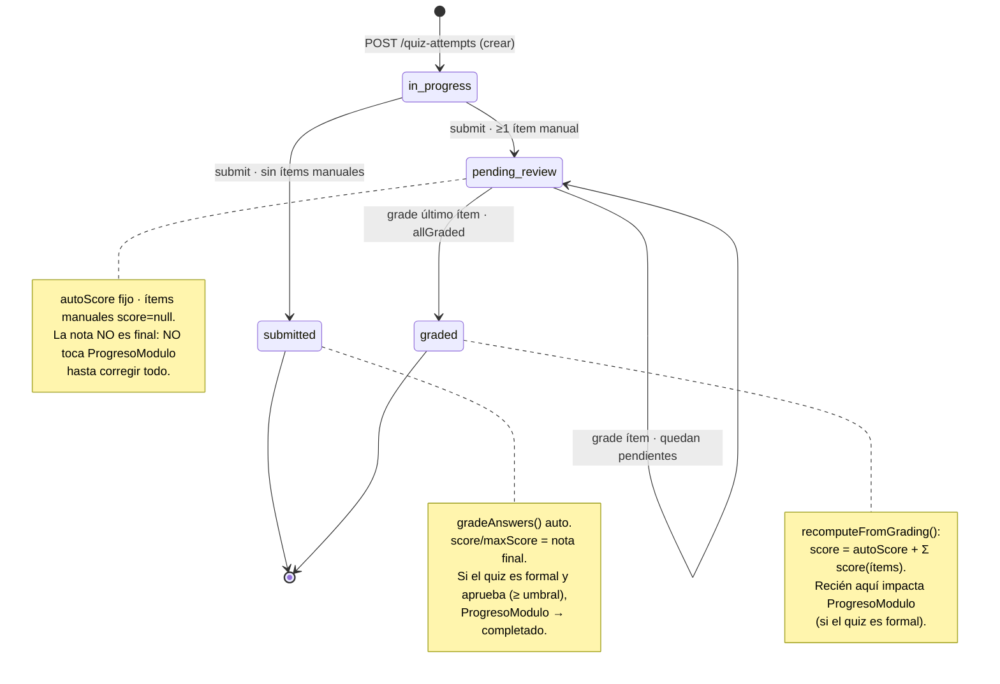
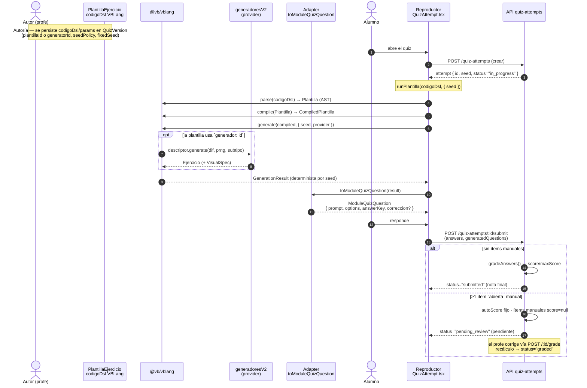
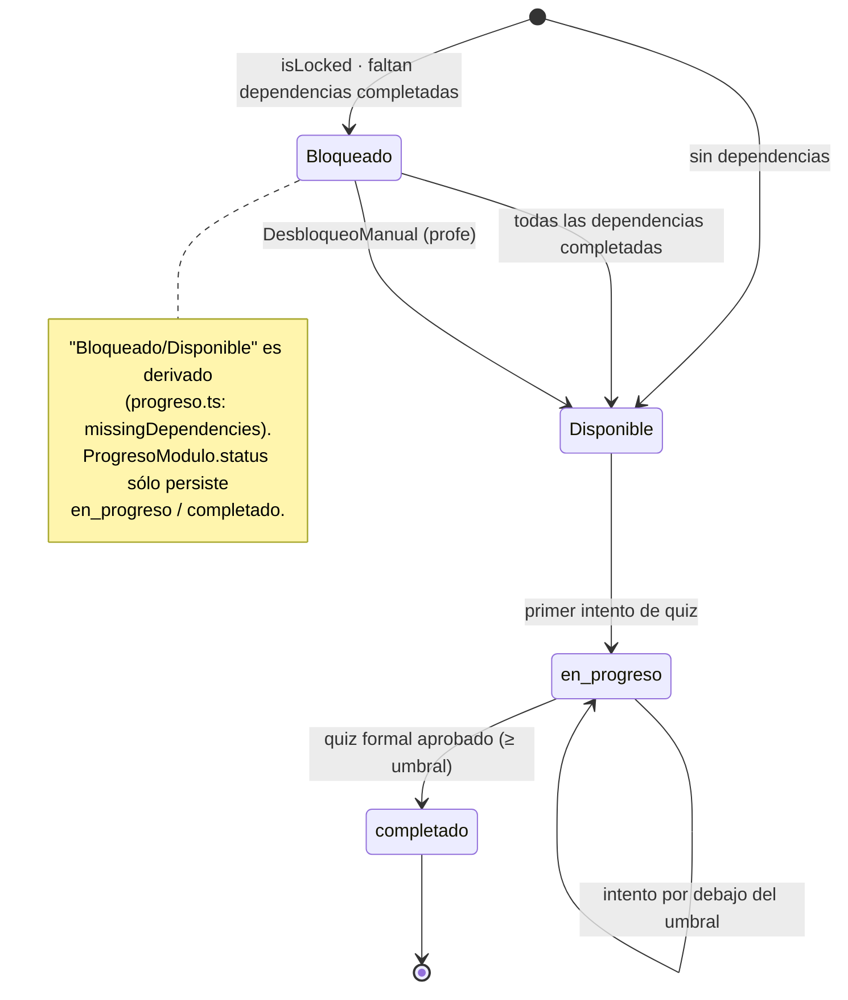
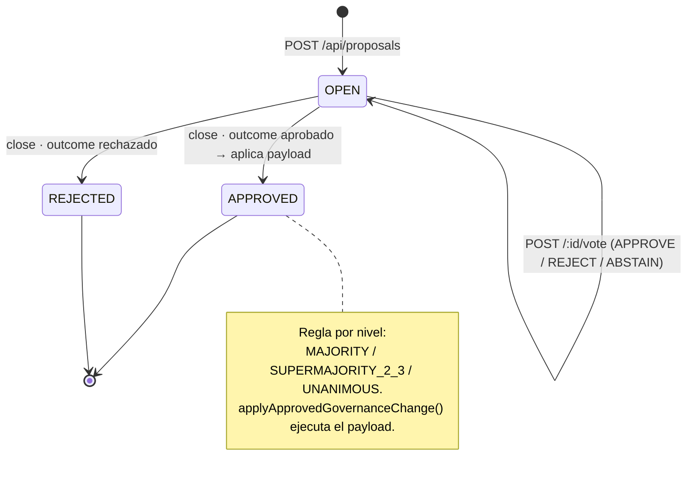

# Diagramas de comportamiento — Backend

| | |
|---|---|
| **Versión** | 1.0 |
| **Estado** | Vigente |
| **Audiencia** | Backend, full-stack, tesis |
| **Última actualización** | 2026-06-02 (§4 desactualizada desde 2026-07-14, ver nota ahí) |
| **Fuente de verdad** | `api/src/routes/quiz-attempts.ts`, `packages/vblang/`, `apps/web/src/vblang/`, `api/src/routes/progreso.ts` — ⚠️ `api/src/routes/governance.ts` **ya no existe** (retirado, ver §4) |

> Complementa al [modelo de datos](./modelo-de-datos.md) (ER estructural) con los
> **diagramas de comportamiento** del sistema: la máquina de estados del intento de quiz
> (incluida la corrección manual de WO07) y el pipeline de generación de ejercicios
> VBLang/generadoresV2. Todos los diagramas se derivan directamente del código citado.

---

## 1. Máquina de estados de `QuizAttempt`

El campo `QuizAttempt.status` toma **cuatro valores literales** exactos definidos en
`api/src/routes/quiz-attempts.ts`:

| Estado | Literal | Significado | Origen |
|---|---|---|---|
| En curso | `"in_progress"` | El alumno tiene el intento abierto. | `quiz-attempts.ts:484` (creación) |
| Enviado | `"submitted"` | Enviado y auto-corregido; **nota final** (sin ítems manuales). | `quiz-attempts.ts:713` |
| Pendiente de corrección | `"pending_review"` | Enviado con ≥1 ítem `abierta`/`manual`; la nota **no** es final. | `quiz-attempts.ts:713` |
| Corregido | `"graded"` | El profe corrigió todos los ítems manuales. | `quiz-attempts.ts:924` |

La nota se recalcula como `score = autoScore + Σ score(ítems manuales)`
(`recomputeFromGrading`, `quiz-attempts.ts:815-826`). El `maxScore` se fija al enviar y no
cambia con la corrección parcial; los ítems informativos (`correccion: "ninguna"`) se excluyen
del `maxScore`.

**Flujo de corrección manual (WO07).** Cada ítem `abierta` con `correccion: "manual"` (o
`manualGrading: true`) queda con `score: null` al enviar. El profe (rol staff) corrige **un
ítem por request** vía `POST /api/quiz-attempts/:id/grade` con `{ questionId, score, feedback? }`
(`quiz-attempts.ts:883-981`). El puntaje se acota a `[0, item.points]`, se recalcula la nota y,
cuando ya no quedan ítems pendientes (`allGraded`), el intento pasa a `"graded"` y recién
entonces impacta `ProgresoModulo` si el quiz es formal.

---

## 2. Pipeline de generación de ejercicios (VBLang / generadoresV2)

Es el flujo más complejo del sistema. Una `PlantillaEjercicio` (código DSL VBLang) o un
generador paramétrico de `generadoresV2` se transforma, de forma **determinista por seed**, en
una `ModuleQuizQuestion` que consume el reproductor, hasta llegar a la corrección.

Orquestador de referencia: `apps/web/src/vblang/runPlantilla.ts` (`parse → compile → generate →
toModuleQuizQuestion`). El reproductor es `apps/web/src/pages/quizzes/QuizAttempt.tsx`.

**Notas del pipeline.**

- **`parse` → `compile` → `generate` → `toModuleQuizQuestion`** son las funciones públicas de
  `@vb/vblang` (`packages/vblang/src/index.ts`). `compile` produce `CompiledPlantilla`
  (`runtime/types.ts:15`) y `generate` produce `GenerationResult` (`runtime/types.ts:59`)
  con `seed` e `intentos` para trazabilidad.
- **Determinismo:** la misma `seed` produce siempre el mismo ejercicio (PRNG LCG seedable,
  `runtime/prng.ts`). La seed del intento la fija el servidor al crear el `QuizAttempt` según
  `seedPolicy`/`fixedSeed` de la `QuizVersion`.
- **Provider:** si la plantilla referencia `generador: <id>`, `generate()` delega en un
  `GeneradorAsistidoProvider` que resuelve el descriptor de `generadoresV2`
  (`apps/web/src/vblang/provider.ts`); en caso contrario el provider se ignora.
- **Adapter:** `ModuleQuizQuestion` (`packages/vblang/src/adapters/module-quiz-question.ts`)
  es el shape canónico que consume el reproductor. La marca de opción correcta **no** viaja en
  `options`; se identifica por igualdad de string contra `answerKey`. Las preguntas `abierta`
  llevan `correccion` (`"ninguna"`/`"manual"`) y `manualGrading`.
- **Corrección:** la auto-corrección compara respuestas contra `answerKey` (con tolerancia
  relativa para numéricos) en `gradeAnswers` (`quiz-attempts.ts:280-331`); los ítems `manual`
  los corrige el profe (ver §1).

---

## 3. (Opcional) Desbloqueo de módulos

Un módulo está **bloqueado** mientras alguna de sus dependencias no esté `completado`. El
cálculo es derivado (`api/src/routes/progreso.ts:198-206`, `missingDependencies`): no se
persiste un estado "bloqueado". Lo que sí persiste `ProgresoModulo.status` es `en_progreso` /
`completado` (ausencia = no iniciado). Un `DesbloqueoManual` del profe abre el módulo aunque
falten dependencias.

---

## 4. (Opcional) Flujo de votación de governance ⚠️ RETIRADO

> **Este flujo ya no existe.** Gobernanza se retiró por completo del producto (commit `be9873ae`,
> 2026-07-14, decisión del usuario): se dropearon las tablas `proposals`/`votes`, se borró
> `api/src/lib/governance.ts` y el router `api/src/routes/governance.ts`. El diagrama de abajo
> queda como **registro histórico** de un flujo que existió — no describe el sistema actual. Ver
> [`modelo-de-datos.md#6-moderación-y-auditoría`](./modelo-de-datos.md#6-moderación-y-auditoría).

Una `Proposal` nace `OPEN`, acumula `Vote` (APPROVE/REJECT/ABSTAIN) y, al cerrarse, se evalúa
contra la regla del nivel (`MAJORITY` / `SUPERMAJORITY_2_3` / `UNANIMOUS`,
`evaluateProposalOutcome`). Si el resultado aprueba, `applyApprovedGovernanceChange` ejecuta el
`payload` y la propuesta queda `APPROVED`; en caso contrario `REJECTED`
(`api/src/routes/governance.ts:114-294`).

---

## Archivos fuente documentados

- `api/src/routes/quiz-attempts.ts` — máquina de estados del intento, auto-corrección y
  corrección manual (WO07).
- `packages/vblang/` — DSL VBLang: `parse`/`compile`/`generate`/`toModuleQuizQuestion`,
  `ModuleQuizQuestion`, PRNG determinista.
- `apps/web/src/vblang/runPlantilla.ts` — orquestador end-to-end del pipeline.
- `apps/web/src/pages/quizzes/QuizAttempt.tsx` — reproductor del intento.
- `api/src/routes/progreso.ts` — desbloqueo de módulos por dependencias.
- `api/src/routes/governance.ts` — ciclo de vida de propuestas y votación.
