# Modelo de datos — Backend

| | |
|---|---|
| **Versión** | 1.1 |
| **Estado** | Vigente |
| **Audiencia** | Backend, full-stack, data |
| **Última actualización** | 2026-07-18 — fusión con `documentacion V2/docs/`: conteo actualizado, gobernanza retirada (§6 reescrita), cobros/pasarelas expandidos (§7), y nuevos §11 (asistencia/períodos), §12 (cuenta espejo), §13 (formulas/push tokens). El detalle de 2026-07-08 (`Material`/`MaterialVersion`, `Quiz` standalone) sigue vigente sin cambios. |
| **Fuente de verdad** | `api/prisma/schema.prisma` (**101 modelos**) |

> Este documento se deriva directamente de `api/prisma/schema.prisma`. Reemplaza al
> inventario de la era MongoDB/SQLite, archivado en
> [`docs/archive/db-inventory.md`](../archive/db-inventory.md) y
> [`docs/archive/sqlite-modeling-decisions.md`](../archive/sqlite-modeling-decisions.md).

> **Diagramas de comportamiento.** Este doc cubre la estructura (ER). La máquina de estados del
> intento de quiz (con la corrección manual de WO07), el pipeline de generación de ejercicios
> VBLang/generadoresV2 y el desbloqueo de módulos están en
> [`diagramas-comportamiento.md`](./diagramas-comportamiento.md) — su §4 (votación de governance)
> describe un flujo **retirado** (ver §6 de este documento), pendiente de limpieza en ese archivo.

## Conceptos generales

- **Motor:** PostgreSQL. El cliente Prisma usa el driver adapter `@prisma/adapter-pg`
  (`@prisma/client` 7.7). Datasource `provider = "postgresql"` (`schema.prisma:5-7`).
- **IDs:** la mayoría de los modelos usan `id String @id` provisto por la app (ObjectId-like
  heredado de la migración desde Mongo). Algunos modelos más nuevos usan `@default(uuid())`
  (p. ej. `ProgresoModulo`, `EconomiaSaldo`, `Tarea`, los modelos `Enterprise*`).
- **Timestamps:** se almacenan como `String` (ISO-8601) — no como `DateTime`. Casi todos los
  modelos llevan `createdAt`/`updatedAt` mapeados a `created_at`/`updated_at`.
- **Soft-delete:** varios modelos exponen `isDeleted` (`is_deleted`) y campos `deletedAt`/
  `deletedBy` en lugar de borrado físico.
- **Naming:** los campos de la app son camelCase y se mapean a snake_case en la tabla con
  `@map(...)`; el nombre de tabla se fija con `@@map(...)`.
- **Payloads JSON-en-String:** un grupo de modelos guarda el documento completo en una columna
  `json String` (herencia directa de la migración desde colecciones Mongo). Se señalan abajo.

### Dominios

| Dominio | Modelos | ¿Relaciones FK en Prisma? |
|---|---|---|
| Auth / usuarios / membresías | `Usuario` (🆕 `roles String[]`, `tipoCuenta`), `Membresia`, **`CuentaVinculada`** 🆕 | Sí |
| Escuela / aula | `Escuela` (🆕 `comisionPct`, `comisionPctIntl`, `saldoInicialAlumno`, `branding`), `Clase`, `ClaseMiembro`, `ClaseModulo`, **`ModuloInvitacion`** 🆕, `ClasePublicacion`, `ModoAula`, `ActividadAula`, `CalendarioEscuela` (🆕 `aulaId` nullable), **`Asistencia`** 🆕, **`ClasePeriodo`** 🆕, `AuditoriaAula`, `LimiteEscuela`, `Transferencia` | Parcial |
| Libros / módulos / pages / progreso | `Modulo` (🆕 `subject`, `theoryItems`, `level`, `category`, `durationMinutes`, `scoringConfig`, `clonedFrom*`, `descatalogado`), `TeoriaJson`, `TuesdayDoc`, `LibroJson`, `BloqueJson`, `Libro`, `Page`, `Materia`, `ConfigModulo`, `ProgresoModulo`, `ProgresoModuloVinculo`, `ResourceLink`, `Tarea`, `Entrega`, `Publicacion`, `Comentario` | Parcial |
| Quiz / banco / generadores | `Quiz`, `QuizVersion`, `QuizQuestionSet`, `QuizAttempt`, `QuizUmbral`, `QuizCompetencia`, `DesbloqueoManual`, `GeneratorConfig`, `GeneratorChangelog`, `GeneradorAdmin` | Sí |
| Economía / ledger / tienda | `EconomiaConfig`, `SaldoUsuario`, `LedgerMovimiento`, `EconomiaRecompensa`, `EconomiaModulo`, `EconomiaEvento`, `EconomiaRiesgoCurso`, `EconomiaSaldo`, `EconomiaTransaccion`, `EconomiaExamen`, `EconomiaExamenPuja`, `EconomiaExamenPunto`, `EconomiaIntercambio`, `EconomiaCompra`, `EconomiaAuditoria`, `Billetera`, `PlazoFijo`, `FciPosicion`, `TiendaItem`, `UsuarioItem` | Parcial |
| Moderación / auditoría | `Prompt`, `Suggestion`, `ModeracionEvento`, `AuditLog` — ⚠️ `Proposal`/`Vote` **eliminadas** (gobernanza retirada, ver §6) | Parcial |
| **Cobros / pasarelas (dinero real)** 🆕 | **`CobroEscuela`**, **`CuotaAlumno`**, **`Pago`**, **`EscuelaPasarela`** | Sí |
| Pagos legacy / suscripciones / enterprise | `Suscripcion` *(legacy, sólo lectura)*, `HistorialPago` *(legacy)*, `TransaccionEscuela`, `LiquidacionEscuela`, `EventoSuscripcion`, `EnterpriseContrato`, `EnterpriseBillingCycle`, `EnterpriseReporte` | Parcial |
| Comunicación / encuestas / familias | `Encuesta`, `EncuestaRespuesta`, `Aviso`, `AvisoLeido`, `Hilo`, `MensajeDirecto`, `Conversacion`, `MensajeItem`, `ForoRespuesta`, `EventoReportePadre`, `Acceso` | Parcial |
| Sincronización offline / mobile | `SyncQueue`, `SyncSnapshot`, `SyncConflicto`, **`PushToken`** 🆕 | No |
| VBLang — plantillas, fórmulas y datasets | `PlantillaEjercicio`, `PlantillaEjercicioVersion`, `VblangDataset` (🆕 `sourceUrl`), `VblangDatasetFila`, **`Formula`** 🆕 | Sí |

> **Maps y diccionarios** no tienen modelos Prisma: se sirven desde SQLite de solo lectura y
> archivos del filesystem (`SQLITE_PATH`, `CONTENT_SQLITE_PATH`, `api/src/maps/`,
> `api/src/diccionarios/`). Ver la sección de API en
> [`api-reference.md`](./api-reference.md#dominio-mapas-diccionarios-y-contenido-público).

---

## 1. Auth, usuarios y membresías

| Modelo | Tabla | Propósito |
|---|---|---|
| `Usuario` | `usuarios` | Cuenta global con rol del sistema, escuela opcional, hash de password y banderas de privacidad/baneo. |
| `Membresia` | `membresias` | Pertenencia de un usuario a una escuela con rol escolar y estado (PK compuesta `usuarioId+escuelaId`). |

**Campos clave `Usuario`:** `id`, `username @unique`, `email @unique`, `fullName`, `role`,
`escuelaId?`, `passwordHash?`, `birthdate?`, `guestOnboardingStatus?`, `privacyConsent?`,
`termsAccepted?`, `consentedAt?`, `isDeleted`, `passwordResetRequired`, `isBanned`, `warningCount`,
`createdAt`, `updatedAt`. Relaciones: `escuela?` (FK a `Escuela`), `membresias[]`.

**Campos clave `Membresia`:** `usuarioId`, `escuelaId`, `rol`, `estado`, `fechaAlta`, `fechaBaja?`.
PK compuesta `@@id([usuarioId, escuelaId])`. FKs a `Usuario` y `Escuela`.

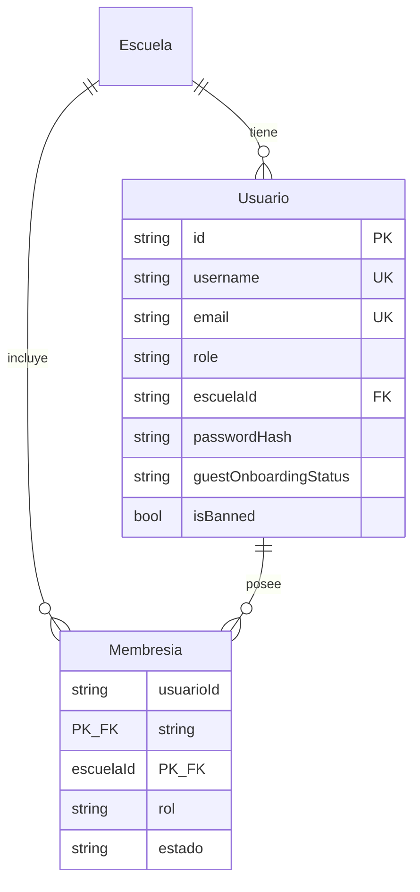

> El detalle de roles (ADMIN/DIRECTIVO/TEACHER/USER/PARENT/GUEST), **multirol** (`roles: String[]`,
> MULTIROL-01) y el onboarding de GUEST está en [`auth-y-roles.md`](./auth-y-roles.md).

### 1.1 Cuentas vinculadas (cuenta espejo) 🆕

| Modelo | Tabla | Propósito |
|---|---|---|
| `CuentaVinculada` | `cuentas_vinculadas` | Puente **simétrico** entre dos cuentas de la **misma persona**. Usado para que un staff (ADMIN/DIRECTIVO/TEACHER) tenga su cuenta espejo de alumno y entre a la app como estudiante sin perder su identidad de staff; la misma tabla se reutiliza para que un alumno se genere una cuenta de padre. |

**Diseño:** `usuarioAId`/`usuarioBId` son equivalentes (no hay principal ni espejo codificados en
columnas) — la app inserta siempre con `min(a,b), max(a,b)` para que `@@unique([usuarioAId,
usuarioBId])` funcione sin importar el orden. El espejo se identifica por `Usuario.tipoCuenta =
"ESPEJO_ALUMNO"` (no por una columna acá). `onDelete: Cascade` en ambas FKs. **No usar para
padre↔hijo** (eso es `ProgresoModuloVinculo` — personas distintas, sin switch).

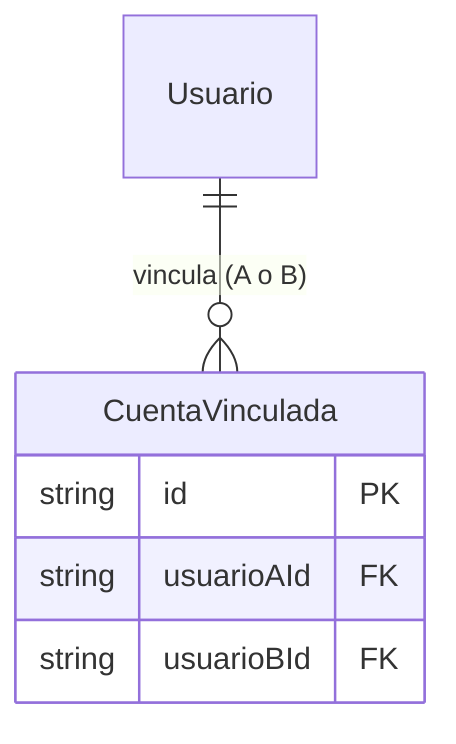

---

## 2. Escuela y aula

| Modelo | Tabla | Propósito |
|---|---|---|
| `Escuela` | `escuelas` | Institución; estado de suscripción, plan y modelo de comisión (Fase 5.1). |
| `Clase` | `clases` | Aula de una escuela, con grado, código de unión y docente de registro. |
| `ClaseMiembro` | `clase_miembros` | Pertenencia a un aula con rol en la clase (PK `claseId+usuarioId+rolEnClase`). |
| `ClaseModulo` | `clase_modulos` | Asignación de un módulo a un aula (`required`). |
| `ClasePublicacion` | `clase_publicaciones` | Publicación del feed de un aula (variante con FK a `Clase`). |
| `ModoAula` | `modo_aula` | Activa "modo aula" con restricciones (p. ej. `tienda,economia`). |
| `ActividadAula` | `actividades_aula` | Evento del calendario del aula (clase/evaluación/evento). |
| `CalendarioEscuela` | `calendario_escuela` | Evento del calendario a nivel escuela. |
| `AuditoriaAula` | `auditoria_aulas` | Bitácora de cambios de estado/borrado de un aula. |
| `LimiteEscuela` | `limites_escuela` | Cupos por escuela (profesores, directivos, aulas, alumnos/aula). |
| `Transferencia` | `transferencias` | Traslado de un estudiante entre escuelas. |

**Campos clave `Escuela`:** `id`, `name`, `code? @unique`, `address?`, `subscriptionStatus?`,
`plan?`, `isDeleted`, `comisionPct?` (doméstico/MercadoPago, 5-7%), `comisionPctIntl?`
(internacional/Cryptomus, 1-2%). Sistema siempre autogestionado — no existe modo "centralizado".
Relaciones: `usuarios[]`, `membresias[]`, `clases[]`, `transacciones[]`, `liquidaciones[]`.

**Campos clave `Clase`:** `id`, `escuelaId` (FK), `name`, `grade`, `code?`, `classCode?`,
`isDeleted`, `status @default("ACTIVE")`, `createdBy?`, `teacherId?`, `teacherOfRecord?`,
`deletedAt?`, `deletedBy?`. Relaciones: `escuela`, `miembros[]`, `modulos[]`, `publicaciones[]`.

```mermaid
erDiagram
    Escuela ||--o{ Clase : "contiene"
    Escuela ||--|| LimiteEscuela : "limita"
    Clase ||--o{ ClaseMiembro : "miembros"
    Clase ||--o{ ClaseModulo : "asigna"
    Clase ||--o{ ClasePublicacion : "feed"
    Clase ||--o| ModoAula : "modo"
    Clase ||--o{ AuditoriaAula : "auditoría"
    Clase {
        string id PK
        string escuelaId FK
        string name
        string grade
        string status
        string classCode
        string teacherId
    }
    ClaseMiembro {
        string claseId PK_FK
        string usuarioId PK
        string rolEnClase PK
    }
    ClaseModulo {
        string claseId PK_FK
        string moduloId PK
        bool required
    }
```

> Nota: `ClaseMiembro`, `ClaseModulo` y `ClasePublicacion` declaran FK a `Clase`. `ModoAula`,
> `ActividadAula`, `CalendarioEscuela`, `AuditoriaAula` y `Transferencia` referencian aulas/
> escuelas por id pero **sin** FK declarada en Prisma.

### 2.1 Asistencia y períodos académicos 🆕 (julio 2026)

| Modelo | Tabla | Propósito |
|---|---|---|
| `Asistencia` | `asistencias` | Registro por `[claseId, alumnoId, fecha]` (`@@unique`). `estado` ∈ presente\|ausente\|tarde\|justificado (validado en zod, no en DB). Antes de esta migración `GET /api/profesor/asistencia` devolvía `[]` hardcodeado — "la colección no existe aún en Prisma". |
| `ClasePeriodo` | `clase_periodos` | Períodos académicos **declarados en el aula** (nunca un motor de calendario global): lista libre y ordenada de `{nombre, desde, hasta}` por docente. "2 semestres + verano" son 3 filas; anual es 1. `desde`/`hasta` son `String` ISO (`yyyy-mm-dd`), comparación lexicográfica. Insumo directo del boletín (§7.1). |
| `ModuloInvitacion` | `modulo_invitaciones` | Invitación individual a un módulo **descatalogado** (`Modulo.descatalogado`). Espejo deliberado de `ClaseModulo` (join-table liviana, sin relación Prisma a `Modulo`/`Usuario`). Un alumno invitado ve el módulo aunque esté fuera de los listados generales. |

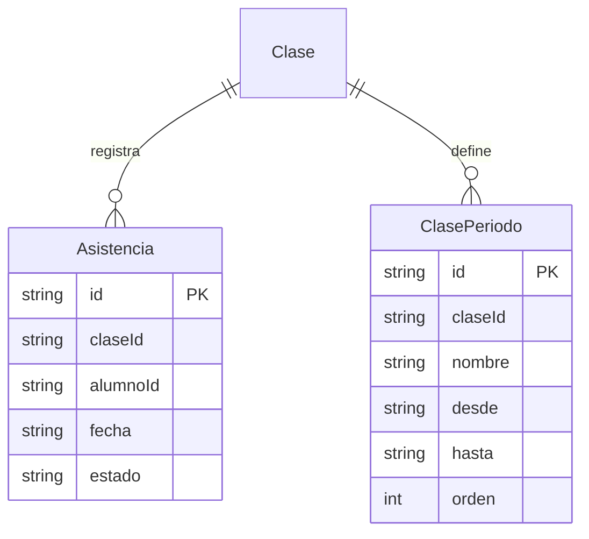

---

## 3. Libros, módulos, pages y progreso

| Modelo | Tabla | Propósito |
|---|---|---|
| `Modulo` | `modulos` | Unidad de contenido; visibilidad, dueño, vínculos a teoría/libro/quiz. |
| `TeoriaJson` | `teoria_json` | Documento de teoría versionado (relación con `Modulo`). |
| `TuesdayDoc` | `tuesdayjs_docs` | Documento "TuesdayJS" versionado. |
| `LibroJson` | `libros_json` | **Muerto** — esquema de un diseño de persistencia anterior; ningún código de `api/src` ni `apps/web/src` lo lee/escribe hoy (confirmado por grep). No usar como referencia. |
| `BloqueJson` | `bloques_json` | Mismo estado que `LibroJson` — sin consumidores confirmados. |
| `Libro` | `libros` | **El libro real y vivo** (`json` = `Book` serializado) + scoping (`ownerUserId`, `schoolId`, `visibility`) y provenance de clonado. Ver [`../book-editor.md`](../book-editor.md#guardado-y-scoping-backend). |
| `Page` | `pages` | Página simple con `title`/`content`. |
| `Materia` | `materias` | Materia como blob `json`. |
| `Material` | `materiales_guardados` | "Guardar como material" genérico (mapa/timeline/interactivo/presentación) usado por varios editores — no confundir con `Modulo` ni `Libro`. Ver detalle abajo. |
| `MaterialVersion` | `material_versions` | Historial de versiones de un `Material` (append-only, mismo patrón que `Quiz`/`QuizVersion`). |
| `ConfigModulo` | `config_modulos` | **No es config de un módulo individual**: catálogo global editable por ADMIN (`items: String[]` como JSON), p. ej. la lista de materias/categorías disponibles en los editores (`GET/PUT /api/config/materias`, `/api/config/categorias`). |
| `ProgresoModulo` | `progreso_modulos` | Progreso de un usuario en un módulo dentro de un aula. |
| `ProgresoModuloVinculo` | `vinculos_padre_hijo` | **A pesar del nombre**, es el vínculo padre↔hijo (cuentas PARENT↔alumno) y sus permisos — no progreso de módulo. |
| `ResourceLink` | `resource_links` | Enlace de recurso asociado a aula/escuela con visibilidad. |
| `Tarea` | `tareas` | Tarea como blob `json` (aula/escuela opcional). |
| `Entrega` | `entregas` | Entrega como blob `json`. |
| `Publicacion` | `publicaciones` | Publicación del feed de aula (variante sin FK). |
| `Comentario` | `comentarios` | Comentario sobre una publicación (blob `json`). |

**Campos clave `Modulo`:** `id`, `slug? @unique`, `titulo`, `descripcion?`, `subject?`, `level?`,
`category?`, `durationMinutes?`, `theoryItems?: String` (JSON de teoría embebida — ver
[`../modulos.md`](../modulos.md#theoryitems), no confundir con `teoriaId`, modelo viejo por
referencia), `scoringConfig?: String` (escala de notas), `visibility @default("private")` (valores
reales usados por el código: `"privado"|"escuela"|"publico"`, el default de columna en inglés es
residual), `schoolId?`, `ownerUserId?`, `teoriaId?` (FK a `TeoriaJson`), `tuesdayDocId?`, `libroId?`
(ambos ids libres, no `@relation` de Prisma), `defaultQuestionCount?`, `dependencies?: String` (JSON
`{id, type:"required"|"unlocks"}[]` — sólo `"required"` se consume hoy, ver
[`../modulos.md`](../modulos.md#dependencias)), `isDeleted`. Relaciones: `teoria?`, `quizzes[]`.
**No tiene** columna `status` (el schema Zod de la API sí declara un `status` `ACTIVE`/`ARCHIVED`,
pero no se persiste — no hay ciclo de vida publicado/borrador implementado) ni columna `aulaId` (la
relación módulo↔aula es la tabla `ClaseModulo`, no una FK directa acá).

### Material / MaterialVersion — "guardar como material"

Sistema de persistencia genérico usado por varios editores (mapas, bloques, libros vía el listado
combinado) para guardar contenido reusable fuera de un módulo. `Material`: `id, tipo` (String libre
∈ `"mapa"|"timeline"|"interactivo"|"presentacion"`, mismo patrón sin-enum-Prisma que
`Modulo.visibility`), `titulo, ownerUserId, schoolId?, visibility @default("privado")`,
`currentVersionId?`, `isDeleted`. `MaterialVersion`: `id, materialId, versionNumber, schemaVersion
@default(1), contenido: String` (el JSON según `tipo`), `contentHash?, createdBy?`.
`@@unique([materialId, versionNumber])`. Cada guardado posterior **crea una versión nueva, nunca
sobrescribe la anterior** (histórico real) — pero hoy no hay ninguna ruta que liste/lea versiones
viejas, sólo la actual (`GET /api/materiales/guardados/:id`). **Sin relación con `Modulo`**: no existe
`moduleId` en `Material` ni ningún flujo "usar en módulo" para materiales (a diferencia de `Quiz`, que
sí tiene `usar-en-modulo`).

**Campos clave `ProgresoModulo`:** `id @default(uuid())`, `usuarioId`, `moduloId`, `aulaId?`,
`status`, `score?`, `attempts @default(0)`, `completedAt?`, `updatedAt`.
`@@unique([usuarioId, moduloId, aulaId])`, `@@index([usuarioId, aulaId])`.

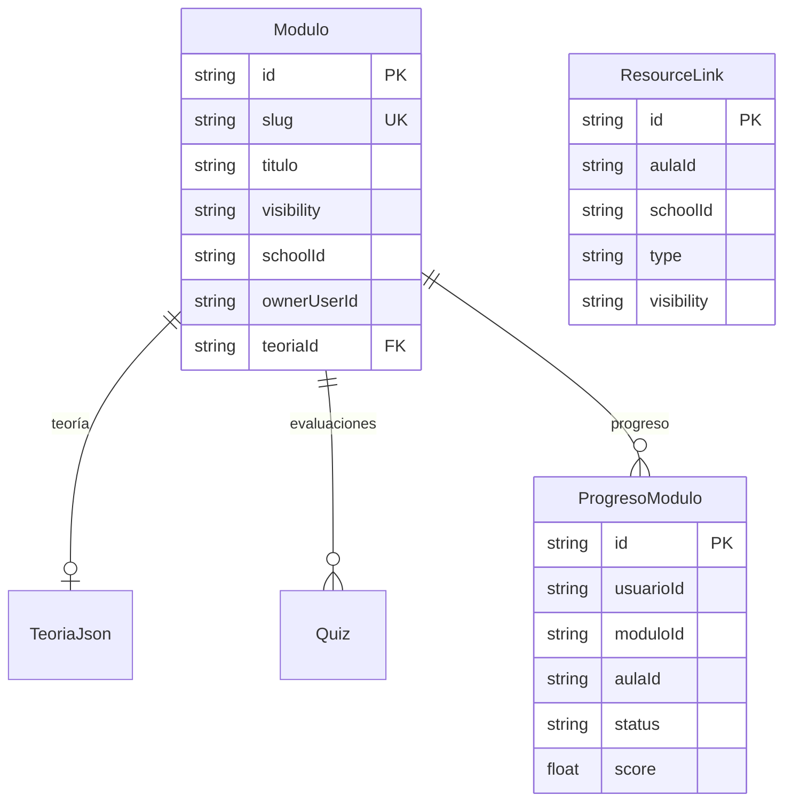

### 3.1 Tareas y entregas (dominio sin FK)

`Tarea` y `Entrega` se guardan como blobs `json` (herencia de la migración desde Mongo): el
documento completo vive en la columna `json String`. `Tarea` expone además las columnas reales
`aulaId`/`schoolId` (sin FK declarada); `Entrega` sólo lleva `id`, `json` y `createdAt`
(`api/prisma/schema.prisma`, modelos `Tarea` y `Entrega`). Las relaciones son **lógicas** (por
id dentro del JSON), no FK de Prisma. El handler `api/src/routes/tareas.ts` filtra por
`usuarioId`/`studentId`/`assignedTo`/`assignees` y lee `titulo`/`title`, `dueDate`/`vence`,
`curso`/`courseName`, `isDeleted` del blob.

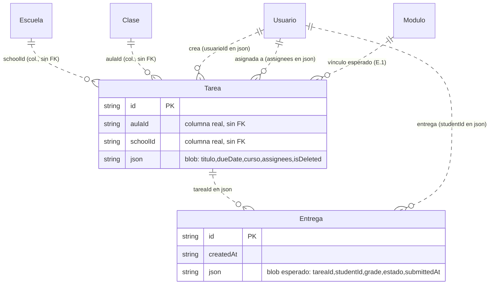

> El blob de `Entrega` no tiene aún un handler que valide su forma (las estadísticas devuelven
> `entregas = 0` hasta tener el modelo, `api/src/routes/estadisticas.ts`). El gap de tipar
> `Tarea`/`Entrega` (hoy `{ id, json }`) está registrado en el apéndice E.1 del plan; el ER de
> arriba documenta la relación **esperada** entre los dominios mientras tanto.

---

## 4. Quiz, banco y generadores

| Modelo | Tabla | Propósito |
|---|---|---|
| `Quiz` | `quizzes` | Evaluación; apunta a la versión activa. `moduleId?` es **nullable** desde PLAN-CORRECCIONES C2 (migración `20260703180000_quiz_standalone`): un quiz puede vivir "suelto" sin módulo, con `ownerUserId?` como dueño mientras tanto (ver [`../modulos.md`](../modulos.md#quiz--quizversion-post-c2)). |
| `QuizVersion` | `quiz_versions` | Versión inmutable de un quiz (preguntas o generador + params). |
| `QuizQuestionSet` | `quiz_question_sets` | Conjunto de preguntas reutilizable (deduplicado por `contentHash`). |
| `QuizAttempt` | `quiz_attempts` | Intento de un usuario sobre una versión de quiz. |
| `QuizUmbral` | `quiz_umbrales` | Umbral de aprobación por quiz (`umbral @default(60)`). |
| `QuizCompetencia` | `quiz_competencia` | Resultado competitivo (score, tiempo) por intento. |
| `DesbloqueoManual` | `desbloqueos_manuales` | Desbloqueo manual de un módulo a un usuario en un aula. |
| `GeneratorConfig` | `generator_configs` | Configuración de un generador de ejercicios (subtipos, enunciados, límites). |
| `GeneratorChangelog` | `generator_changelog` | Historial de cambios de un generador (FK a `GeneratorConfig`). |
| `GeneradorAdmin` | `generadores_admin` | Estado admin de un generador por `subject+topic` (`@@unique`). |

**Campos clave `QuizVersion`:** `id`, `quizId` (FK), `versionNumber`, `questionSetId?` (FK),
`questions?`, `generatorId?`, `generatorVersion?`, `params?`, `count?`, `seedPolicy @default(0)`,
`fixedSeed?`, `settings?`, `contentHash?`, `plantillaId?` (FK a `PlantillaEjercicio`, relación
`"PlantillaQuiz"`). `@@unique([quizId, versionNumber])`, `@@index([plantillaId])`.

**Campos clave `QuizAttempt`:** `id`, `quizId` (FK), `quizVersionId` (FK), `userId`, `status`,
`startedAt`, `submittedAt?`, `score?`, `maxScore?`, `answers`, `feedback?`, `grading?`, `seed?`,
`seedPolicy`, `attemptNo?`.

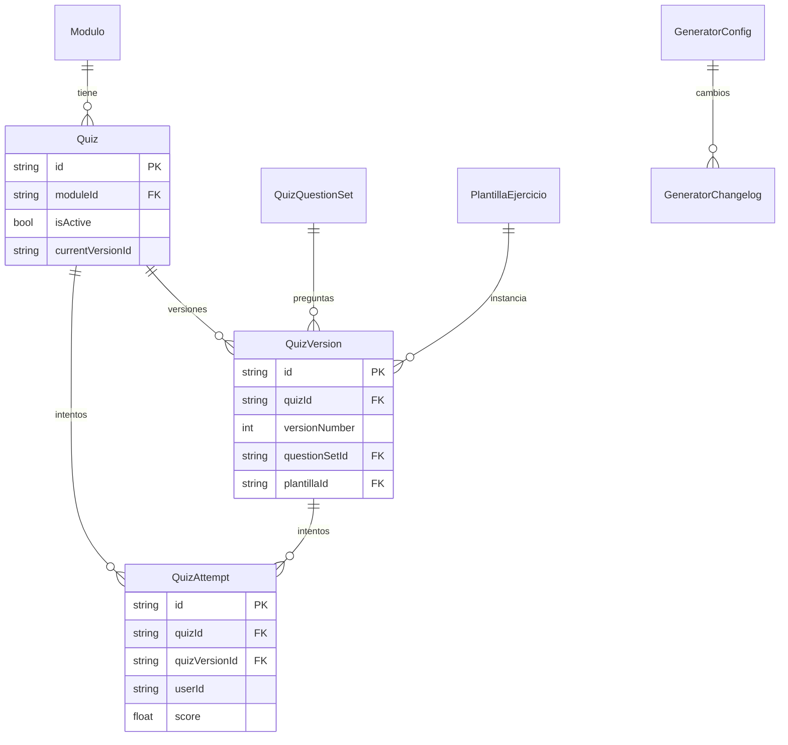

---

## 5. Economía, ledger y tienda

| Modelo | Tabla | Propósito |
|---|---|---|
| `EconomiaConfig` | `economia_config` | Configuración global de economía (blob `json`, id `default`). |
| `SaldoUsuario` | `saldos_usuario` | Saldo por usuario y moneda (PK `usuarioId+moneda`). |
| `LedgerMovimiento` | `ledger_movimientos` | Movimiento contable con tipo, motivo y referencia. |
| `EconomiaRecompensa` | `economia_recompensas` | Recompensa configurable por tipo/referencia. |
| `EconomiaModulo` | `economia_modulos` | Habilitación de economía por módulo. |
| `EconomiaEvento` | `economia_eventos` | Evento económico (tasa, activo). |
| `EconomiaRiesgoCurso` | `economia_riesgo_cursos` | Parámetros de riesgo por aula. |
| `EconomiaSaldo` | `economia_saldos` | Saldo simple por usuario (`usuarioId @unique`). |
| `EconomiaTransaccion` | `economia_transacciones` | Transacción crédito/débito con aula y escuela. |
| `EconomiaExamen` | `economia_examenes` | Examen económico (subasta) como blob `json`. |
| `EconomiaExamenPuja` | `economia_examen_pujas` | Puja sobre un examen (blob `json`). |
| `EconomiaExamenPunto` | `economia_examen_puntos` | Puntos por usuario en exámenes (blob `json`). |
| `EconomiaIntercambio` | `economia_intercambios` | Intercambio entre usuarios (blob `json`). |
| `EconomiaCompra` | `economia_compras` | Compra registrada (blob `json`). |
| `EconomiaAuditoria` | `economia_auditoria` | Auditoría de economía (blob `json`). |
| `Billetera` | `billeteras` | Billetera (blob `json`). |
| `PlazoFijo` | `plazo_fijo` | Instrumento de ahorro a plazo con tasa e interés. |
| `FciPosicion` | `fci_posiciones` | Posición tipo FCI con tasa mensual. |
| `TiendaItem` | `tienda_items` | Ítem comprable (precio, moneda `PF`, asset). |
| `UsuarioItem` | `usuario_items` | Ítem adquirido por un usuario (FK a `TiendaItem`). |

**Campos clave `EconomiaTransaccion`:** `id @default(uuid())`, `usuarioId`, `aulaId`, `schoolId`,
`tipo`, `monto`, `moneda`, `motivo`, `referenciaId?`. `@@index([usuarioId])`.

**Campos clave `LedgerMovimiento`:** `id`, `usuarioId`, `tipo`, `monto`, `moneda`, `motivo`,
`origen?`, `referenciaId?`, `referenciaTipo?`, `createdAt`.

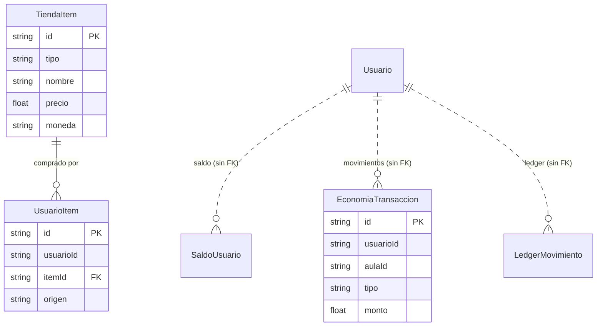

> Solo `UsuarioItem → TiendaItem` tiene FK declarada. El resto de los modelos de economía
> referencian usuarios/aulas por id sin FK (relaciones lógicas, marcadas `||..o{` arriba).

---

## 6. Moderación y auditoría

> ⚠️ **Gobernanza retirada por completo** (commit `be9873ae`, 2026-07-14, decisión del usuario). Los
> modelos `Proposal`/`Vote` de este documento (versión 1.0) **ya no existen** — se dropearon las
> tablas `proposals`/`votes`, se borró `api/src/lib/governance.ts`, el router `governance.ts` y las
> páginas `/gobernanza/*` del frontend. La promoción a `ADMIN` (`PATCH
> /api/admin/usuarios/:id/rol`) mantiene la restricción "sólo el admin principal" **sin** el flag
> `requiresGovernance` que antes ofrecía la alternativa de votación. `Prompt` quedó **write-only**
> (nada lo lee hoy — candidata a limpieza futura, no se borró en el mismo commit por prudencia).

| Modelo | Tabla | Propósito |
|---|---|---|
| `Prompt` | `prompts` | Prompt/plantilla de contenido asociada a un target. **Write-only** desde el retiro de gobernanza. |
| `Suggestion` | `suggestions` | Sugerencia de usuario con flujo de revisión (`status @default("PENDING")`). |
| `ModeracionEvento` | `moderacion_eventos` | Evento de moderación (ban, advertencia, reporte). |
| `AuditLog` | `audit_logs` | Bitácora general de acciones (`actorId`, `action`, `targetType`). |

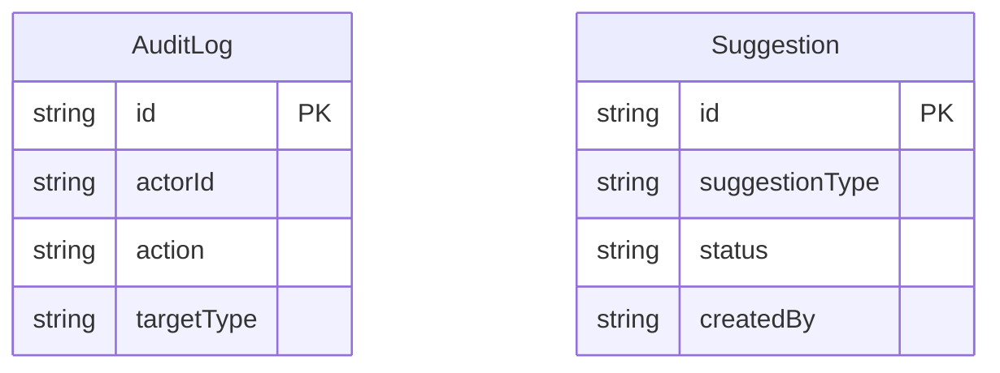

---

## 7. Pagos, suscripciones y enterprise

| Modelo | Tabla | Propósito |
|---|---|---|
| `Suscripcion` | `suscripciones` | Suscripción de una entidad (escuela/usuario) con plan, estado y datos MercadoPago. |
| `HistorialPago` | `historial_pagos` | Pago histórico de una suscripción (FK a `Suscripcion`). |
| `TransaccionEscuela` | `transacciones_escuela` | Cobro de una escuela autogestionada (comisión VB, neto). |
| `LiquidacionEscuela` | `liquidaciones_escuela` | Liquidación periódica del neto a la escuela. |
| `EventoSuscripcion` | `eventos_suscripciones` | Evento de suscripción (blob `json`). |
| `EnterpriseContrato` | `enterprise_contratos` | Contrato enterprise por escuela (blob `json`). |
| `EnterpriseBillingCycle` | `enterprise_billing_cycles` | Ciclo de facturación enterprise (blob `json`). |
| `EnterpriseReporte` | `enterprise_reportes` | Reporte enterprise (blob `json`). |

**Campos clave `Suscripcion`:** `id`, `entidadTipo`, `entidadId`, `plan`, `estado`,
`mpPreapprovalId?`, `mpPayerEmail?`, `periodoInicio`, `periodoFin`, `montoMensual @default(0)`,
`moneda @default("ARS")`, `expansiones @default(0)`, `canceladaAt?`, `reembolsoSolicitado @default(0)`,
`reembolsoAt?`. Relación `pagos[]`.

**Campos clave `TransaccionEscuela`:** `id`, `escuelaId` (FK), `montoTotal`, `comisionVB`,
`montoNeto`, `estado @default("registrada")`, `mpPaymentId?`. `@@index([escuelaId])`.

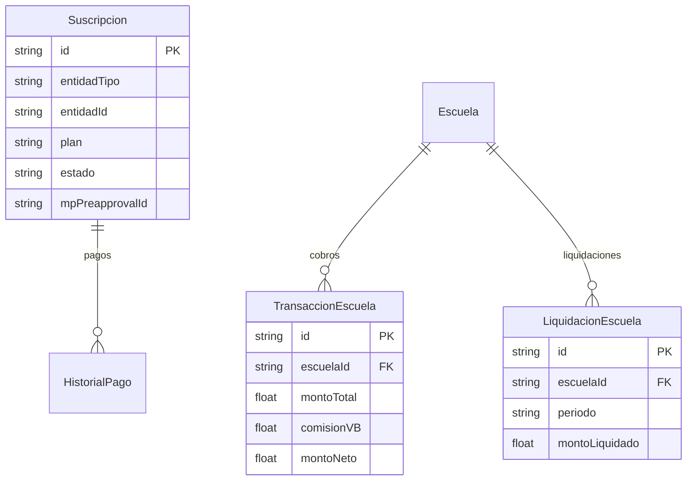

> El nivel de acceso por estado de suscripción (`active`/`read_only`/`disabled`) y la política de
> mora están en [`auth-y-roles.md`](./auth-y-roles.md) y [`../politica-mora.md`](../politica-mora.md).
> El detalle del modelo de comisión (Fase 5.1) está en [`../pagos/`](../pagos/).

### 7.1 Cobros escuela→familias y pasarelas 🆕 (PLAN-B, julio 2026)

| Modelo | Tabla | Propósito |
|---|---|---|
| `CobroEscuela` | `cobros_escuela` | Orden de cobro que crea el directivo/admin (ej. "Cuota julio 2026"). `concepto`, `montoUnitario`, `moneda @default("ARS")`, `estado`: `"borrador"\|"publicado"\|"cerrado"`. Al publicarla se generan las `CuotaAlumno`. |
| `CuotaAlumno` | `cuotas_alumno` | Instancia de un `CobroEscuela` para **un** alumno. `pagadorId` es quién efectivamente paga (típicamente el padre vinculado; puede ser el propio alumno si es adulto). `montoFinal` puede diferir de `cobro.montoUnitario` (becas/descuentos) sin tocar el cobro original. `estado`: `pendiente\|en_proceso\|pagada\|vencida\|anulada`. `@@unique([cobroId, alumnoId])`. |
| `Pago` | `pagos` | Registro de pago genérico por proveedor. `provider`, `providerRef?`, `estado`: `pendiente\|en_proceso\|pagada\|fallida\|anulada`, `montoBruto`, `comisionVB?`, `montoNetoEscuela?`, `raw?` (payload del webhook tal cual, para auditoría). **`@@unique([provider, providerRef])`** — idempotencia: nunca se crea un segundo `Pago` para el mismo pago aunque el proveedor reintente el webhook. |
| `EscuelaPasarela` | `escuelas_pasarelas` | Conexión de una escuela con un provider (`"mercadopago"\|"cryptomus"`). `cuentaConectadaId` es la cuenta **de la escuela** en el provider (nunca la de VB). `credencialesCifradas` guarda el token OAuth/API key cifrado. Cryptomus no tiene split nativo — modo v1, liquidación manual. `@@unique([escuelaId, provider])`. |

**Campos clave `CuotaAlumno`:** `id`, `cobroId` (FK), `alumnoId`, `pagadorId?`, `estado`,
`montoFinal`, `pagoId?` (FK a `Pago`), `createdAt`, `updatedAt`.

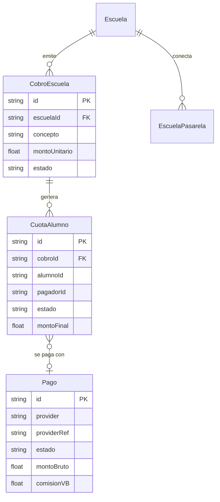

> Endpoints en [`api-reference.md`](./api-reference.md#71-cobros-y-pasarelas-🆕). Modelo de negocio:
> **autogestionado** (decisión 2026-07-05) — VB no maneja el dinero, cada escuela cobra con su
> propia cuenta de pasarela; VB sólo registra/concilia (`TransaccionEscuela`/`LiquidacionEscuela`,
> §7). Comisión VB: 5-7% en pagos domésticos (MercadoPago/Argentina), 1-2% en pagos
> internacionales (Cryptomus) — Stripe se sacó como pasarela. Detalle en
> [`../pagos/comision-roadmap-v2.md`](../pagos/comision-roadmap-v2.md).

---

## 8. Comunicación, encuestas y familias

| Modelo | Tabla | Propósito |
|---|---|---|
| `Encuesta` | `encuestas` | Encuesta de aula (tipo normal/puntuación/segunda vuelta). |
| `EncuestaRespuesta` | `encuestas_respuestas` | Respuesta a una encuesta (FK a `Encuesta`). |
| `Aviso` | `avisos` | Aviso de escuela/aula con destino por rol. |
| `AvisoLeido` | `avisos_leidos` | Marca de lectura de un aviso (PK `avisoId+usuarioId`, FK a `Aviso`). |
| `Hilo` | `hilos` | Hilo de mensajería directa entre dos usuarios de una escuela. |
| `MensajeDirecto` | `mensajes_directos` | Mensaje de un hilo (FK a `Hilo`). |
| `Conversacion` | `conversaciones` | Conversación estudiante↔padre dentro de una clase. |
| `MensajeItem` | `mensajes_items` | Mensaje de una conversación (FK a `Conversacion`). |
| `ForoRespuesta` | `foros_respuestas` | Respuesta de foro (blob `json`). |
| `EventoReportePadre` | `eventos_reportes_padres` | Evento de reporte para padres (blob `json`). |
| `Acceso` | `accesos` | Registro de acceso (blob `json`). |

**Campos clave `Encuesta`:** `id`, `title`, `description`, `classroomId`, `type`, `options`,
`maxOptions?`, `startAt`, `endAt`, `showResultsBeforeClose`, `showResultsRealtime`, `status`,
`responsesCount @default(0)`, `createdBy`. Relación `respuestas[]`.

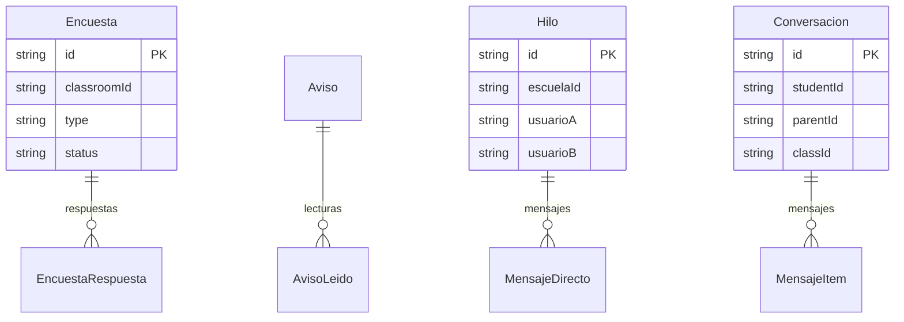

---

## 9. Sincronización offline y mobile

| Modelo | Tabla | Propósito |
|---|---|---|
| `SyncQueue` | `sync_queue` | Cola de operaciones a sincronizar por usuario (reintentos, estado). |
| `SyncSnapshot` | `sync_snapshots` | Último snapshot descargado por usuario/tipo/aula (`@@unique`). |
| `SyncConflicto` | `sync_conflictos` | Conflicto detectado y su resolución (`server_wins` por defecto). |
| **`PushToken`** 🆕 | `push_tokens` | Token de push (Expo) de la app móvil (PLAN-R Parte 5). Un usuario puede tener el token en más de un dispositivo — `@@unique` es sobre el **token**, no sobre `userId` (reinstalar/reloguearse en otro teléfono agrega una fila, no pisa la anterior). El envío real de push (expo-server-sdk) queda para otra sesión; este modelo sólo guarda dónde mandar el push cuando exista ese código. |

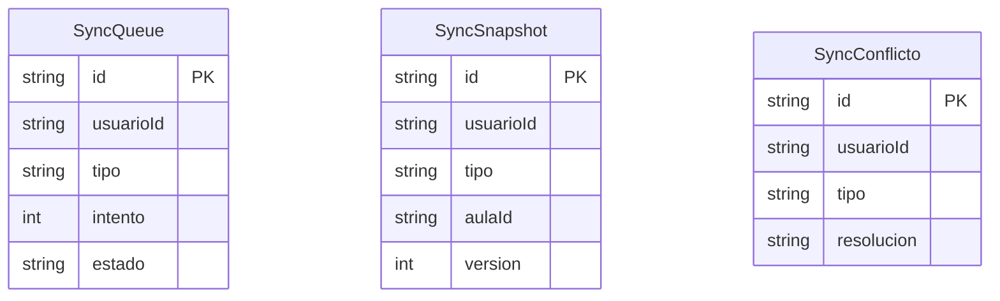

> Ninguno de estos modelos declara FK; se vinculan por `usuarioId`/`aulaId`. Ver el flujo en
> [`api-reference.md`](./api-reference.md#dominio-sincronización-offline).

---

## 10. VBLang — plantillas, fórmulas y datasets

| Modelo | Tabla | Propósito |
|---|---|---|
| `PlantillaEjercicio` | `plantillas_ejercicio` | Plantilla de ejercicio paramétrico (código DSL VBLang) con visibilidad y forks. |
| `PlantillaEjercicioVersion` | `plantillas_ejercicio_versiones` | Versión histórica del código DSL de una plantilla. |
| `VblangDataset` | `vblang_datasets` | Dataset reutilizable por owner (columnas declaradas como JSON). 🆕 `sourceUrl?` (PLAN-E §20): URL externa HTTPS CSV/JSON para refresco manual. |
| `VblangDatasetFila` | `vblang_dataset_filas` | Fila ordenada de un dataset (FK a `VblangDataset`). |
| **`Formula`** 🆕 | `formulas` | Banco compartido de fórmulas (nombre + LaTeX + materia). Mismo scoping que `PlantillaEjercicio`/`VblangDataset` (`"privada"\|"escuela"\|"publica"`); las globales son `publica` con `ownerUserId = "system"`. |

**Campos clave `PlantillaEjercicio`:** `id`, `ownerUserId`, `schoolId?`, `visibility`
(`privada`|`escuela`|`publica`), `nombre`, `descripcion?`, `materia?`, `tags?`, `codigoDsl`,
`version @default(1)`, `basadoEn?` (self-relación `"Fork"`), `publicAprobado @default(false)`,
`isDeleted`. Relaciones: `versiones[]`, `basadaEn?`, `forks[]`, `quizVersions[]`.
Índices: `@@index([ownerUserId])`, `@@index([schoolId, visibility])`,
`@@index([materia, visibility])`, `@@index([visibility, publicAprobado])`.

**Campos clave `VblangDataset`:** `id`, `ownerUserId`, `schoolId?`, `visibility`, `nombre`,
`descripcion?`, `columnas` (JSON), `isDeleted`. `@@unique([ownerUserId, nombre])`,
`@@index([ownerUserId])`, `@@index([schoolId, visibility])`. Relación `filas[]`.

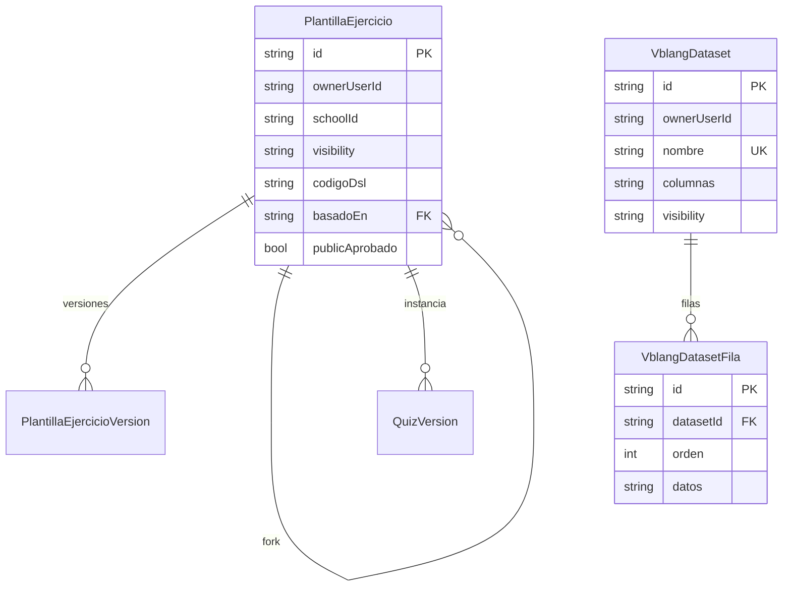

---

## Archivos fuente documentados

- `api/prisma/schema.prisma` — definición de los 101 modelos (única fuente de verdad de este doc).
- `api/prisma/migrations/` — evolución del esquema, **30 migraciones** (ver [`migraciones.md`](./migraciones.md)).
- `api/src/lib/roles.ts`, `cuenta-vinculada.ts` — helpers de multirol y cuenta espejo (§1.1).
- `api/src/lib/boletin.ts` — cálculo puro del boletín sobre `Asistencia`/`ClasePeriodo`/`QuizAttempt` (§2.1).
