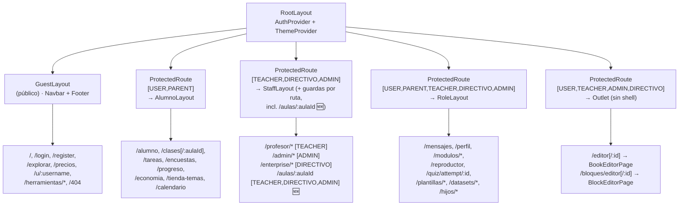

# Frontend — Overview (app shell, routing y capas)

| | |
|---|---|
| **Estado** | Vigente |
| **Audiencia** | Frontend, full-stack |
| **Última actualización** | 2026-07-18 — fusión con `documentacion V2/docs/`: `AlumnoLayout` restringido a `[USER,PARENT]` (FIX-VISTA-PREVIA-STAFF, 2026-07-16 — corrige el árbol de layouts y la tabla de rutas de abajo, que estaban desactualizados), ruta nueva `/aulas/:aulaId` bajo `StaffLayout`, editores V1/V2 de cuestionarios confirmados archivados (reemplazados por Tiza), i18n (§ nueva), multirol y cuenta espejo en el cliente, conteos reales (68 páginas, 29 servicios). El resto de la versión 2026-05-30 sigue vigente. |
| **Fuente de verdad** | `apps/web/src/` (`main.tsx`, `router.tsx`, `layouts/`, `pages/`, `services/`, `domain/`, `auth/`) |

> Documentación derivada del código real de la web (React 19 + Vite 7 + TypeScript). El contrato
> del backend que consume el front está en [`../backend/api-reference.md`](../backend/api-reference.md).
> Documentos hermanos: [`editor-bloques.md`](./editor-bloques.md), [`generadores.md`](./generadores.md),
> [`calculador.md`](./calculador.md).

## Conceptos

La app es una SPA con **React Router** (`createBrowserRouter`). El árbol de rutas está centralizado
en `apps/web/src/router.tsx`; el bootstrap es mínimo (`main.tsx` monta `<RouterProvider>` dentro de
`React.StrictMode`). El acceso se controla por **rol** mediante `ProtectedRoute` y se organiza en
**layouts** (shells) según el público de cada sección. Las páginas hablan con la API a través de la
**capa de servicios** (`services/`), que usa el cliente HTTP compartido `lib/api.ts`. La lógica de
dominio del cliente vive en `domain/`.

### Bootstrap

- `main.tsx` → `ReactDOM.createRoot(...).render(<StrictMode><RouterProvider router={router}/></StrictMode>)`.
- `App.tsx` es un wrapper equivalente (`<RouterProvider router={router} />`) — no es el punto de
  entrada usado por `main.tsx`.
- Carga diferida: casi todas las páginas se importan con `lazyWithRetry(() => import(...))`
  (`lib/lazyWithRetry`) y se envuelven en `withSuspense` (`<RouteErrorBoundary>` + `<Suspense>` con
  un `PageLoader`). Solo unas pocas páginas críticas/pequeñas son import estático (Landing, Login,
  Register, NotFound, RecuperarContrasena y los stubs de Herramientas).

## App shell y layouts

`apps/web/src/layouts/` (más `nav/` y `routing/`):

| Layout | Rol | Contenido del shell |
|---|---|---|
| `RootLayout` | Raíz de todas las rutas | Envuelve en `<AuthProvider>` + `<ThemeProvider>` y un `<Outlet>`. Sin UI propia. |
| `GuestLayout` | Público / GUEST | `Navbar` + `Footer` + `OfflineIndicator`. |
| `AlumnoLayout` | 🆕 **Sólo `[USER, PARENT]`** desde el 2026-07-16 (antes admitía staff en "vista previa alumno" — ver nota abajo) | `AlumnoNavbar` + `AnimatedBackground` + `OfflineIndicator`. |
| `StaffLayout` | TEACHER/DIRECTIVO/ADMIN | `StaffSidebar` + `Topbar` (título según `NAV_BY_ROLE`) + `OfflineIndicator`. |
| `RoleLayout` | Mixto (alumno/familia/staff) | Si el rol es staff → `StaffSidebar`; si no → `Navbar`. |
| `SharedLayout` | Genérico | `Navbar` + `OfflineIndicator`. (No referenciado por `router.tsx` actualmente — `POR CONFIRMAR (layouts/SharedLayout.tsx)`.) |
| `StaffSidebar` | Componente de navegación | Barra lateral usada por `StaffLayout` y `RoleLayout` (ítems de `nav/navConfig.ts`). |

### Árbol de layouts

`RootLayout` envuelve todo en los providers y delega en un layout por sección; cada sección protegida
aplica `ProtectedRoute` con su lista de roles permitidos.

> `RoleLayout` decide en runtime el shell: si el rol es staff (TEACHER/DIRECTIVO/ADMIN) renderiza
> `StaffSidebar`; si no, `Navbar`. Dentro de `StaffLayout` y `RoleLayout` varias rutas vuelven a
> envolver con `ProtectedRoute` para restringir más (p. ej. `/admin/*` exige `ADMIN`).
>
> 🆕 **FIX-VISTA-PREVIA-STAFF (2026-07-16):** hasta esa fecha, `AlumnoLayout` admitía también a
> staff (para una "vista previa alumno"), pero el switch de rol dual (mismo layout, distinto rol)
> producía bugs visuales sistemáticos (navbar mezclado, labels de rol incorrectos, dashboards
> mostrando datos propios como si fueran de un alumno — `docs/qa/bug-visual-aula-rol-dual.md`,
> `docs/qa/test-parte-3-profesor*.md`). La única forma real de ver el lado alumno sigue siendo la
> **cuenta espejo** (switch de cuenta, sesión distinta con `role: USER` real, ver
> [`../backend/auth-y-roles.md#31-cuenta-espejo`](../backend/auth-y-roles.md#31-cuenta-espejo-🆕-apisrclibcuenta-vinculadats)).
> La excepción es `/clases/:aulaId`: es la vista de **gestión** del aula que un docente/directivo/
> admin sí usa con su cuenta propia — esa vista se movió a `/aulas/:aulaId` bajo `StaffLayout`
> (mismo componente `pages/aula.tsx` que usa el alumno, que ya distingue el rol internamente vía
> `isTeacherOfClass`/`isTeacher`, pero servido sin mezclar el navbar de alumno).

### Control de acceso — `ProtectedRoute`

`routing/ProtectedRoute.tsx`: recibe `allow: Role[]`; si `user?.role` no está en `allow`, redirige a
`redirectTo` (default `/login`). `Role = 'ADMIN' | 'USER' | 'PARENT' | 'TEACHER' | 'DIRECTIVO' | 'GUEST'`
(`auth/roles.ts`). Los grupos de rutas aplican `ProtectedRoute` a nivel de layout y, en `StaffLayout`,
**también** por ruta individual (p. ej. `/admin/*` exige `ADMIN` aunque el shell admita todo el staff).

## Routing — tabla ruta → page → layout

> Rutas extraídas de `router.tsx`. La columna **Roles** refleja el `allow` efectivo (el más restrictivo
> entre el grupo y la ruta).

### GuestLayout — públicas

| Ruta | Page | Roles |
|---|---|---|
| `/` | `pages/Home` | público |
| `/explorar` | `pages/Explorar` | público |
| `/precios` | `pages/Pricing` | público |
| `/pricing` | → redirect `/precios` | público |
| `/login` | `pages/Login` | público |
| `/register` | `pages/Register` | público |
| `/recuperar` | `pages/RecuperarContrasena` | público |
| `/landing` | `pages/Landing` | público |
| `/contact` | `pages/Contact` | público |
| `/terminos` | `pages/Terminos` | público |
| `/privacidad` | `pages/Privacidad` | público |
| `/metodologia` | `pages/metodologia` | público |
| `/laboratorio-web3` | `pages/LaboratorioWeb3` | público |
| `/onboarding-guest` | `pages/GuestOnboarding` | público |
| `/onboarding/tema` | `pages/OnboardingTema` | público |
| `/u/:username` | `pages/PerfilPublico` | público |
| `/herramientas` | `stubs/herramientas` (HerramientasEducativas) | público |
| `/herramientas/{estadistica,ciencias-sociales,mapa-editor,filosofia,arte,biologia,musica,politica,civica,ambiental,informatica,naturales,cocina,vida-practica}` | stubs de `stubs/herramientas` | público |
| `/404` | `pages/NotFound` | público |
| `/dev/ui` | `pages/dev/UiShowcase` | público (solo `import.meta.env.DEV`) |

### AlumnoLayout — `allow: [USER, PARENT]` (🆕 restringido desde 2026-07-16; antes incluía TEACHER/DIRECTIVO/ADMIN)

| Ruta | Page |
|---|---|
| `/alumno` | `pages/menu-alumno` |
| `/clases` | `pages/MisClases` |
| `/clases/:aulaId` | `pages/aula` |
| `/tareas` | `pages/Tareas` |
| `/encuestas` | `pages/AlumnoEncuestas` |
| `/progreso` | `pages/Progreso` |
| `/economia` | `pages/Economia` |
| `/tienda-temas` | `pages/TiendaTemas` |
| `/calendario` | `pages/ProfesorCalendario` |

### StaffLayout — grupo `allow: [TEACHER, DIRECTIVO, ADMIN]` (+ guarda por ruta)

| Ruta | Page | Roles (ruta) |
|---|---|---|
| `/profesor` | `pages/MenuProfesor` | TEACHER |
| `/profesor/cursos` | `pages/ProfesorCursos` | TEACHER |
| `/profesor/cursos/nuevo` | `pages/ProfesorCursoNuevo` | TEACHER |
| `/profesor/aulas` | `pages/ProfesorAulas` | TEACHER |
| `/profesor/aulas/:aulaId` | `pages/ProfesorAulaConfiguracion` | TEACHER |
| `/profesor/evaluaciones` | `pages/ProfesorEvaluaciones` | TEACHER |
| `/profesor/encuestas` | `pages/ProfesorEncuestas` | TEACHER |
| `/profesor/asistencia` | `pages/ProfesorAsistencia` | TEACHER |
| `/profesor/calificaciones` | `pages/ProfesorCalificaciones` | TEACHER |
| `/profesor/materiales` | `pages/ProfesorMateriales` | TEACHER |
| `/profesor/estadisticas` | `pages/ProfesorEstadisticas` | TEACHER |
| `/profesor/configuracion` | `pages/ProfesorConfiguracion` | TEACHER |
| `/profesor/calendario` | `pages/ProfesorCalendario` | TEACHER, DIRECTIVO, ADMIN |
| `/profesor/reportes` | `pages/ProfesorReportes` | TEACHER |
| `/admin` | `pages/Admin` | ADMIN |
| `/admin/usuarios` | `pages/AdminUsuarios` | ADMIN |
| `/admin/cursos` | `pages/AdminCursos` | ADMIN |
| `/admin/materias` | `pages/AdminMaterias` | ADMIN |
| `/admin/moderacion` | `pages/AdminModeracion` | ADMIN |
| `/admin/plantillas-moderacion` | `pages/admin/PlantillasModeracion` | ADMIN |
| `/admin/reportes` | `pages/AdminReportesGlobal` | ADMIN |
| `/admin/generadores` | `pages/AdminGeneradores` | ADMIN |
| `/admin/comisiones` | `pages/AdminComisiones` | ADMIN |
| `/enterprise` | `pages/EnterpriseDashboard` | DIRECTIVO |
| `/enterprise/reportes` | `pages/EnterpriseReportes` | DIRECTIVO |
| `/enterprise/aulas` | `pages/EnterpriseAulas` | DIRECTIVO |
| `/enterprise/miembros` | `pages/EnterpriseMiembros` | DIRECTIVO |
| `/enterprise/modulos` | `pages/EnterpriseModulos` | DIRECTIVO |
| `/enterprise/comisiones` | `pages/EnterpriseComisiones` | DIRECTIVO |
| `/enterprise/calendario` | `pages/ProfesorCalendario` | DIRECTIVO, ADMIN |
| `/aulas/:aulaId` 🆕 | `pages/aula` (mismo componente que `/clases/:aulaId` del alumno) | TEACHER, DIRECTIVO, ADMIN |

> ⚠️ **`/gobernanza/*` retirado por completo** (2026-07-14, junto con el backend — ver
> [`../backend/api-reference.md`](../backend/api-reference.md#dominio-encuestas-estadísticas-y-reportes)).
> Las páginas `Gobernanza`, `GobernanzaNuevaPropuesta`, `GobernanzaPropuesta` y el servicio
> `governance.ts` de la tabla de servicios (más abajo) ya no existen en el código — eliminados de
> esta tabla, que en la versión 1.0 (2026-05-30) todavía los listaba.

### RoleLayout — grupo `allow: [USER, PARENT, TEACHER, DIRECTIVO, ADMIN]` (+ guarda por ruta)

| Ruta | Page | Roles (ruta) |
|---|---|---|
| `/mensajes` | `pages/Mensajeria` | (grupo) |
| `/perfil` | `pages/Perfil` | (grupo) |
| `/menualumno` | `pages/menu-alumno` | USER, PARENT, ADMIN |
| `/hijos` | `pages/HijosProgreso` | PARENT |
| `/hijos/agregar` | `pages/HijosAgregar` | PARENT |
| `/modulos` | `pages/modulos/ModulosList` | USER, PARENT, TEACHER, DIRECTIVO, ADMIN |
| `/modulos/crear` | `pages/modulos/ModuloEditor` | TEACHER, ADMIN, DIRECTIVO |
| `/modulos/:id` | `pages/modulos/ModuloDetail` | USER, PARENT, TEACHER, DIRECTIVO, ADMIN |
| `/modulos/:id/editar` | `pages/modulos/ModuloEditor` | TEACHER, ADMIN, DIRECTIVO |
| `/modulos/:id/jugar` | `pages/modulos/ModuloDetail` | USER, TEACHER, DIRECTIVO, ADMIN, PARENT |
| `/reproductor` | `pages/modulos/ReproductorModulos` | USER, PARENT, TEACHER, ADMIN, DIRECTIVO |
| `/quiz/attempt/:attemptId` | `pages/quizzes/QuizAttempt` | USER, PARENT, TEACHER, ADMIN |
| `/plantillas` | `pages/PlantillasIndex` | TEACHER, ADMIN, DIRECTIVO |
| `/plantillas/biblioteca` | `pages/PlantillasBiblioteca` | TEACHER, ADMIN, DIRECTIVO |
| `/plantillas/nueva` | `pages/PlantillaEditorTiza` 🆕 | TEACHER, ADMIN, DIRECTIVO |
| `/plantillas/:id` | `pages/PlantillaEditorTiza` 🆕 | TEACHER, ADMIN, DIRECTIVO |

> ⚠️ **`/profesor/editor-cuestionarios[-v2]` retirados**: `pages/EditorCuestionarios` y
> `EditorCuestionariosV2` (listados en la versión 1.0 de este documento) ya **no existen** como
> archivo ni como ruta — se archivaron en `archive/web/pages/` (auditoría de huérfanos, 2026-07-14).
> El sistema de cuestionarios vigente es **Tiza** (`PlantillaEditorTiza`, montado en `/plantillas/nueva`
> y `/plantillas/:id`) — la config del quiz vive únicamente ahí (PLAN-Y, 2026-07-13), no en
> `ModuloEditor`. `/cuestionarios` (`pages/CuestionariosIndex`) es el punto de entrada.
| `/datasets` | `pages/VblangDatasetsIndex` | TEACHER, ADMIN, DIRECTIVO |
| `/datasets/biblioteca` | `pages/VblangDatasetsIndex` (`mode="biblioteca"`) | TEACHER, ADMIN, DIRECTIVO |
| `/datasets/nuevo` | `pages/DatasetEditor` | TEACHER, ADMIN, DIRECTIVO |
| `/datasets/:id` | `pages/DatasetEditor` | TEACHER, ADMIN, DIRECTIVO |

### Editores — `allow: [USER, TEACHER, ADMIN, DIRECTIVO]` (sin shell, `<Outlet>` desnudo)

| Ruta | Page |
|---|---|
| `/editor` · `/editor/:id` | `bookEditor/BookEditorPage` |
| `/bloques/editor` · `/bloques/editor/:id` | `blocks/v2/BlockEditorPage` |

> El editor de libros y el editor de bloques se documentan en [`editor-bloques.md`](./editor-bloques.md)
> (que extiende [`../book-editor.md`](../book-editor.md)).

### Redirects

`/admin/panel` → `/admin` · `/profesor/editar-modulo/:id` → `/modulos/:id/editar` ·
`/profesor/calendario/detalle` → `/profesor/calendario` · `/profesor/mensajes` → `/mensajes` ·
`/profesor/crear-modulo` → `/modulos/crear` · `/profesor/modulos` → `/modulos` · `*` → `/404`.

## Propósito de cada página

> Una línea por page; "Usa" lista los servicios/hooks/componentes principales. Derivado leyendo cada
> archivo.

### Públicas / auth / onboarding

| Página | Propósito | Usa |
|---|---|---|
| `Home` | Landing privada que redirige al dashboard según el rol. | useAuth, react-router |
| `Landing` | Página pública mínima de bienvenida. | — |
| `Login` | Formulario de login con redirección por rol. | useAuth, `POST /api/auth/login` |
| `Register` | Registro con selector de fecha y opciones de rol. | `POST /api/auth/register`, services/registro |
| `RecuperarContrasena` | Solicitud de recuperación de contraseña por email. | `POST /api/auth/forgot-password` |
| `NotFound` | Página 404. | react-router |
| `Contact` | Contacto (estática, con formulario). | — |
| `Pricing` | Planes, precios y métodos de pago. | react-router |
| `Explorar` | Exploración de rutas/módulos (estática). | — |
| `metodologia` | Metodología de enseñanza (estática). | — |
| `Terminos` · `Privacidad` | Términos y política de privacidad (estáticas). | — |
| `LaboratorioWeb3` | Laboratorio que simula DeFi (swaps, liquidez) en sandbox. | useState/useMemo |
| `GuestOnboarding` | Estado de validación para usuarios GUEST. | useAuth |
| `OnboardingTema` | Selección de tema visual tras el registro (localStorage). | react-router, localStorage |
| `PerfilPublico` | Perfil público por username con módulos completados. | `GET /api/perfil/:username` |
| `dev/UiShowcase` | Showcase del sistema de diseño (solo dev). | components/ui |

### Alumno y familia

| Página | Propósito | Usa |
|---|---|---|
| `menu-alumno` | Dashboard del alumno (próxima clase, stats, módulos, tareas). | useAuth, apiGet, services/tareas |
| `MisClases` | Listado de aulas del alumno + unión por código. | apiGet, `POST /api/aulas`, domain/classroom |
| `aula` | Vista de aula: feed, ranking, progreso, enlaces, subastas. | services/aulas, publicaciones, leaderboard, actividades, resource-links, subastas |
| `Tareas` | Tareas pendientes con filtros por urgencia. | services/tareas |
| `AlumnoEncuestas` | Votación en encuestas del aula + resultados. | services/encuestas, services/aulas |
| `Progreso` | Avance del alumno por módulo. | services/progreso |
| `Economia` | Tablero financiero educativo (inversiones, simulador, intercambios). | useAuth, apiGet/apiPost (economía/instrumentos) |
| `TiendaTemas` | Tienda de temas con monedas. | useTheme, services/tienda |
| `Mensajeria` | Mensajes directos y avisos de la escuela. | services/mensajeria |
| `HijosProgreso` | Seguimiento de hijos (módulos, actividades, boletín). | services/progreso, services/padres |
| `HijosAgregar` | Vincular un nuevo hijo. | `POST /api/hijos`, services/registro |

### Módulos y quizzes

| Página | Propósito | Usa |
|---|---|---|
| `modulos/ModulosList` | Listado de módulos con tabs/filtros y acciones crear/editar. | useAuth, `GET /api/modulos`, domain/module |
| `modulos/ModuloDetail` | Detalle: teoría, quizzes, lectura por voz, diccionario. | apiGet/apiPost (quiz-attempts), services/diccionario, generadoresV2 |
| `modulos/ModuloEditor` | Editor de módulos (teoría, quizzes, herramientas). | useModuloEditor, vblang/plantillaApi, editores de quiz/teoría/bloques |
| `modulos/ReproductorModulos` | Reproductor/catálogo de módulos con filtros. | `GET /api/modulos`, domain/module, subjectColors |
| `quizzes/QuizAttempt` | Resolución de un intento de quiz. | apiGet/apiPost, generadoresV2, vblang, renderers |
| `CuestionariosIndex` 🆕 | Punto de entrada al sistema de cuestionarios Tiza. | domain/vblang, plantillaApi |

> ⚠️ `EditorCuestionarios`/`EditorCuestionariosV2` (editores clásicos V1/V2) archivados — reemplazados por Tiza (`PlantillaEditorTiza`, ver tabla de rutas arriba).

### Profesor

| Página | Propósito | Usa |
|---|---|---|
| `MenuProfesor` | Dashboard del profesor (aulas, evaluaciones, planificación). | useAuth, services/profesor |
| `ProfesorCursos` | Cursos/aulas del profesor con filtro de archivadas. | `GET /api/aulas` |
| `ProfesorCursoNuevo` | Crear una nueva clase/sección. | useAuth, apiGet |
| `ProfesorAulas` | Gestión de aulas con progreso y reportes. | services/aulas |
| `ProfesorAulaConfiguracion` | Configura un aula (datos, actividades, módulos). | services/aulas, actividades, clase-modulos |
| `ProfesorEvaluaciones` | Lista/filtra evaluaciones (datos mock). | useState/useMemo (mock) |
| `ProfesorEncuestas` | Crea y administra encuestas por aula. | services/encuestas |
| `ProfesorAsistencia` | Clases del aula para tomar asistencia. | apiGet (aulas/actividades) |
| `ProfesorCalificaciones` | Calificaciones de intentos de quiz por aula. | apiGet (quiz-attempts) |
| `ProfesorMateriales` | Lista y comparte material didáctico. | apiGet/apiPost (materiales) |
| `ProfesorEstadisticas` | Estadísticas de progreso por módulo. | apiGet (modulos/progreso) |
| `ProfesorConfiguracion` | Redirige a `/perfil`. | Navigate |
| `ProfesorCalendario` | Calendario unificado de eventos escuela/aula. | services/calendarioUnificado |
| `ProfesorReportes` | Reportes de boletín/asistencia/progreso/riesgo. | services/reportes-v2 |

### Admin

| Página | Propósito | Usa |
|---|---|---|
| `Admin` | Panel administrativo (secciones, stats, config de economía). | services/admin |
| `AdminUsuarios` | Gestión de usuarios: roles, baneos, advertencias. | services/admin |
| `AdminCursos` | Lista cursos para revisar calidad/impacto. | services/admin |
| `AdminMaterias` | CRUD de materias de la plataforma. | services/admin |
| `AdminModeracion` | Modera aulas públicas y mensajes reportados. | services/admin |
| `admin/PlantillasModeracion` | Aprueba/rechaza plantillas VBLang públicas. | apiGet/apiPost, plantilla.types |
| `AdminReportesGlobal` | Estadísticas globales de actividad por período. | services/admin |
| `AdminGeneradores` | Gestiona generadores y sugerencias. | apiGet/apiPatch/apiPost |
| `AdminComisiones` | Comisiones por escuela (liquidación, CSV). | apiGet/apiPost/apiGetText |

### Enterprise (DIRECTIVO)

| Página | Propósito | Usa |
|---|---|---|
| `EnterpriseDashboard` | Panel de la escuela (resumen, staff, crear aulas). | services/enterprise |
| `EnterpriseReportes` | Reportes de escuela (boletín, progreso por aula). | services/reportes-v2 |
| `EnterpriseAulas` | Aulas activas de la institución. | services/enterprise |
| `EnterpriseMiembros` | Miembros del equipo por rol. | `GET /api/enterprise/miembros` |
| `EnterpriseModulos` | Módulos disponibles para la institución. | services/enterprise |
| `EnterpriseComisiones` | Comisiones de la escuela para directivos. | apiGet/apiPost |

### VBLang

> ⚠️ Sección "Gobernanza y VBLang" de la versión 1.0 renombrada: `Gobernanza`,
> `GobernanzaNuevaPropuesta`, `GobernanzaPropuesta` y `services/governance.ts` **ya no existen**
> (retiro completo, 2026-07-14).

| Página | Propósito | Usa |
|---|---|---|
| `PlantillasIndex` | Listado de plantillas VBLang (Mías/Biblioteca). | domain/vblang/plantillaApi |
| `PlantillasBiblioteca` | Reusa `PlantillasIndex` en modo biblioteca. | PlantillasIndex |
| `PlantillaEditorTiza` 🆕 | Editor Tiza de plantillas/cuestionarios VBLang (compile/lint/preview + config de quiz centralizada). | @vb/vblang, hooks usePlantilla* |
| `VblangDatasetsIndex` | Listado de datasets VBLang + creación rápida. | domain/vblang/datasetApi |
| `DatasetEditor` | Editor tabular de un dataset (auto-save, validación). | domain/vblang/datasetApi, datasetCache |
| `TiendaTemas` (ver tabla "Alumno y familia") | Tienda de temas visuales, compra validada contra `ThemeContext`. | useTheme, services/tienda |

## Capa de servicios (`services/`)

La capa `services/` traduce acciones de UI en llamadas HTTP. Todos los módulos usan el cliente
compartido `lib/api.ts`.

### Cliente HTTP — `lib/api.ts`

- **Base URL:** `API_BASE_URL = VITE_API_BASE_URL ?? VITE_API_URL ?? "http://localhost:5050"`;
  `buildUrl(path)` normaliza barras y respeta URLs absolutas.
- **Tokens:** claves `auth.token`, `auth.refreshToken`, `auth.user`; helpers `getAuthToken`,
  `getRefreshToken`, `setAuthToken(token,{remember})`, `setRefreshToken(...)` (eligen `localStorage`
  con `remember` o `sessionStorage`); evento `auth:session-cleared` al limpiar la sesión.
- **Refresh automático:** ante `401`, hace `POST /api/auth/refresh` y reintenta la request una vez.
- **Helpers:** `apiGet`, `apiGetText` (CSV/texto), `apiGetPublic` (sin auth), `apiPost`, `apiPatch`,
  `apiPut`, `apiDelete`; clase `ApiError` (con `status` y `payload`); manejo de `429`/`Retry-After`
  y `204 No Content`.

> Nota: `services/api.ts` es un wrapper más simple (`apiFetch`) que hoy está mayormente sin uso; los
> servicios importan de `lib/api.ts`.

### Servicios → endpoints

| Servicio | Funciones exportadas | Endpoints que consume |
|---|---|---|
| `actividades.ts` | `fetchUpcomingActivities`, `createActivity`, `deleteActivity` | `GET/POST /api/aula/actividades`, `DELETE /api/aula/actividades/:id` |
| `admin.ts` | `fetchAdminUsuarios`, `promoteUsuario`, `banUsuario`, `advertenciaUsuario`, `fetchAdmin*`, materias CRUD, economía config | `GET /api/admin/usuarios`, `PATCH /api/admin/usuarios/:id/rol`, `GET /api/admin/stats`, `GET /api/admin/reportes-global`, `GET/POST/PATCH /api/admin/materias`, `GET /api/moderacion/clases-publicas`, `GET /api/moderacion/mensajes-reportados`, `POST /api/moderacion/usuarios/:id/{ban,advertencias}`, `GET/PATCH /api/economia/config`, `GET /api/admin/cursos`, `GET /api/admin/panel`¹ |
| `aulas.ts` | `fetchClassrooms`, `fetchClassroomDetail`, `createClassroom`, `updateClassroom`, `deleteClassroom` | `GET/POST /api/aulas`, `GET/PUT/DELETE /api/aulas/:id` |
| `calendarioUnificado.ts` | `fetchCalendarioUnificado`, `crear/eliminarEvento{Escuela,Aula}` | `GET /api/calendario/unificado`, `POST/DELETE /api/calendario/escuela[/:id]`, `POST/DELETE /api/calendario/aula[/:id]` |
| `clase-modulos.ts` | `fetchClaseModulos`, `assignModulo`, `unassignModulo` | `GET/POST /api/aulas/:aulaId/modulos`, `DELETE /api/aulas/:aulaId/modulos/:moduloId` |
| `diccionario.ts` | `lookupPalabra`, `prefixPalabra` | `GET /api/dictionary/lookup`, `GET /api/dictionary/prefix` |
| `encuestas.ts` | `fetchSurveys`, `createSurvey`, `updateSurvey`, `deleteSurvey`, `voteSurvey`, `fetchSurveyResults`, … | `GET/POST /api/encuestas`, `PATCH/DELETE /api/encuestas/:id`, `POST /api/encuestas/:id/votos`, `GET /api/encuestas/:id/resultados`, `GET /api/encuestas/defaults`¹, `GET /api/encuestas/puntuaciones`¹ |
| `enterprise.ts` | `fetchEnterpriseStaff`, `fetchEnterpriseDashboard`, `fetchEnterpriseAulas`, `fetchEnterpriseModulos` | `GET /api/usuarios?schoolId=…`, `GET /api/aulas?schoolId=…`, `GET /api/modulos?visibility=escuela…` |
| `leaderboard.ts` | `fetchLeaderboard` | `GET /api/aula/leaderboard` |
| `mensajeria.ts` | `fetchHilos`, `fetchHilo`, `enviarMensaje`, `fetchAvisos`, `crearAviso`, `marcarAvisoLeido`, `buscarUsuarios`, `fetchNoLeidos` | `GET/POST /api/mensajeria/hilos`, `GET /api/mensajeria/hilos/:id`, `GET/POST /api/mensajeria/avisos`, `POST /api/mensajeria/avisos/:id/leer`, `GET /api/mensajeria/usuarios`, `GET /api/mensajeria/no-leidos` |
| `modulos.ts` | `fetchModuleCreatorOptions`, `fetchMateriasConfig`, `fetchCategoriasConfig` | `GET /api/modulos/opciones`¹, `GET /api/config/materias`, `GET /api/config/categorias` |
| `padres.ts` | `fetchActividadesHijo`, `fetchBoletinHijo` | `GET /api/padres/hijos/:id/{actividades,boletin}` |
| `profesor.ts` | `fetchProfesorCursos`, `fetchProfesorMenuDashboard`, `filterProfesorQuickLinks` | `GET /api/profesor/cursos`, `GET /api/profesor/menu` |
| `progreso.ts` | `fetchProgresoEstudiante`, `fetchProgresoHijos`, `fetchProgresoHijo` | `GET /api/progreso/estudiante`, `GET /api/progreso/hijos[/:id]` |
| `publicaciones.ts` | `fetchPublications`, `createPublication` | `GET/POST /api/aula/publicaciones` |
| `registro.ts` | `fetchRegistroOpciones` | `GET /api/registro/opciones` |
| `reportes-v2.ts` | `fetchBoletin`, `fetchAsistencia`, `fetchProgresoReporte`, `fetchEscuelaReporte` | `GET /api/v2/reportes/{boletin,asistencia,progreso}/:aulaId`, `GET /api/v2/reportes/escuela` |
| `resource-links.ts` | `fetchResourceLinks` | `GET /api/aulas/:aulaId/resource-links` |
| `subastas.ts` | `fetchSubastasActivas`, `fetchMisPujas`, `crearPuja` | `GET /api/economia/examenes`, `GET/POST /api/economia/examenes/:id/pujas` |
| `suscripciones.ts` | `fetchEstadoSuscripcion`, `fetchLimites`, `fetchHistorialPagos`, `iniciarSuscripcion`, `cancelarSuscripcion`, `solicitarReembolso` | `GET /api/suscripciones/{estado,limites,historial}`, `POST /api/suscripciones/{iniciar,cancelar,reembolso}` |
| `tareas.ts` | `fetchTareas` | `GET /api/tareas` |
| `tienda.ts` | `fetchCatalogo`, `fetchMisItems`, `comprarItem` | `GET /api/tienda`, `GET /api/tienda/mis-items`, `POST /api/tienda/comprar` |
| `asistencia.ts` 🆕 | Fetch/upsert de la planilla de asistencia del aula | `GET/PUT /api/aulas/:id/asistencia[/:fecha]` |
| `cobros.ts` 🆕 | Crear/publicar cobros, cuotas propias, checkout, confirmación manual | `GET/POST /api/cobros`, `POST /api/cobros/:id/publicar`, `GET /api/cuotas/mias`, `POST /api/cuotas/:id/{checkout,confirmar-pago}` |
| `cuenta-alumno-staff.ts` 🆕 | Switch a la cuenta espejo de alumno y viceversa (sin re-login) | endpoints de cambio de cuenta (`roles.ts` backend) |
| `escuelas.ts` 🆕 | CRUD y consulta de escuelas | `GET/POST/PATCH /api/escuelas[/:id]`, `GET /api/escuelas/code/:code` |
| `progreso-aula.ts` 🆕 | Progreso agregado de un aula (distinto de `progreso.ts`, que es del alumno) | `GET /api/progreso?aulaId=…` |
| `roles.ts` 🆕 | Helpers de rol multirol en el cliente (`hasRole`, `isStaffRole`) | — (lógica cliente, sin endpoint propio) |

> ¹ **Deriva cliente↔servidor** — endpoints que el cliente invoca pero que **no existen** en el
> backend actual (verificado contra `api/src/routes/*`, ver
> [`../backend/api-reference.md`](../backend/api-reference.md)):
>
> | Endpoint que llama el cliente | Origen | Consumido por | Impacto |
> |---|---|---|---|
> | `GET /api/admin/panel` | `services/admin.ts` `fetchAdminPanelData` | — (sin consumidores) | Código muerto. |
> | `GET /api/modulos/opciones` | `services/modulos.ts` `fetchModuleCreatorOptions` | — (sin consumidores) | Código muerto. |
> | `GET /api/encuestas/defaults` | `services/encuestas.ts` `fetchSurveyDefaults` | `ProfesorEncuestas` | Degrada a `null` (try/catch); se pierden los defaults. |
> | `GET /api/encuestas/puntuaciones` | `services/encuestas.ts` `fetchSurveyScoreValues` | `AlumnoEncuestas` | Degrada a `null` (try/catch); se pierden las escalas. |
>
> Seguimiento y checklist en el issue [#661](https://github.com/BOTC3PO/Proyecto_final/issues/661).

## Capa de dominio (`domain/`)

Lógica y tipos del cliente, independientes del transporte HTTP:

| Módulo | Contenido |
|---|---|
| `domain/book/` | `book.types.ts`, `book.schema.ts`, `book.normalize.ts`, `utils.ts` — tipos/validación/normalización del modelo `Book` del editor de libros. |
| `domain/classroom/` | `classroom.types.ts` — tipos de aula y helpers (p. ej. `getAulaId`). |
| `domain/quiz/` | `checkAnswerSpecial.ts`, `ejercicioToQuestion.ts` — corrección y mapeo de ejercicios a preguntas. |
| `domain/module/` | `module.types.ts`, `subjectColors.ts` — tipos de módulo y colores por materia. |
| `domain/vblang/` | `plantilla.types.ts`, `plantillaApi.ts`, `dataset.types.ts`, `datasetApi.ts` — tipos y clientes de plantillas/datasets VBLang. |

## i18n 🆕 (`apps/web/src/i18n/`)

Sistema propio, **sin librería externa**: `I18nContext.tsx` + hook `t()`. **12 catálogos** JSON
(`de`, `en`, `eo`, `es-AR`, `es`, `fr`, `it`, `ja`, `ko`, `pt-BR`, `pt-PT`, `zh`), cableado en la
mayoría de las páginas (2026-07-09). **Regla dura del proyecto**: agregar una clave nueva exige
tocar **todos** los catálogos, no sólo `es.json` — hay un test de paridad de claves que falla si
falta una en cualquier idioma. Gotchas documentados: *shadowing* de la variable `t` (colisiona
fácil con otros usos comunes de ese nombre), imports multilínea que rompen el linter de i18n, y el
caché incremental de `tsc` puede reportar errores fantasma tras tocar un catálogo (limpiar caché).
Sin cablear (decisión, no deuda): strings dinámicos generados en runtime y los editores de
escritorio (mapas, libro, cuestionarios — desktop-only por decisión del equipo).

## Auth y estado de usuario en el cliente

- **`auth/auth-provider.tsx`** (`AuthProvider`): mantiene el `user` y lo persiste en `localStorage`
  (si `remember`) o `sessionStorage` bajo la clave `auth.user`. Expone `login(user, token,
  refreshToken, {remember})`, `logout()` y `loginAs` (deshabilitado — usar el flujo real). `login`
  delega el guardado de tokens en `setAuthToken`/`setRefreshToken` de `lib/api.ts`.
- **`auth/use-auth.ts`** + **`auth/AuthContex.tsx`**: hook y contexto (`User`, `useAuth`).
- **`auth/roles.ts`**: tipo `Role`. 🆕 **Multirol**: los ~47 checks de rol del front se
  centralizaron usando `hasRole`/`isStaffRole` re-exportados desde `authorization` (espejo del
  backend, ver [`../backend/auth-y-roles.md#21-multirol`](../backend/auth-y-roles.md#21-multirol-🆕-apisrclibrolests-multirol-01)) — un usuario puede tener menús de más de un rol activos a la vez.
- 🆕 **Cuenta espejo**: `services/cuenta-alumno-staff.ts` implementa el switch de cuenta
  staff↔alumno espejo (o padre→alumno opt-in) sin re-login, reemplazando la vieja "vista previa
  alumno" de `AlumnoLayout` (ver nota FIX-VISTA-PREVIA-STAFF más arriba).
- **`logout()`** limpia tokens, el `user`, el tema persistido (`vb-theme`) y emite `vb:logout`.
- **Tema:** `theme/ThemeContext.tsx` (`ThemeProvider`/`useTheme`) gestiona el tema visual (comprable
  en la tienda); ver `pages/TiendaTemas` y `pages/OnboardingTema`.
- **Entitlements enterprise:** `hooks/use-enterprise-entitlements.ts` y `entitlements/enterprise.ts`
  exponen el plan/feature-gating de la escuela en el cliente (espejo de
  [`../backend/auth-y-roles.md`](../backend/auth-y-roles.md#5-acceso-por-suscripción-y-plan-enterprise)).

## Archivos fuente documentados

- `apps/web/src/main.tsx`, `App.tsx`, `router.tsx`
- `apps/web/src/layouts/*`, `nav/*`, `routing/ProtectedRoute.tsx`
- `apps/web/src/pages/**` (**68 archivos** — la 1.0 decía 80; la diferencia incluye el archivado
  de `EditorCuestionarios[V2]`, `Gobernanza*` y otras páginas huérfanas en 2026-07-14)
- `apps/web/src/services/*` (**29** — 🆕 `asistencia`, `cobros`, `cuenta-alumno-staff`, `escuelas`,
  `progreso-aula`, `roles`; `governance.ts` retirado), `lib/api.ts`
- `apps/web/src/domain/**`, `auth/*`, `theme/ThemeContext.tsx`, `hooks/*`, `entitlements/*`
- `apps/web/src/i18n/*` 🆕 (12 catálogos + `I18nContext.tsx`)
